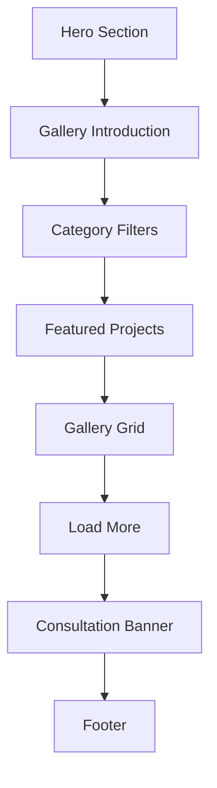
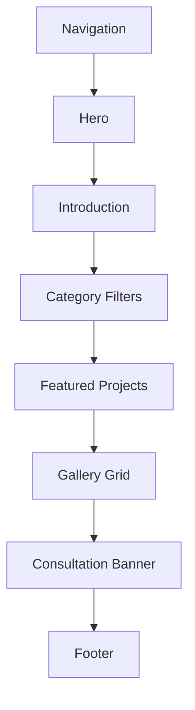
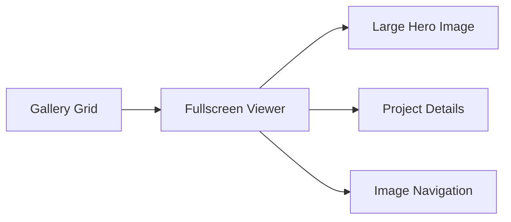
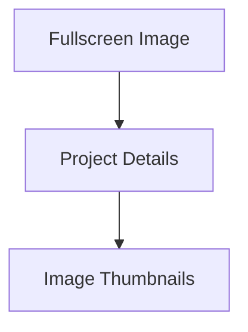
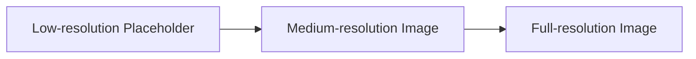
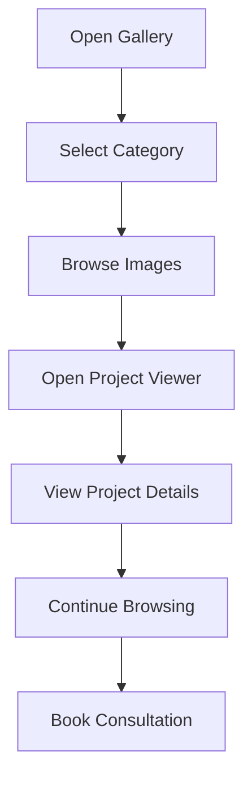

# 10 — Gallery Page Specification (Part 1)

> MatchStick Events Documentation Repository

---

# Document Information

| Property | Value |
|----------|-------|
| Document Name | Gallery Page |
| Document ID | DOC-010 |
| Version | 1.0.0 |
| Part | 1 of 3 |
| Status | Approved |
| Depends On | README.md, 05-brand-guidelines.md, 06-design-system.md |

---

# Purpose

The Gallery page serves as the visual heart of the MatchStick Events website.

Unlike a traditional photo gallery, this page is designed to communicate craftsmanship, creativity, and emotional storytelling through carefully curated event imagery.

Every photograph should reinforce the premium identity of MatchStick Events while encouraging visitors to imagine their own celebration.

The Gallery should function as both inspiration and proof of execution.

---

# Business Goals

The Gallery page should:

- Showcase the quality of completed events.
- Demonstrate the diversity of event types.
- Build credibility through real work.
- Encourage visitors to explore the portfolio.
- Increase consultation requests.
- Reinforce the luxury positioning of the brand.

The README identifies showcasing previous work and strengthening the luxury brand identity as primary business objectives. 0

---

# User Goals

Visitors should be able to:

- Explore real events.
- Discover ideas for their own celebrations.
- View different event styles.
- Understand the quality of execution.
- Navigate effortlessly between event categories.
- Reach the consultation page after feeling inspired.

---

# Gallery Philosophy

The Gallery should feel like browsing the portfolio of a luxury creative studio rather than scrolling through a social media feed.

Each image should communicate:

- Emotion
- Elegance
- Atmosphere
- Craftsmanship
- Storytelling

The experience should prioritize visual immersion over excessive text.

---

# User Experience Goals

Visitors should feel:

> "If they created these experiences, I want them to create mine."

This follows the repository's core philosophy of emphasizing emotion before information. 1

---

# Information Hierarchy



---

# Page Structure



---

# Hero Section

## Purpose

Immediately communicate that MatchStick Events creates memorable experiences across a wide variety of celebrations.

The Hero should establish the emotional tone before users begin browsing images.

---

# Hero Background

Preferred

Full-screen cinematic collage of carefully selected event photography.

Alternative

Muted looping background video featuring short clips from multiple events.

Transitions should remain subtle and elegant.

---

# Hero Heading

Example direction

```
Every Celebration Has A Story.
Explore Ours.
```

This is design guidance and not final marketing copy.

---

# Hero Supporting Text

Approximately 50–80 words.

Briefly introduce the portfolio and encourage visitors to discover different celebrations.

Avoid lengthy descriptions.

---

# Hero CTAs

Primary

```
Book Consultation
```

Secondary

```
Explore Projects
```

---

# Introduction Section

## Purpose

Explain the role of the gallery.

Visitors should understand that these are real celebrations executed by MatchStick Events.

Keep this section concise.

---

# Featured Projects

The Source of Truth currently provides five featured portfolio projects:

- Traditional South Indian Sit-Down Lunch
- Spirit of Egypt: Pharaoh's Land
- The Vintage Botanical High Tea
- Neon Haveli Underground
- Corporate Gala & Elite Awards 2

These projects should receive visual priority throughout the Gallery page.

---

# Gallery Categories

Gallery categories should align with the client's service offerings.

Recommended filters:

- All Events
- Weddings
- Anniversaries
- Birthdays
- Baby Showers
- Corporate
- High Teas
- Seasonal

These categories directly correspond to the services defined by the client. 3

---

# Category Filter Design

Desktop

Horizontal filter bar.

Tablet

Scrollable horizontal chips.

Mobile

Swipeable filter chips.

The active filter should always remain visible.

---

# Filtering Behaviour

Users should be able to:

- View all projects.
- Filter instantly without page reloads.
- Return to "All Events" easily.
- Preserve the selected filter while browsing.

Filtering should feel immediate and smooth.

---

# Gallery Grid

## Design Philosophy

The gallery should avoid rigid layouts.

Instead, use a modern masonry-style grid that highlights photography of varying aspect ratios.

Images should feel curated rather than mechanically aligned.

---

# Masonry Layout

Desktop

- 4 responsive columns.

Tablet

- 2–3 responsive columns.

Mobile

- Single-column or staggered two-column layout depending on screen width.

The layout should automatically balance image heights.

---

# Gallery Card Specification

Each gallery card should contain:

- Event photograph
- Event title
- Event category
- Event location
- Event year

Optional:

- Short project description
- Featured badge

The available project information comes from the Source of Truth portfolio. 4

---

# Card Design

Background

White.

Border Radius

Large.

Shadow

Soft.

Hover

- Slight image zoom.
- Elevated shadow.
- Title fade-in.
- Elegant overlay.

Animations should remain subtle.

---

# Card Information Hierarchy

Display order:

1. Photograph
2. Event Title
3. Event Category
4. Location
5. Year

Descriptions should only appear inside the project viewer (defined in Part 2).

---

# Consultation Placement

Visitors should encounter consultation opportunities naturally.

Recommended placement:

- Hero section
- After Featured Projects
- Bottom of Gallery page

Avoid placing CTAs between every few images.

---

# Responsive Behaviour

Desktop

Immersive masonry layout.

Tablet

Reduced spacing with balanced image flow.

Mobile

Optimized touch interactions.

Readable text overlays.

Fast image loading.

---

# Accessibility

Requirements

- Meaningful alt text.
- Keyboard-accessible filters.
- Visible focus indicators.
- Screen reader compatibility.
- Accessible colour contrast.
- Logical heading hierarchy.

---

# Functional Requirements

| ID | Requirement |
|----|-------------|
| GAL-001 | Display featured portfolio projects. |
| GAL-002 | Support category filtering. |
| GAL-003 | Display responsive masonry gallery. |
| GAL-004 | Provide consultation CTAs. |
| GAL-005 | Maintain responsive behaviour. |

---

# Non-Functional Requirements

The Gallery page shall be:

- Responsive.
- Accessible.
- Performance optimized.
- SEO friendly.
- Mobile-first.
- Consistent with the Design System.

---

# Developer Notes

Developers should:

- Build gallery cards as reusable components.
- Reuse filter chip components.
- Use responsive image loading.
- Support future expansion without redesign.
- Keep category data configurable.

---

# End of Part 1

Part 2 introduces the interactive gallery experience, including image cards, fullscreen lightbox, mobile gestures, keyboard navigation, lazy loading, progressive image loading, animations, loading states, and user interactions.


# 10 — Gallery Page Specification (Part 2)

> MatchStick Events Documentation Repository

---

# Document Information

| Property | Value |
|----------|-------|
| Document Name | Gallery Page |
| Document ID | DOC-010 |
| Version | 1.0.0 |
| Part | 2 of 3 |
| Status | Approved |
| Depends On | README.md, 06-design-system.md |

---

# Gallery Experience

## Purpose

The Gallery should provide an immersive browsing experience that feels effortless, premium, and emotionally engaging.

Visitors should spend time exploring photographs without distractions.

Every interaction should encourage deeper exploration.

---

# Gallery Card Interaction

## Hover Behaviour (Desktop)

When a visitor hovers over a gallery card:

- Image scales slightly (≈105%).
- Soft dark gradient overlay fades in.
- Event title fades into view.
- Event category appears beneath the title.
- Cursor changes to indicate interactivity.

Animations should be smooth and subtle.

---

## Touch Behaviour (Mobile)

Since hover is unavailable:

- The first tap opens the project viewer.
- Cards provide subtle touch feedback.
- Avoid requiring long presses or double taps.

---

# Gallery Card Overlay

Each gallery card overlay should display:

- Event Name
- Event Category
- Event Location
- Featured Badge (optional)

The overlay should never obscure the entire image.

---

# Project Viewer (Lightbox)

## Purpose

Selecting a gallery item should open a premium fullscreen project viewer instead of navigating to another page.

This keeps visitors immersed in the Gallery.

---

# Viewer Layout

Desktop



Mobile



---

# Project Information

Each project should display:

- Event Title
- Event Type
- Date
- Location
- Project Description

The available metadata comes from the Source of Truth portfolio entries. 0

---

# Image Navigation

Visitors should be able to:

- Move to the next photograph.
- Return to the previous photograph.
- Close the viewer.
- Jump directly to thumbnail images.

Navigation should feel instant.

---

# Thumbnail Strip

Desktop

Horizontal strip beneath the primary image.

Tablet

Responsive scrolling thumbnails.

Mobile

Swipeable thumbnail carousel.

The active image should always remain highlighted.

---

# Fullscreen Mode

Desktop

Support fullscreen viewing for large event photography.

Mobile

Support edge-to-edge image viewing while respecting safe display areas.

---

# Keyboard Navigation

Desktop users should be able to use:

| Key | Action |
|------|--------|
| ← | Previous image |
| → | Next image |
| Esc | Close viewer |
| Tab | Navigate controls |
| Enter | Activate focused control |

---

# Swipe Gestures

Mobile users should be able to:

- Swipe left.
- Swipe right.
- Pinch to zoom.
- Double tap to zoom.
- Drag zoomed images.

Gestures should remain smooth without accidental page scrolling.

---

# Image Zoom

Desktop

Mouse wheel zoom (optional).

Mobile

Pinch-to-zoom.

Maximum zoom level should preserve image quality without introducing noticeable pixelation.

---

# Lazy Loading Strategy

To maintain excellent performance:

- Load only visible images initially.
- Load nearby images just before they enter the viewport.
- Delay loading distant images.

This minimizes initial page load time while preserving a smooth browsing experience.

---

# Progressive Image Loading

Recommended flow:



Visitors should see content immediately, with higher-quality images replacing placeholders seamlessly.

---

# Loading Skeletons

Before images load:

Display elegant skeleton placeholders matching the final card dimensions.

Avoid visible layout shifts.

---

# Empty State

If no gallery items match the selected category:

Display:

> No events were found for this category.

Provide:

- Reset Filters button.
- Browse All Events button.

---

# Error State

If gallery content cannot be loaded:

Display:

- Friendly error message.
- Retry button.
- Contact option.

Avoid exposing technical error details.

---

# Image Optimization

Every image should support:

- Responsive image sizes.
- Modern image formats (where supported).
- Compression without visible quality loss.
- Lazy loading.

---

# Animation Philosophy

Animations should enhance elegance rather than attract attention.

Avoid dramatic transitions.

---

# Animation Specification

Gallery Cards

- Fade Up
- Slight Scale
- Soft Shadow

Images

- Gentle Zoom

Lightbox

- Fade In
- Fade Out

Buttons

- Smooth Color Transition

Filter Chips

- Sliding Active Indicator

---

# Transition Durations

| Element | Duration |
|----------|----------|
| Cards | 250ms |
| Images | 300ms |
| Lightbox | 300ms |
| Buttons | 200ms |
| Filters | 200ms |

---

# User Flow



---

# Responsive Behaviour

Desktop

- Large masonry layout.
- Fullscreen viewer.
- Keyboard navigation.

Tablet

- Balanced grid.
- Swipe-enabled viewer.
- Scrollable thumbnails.

Mobile

- Single-column browsing.
- Edge-to-edge viewer.
- Touch gestures.
- Optimized controls.

---

# Functional Requirements

| ID | Requirement |
|----|-------------|
| GAL-006 | Open project viewer from gallery cards. |
| GAL-007 | Support image navigation. |
| GAL-008 | Support touch gestures on mobile. |
| GAL-009 | Lazy-load gallery images. |
| GAL-010 | Display loading and error states gracefully. |

---

# Non-Functional Requirements

The gallery experience shall be:

- Smooth.
- Responsive.
- Performance optimized.
- Accessible.
- Mobile-first.
- Consistent with the Design System.

---

# Developer Notes

Developers should:

- Build the lightbox as a reusable component.
- Optimize all images before deployment.
- Use lazy loading by default.
- Keep animations GPU-friendly.
- Prevent layout shifts during loading.
- Design the viewer to support future video content without major architectural changes.

---

# End of Part 2

Part 3 completes the Gallery Page with:

- Accessibility Specification
- SEO Strategy
- Structured Data
- Open Graph Metadata
- Analytics Events
- Functional Requirements
- Non-functional Requirements
- Requirement Traceability
- Future Enhancements
- Developer Notes
- Acceptance Criteria
- Final Implementation Checklist

# 10 — Gallery Page Specification (Part 3)

> MatchStick Events Documentation Repository

---

# Document Information

| Property | Value |
|----------|-------|
| Document Name | Gallery Page |
| Document ID | DOC-010 |
| Version | 1.0.0 |
| Part | 3 of 3 |
| Status | Approved |
| Depends On | README.md, 05-brand-guidelines.md, 06-design-system.md |

---

# Accessibility Specification

## Purpose

The Gallery should provide an exceptional browsing experience for all users, regardless of device, ability, or assistive technology.

Accessibility should be considered a core feature rather than an afterthought.

---

# Accessibility Requirements

The Gallery shall support:

- Semantic HTML structure.
- Screen reader compatibility.
- Keyboard navigation.
- Visible keyboard focus indicators.
- Accessible colour contrast (WCAG AA minimum).
- Descriptive alternative text for all images.
- Responsive typography.
- Scalable browser zoom up to 200%.
- Reduced-motion support.

---

# Alternative Text Guidelines

Every gallery image should include meaningful alternative text.

Example

```
Luxury wedding mandap decorated with white florals at Suryagarh, Rajasthan.
```

Avoid generic descriptions such as:

- Image
- Wedding Photo
- Event Picture

Alt text should describe the visual content.

---

# Keyboard Accessibility

Users should be able to:

- Navigate gallery cards.
- Open projects.
- Browse images.
- Close the lightbox.
- Activate buttons.

No functionality should require a mouse.

---

# Focus Management

When the Project Viewer opens:

- Keyboard focus moves into the viewer.
- Background content becomes inaccessible.
- Closing the viewer restores focus to the previously selected gallery card.

---

# Reduced Motion

Users who prefer reduced motion should experience:

- No parallax effects.
- Minimal animations.
- Instant transitions where appropriate.

---

# Search Engine Optimization (SEO)

## Purpose

The Gallery should attract visitors searching for luxury event inspiration while reinforcing the MatchStick Events brand.

The Gallery supports the repository goal of strengthening the luxury brand identity and showcasing previous work. 0

---

# Page Title

Recommended

```
Gallery | Luxury Event Portfolio | MatchStick Events Kolkata
```

---

# Meta Description

Recommended length

150–160 characters.

Content should summarize:

- Weddings
- Corporate Events
- Birthdays
- Baby Showers
- High Teas
- Luxury Celebrations

These categories are derived from the client's services. 1

---

# URL Structure

```
/gallery
```

Future expansion

```
/gallery/weddings

/gallery/corporate

/gallery/high-teas
```

---

# Structured Data

Recommended Schema.org types

```
CollectionPage

+

ImageGallery

+

LocalBusiness
```

The LocalBusiness information should reflect the company details provided by the client. 2

---

# Open Graph

Include:

- Gallery title
- Description
- Hero image
- Canonical URL
- Brand name

---

# Twitter/X Card

Use:

```
summary_large_image
```

Include:

- Premium hero image.
- Gallery title.
- Short description.

---

# Analytics Events

Track the following user interactions:

| Event | Description |
|--------|-------------|
| gallery_open | User opens Gallery page |
| category_filter | User selects a gallery category |
| project_open | User opens a portfolio project |
| image_next | User browses to next image |
| image_previous | User browses to previous image |
| gallery_search | User uses gallery search (future) |
| consultation_click | User clicks a consultation CTA |
| contact_click | User navigates to Contact page |

These analytics recommendations are design decisions intended to improve future product insights.

---

# Performance Goals

| Metric | Target |
|---------|---------|
| Largest Contentful Paint | < 2.5 s |
| First Contentful Paint | < 1.8 s |
| Cumulative Layout Shift | < 0.1 |
| Time to Interactive | < 3.5 s |

The Gallery should remain fast despite heavy image usage.

---

# Functional Requirements

| ID | Requirement |
|----|-------------|
| GAL-011 | Display optimized images. |
| GAL-012 | Support accessibility requirements. |
| GAL-013 | Provide SEO metadata. |
| GAL-014 | Record analytics events. |
| GAL-015 | Support future gallery expansion. |

---

# Non-Functional Requirements

The Gallery page shall be:

- Responsive.
- Secure.
- Accessible.
- SEO friendly.
- High performance.
- Maintainable.
- Scalable.
- Mobile-first.

---

# Requirement Traceability

| Business Objective | Gallery Implementation |
|--------------------|------------------------|
| Showcase previous work | Featured Projects & Gallery Grid |
| Strengthen luxury identity | Premium imagery & elegant layouts |
| Build credibility | Real portfolio projects |
| Increase consultation requests | Consultation CTAs throughout the Gallery |
| Create exceptional first impression | Immersive visual experience |

These objectives are consistent with the repository's documented goals. 3

---

# Developer Notes

Developers should:

- Build reusable Gallery components.
- Keep all gallery data configurable.
- Optimize images before deployment.
- Use lazy loading by default.
- Use responsive image formats.
- Avoid layout shifts.
- Separate gallery content from presentation logic.
- Design the architecture to support future video galleries and 360° experiences.

---

# Future Enhancements

The Gallery architecture should support:

- Individual project pages.
- Behind-the-scenes albums.
- Video highlights.
- Drone footage.
- Before-and-after venue transformations.
- Interactive 360° venue tours.
- Client testimonials linked to projects.
- AI-powered image search.
- Mood-board creation for prospective clients.
- Favorite/Save functionality.
- Social sharing.
- Virtual Reality gallery mode.

These enhancements are future product ideas and are **not** part of Version 1.

---

# Acceptance Criteria

The Gallery implementation is complete when:

- All featured portfolio projects are displayed.
- Gallery filtering works correctly.
- The masonry layout adapts across devices.
- The project viewer functions correctly.
- Images load progressively without layout shifts.
- Accessibility requirements are satisfied.
- SEO metadata is implemented.
- Analytics events are tracked.
- Responsive layouts function across mobile, tablet, and desktop.
- Performance targets are met.
- Visual consistency matches the Design System.

---

# Related Documents

- README.md
- 05-brand-guidelines.md
- 06-design-system.md
- 09-services-page.md
- 11-previous-events-page.md

---

**Document:** 10-gallery-page.md

**Version:** 1.0.0

**Status:** Approved

**End of Gallery Page Specification**
