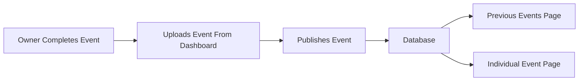
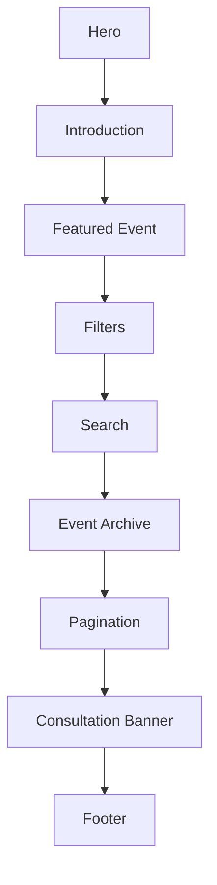
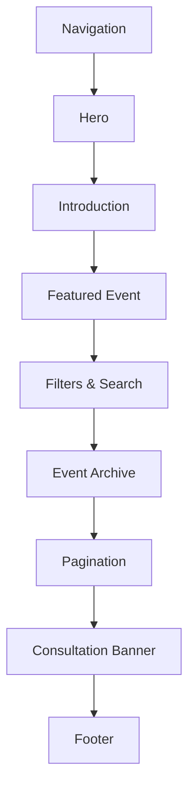
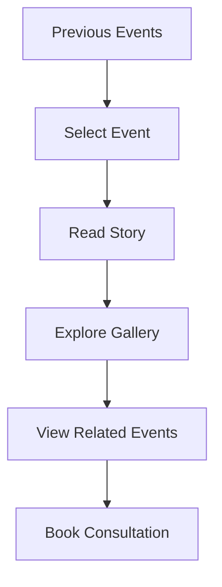
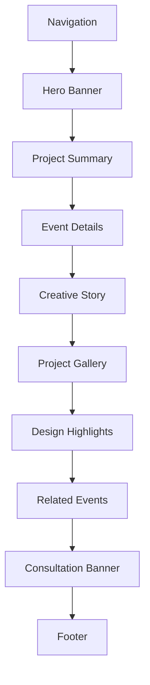
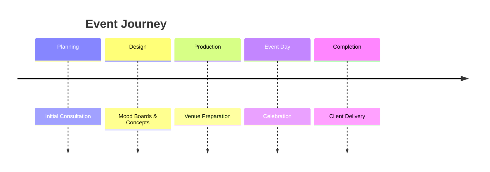
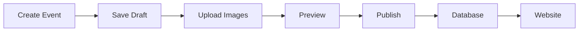
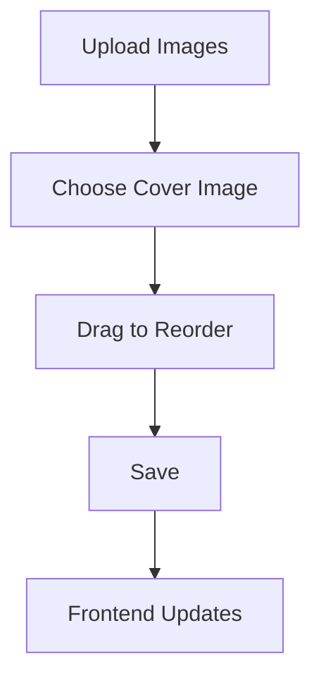
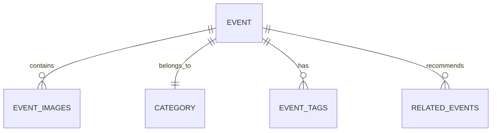

# 11 — Previous Events Page Specification (Part 1)

> MatchStick Events Documentation Repository

---

# Document Information

| Property | Value |
|----------|-------|
| Document Name | Previous Events Page |
| Document ID | DOC-011 |
| Version | 1.0.0 |
| Part | 1 of 4 |
| Status | Approved |
| Depends On | README.md, 06-design-system.md, 10-gallery-page.md |

---

# Purpose

The Previous Events page serves as the official archive of MatchStick Events' completed projects.

Unlike the Gallery page, which is designed for inspiration through photography, the Previous Events page is designed to tell the complete story behind every celebration.

Every published event should function as a case study demonstrating the company's creativity, planning process, execution quality, and attention to detail.

The page should naturally grow as MatchStick Events completes more events.

---

# Business Goals

The Previous Events page should:

- Showcase completed projects.
- Build long-term credibility.
- Demonstrate experience across different event categories.
- Improve SEO through continuously expanding content.
- Increase consultation requests.
- Act as a permanent digital portfolio.

The repository identifies showcasing previous work as one of the primary business objectives. 0

---

# User Goals

Visitors should be able to:

- Browse completed events.
- Learn how previous celebrations were executed.
- Discover ideas for their own event.
- Filter projects by category.
- Search for specific events.
- View complete event stories.
- Contact MatchStick Events after exploring previous work.

---

# Living Portfolio Philosophy

This page should never become "finished."

Instead, it should evolve with the company.

Every completed event should become a permanent portfolio entry after being published through the Admin Dashboard.

As MatchStick Events grows, this page should naturally become richer, strengthening the brand without requiring redesigns.

This is a product design decision supporting the repository's goals of maintainability and scalability. 1

---

# Dynamic Content Philosophy

This page shall be **100% data-driven**.

No event should be hardcoded into the frontend.

Instead:



The website should automatically display newly published events.

---

# Information Hierarchy



---

# Page Structure



---

# Hero Section

## Purpose

Introduce visitors to the growing collection of completed projects.

The Hero should communicate experience, craftsmanship and trust.

---

# Hero Heading

Example direction

```
Every Event Has A Story.
Discover Ours.
```

Example only.

---

# Hero Supporting Text

Approximately

60–90 words.

Describe the page as a collection of real celebrations delivered by MatchStick Events.

Avoid marketing-heavy language.

---

# Hero CTAs

Primary

```
Explore Events
```

Secondary

```
Book Consultation
```

---

# Introduction Section

Purpose

Briefly explain that each event showcases a unique creative journey.

Visitors should understand that they are exploring real client projects rather than promotional examples.

---

# Featured Event

## Purpose

Highlight one outstanding project.

The Featured Event should occupy the largest visual section beneath the introduction.

---

# Featured Event Layout

Desktop

Two-column layout.

Left

Large hero image.

Right

Project summary.

Tablet

Stacked.

Mobile

Single-column.

---

# Featured Event Content

Display:

- Event Title
- Event Category
- Venue
- Date
- Short Summary
- View Case Study button

Initially, featured projects may be selected from the client's existing portfolio, such as "Spirit of Egypt: Pharaoh's Land" or "Corporate Gala & Elite Awards." Future featured projects should be configurable through the dashboard. 2

---

# Event Archive

## Purpose

Display every published event.

Events should appear automatically after publication through the Admin Dashboard.

The archive should never require manual frontend updates.

---

# Default Sorting

Newest published event first.

Alternative sorting options:

- Oldest First
- Event Date
- Recently Added
- Featured First

---

# Category Filters

Users should be able to filter events by:

- All Events
- Weddings
- Anniversaries
- Birthdays
- Baby Showers
- Corporate
- High Teas
- Seasonal

These categories mirror the services offered by MatchStick Events. 3

---

# Search

Users should be able to search by:

- Event title
- Venue
- City
- Event type
- Year

Search results should update instantly.

---

# Event Card Specification

Every event card shall display:

- Cover Image
- Event Title
- Event Type
- Venue
- Event Date
- Short Description
- Read Case Study button

Optional badges:

- Featured
- Latest
- Award Winning
- Destination Event

Badge values should come from dashboard settings.

---

# Event Card Design

Background

White.

Large rounded corners.

Premium shadow.

Hover

- Slight lift.
- Image zoom.
- Shadow increase.
- Title highlight.

Animation duration

250ms.

---

# Event Card Behaviour

Clicking a card opens the dedicated Event Case Study page.

Each published event should automatically receive its own page.

Example URL

```
/previous-events/spirit-of-egypt-pharaohs-land
```

Slug generation is defined in Part 3.

---

# Pagination

Recommended

12 events per page.

Support:

- Previous
- Next
- Direct page numbers

Future option

Infinite scrolling.

---

# Empty State

If no events exist:

Display

> The next unforgettable celebration is already being planned.

Include:

- Browse Gallery
- Book Consultation

---

# Responsive Behaviour

Desktop

4-column archive grid.

Tablet

2-column grid.

Mobile

Single-column cards.

Filters become horizontally scrollable.

---

# Functional Requirements

| ID | Requirement |
|----|-------------|
| EVT-001 | Display published events dynamically. |
| EVT-002 | Display featured event. |
| EVT-003 | Support category filters. |
| EVT-004 | Support event search. |
| EVT-005 | Open dedicated event pages. |

---

# Non-Functional Requirements

The Previous Events page shall be:

- Responsive.
- Accessible.
- SEO friendly.
- Performance optimized.
- Mobile-first.
- Fully data-driven.

---

# Developer Notes

Developers should:

- Never hardcode portfolio entries.
- Fetch events dynamically from the database.
- Keep featured events configurable.
- Design reusable event cards.
- Ensure new events appear automatically after publication.

---

# End of Part 1

Part 2 defines the complete **Individual Event Case Study** experience, including the hero section, event narrative, creative concept, venue details, timeline, image galleries, client goals, outcomes, related projects, and consultation journey.

# 11 — Previous Events Page Specification (Part 2)

> MatchStick Events Documentation Repository

---

# Document Information

| Property | Value |
|----------|-------|
| Document Name | Previous Events Page |
| Document ID | DOC-011 |
| Version | 1.0.0 |
| Part | 2 of 4 |
| Status | Approved |
| Depends On | 06-design-system.md, 10-gallery-page.md |

---

# Individual Event Case Study

## Purpose

Every published event should have its own dedicated page.

Unlike the Gallery, which emphasizes visual exploration, the Event Case Study page should explain the complete journey behind the celebration.

Visitors should feel like they are reading the story behind a masterpiece.

---

# Page Philosophy

The goal is not simply to showcase photographs.

Instead, each case study should answer:

- What was the celebration?
- What made it unique?
- Where was it hosted?
- How was it designed?
- What experience was created?

Every page should strengthen trust in MatchStick Events.

---

# User Journey



---

# Page Layout



---

# Hero Section

## Purpose

Immediately immerse visitors in the event.

The Hero should communicate emotion before details.

---

# Hero Background

Preferred

Large cinematic photograph from the event.

Alternative

Background slideshow featuring 3–5 hero images.

---

# Hero Overlay

Dark gradient overlay.

Text aligned toward the lower-left corner.

---

# Hero Content

Display:

- Event Name
- Event Category
- Event Date
- Venue
- Location

Example data comes from the client's portfolio entries such as **Spirit of Egypt: Pharaoh's Land**, **Traditional South Indian Sit-Down Lunch**, and **Corporate Gala & Elite Awards**. 0

---

# Project Summary

## Purpose

Provide visitors with a quick understanding of the celebration.

---

# Summary Layout

Desktop

Two columns.

Left

Narrative.

Right

Quick facts.

Tablet

Stacked.

Mobile

Single-column.

---

# Summary Content

Approximately

120–180 words.

Discuss:

- Event vision.
- Overall atmosphere.
- Client objectives.
- Experience delivered.

This content is written by the owner from the dashboard and is not automatically generated.

---

# Event Details

Display in a premium information panel.

Required fields

| Field | Required |
|---------|----------|
| Event Name | Yes |
| Event Category | Yes |
| Event Date | Yes |
| Venue | Yes |
| City | Yes |
| State | Yes |
| Event Type | Yes |

Optional

- Guest Count
- Celebration Duration
- Destination Event
- Indoor / Outdoor

These optional fields are dashboard-managed enhancements rather than client-provided requirements.

---

# Creative Story

## Purpose

Tell the story behind the celebration.

Instead of listing services performed, explain the creative direction.

Suggested structure:

### Inspiration

How the event idea originated.

---

### Design Philosophy

Overall creative direction.

---

### Execution

Highlights of planning and production.

---

### Guest Experience

Describe memorable moments.

---

### Final Outcome

Explain how the celebration came together.

---

# Event Timeline

Display a visual timeline.

Example



Timeline labels should be editable through the dashboard.

---

# Project Gallery

## Purpose

Display photographs specific to this event.

Unlike the Gallery page, these images remain exclusive to one project.

---

# Gallery Layout

Desktop

Large masonry gallery.

Tablet

Responsive grid.

Mobile

Swipeable gallery.

---

# Image Behaviour

Users should:

- Open images.
- Zoom.
- Swipe.
- Browse sequentially.

The interaction follows the Gallery page specification.

---

# Design Highlights

Present key creative achievements.

Suggested cards

- Floral Design
- Lighting
- Stage Design
- Entertainment
- Dining Experience
- Guest Experience

These cards are configurable by the owner and should reflect each individual event.

---

# Venue Information

Display:

- Venue Name
- City
- State

Optional

- Google Maps button
- Venue Website

The venue information should reflect the data entered through the dashboard.

---

# Project Statistics

Optional information cards.

Examples

- Images
- Event Days
- Guest Count
- Team Members
- Setup Duration

Hide any empty fields automatically.

---

# Related Events

Display three to six similar projects.

Recommended matching priority:

1. Same category.
2. Same venue.
3. Same city.
4. Similar theme.

This helps visitors continue exploring the portfolio.

---

# Consultation Banner

After reading a case study, visitors should be encouraged to discuss their own event.

Primary CTA

```
Let's Plan Your Celebration
```

Secondary CTA

```
Book Consultation
```

Avoid aggressive sales language.

---

# Responsive Behaviour

Desktop

Large immersive visuals.

Tablet

Balanced spacing.

Mobile

Single-column content.

Readable typography.

Swipe-enabled galleries.

---

# Functional Requirements

| ID | Requirement |
|----|-------------|
| EVT-006 | Generate an individual page for every published event. |
| EVT-007 | Display editable project information. |
| EVT-008 | Display project image gallery. |
| EVT-009 | Display related events. |
| EVT-010 | Display consultation CTA. |

---

# Non-Functional Requirements

Every Event Case Study shall be:

- Responsive.
- Accessible.
- SEO optimized.
- Performance optimized.
- Fully CMS-driven.
- Mobile-first.

---

# Developer Notes

Developers should:

- Treat every event page as a reusable template.
- Populate all content dynamically from the database.
- Avoid hardcoding event layouts.
- Support future additions without requiring code changes.
- Keep the design consistent regardless of the amount of content available.

---

# End of Part 2

Part 3 defines the complete **Dashboard Integration**, including event creation, editing, publishing workflow, image management, SEO fields, URL generation, featured events, archive management, and how every new event automatically appears on the website after publication.

# 11 — Previous Events Page Specification (Part 3)

> MatchStick Events Documentation Repository

---

# Document Information

| Property | Value |
|----------|-------|
| Document Name | Previous Events Page |
| Document ID | DOC-011 |
| Version | 1.0.0 |
| Part | 3 of 4 |
| Status | Approved |
| Depends On | 15-admin-dashboard.md, 16-database-design.md |

---

# Dashboard Integration

## Purpose

The Previous Events page is a living portfolio.

Unlike static websites, every completed event should be managed entirely through the Admin Dashboard.

The website should automatically update whenever the owner publishes, edits, or archives an event.

No developer should be required for routine portfolio updates.

---

# Content Management Philosophy

The dashboard is the **single source of truth** for all event portfolio content.

The frontend should never contain hardcoded events.

Every event displayed on the website must originate from the database after being created through the dashboard.

---

# Publishing Workflow



Publishing should update the website automatically.

---

# Dashboard Navigation

Recommended navigation

```
Dashboard

↓

Previous Events

↓

All Events

↓

Create Event

↓

Drafts

↓

Published

↓

Archived
```

---

# Event Management

The owner should be able to:

- Create events.
- Edit events.
- Publish events.
- Unpublish events.
- Archive events.
- Restore archived events.
- Delete events (with confirmation).

---

# Event Creation Form

## Required Fields

| Field | Required |
|---------|----------|
| Event Title | Yes |
| Event Category | Yes |
| Event Date | Yes |
| Venue Name | Yes |
| City | Yes |
| State | Yes |
| Cover Image | Yes |
| Short Summary | Yes |
| Story Content | Yes |

---

# Optional Fields

| Field |
|---------|
| Client Name |
| Guest Count |
| Event Duration |
| Indoor / Outdoor |
| Destination Event |
| Budget Range (Private) |
| Team Members |
| Vendor Notes |
| Google Maps Link |
| Venue Website |

Private fields should never appear on the public website unless explicitly enabled.

---

# Rich Text Editor

The Story section should support:

- Headings
- Paragraphs
- Lists
- Quotes
- Image captions
- Hyperlinks

Avoid requiring HTML knowledge.

---

# Image Upload System

The owner should be able to:

- Upload multiple images.
- Drag to reorder.
- Replace images.
- Delete images.
- Set a cover image.
- Add captions.
- Add alt text.

---

# Image Ordering



The displayed gallery should always respect the saved image order.

---

# Featured Event Management

Every event should include:

```
Featured Event

Yes / No
```

Rules

- Multiple featured events allowed.
- Dashboard determines display priority.
- Featured events appear before regular events.

---

# Event Categories

The dashboard should provide predefined categories matching the company's services:

- Weddings
- Anniversaries
- Birthdays
- Baby Showers
- Corporate
- High Teas
- Seasonal & Festive

These align with the service categories defined in the client's brief. 0

Custom categories should not be allowed in Version 1 to maintain consistency.

---

# Tags

Support optional tags such as:

- Luxury
- Destination
- Traditional
- Modern
- Outdoor
- Indoor
- Floral
- Premium
- Cultural

Tags improve search and related event recommendations.

---

# SEO Management

Each event should support:

| Field |
|---------|
| SEO Title |
| Meta Description |
| Canonical URL |
| Open Graph Image |

If left blank, the system should generate sensible defaults automatically.

---

# URL Slug Generation

Every published event receives a unique URL.

Example

```
Spirit of Egypt: Pharaoh's Land

↓

spirit-of-egypt-pharaohs-land

↓

/previous-events/spirit-of-egypt-pharaohs-land
```

Rules

- Lowercase.
- Replace spaces with hyphens.
- Remove unsupported characters.
- Prevent duplicate slugs automatically.

---

# Publish States

Each event shall have one status.

| Status | Public |
|----------|---------|
| Draft | No |
| Published | Yes |
| Archived | No |

Only published events appear on the public website.

---

# Preview Mode

Before publishing, the owner should be able to preview:

- Desktop
- Tablet
- Mobile

Preview should reflect the final public page.

---

# Archive System

Archived events should:

- Remain in the database.
- Disappear from public pages.
- Be restorable.
- Preserve images and metadata.

---

# Delete Protection

Deleting an event should require:

1. Confirmation dialog.
2. Warning message.
3. Final confirmation.

Deleting should permanently remove associated public content.

---

# Auto-generated Pages

Publishing an event should automatically generate:

- Previous Events listing.
- Individual Case Study page.
- Internal search index.
- Related event recommendations.
- XML sitemap entry (future enhancement).

No manual page creation should be required.

---

# Search Index Updates

Whenever an event is:

- Published
- Edited
- Archived
- Deleted

The search index should update automatically.

---

# Related Event Logic

The system should automatically recommend similar events using:

1. Category
2. Venue
3. City
4. Tags
5. Theme

No manual linking should be required.

---

# Database Relationships



This structure supports future expansion without changing the frontend architecture.

---

# Version History

Each event should record:

- Created Date
- Last Updated
- Published Date

This information is primarily for administrative use.

---

# Functional Requirements

| ID | Requirement |
|----|-------------|
| EVT-011 | Create events through dashboard. |
| EVT-012 | Upload and manage images. |
| EVT-013 | Publish and archive events. |
| EVT-014 | Auto-generate event pages. |
| EVT-015 | Generate SEO-friendly URLs. |
| EVT-016 | Update search automatically. |
| EVT-017 | Manage featured events. |

---

# Non-Functional Requirements

The dashboard integration shall be:

- Secure.
- Scalable.
- Maintainable.
- Responsive.
- Accessible.
- Easy for non-technical users.
- Fully CMS-driven.

---

# Developer Notes

Developers should:

- Separate event content from presentation logic.
- Use reusable CRUD operations.
- Validate required fields before publishing.
- Optimize uploaded images automatically.
- Generate thumbnails during upload.
- Keep dashboard actions transactional to prevent partial updates.
- Ensure every published event becomes immediately available to the frontend without code changes.

---

# End of Part 3

Part 4 completes the Previous Events specification with:

- Accessibility
- SEO
- Structured Data
- Analytics Events
- Performance Goals
- Requirement Traceability
- Future Enhancements
- Acceptance Criteria
- Final Developer Checklist
- Related Documents

# 11 — Previous Events Page Specification (Part 4)

> MatchStick Events Documentation Repository

---

# Document Information

| Property | Value |
|----------|-------|
| Document Name | Previous Events Page |
| Document ID | DOC-011 |
| Version | 1.0.0 |
| Part | 4 of 4 |
| Status | Approved |
| Depends On | README.md, 06-design-system.md, 16-database-design.md |

---

# Accessibility Specification

## Purpose

Every visitor should be able to explore previous events regardless of their device, browsing method, or accessibility requirements.

Accessibility should remain consistent with every page across the website.

---

# Accessibility Requirements

The Previous Events page shall support:

- Semantic HTML
- Keyboard navigation
- Screen reader compatibility
- Accessible color contrast (WCAG AA)
- Visible focus indicators
- Responsive typography
- Reduced motion preferences
- Alternative text for every image

---

# Alternative Text

Every uploaded image should require an Alt Text field inside the Dashboard.

Example

```
Bride entering the floral mandap during sunset ceremony at Suryagarh.
```

Avoid generic descriptions such as:

- Wedding Image
- Event Photo
- Gallery Picture

---

# Keyboard Navigation

Users shall be able to:

- Browse event cards
- Open event pages
- Navigate image galleries
- Close dialogs
- Activate buttons

Every interactive component should be keyboard accessible.

---

# SEO Strategy

## Purpose

Unlike the Gallery page, Previous Events should continuously improve SEO as new events are published.

Every event becomes an additional searchable page.

This supports the repository goal of continuously showcasing previous work while strengthening the brand. 0

---

# URL Structure

Listing Page

```
/previous-events
```

Individual Event

```
/previous-events/{event-slug}
```

Example

```
/previous-events/spirit-of-egypt-pharaohs-land
```

---

# Meta Information

Every event page should contain:

- SEO Title
- Meta Description
- Canonical URL
- Featured Image

Values should be editable through the Dashboard.

---

# Structured Data

Recommended Schema.org Types

```
CollectionPage

+

CreativeWork

+

ImageGallery

+

LocalBusiness
```

---

# Open Graph

Every event should generate:

- Title
- Description
- Featured Image
- Canonical URL

Automatically using Dashboard data.

---

# XML Sitemap

Whenever an event is published:

Automatically

- Add page to sitemap

When archived

Automatically

- Remove page from sitemap

This improves search engine indexing without manual work.

---

# Analytics Events

Track:

| Event | Description |
|---------|-------------|
| events_page_open | Previous Events page viewed |
| event_card_open | Event card selected |
| case_study_open | Individual case study opened |
| gallery_image_open | Event image viewed |
| related_event_click | Related project selected |
| search_used | Search performed |
| filter_used | Category filter changed |
| consultation_click | Consultation button clicked |

These analytics events are implementation recommendations for understanding user engagement.

---

# Performance Goals

| Metric | Target |
|---------|---------|
| Largest Contentful Paint | <2.5 seconds |
| First Contentful Paint | <1.8 seconds |
| CLS | <0.1 |
| Time To Interactive | <3.5 seconds |

Image-heavy pages should remain fast through lazy loading and optimized assets.

---

# Functional Requirements

| ID | Requirement |
|----|-------------|
| EVT-018 | Support accessibility standards. |
| EVT-019 | Generate SEO metadata automatically. |
| EVT-020 | Generate structured data. |
| EVT-021 | Track analytics events. |
| EVT-022 | Update sitemap automatically. |

---

# Non-Functional Requirements

The Previous Events system shall be:

- Secure
- Responsive
- Accessible
- SEO optimized
- Performance optimized
- Maintainable
- Scalable
- Mobile-first

---

# Requirement Traceability

| Business Objective | Implementation |
|--------------------|----------------|
| Build credibility | Detailed event case studies |
| Showcase previous work | Dynamic event archive |
| Increase consultation requests | CTAs throughout event pages |
| Strengthen luxury branding | Premium storytelling and photography |
| Long-term maintainability | Dashboard-driven CMS architecture |

These objectives are consistent with the repository's documented goals. 1

---

# Future Enhancements

The architecture should support future features without redesigning the system.

Possible additions include:

## Visitor Features

- Favorite Events
- Share Event
- Print Event Story
- Download Event Brochure
- AI-powered Event Recommendations
- Interactive Timeline
- Before & After Venue Comparison
- Video Highlights
- Drone Footage
- 360° Venue Tours

---

## Dashboard Features

- Event Performance Analytics
- View Counts
- Most Viewed Projects
- Draft Collaboration
- Scheduled Publishing
- AI-generated SEO Suggestions
- AI-generated Alt Text
- Bulk Image Upload
- Bulk Event Import

---

# Acceptance Criteria

The Previous Events implementation is complete when:

- Every published event automatically appears in the archive.
- Every event receives an individual case study page.
- Search and filtering work correctly.
- Dashboard publishing updates the public website automatically.
- Event galleries function correctly.
- Related events are generated dynamically.
- Accessibility requirements are satisfied.
- SEO metadata is generated.
- XML sitemap updates automatically.
- Analytics events are tracked.
- Responsive layouts work correctly across all devices.
- Performance targets are met.
- No frontend code changes are required to publish new events.

---

# Developer Checklist

Before deployment, verify:

- All event data is loaded dynamically.
- Draft events are hidden.
- Archived events are excluded.
- Deleted events are permanently removed only after confirmation.
- Cover images display correctly.
- Galleries maintain upload order.
- Slugs remain unique.
- Search indexes refresh after publishing.
- Related events generate correctly.
- Featured events display according to dashboard priority.
- Sitemap updates successfully.
- SEO metadata is valid.
- Accessibility audit passes.
- Lighthouse Performance score ≥ 90.
- Lighthouse Accessibility score ≥ 95.
- Lighthouse Best Practices score ≥ 90.
- Lighthouse SEO score ≥ 95.

---

# Related Documents

- README.md
- 06-design-system.md
- 10-gallery-page.md
- 13-booking-consultation.md
- 15-admin-dashboard.md
- 16-database-design.md
- 17-backend-architecture.md

---

# Version

**Document:** 11-previous-events-page.md

**Version:** 1.0.0

**Status:** Approved

---

# End of Previous Events Page Specification

This document defines a fully dynamic, CMS-driven portfolio system where every completed event is managed through the Admin Dashboard, automatically published to the website, and presented as a premium case study. It is designed to grow alongside MatchStick Events without requiring frontend redevelopment, supporting the long-term vision of a maintainable, scalable, and luxury-focused digital portfolio.
