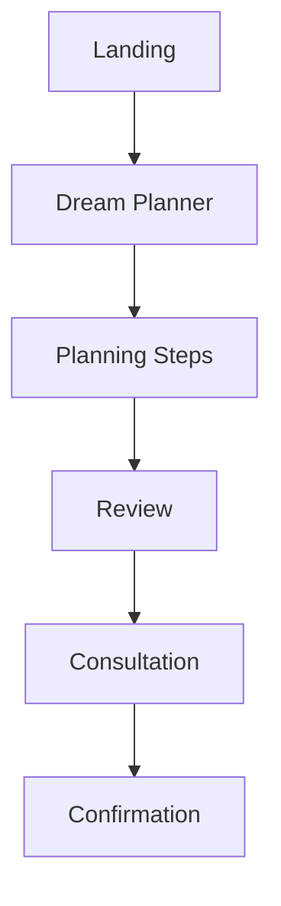
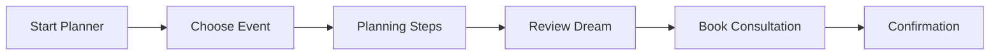
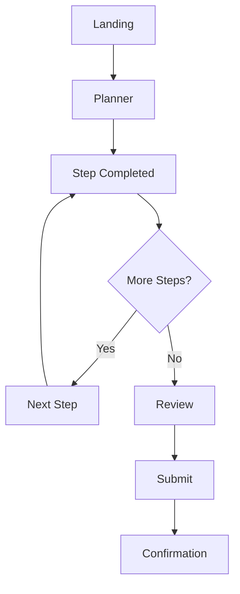
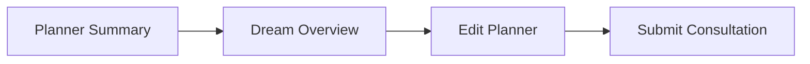
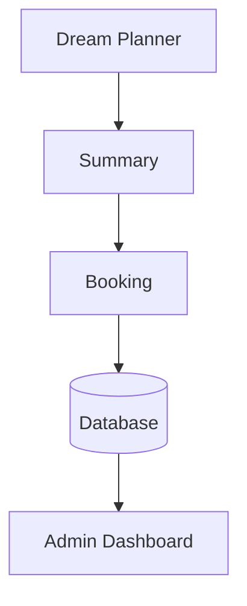
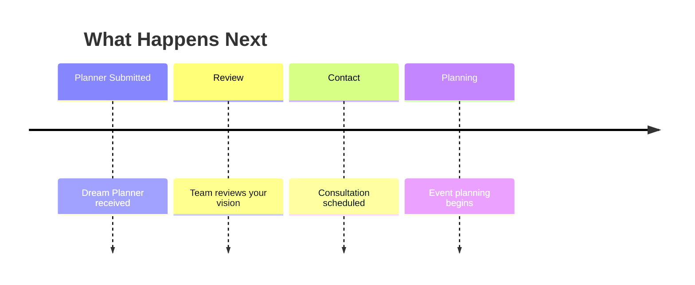
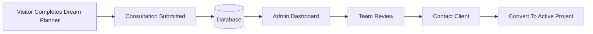
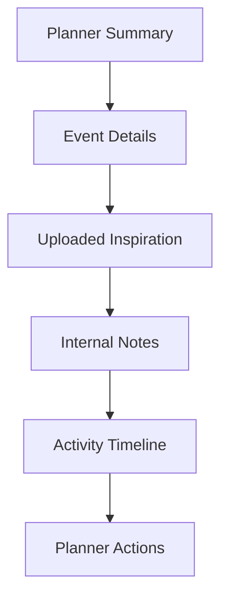
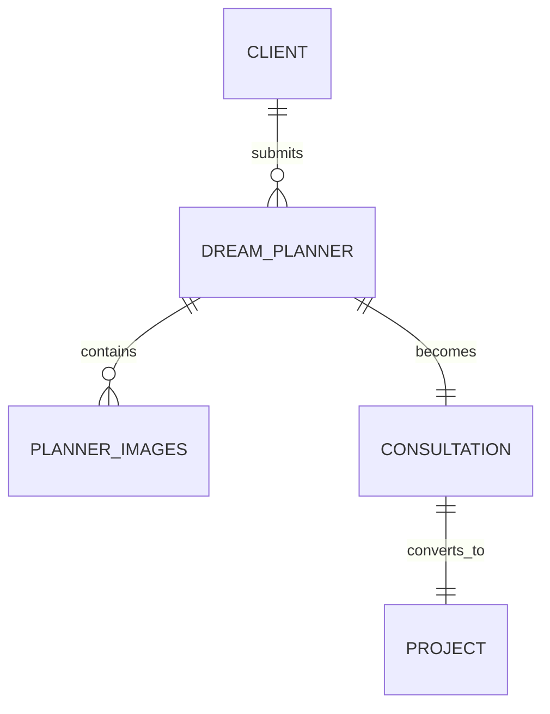

# 12 — Dream Planner Specification (Part 1)

> MatchStick Events Documentation Repository

---

# Document Information

| Property | Value |
|----------|-------|
| Document Name | Dream Planner |
| Document ID | DOC-012 |
| Version | 1.0.0 |
| Part | 1 of 5 |
| Status | Approved |
| Depends On | README.md, 01-product-vision.md, 06-design-system.md, 13-booking-consultation.md |

---

# Purpose

The Dream Planner is an interactive planning experience that transforms a visitor's ideas into a structured event brief.

Instead of immediately asking users to contact MatchStick Events, the planner helps them organize their thoughts, preferences, and inspiration before submitting an enquiry.

The result is a higher-quality consultation request for both the client and the event planning team.

---

# Business Goals

The Dream Planner should:

- Reduce friction during enquiries.
- Increase qualified consultation requests.
- Help visitors visualize their event.
- Collect richer planning information.
- Improve communication before the first consultation.
- Differentiate MatchStick Events from traditional event planning websites.

This feature is a product enhancement that supports the repository's objectives of generating qualified leads and delivering a premium user experience. 0 1

---

# User Goals

Visitors should be able to:

- Organize event ideas.
- Explore planning options.
- Make decisions gradually.
- Review their selections.
- Submit a complete planning request.
- Feel excited rather than overwhelmed.

---

# Product Philosophy

The Dream Planner should feel like a luxury planning consultation.

It should not resemble:

- Long forms
- Surveys
- Questionnaires

Instead, every step should feel like a conversation.

The experience should inspire creativity while remaining simple.

---

# Core Principles

The Dream Planner should always be:

- Elegant
- Interactive
- Mobile-first
- Encouraging
- Non-intimidating
- Guided
- Premium

Visitors should feel that MatchStick Events is helping them shape their vision—not asking them to complete paperwork.

---

# User Experience Goals

By the end of the planner, visitors should think:

> "They already understand my vision before we've even spoken."

---

# Information Architecture



---

# Overall Workflow



---

# Planner Structure

The planner should use a multi-step wizard.

Visitors should complete one section at a time.

Avoid displaying every question on one page.

---

# Estimated Completion Time

Display near the beginning:

```
Approximately 5–8 minutes
```

This sets expectations before users begin.

---

# Progress Indicator

A progress bar should always remain visible.

Example

```
Step 3 of 10

████████░░░░░░░░░
30% Complete
```

Progress updates automatically after every completed step.

---

# Navigation

Users should always be able to:

- Continue
- Go Back
- Save Progress
- Exit Planner

Navigation buttons remain fixed at the bottom of the viewport on mobile.

---

# Save & Resume

The planner should automatically save progress.

Users returning later should continue where they left off.

Save triggers:

- Next Step
- Previous Step
- Refresh
- Browser Close

---

# Session Recovery

If a session expires:

Display

> We saved your progress so you can continue where you left off.

Users should never lose completed work unexpectedly.

---

# Landing Screen

## Purpose

Introduce the Dream Planner before asking any questions.

---

# Landing Layout

Desktop

Two-column layout.

Left

Introduction.

Right

Hero illustration or premium lifestyle photography.

Tablet

Stacked.

Mobile

Single-column.

---

# Landing Heading

Example direction

```
Let's Design Your Dream Celebration
```

Example only.

---

# Supporting Text

Approximately

80–120 words.

Explain that the planner will help organize ideas before the consultation.

Avoid technical language.

---

# Primary CTA

```
Start Planning
```

---

# Secondary CTA

```
Book Consultation Instead
```

Users who already know what they want should be able to skip the planner.

---

# Planner Sections

The complete planner consists of:

1. Event Type
2. Guest Information
3. Budget
4. Venue Preferences
5. Theme & Style
6. Food & Dining
7. Entertainment
8. Photography & Media
9. Special Requests
10. Review & Submit

Each section is detailed in Part 2.

---

# User Flow



---

# Error Prevention

The planner should:

- Save continuously.
- Prevent accidental exits.
- Warn before abandoning unsaved progress.
- Validate required fields before continuing.

---

# Empty State

If the planner contains no saved information:

Display

> Your dream celebration starts here.

Include

```
Start Planning
```

---

# Responsive Behaviour

Desktop

- Spacious layouts.
- Large imagery.
- Two-column content.

Tablet

- Reduced spacing.
- Comfortable touch targets.

Mobile

- Single-column layout.
- Sticky navigation.
- Large buttons.
- Minimal typing.

---

# Functional Requirements

| ID | Requirement |
|----|-------------|
| DP-001 | Display multi-step planner. |
| DP-002 | Display progress indicator. |
| DP-003 | Support save and resume. |
| DP-004 | Allow forward and backward navigation. |
| DP-005 | Display landing experience. |

---

# Non-Functional Requirements

The Dream Planner shall be:

- Responsive.
- Accessible.
- Mobile-first.
- Fast.
- Intuitive.
- Fully data-driven.
- Consistent with the Design System.

---

# Developer Notes

Developers should:

- Build every planner step as an independent reusable component.
- Maintain planner state across sessions.
- Avoid page reloads between steps.
- Keep navigation consistent.
- Design the planner to support additional steps in future versions without restructuring the workflow.

---

# End of Part 1

Part 2 defines every planner step in detail, including Event Type, Guest Information, Budget, Venue Preferences, Theme & Style, Food & Dining, Entertainment, Photography, Special Requests, validation rules, conditional logic, and user interactions.

# 12 — Dream Planner Specification (Part 2)

> MatchStick Events Documentation Repository

---

# Document Information

| Property | Value |
|----------|-------|
| Document Name | Dream Planner |
| Document ID | DOC-012 |
| Version | 1.0.0 |
| Part | 2 of 5 |
| Status | Approved |

---

# Planner Steps

## Purpose

The Dream Planner should guide visitors through a structured planning journey.

Questions should feel conversational rather than administrative.

Each step should focus on a single topic to reduce cognitive load.

---

# Step Progress

Example

```text
Step 1 of 10

Choose Your Celebration
```

Every step should contain:

- Title
- Short explanation
- Inputs
- Previous button
- Continue button

---

# Step 1 — Event Type

## Purpose

Identify the type of celebration.

---

# User Prompt

Example

```
What are we celebrating?
```

---

# Available Options

Display premium cards.

- Wedding
- Anniversary
- Birthday
- Baby Shower
- Corporate Event
- High Tea
- Seasonal Celebration

These options correspond to the services currently offered by MatchStick Events. 0

---

# Card Design

Each option contains:

- Illustration
- Title
- Short description

Selecting a card highlights it immediately.

---

# Validation

Required.

Only one event type may be selected.

---

# Step 2 — Guest Information

## Purpose

Understand the scale of the event.

---

# Questions

Guest Count

Examples

- Under 25
- 25–50
- 50–100
- 100–250
- 250–500
- 500+

Children attending?

- Yes
- No

---

# Additional Question

Special guest requirements

Optional.

Free text.

---

# Validation

Guest count required.

---

# Step 3 — Budget Planning

## Purpose

Understand planning expectations.

The budget should assist consultation planning and should never be displayed publicly.

---

# Budget Input

Preferred

Range selector.

Example

```
₹50K – ₹1L

₹1L – ₹3L

₹3L – ₹5L

₹5L – ₹10L

₹10L+
```

---

# Budget Flexibility

Optional question

```
Is this budget flexible?
```

Options

- Yes
- Somewhat
- No

---

# Validation

Budget selection required.

---

# Step 4 — Venue Preferences

## Purpose

Understand where the celebration may take place.

---

# Questions

Venue already booked?

- Yes
- No

---

If Yes

Display

- Venue Name
- City
- State

---

If No

Ask

```
Would you like venue recommendations?
```

Options

- Yes
- No

---

# Event Type

Choose

- Indoor
- Outdoor
- Either

---

# Destination Event

Question

```
Is this a destination celebration?
```

Options

- Yes
- No

---

# Conditional Logic

Destination questions only appear if the answer is Yes.

---

# Step 5 — Theme & Style

## Purpose

Capture the visual personality of the event.

---

# Theme Selection

Examples

- Traditional
- Royal
- Minimalist
- Luxury
- Modern
- Floral
- Vintage
- Cultural
- Contemporary
- Custom

Multiple selections allowed.

---

# Colour Palette

Display elegant colour swatches.

Examples

- White & Gold
- Emerald Green
- Burgundy
- Pastels
- Royal Blue
- Black & Gold
- Neutral
- Custom

---

# Mood Selection

Allow users to choose feelings they want guests to experience.

Examples

- Elegant
- Romantic
- Grand
- Intimate
- Vibrant
- Luxurious
- Playful
- Sophisticated

---

# Inspiration Upload

Optional.

Users may upload:

- Inspiration photos
- Pinterest screenshots
- Mood boards

Supported formats

- JPG
- PNG
- PDF

---

# Step 6 — Food & Dining

## Purpose

Capture catering preferences.

---

# Cuisine Preferences

Examples

- Indian
- Bengali
- South Indian
- Italian
- Continental
- Asian
- Multi-Cuisine
- Custom

Multiple selection supported.

---

# Dining Style

Options

- Buffet
- Sit-down
- Live Counters
- Cocktail Reception

---

# Dietary Requirements

Optional.

Examples

- Jain
- Vegan
- Vegetarian
- Gluten Free

---

# Step 7 — Entertainment

## Purpose

Capture preferred experiences.

---

# Entertainment Options

- Live Band
- DJ
- Classical Music
- Dance Performances
- Celebrity Appearance
- Fireworks
- Interactive Activities
- Kids Zone
- Cultural Performances

Multiple selections allowed.

---

# Special Attraction

Optional.

Free text.

---

# Step 8 — Photography & Media

## Purpose

Understand documentation preferences.

---

# Options

Photography

- Essential
- Premium
- Cinematic

Videography

- Yes
- No

Drone Coverage

- Yes
- No

Live Streaming

- Yes
- No

---

# Step 9 — Special Requests

## Purpose

Capture details that don't fit elsewhere.

---

# Questions

Special traditions?

Accessibility requirements?

VIP guests?

Anything else you'd like us to know?

Large multi-line text area.

---

# Character Limit

3000 characters.

---

# Step Navigation

Each step displays:

Previous

Continue

Progress

Auto-save status

---

# Validation Rules

Every required step should be completed before moving forward.

Show inline validation.

Avoid popup error messages.

---

# Conditional Logic

Examples

If Event Type = Corporate

↓

Hide Wedding-specific questions.

---

If Destination = No

↓

Hide destination planning.

---

If Venue Booked = Yes

↓

Hide venue recommendation questions.

---

If Photography = No

↓

Hide photography preferences.

---

Every conditional section should appear and disappear smoothly.

---

# User Experience Principles

- Minimize typing.
- Prefer visual selections.
- Use cards instead of dropdowns where practical.
- Show one primary task per screen.
- Preserve previous answers.

---

# Functional Requirements

| ID | Requirement |
|----|-------------|
| DP-006 | Capture event type. |
| DP-007 | Capture guest information. |
| DP-008 | Capture budget preferences. |
| DP-009 | Capture venue information. |
| DP-010 | Capture event style. |
| DP-011 | Capture catering preferences. |
| DP-012 | Capture entertainment preferences. |
| DP-013 | Capture photography preferences. |
| DP-014 | Capture special requests. |
| DP-015 | Support conditional logic. |

---

# Non-Functional Requirements

Planner steps shall be:

- Responsive.
- Accessible.
- Mobile-first.
- Fast.
- Easy to complete.
- Fully configurable.

---

# Developer Notes

Developers should:

- Implement every step as a reusable component.
- Use configurable question definitions instead of hardcoding inputs.
- Support future addition, removal, or reordering of planner steps.
- Preserve all user inputs automatically throughout the session.
- Design conditional logic as configurable rules rather than embedded code.

---

# End of Part 2

Part 3 introduces the **Dream Summary & Booking Integration**, where the user's selections are transformed into a polished planning brief, reviewed, edited if necessary, and seamlessly submitted as a consultation request to the MatchStick Events team.

# 12 — Dream Planner Specification (Part 3)

> MatchStick Events Documentation Repository

---

# Document Information

| Property | Value |
|----------|-------|
| Document Name | Dream Planner |
| Document ID | DOC-012 |
| Version | 1.0.0 |
| Part | 3 of 5 |
| Status | Approved |
| Depends On | 12-dream-planner.md (Part 1 & 2), 13-booking-consultation.md |

---

# Dream Summary

## Purpose

After completing the planner, visitors should receive a beautifully presented summary of their dream celebration before submitting it.

Instead of immediately sending raw form data, the website should organize every selection into a premium planning brief.

This gives users confidence that their vision has been understood.

---

# User Experience Goal

Visitors should feel:

> "This already feels like the first draft of my event."

The summary should encourage excitement while allowing users to review everything before submission.

---

# Summary Layout

Desktop



Tablet

Stacked sections.

Mobile

Single-column layout.

---

# Summary Header

Display

- Event Type
- Event Name (optional)
- Progress Completed
- Estimated Guest Count

Large hero banner.

Premium typography.

---

# Dream Overview Card

The first section summarizes the celebration.

Example

```
Luxury Wedding

Estimated Guests

250

Venue

Not Selected

Theme

Royal & Floral

Budget

₹5L – ₹10L
```

Values come directly from planner responses.

---

# Planning Sections

Display every completed planner section.

## Event Information

- Event Type
- Guest Count
- Event Date (if provided)

---

## Venue

- Venue Status
- Venue Name
- City
- State
- Destination Event

---

## Design

- Theme
- Colours
- Mood

---

## Dining

- Cuisine
- Dining Style
- Dietary Requirements

---

## Entertainment

- Selected experiences
- Special attraction

---

## Photography

- Photography package
- Videography
- Drone coverage
- Live streaming

---

## Special Requests

Display the user's notes exactly as entered.

---

# Inspiration Gallery

If the user uploaded inspiration images:

Display thumbnails.

Allow:

- Preview
- Remove
- Replace

---

# Missing Information

Optional questions left unanswered should appear as:

```
Not Specified
```

Never leave blank sections.

---

# Planner Score

## Purpose

Provide gentle feedback about completion.

Example

```
Your Planner

95% Complete
```

---

# Completion Rules

100%

All recommended questions answered.

90%

One optional section skipped.

75%

Several optional sections skipped.

Required fields always remain mandatory.

---

# Editing

Every summary section includes:

```
Edit
```

Selecting Edit returns users directly to that planner step.

Returning to the summary preserves scroll position.

---

# Booking Integration

Selecting

```
Continue
```

opens the Consultation Booking page.

No information should be lost.

---

# Data Transfer



All planner responses travel together as one submission.

---

# Consultation Package

The submitted planner should include:

- Planner ID
- Event Information
- Guest Details
- Budget
- Venue Preferences
- Theme
- Food
- Entertainment
- Photography
- Special Requests
- Uploaded Inspiration Images

Everything becomes one consultation request.

---

# Confirmation Before Submission

Ask:

```
Everything looks good?

Ready to send your Dream Planner?
```

Buttons

- Back
- Submit Planner

---

# Submission Animation

After submission:

Display elegant success animation.

Avoid excessive celebrations.

Duration

Approximately

2 seconds.

---

# Confirmation Screen

## Heading

Example

```
Your Dream Celebration Is One Step Closer.
```

---

# Confirmation Message

Thank the visitor.

Explain that MatchStick Events has received their planner and will review the information before the consultation.

---

# Confirmation Details

Display

- Reference Number
- Event Type
- Submission Date
- Estimated Response Time

Estimated response time should be configurable from the Admin Dashboard.

---

# Next Steps Timeline



---

# Confirmation Actions

Primary

```
Book Consultation Time
```

Secondary

```
Return Home
```

Optional

```
Download Planner Summary (PDF)
```

PDF generation is a Version 2 enhancement.

---

# Email Confirmation

After submission

Automatically send:

Visitor receives

- Thank-you email
- Planner summary
- Reference number

Event Team receives

- Complete planner
- Uploaded images
- Contact information
- Booking reference

---

# WhatsApp Integration

Optional feature

Allow users to:

```
Continue on WhatsApp
```

The planner summary should be attached to the conversation.

Implementation depends on future WhatsApp Business API integration.

---

# Error Handling

If submission fails:

Display

> We couldn't submit your planner just yet.

Options

- Retry
- Save Draft
- Contact Us

Never discard user responses.

---

# Auto-save After Submission Failure

If submission fails:

Keep the planner locally until successful.

Users should never need to complete the planner again.

---

# Functional Requirements

| ID | Requirement |
|----|-------------|
| DP-016 | Display planner summary. |
| DP-017 | Support editing from summary. |
| DP-018 | Transfer planner data to booking. |
| DP-019 | Generate confirmation page. |
| DP-020 | Generate consultation package. |
| DP-021 | Preserve uploaded inspiration files. |
| DP-022 | Display confirmation timeline. |

---

# Non-Functional Requirements

The summary experience shall be:

- Responsive.
- Accessible.
- Elegant.
- Fast.
- Reliable.
- Mobile-first.

---

# Developer Notes

Developers should:

- Build the summary dynamically from planner data.
- Avoid duplicating stored information.
- Generate summaries using reusable UI components.
- Ensure planner data remains editable until final submission.
- Keep all submission logic transactional so partial submissions cannot occur.
- Design the data model so future AI-generated planning recommendations can be added without redesigning the workflow.

---

# End of Part 3

Part 4 defines the complete **Dashboard & Database Integration**, including how Dream Planner submissions are stored, assigned, tracked, converted into active projects, managed by staff, and integrated with the Admin Dashboard, CRM workflow, database, and future automation features.

# 12 — Dream Planner Specification (Part 4)

> MatchStick Events Documentation Repository

---

# Document Information

| Property | Value |
|----------|-------|
| Document Name | Dream Planner |
| Document ID | DOC-012 |
| Version | 1.0.0 |
| Part | 4 of 5 |
| Status | Approved |
| Depends On | 13-booking-consultation.md, 15-admin-dashboard.md, 16-database-design.md |

---

# Dashboard & Database Integration

## Purpose

Every submitted Dream Planner should become a structured planning request inside the Admin Dashboard.

The Dashboard should provide the MatchStick Events team with all the information required before the first consultation.

The Dream Planner is **not** the booking itself—it is the beginning of the client relationship.

---

# Workflow Overview



---

# Dashboard Navigation

```text
Dashboard

↓

Dream Planner

↓

New Requests

↓

In Progress

↓

Consultations Scheduled

↓

Converted Projects

↓

Archived
```

---

# Planner Status System

Every Dream Planner shall have exactly one status.

| Status | Description |
|----------|-------------|
| New | Newly submitted |
| Under Review | Team reviewing planner |
| Contacted | Client has been contacted |
| Consultation Scheduled | Meeting confirmed |
| Planning Started | Active project |
| Completed | Event completed |
| Archived | Closed record |

---

# Dream Planner Inbox

The Dashboard should display all planner submissions in a searchable table.

Columns

- Reference ID
- Client Name
- Event Type
- Event Date
- Guest Count
- Budget Range
- Submission Date
- Assigned Planner
- Status

The newest submissions should appear first.

---

# Search & Filtering

Staff should be able to filter by:

- Event Type
- Status
- Budget Range
- Assigned Planner
- Event Date
- Submission Date
- City
- State

Search should support:

- Client Name
- Reference Number
- Venue
- Keywords

---

# Planner Details Page

Selecting a submission opens the complete planner.

Layout



---

# Internal Notes

Staff members should be able to add:

- Meeting notes
- Client preferences
- Follow-up reminders
- Internal discussions

These notes must never be visible to the client.

---

# Planner Assignment

Managers should be able to assign planners.

Assignment options

- Automatic (future)
- Manual

Assigned planner appears throughout the Dashboard.

---

# Consultation Scheduling

From the planner page staff should be able to:

- Schedule consultation
- Reschedule
- Cancel
- Mark Completed

Future integration with Google Calendar may be supported.

---

# Client Information

Store

- Name
- Phone
- Email
- Preferred Contact Method

Additional contact fields are defined in `13-booking-consultation.md`.

---

# Planner History

Every modification should generate an activity log.

Examples

```
Planner Submitted

↓

Assigned to Planner

↓

Consultation Scheduled

↓

Meeting Completed

↓

Converted to Project
```

Every activity should contain:

- Date
- Time
- User
- Action

---

# Planner Attachments

Store

- Inspiration Images
- PDFs
- Mood Boards

Dashboard should support:

- Preview
- Download
- Delete
- Replace

---

# Convert to Project

## Purpose

After consultation, planners should become active projects.

Example

```mermaid
flowchart LR

Planner

-->

Approved

-->

Project

-->

Project Dashboard
```

Conversion should preserve all planning information.

---

# Conversion Rules

Convert:

- Event Details
- Theme
- Venue
- Budget
- Planner Notes
- Attachments

Generate

- Project ID
- Project Timeline
- Client Workspace (future)

---

# Duplicate Detection

The system should warn if:

- Same phone number
- Same email
- Same event date

Already exists.

Staff may continue after confirmation.

---

# Reminder System

Dashboard reminders

Examples

- Consultation tomorrow
- Follow-up overdue
- Missing contact information
- Unassigned planner

Reminder rules should be configurable.

---

# Notification System

Notify staff when:

- New planner submitted
- Planner updated
- Consultation booked
- Planner converted

Notify client when:

- Planner received
- Consultation confirmed
- Meeting rescheduled

---

# Database Relationships



---

# Planner Record Structure

Every planner record should include:

Required

- Planner ID
- Client ID
- Event Type
- Status
- Created Date

Optional

- Assigned Planner
- Internal Notes
- Attachments
- Consultation Date
- Conversion Date

---

# Dashboard Permissions

Administrators

- Full access

Event Managers

- Create
- Edit
- Assign
- Convert

Staff

- View
- Comment
- Update Status

Future role expansion should not require architectural changes.

---

# Data Retention

Completed planners should remain stored.

Archived planners should:

- Remain searchable
- Preserve attachments
- Preserve history

No data should be deleted automatically.

---

# Functional Requirements

| ID | Requirement |
|----|-------------|
| DP-023 | Store planner submissions. |
| DP-024 | Display dashboard inbox. |
| DP-025 | Support planner assignment. |
| DP-026 | Schedule consultations. |
| DP-027 | Convert planner into project. |
| DP-028 | Maintain activity history. |
| DP-029 | Manage attachments. |
| DP-030 | Support status workflow. |

---

# Non-Functional Requirements

Dashboard integration shall be:

- Secure.
- Responsive.
- Scalable.
- Maintainable.
- Reliable.
- Transaction-safe.
- Easy for non-technical staff.

---

# Developer Notes

Developers should:

- Treat Dream Planner submissions as first-class entities in the database.
- Keep planner data separate from active project data while supporting seamless conversion.
- Use transactional operations when converting planners into projects.
- Maintain immutable activity logs for auditing.
- Design the system to support CRM integrations in future versions.
- Ensure uploaded files are securely stored and referenced without duplication.

---

# End of Part 4

Part 5 completes the Dream Planner specification with:

- Accessibility
- SEO considerations
- Analytics Events
- Performance Goals
- Requirement Traceability
- Future Enhancements
- Acceptance Criteria
- Developer Checklist
- Related Documents
- Final implementation guidance

# 12 — Dream Planner Specification (Part 5)

> MatchStick Events Documentation Repository

---

# Document Information

| Property | Value |
|----------|-------|
| Document Name | Dream Planner |
| Document ID | DOC-012 |
| Version | 1.0.0 |
| Part | 5 of 5 |
| Status | Approved |

---

# Accessibility

## Purpose

The Dream Planner should be usable by all visitors, regardless of device or ability.

Accessibility shall be considered throughout the planning experience rather than added as an afterthought.

---

# Keyboard Navigation

Users should be able to:

- Navigate every step using the keyboard.
- Select options using keyboard controls.
- Move between fields logically.
- Submit the planner without requiring a mouse.

---

# Screen Reader Support

All interactive elements shall include:

- Accessible labels
- Descriptive button text
- Form descriptions
- Progress announcements
- Validation announcements

Images uploaded by users do not require alternative text.

Decorative illustrations should be ignored by assistive technologies.

---

# Color & Contrast

The planner shall:

- Never rely solely on color to communicate information.
- Meet WCAG AA contrast requirements.
- Provide visible focus indicators.
- Maintain readability in light and dark environments.

---

# Touch Accessibility

Mobile controls should:

- Maintain generous touch targets.
- Provide adequate spacing.
- Prevent accidental taps.
- Support portrait orientation.

---

# Performance

## Loading Time

Target

| Metric | Goal |
|---------|------|
| Initial Planner Load | < 2 seconds |
| Step Transition | < 300 ms |
| Auto-save | < 500 ms |
| Submission | < 3 seconds |

---

# File Upload Performance

Uploaded inspiration files should:

- Upload asynchronously.
- Display progress indicators.
- Retry automatically on temporary failures.
- Prevent duplicate uploads.

---

# Reliability

The planner shall:

- Recover from temporary network interruptions.
- Preserve unsent data.
- Continue after browser refresh.
- Detect incomplete submissions.

---

# SEO Considerations

The Dream Planner primarily supports lead generation rather than search visibility.

Public pages should include:

- Descriptive metadata.
- Open Graph tags.
- Structured headings.

Planner submissions and personal information must never be indexed by search engines.

---

# Analytics

## Purpose

Analytics should measure engagement while respecting user privacy.

---

# Recommended Events

| Event | Trigger |
|--------|----------|
| Planner Started | User begins planning |
| Step Completed | User completes a section |
| Planner Saved | Auto-save occurs |
| Planner Resumed | Saved session restored |
| Planner Abandoned | User exits before completion |
| Summary Viewed | Summary screen displayed |
| Planner Submitted | Successful submission |
| Submission Failed | Submission error |

---

# Funnel Tracking

The dashboard should support measuring:

```mermaid
flowchart LR

Landing

-->

Planner Started

-->

Planner Completed

-->

Consultation Submitted

-->

Consultation Scheduled

-->

Project Created
```

This helps identify where visitors leave the journey.

---

# Success Metrics

Suggested KPIs

| Metric | Description |
|----------|-------------|
| Planner Completion Rate | Percentage of started planners that reach submission |
| Average Completion Time | Time required to finish the planner |
| Abandonment Rate | Percentage of incomplete planners |
| Consultation Conversion Rate | Submitted planners resulting in consultations |
| Project Conversion Rate | Consultations converted into active projects |

---

# Privacy

The Dream Planner collects personal planning information.

The system should:

- Request only necessary information.
- Protect uploaded files.
- Prevent unauthorized access.
- Allow future compliance with applicable privacy regulations.

Detailed security controls are specified in `19-security.md`.

---

# Future Enhancements

The architecture should support future capabilities without requiring significant redesign.

Potential enhancements include:

- AI-generated event recommendations
- Personalized theme suggestions
- Budget estimation tools
- Venue recommendation engine
- Vendor recommendation engine
- Interactive seating planner
- Collaborative family planning
- Guest list management
- Calendar synchronization
- Multi-language support
- PDF planner export
- WhatsApp Business integration
- Client portal
- AI planning assistant

These features are outside the scope of Version 1.

---

# Requirement Traceability

| Requirement Group | Covered In |
|-------------------|------------|
| Planner Workflow | Part 1 |
| Planner Steps | Part 2 |
| Summary & Submission | Part 3 |
| Dashboard Integration | Part 4 |
| Accessibility & Quality | Part 5 |

---

# Acceptance Criteria

The Dream Planner shall be considered complete when:

- Visitors can complete every planner step.
- Progress is automatically saved.
- Sessions can be resumed.
- Validation prevents incomplete required submissions.
- A complete planner summary is generated.
- Users can edit any section before submission.
- Consultation requests include the full planner.
- Dashboard users can review and manage submissions.
- Planner records can be converted into active projects.
- Accessibility requirements are satisfied.
- Performance targets are met.
- Analytics events are captured successfully.

---

# Developer Checklist

## User Experience

- Multi-step planner implemented.
- Responsive layouts completed.
- Progress indicator implemented.
- Auto-save working.
- Resume functionality verified.
- Summary page completed.
- Confirmation flow completed.

---

## Backend

- Planner data model implemented.
- File uploads supported.
- Submission API completed.
- Status workflow implemented.
- Activity history recorded.
- Duplicate detection verified.

---

## Dashboard

- Planner inbox implemented.
- Search completed.
- Filtering completed.
- Assignment workflow completed.
- Consultation scheduling implemented.
- Project conversion verified.

---

## Quality Assurance

- Accessibility testing completed.
- Responsive testing completed.
- Cross-browser testing completed.
- Performance targets achieved.
- Validation tested.
- Error recovery verified.

---

# Related Documents

- README.md
- 01-product-vision.md
- 06-design-system.md
- 13-booking-consultation.md
- 15-admin-dashboard.md
- 16-database-design.md
- 17-backend-architecture.md
- 18-api-specification.md
- 19-security.md
- 20-seo.md
- 21-testing.md

---

# Version History

| Version | Date | Changes |
|----------|------|----------|
| 1.0.0 | Initial Release | Complete Dream Planner specification |

---

# Conclusion

The Dream Planner is designed to transform a traditional enquiry form into an engaging, guided planning experience that helps visitors articulate their vision while providing the MatchStick Events team with rich, structured information before the first consultation. It serves as the bridge between initial interest and a productive client relationship, supporting the premium, personalized experience envisioned for the platform while remaining extensible for future enhancements.

---

# End of Document

**Document Complete**

**Next Document:** **13 — Booking Consultation Specification**

The Booking Consultation specification will define appointment scheduling, calendar availability, meeting preferences, contact information, consultation workflows, reminder notifications, dashboard management, and its integration with the Dream Planner and Admin Dashboard.
