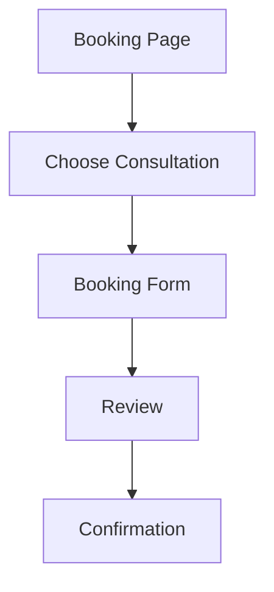
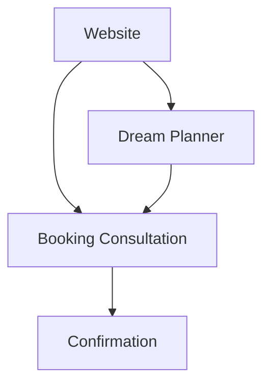
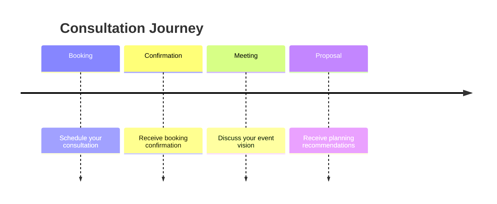
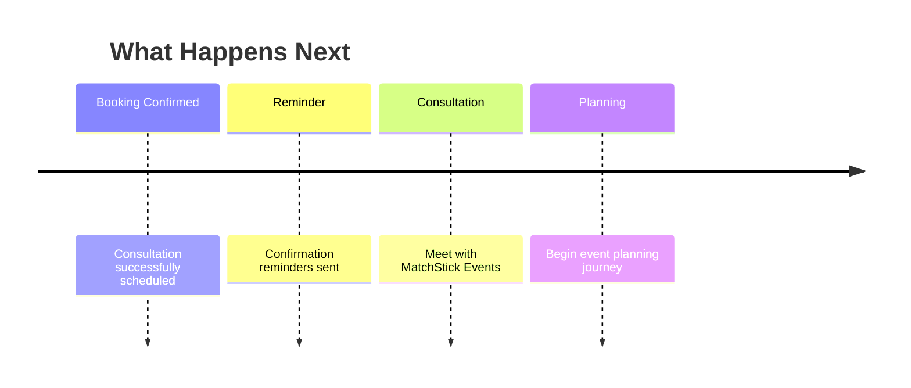
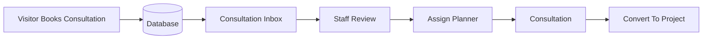
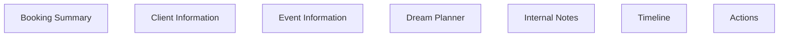
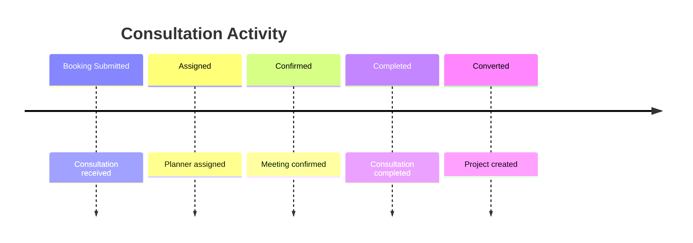
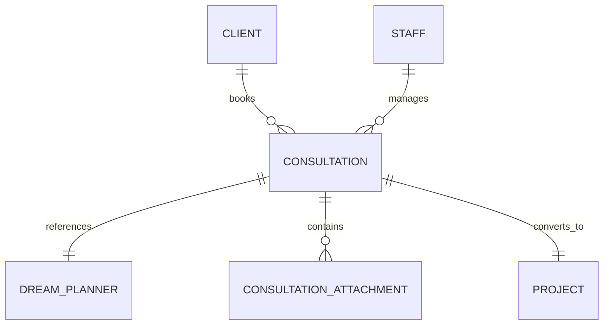

# 13 — Booking Consultation Specification (Part 1)

> MatchStick Events Documentation Repository

---

# Document Information

| Property | Value |
|----------|-------|
| Document Name | Booking Consultation |
| Document ID | DOC-013 |
| Version | 1.0.0 |
| Part | 1 of 5 |
| Status | Approved |
| Depends On | README.md, 01-product-vision.md, 06-design-system.md, 12-dream-planner.md |

---

# Purpose

The Booking Consultation page provides visitors with a seamless way to schedule an initial consultation with MatchStick Events.

Rather than functioning as a generic contact form, the page should feel like the beginning of a premium client relationship.

It should encourage meaningful conversations while collecting the information required for an effective consultation.

---

# Business Goals

The consultation experience should:

- Generate qualified leads.
- Reduce friction during booking.
- Improve consultation preparedness.
- Capture structured client information.
- Increase consultation attendance.
- Strengthen the premium brand experience.

The client currently receives enquiries through calls, WhatsApp, Instagram DMs, emails, and word of mouth. The Booking Consultation page centralizes these enquiries into a structured digital workflow while preserving existing communication channels. 0

---

# User Goals

Visitors should be able to:

- Schedule a consultation quickly.
- Choose their preferred communication method.
- Select a convenient meeting time.
- Share important event details.
- Receive immediate confirmation.
- Feel confident that their enquiry has been received.

---

# Product Philosophy

Booking a consultation should feel effortless.

The experience should resemble booking a luxury design consultation rather than completing an online form.

Every interaction should reinforce trust, professionalism, and attention to detail.

---

# Core Principles

The Booking Consultation experience should always be:

- Elegant
- Personal
- Guided
- Efficient
- Mobile-first
- Transparent
- Professional

---

# User Experience Goal

Visitors should leave the page thinking:

> "I'm looking forward to speaking with them."

---

# Information Architecture



---

# Overall Workflow

```mermaid
flowchart LR

Landing

-->

Consultation Type

-->

Booking Details

-->

Review

-->

Submit

-->

Confirmation
```

---

# Booking Philosophy

The consultation is not a sales meeting.

It is an opportunity to:

- Understand the client's vision.
- Discuss possibilities.
- Answer questions.
- Build trust.
- Determine the next planning steps.

---

# Relationship with Dream Planner

Visitors may reach this page in two ways.

## Path 1

Dream Planner Completed

↓

Booking Consultation

↓

Confirmation

---

## Path 2

Direct Website Visitor

↓

Booking Consultation

↓

Confirmation

---

# Workflow Diagram



---

# Automatic Data Population

If the visitor arrives from the Dream Planner:

Automatically populate:

- Event Type
- Guest Count
- Budget
- Venue Information
- Theme Preferences
- Special Requests

Users may edit this information before submitting.

If the visitor books directly, the form should begin empty.

---

# Landing Section

## Purpose

Introduce the consultation experience.

Help visitors understand what happens next.

---

# Hero Layout

Desktop

Two-column layout.

Left

Introduction.

Right

Elegant lifestyle imagery or consultation-themed photography.

Tablet

Stacked layout.

Mobile

Single-column layout.

---

# Hero Heading

Example direction

```
Let's Start Planning Something Extraordinary
```

Example only.

---

# Supporting Text

Approximately

80–120 words.

Explain that the consultation is an opportunity to discuss ideas, understand requirements, and explore possibilities before detailed planning begins.

Avoid mentioning pricing or sales language.

---

# Primary CTA

```
Book Your Consultation
```

---

# Secondary CTA

```
Complete Dream Planner First
```

This option encourages users who are still exploring ideas to complete the Dream Planner before scheduling.

---

# Consultation Types

Offer consultation options as premium cards.

Examples:

- Initial Consultation
- Wedding Consultation
- Corporate Consultation
- Event Planning Consultation
- Follow-up Consultation

The specific consultation type should automatically adapt to the selected event type when the user arrives from the Dream Planner.

---

# Consultation Cards

Each card should contain:

- Icon or illustration
- Consultation title
- Short description
- Estimated duration

Selecting a card immediately highlights it.

---

# Consultation Duration

Display estimated durations.

Examples

| Consultation | Duration |
|--------------|----------|
| Initial Consultation | 30 Minutes |
| Wedding Consultation | 60 Minutes |
| Corporate Consultation | 60 Minutes |
| Follow-up Consultation | 30 Minutes |

Actual durations should remain configurable from the Admin Dashboard.

---

# What to Expect

Display a simple timeline.



---

# Consultation Benefits

Visitors should understand they will receive:

- Personalized guidance
- Professional recommendations
- Opportunity to discuss ideas
- Clarification of planning requirements
- Answers to event-related questions

Avoid promising quotations or final pricing during the consultation.

---

# Alternative Contact Methods

Visitors who prefer immediate communication should also see:

- Call
- WhatsApp
- Email

These options align with the client's existing enquiry channels. 1 2

---

# Navigation

Throughout the booking process users should always be able to:

- Continue
- Go Back
- Cancel Booking

Navigation should remain fixed on mobile devices.

---

# Save Progress

The booking form should automatically preserve entered information.

Triggers:

- Page refresh
- Browser close
- Step completion

Saved bookings should automatically resume when the visitor returns.

---

# Empty State

Display when no booking has started.

```
Every unforgettable celebration begins with a conversation.

Book your consultation to start planning your next memorable event.
```

---

# Responsive Behaviour

Desktop

- Spacious layout
- Two-column sections
- Side-by-side summary

Tablet

- Reduced spacing
- Comfortable touch targets

Mobile

- Single-column layout
- Sticky navigation
- Large action buttons
- Minimal scrolling

---

# Functional Requirements

| ID | Requirement |
|----|-------------|
| BC-001 | Display consultation landing page. |
| BC-002 | Support bookings with or without Dream Planner completion. |
| BC-003 | Display consultation options. |
| BC-004 | Auto-populate planner information when available. |
| BC-005 | Preserve booking progress. |
| BC-006 | Display alternative contact methods. |

---

# Non-Functional Requirements

The consultation experience shall be:

- Responsive.
- Accessible.
- Mobile-first.
- Fast.
- Elegant.
- Secure.
- Easy to complete.

---

# Developer Notes

Developers should:

- Keep the booking workflow independent of the Dream Planner while supporting seamless integration.
- Design all consultation types as configurable entities rather than hardcoded values.
- Build reusable booking components that can support future consultation categories.
- Preserve partially completed bookings across browser sessions.
- Ensure users can enter the booking flow from any page of the website without losing context.

---

# End of Part 1

Part 2 defines the complete Booking Form, including contact information, preferred communication methods, meeting mode, date and time selection, validation rules, conditional logic, responsive behaviour, and all required user inputs.

# 13 — Booking Consultation Specification (Part 2)

> MatchStick Events Documentation Repository

---

# Document Information

| Property | Value |
|----------|-------|
| Document Name | Booking Consultation |
| Document ID | DOC-013 |
| Version | 1.0.0 |
| Part | 2 of 5 |
| Status | Approved |

---

# Booking Form

## Purpose

The booking form collects the information required to schedule a consultation while maintaining a premium, low-friction user experience.

The form should feel conversational and welcoming rather than administrative.

---

# Form Structure

The booking form should be divided into logical sections.

1. Contact Information
2. Consultation Details
3. Meeting Preferences
4. Event Information
5. Additional Notes
6. Review & Continue

Each section should be visually separated with generous spacing.

---

# Progress Indicator

Display throughout the booking process.

Example

```text
Step 2 of 6

██████████░░░░░░░░░░
40% Complete
```

Progress updates automatically.

---

# Section 1 — Contact Information

## Purpose

Collect essential contact information.

---

# Fields

| Field | Required |
|--------|----------|
| Full Name | Yes |
| Mobile Number | Yes |
| Email Address | Yes |

---

# Validation

Full Name

- Minimum 2 characters

Mobile Number

- Valid Indian mobile number

Email

- Valid email format

Display inline validation.

---

# Preferred Contact Method

Question

```
How would you like us to contact you?
```

Options

- Phone Call
- WhatsApp
- Email

Only one option may be selected.

These options reflect the communication methods currently used by MatchStick Events. 0 1

---

# Section 2 — Consultation Details

## Purpose

Capture the preferred consultation type.

---

# Consultation Type

Display as premium cards.

Examples

- Initial Consultation
- Wedding Consultation
- Corporate Consultation
- Event Planning Consultation
- Follow-up Consultation

Automatically selected when arriving from the Dream Planner.

Users may change it.

---

# Meeting Mode

Question

```
How would you like to meet?
```

Options

- Phone Call
- Video Call
- In-Person

Only one option may be selected.

---

# Conditional Logic

If

In-Person

↓

Display

Preferred Meeting Location

If

Video Call

↓

Display

Preferred Platform

Examples

- Google Meet
- Zoom
- Microsoft Teams

---

# Section 3 — Date Selection

## Purpose

Allow visitors to choose a preferred consultation date.

---

# Calendar Picker

Requirements

- Modern calendar component
- Mobile-friendly
- Keyboard accessible
- Future dates only

Past dates cannot be selected.

---

# Availability Rules

Unavailable dates should appear disabled.

Examples

- Company holidays
- Fully booked dates
- Manual closures

Availability is controlled from the Admin Dashboard.

---

# Preferred Time

Display available time slots.

Example

```
09:00

10:00

11:00

12:00

02:00

03:00

04:00

05:00
```

Unavailable slots should not be selectable.

---

# Time Zone

Automatically detect the visitor's time zone.

Display

```
Asia/Kolkata (IST)
```

Users may change it if necessary.

---

# Section 4 — Event Information

## Purpose

Capture high-level event details.

If users arrive from the Dream Planner, these values should already be populated.

---

# Fields

Event Type

Estimated Guest Count

Preferred Event Date

Preferred Venue

Budget Range

Theme

Each field should remain editable.

---

# Event Date

Optional.

Allows visitors to indicate the expected celebration date.

---

# Budget

Display selected range.

Editable.

No public pricing should be shown anywhere in the booking experience, consistent with the repository's business objectives. 2

---

# Section 5 — Additional Notes

## Purpose

Provide space for additional information.

---

# Text Area

Prompt

```
Is there anything you'd like us to know before the consultation?
```

Examples

- Family traditions
- Accessibility needs
- Planning concerns
- Questions

Maximum

3000 characters.

---

# Attachment Upload

Optional.

Users may upload

- Inspiration Images
- PDFs
- Mood Boards

Supported Formats

- JPG
- PNG
- PDF

Maximum file size should be configurable.

---

# Auto-save

Every completed field should trigger an automatic save.

Display

```
Saved
```

after successful synchronization.

---

# Form Validation

Required fields

- Full Name
- Mobile Number
- Email
- Consultation Type
- Meeting Mode
- Preferred Date
- Preferred Time

Validation should occur:

- During typing
- On field exit
- Before submission

Avoid blocking users with unnecessary error dialogs.

---

# Error Messages

Examples

```
Please enter your name.
```

```
Select a preferred consultation date.
```

```
Please choose a meeting mode.
```

Messages should clearly explain how to resolve the issue.

---

# Conditional Logic

Examples

If Meeting Mode = Video Call

↓

Show platform selection.

---

If Meeting Mode = In-Person

↓

Show meeting location.

---

If Dream Planner exists

↓

Pre-fill planner information.

---

If no planner exists

↓

Display blank event information fields.

---

# Review Section

Before submission display:

Contact Information

↓

Consultation Details

↓

Meeting Preferences

↓

Event Information

↓

Additional Notes

Users should be able to edit any section before continuing.

---

# Mobile Experience

On mobile devices:

- Sticky Continue button.
- Large touch targets.
- Full-width inputs.
- Native date picker where appropriate.
- Minimize keyboard usage through cards, selectors, and pickers.

---

# Functional Requirements

| ID | Requirement |
|----|-------------|
| BC-007 | Collect contact information. |
| BC-008 | Capture preferred contact method. |
| BC-009 | Capture consultation details. |
| BC-010 | Support meeting mode selection. |
| BC-011 | Support calendar booking. |
| BC-012 | Display available time slots. |
| BC-013 | Pre-fill Dream Planner information. |
| BC-014 | Support attachments. |
| BC-015 | Validate required fields. |
| BC-016 | Auto-save booking progress. |

---

# Non-Functional Requirements

The booking form shall be:

- Responsive.
- Accessible.
- Mobile-first.
- Fast.
- Reliable.
- Secure.
- Easy to complete.

---

# Developer Notes

Developers should:

- Implement reusable form components for all input types.
- Retrieve available dates and time slots dynamically from the backend.
- Support configurable meeting platforms, locations, and consultation types through the Admin Dashboard.
- Preserve all entered data across sessions until submission or cancellation.
- Ensure validation logic is centralized and reusable across both frontend and backend services.

---

# End of Part 2

Part 3 defines the **Scheduling & Confirmation Workflow**, including calendar availability, double-booking prevention, booking confirmation, email and WhatsApp notifications, reminder scheduling, rescheduling, cancellation, failure recovery, and post-booking user experience.

# 13 — Booking Consultation Specification (Part 3)

> MatchStick Events Documentation Repository

---

# Document Information

| Property | Value |
|----------|-------|
| Document Name | Booking Consultation |
| Document ID | DOC-013 |
| Version | 1.0.0 |
| Part | 3 of 5 |
| Status | Approved |
| Depends On | 12-dream-planner.md, 15-admin-dashboard.md |

---

# Scheduling & Confirmation

## Purpose

After completing the booking form, visitors should experience a smooth, transparent scheduling process.

The system should confirm bookings immediately while preventing scheduling conflicts and keeping both the visitor and the MatchStick Events team informed.

---

# Scheduling Workflow

```mermaid
flowchart LR

Booking

-->

Availability Check

-->

Confirmation

-->

Notifications

-->

Dashboard

-->

Consultation
```

---

# Booking Validation

Before confirming a consultation, the system shall verify:

- Required fields completed.
- Preferred date is available.
- Preferred time slot is available.
- Contact information is valid.
- Duplicate booking rules.
- Uploaded files processed successfully.

Only successful validations proceed to confirmation.

---

# Availability Engine

## Purpose

The booking system should display only available consultation slots.

Availability is determined dynamically from the Admin Dashboard.

Unavailable slots must never be selectable.

---

# Availability Rules

The scheduler should consider:

- Working hours.
- Company holidays.
- Blocked dates.
- Existing consultations.
- Manual overrides.
- Buffer time between meetings.

The booking experience should always reflect the latest availability.

---

# Working Hours

Working hours should be configurable.

Example

| Day | Hours |
|------|--------|
| Monday | 10:00–18:00 |
| Tuesday | 10:00–18:00 |
| Wednesday | 10:00–18:00 |
| Thursday | 10:00–18:00 |
| Friday | 10:00–18:00 |
| Saturday | 11:00–16:00 |
| Sunday | Closed |

These values are examples only.

---

# Time Slot Generation

Available consultation slots should be generated automatically.

Example

```
10:00

10:30

11:00

11:30

12:00

14:00

14:30

15:00
```

Slot duration should remain configurable.

---

# Buffer Time

The system should automatically reserve preparation time between consultations.

Example

```
Consultation

↓

15 Minute Buffer

↓

Next Consultation
```

Buffer duration should be configurable.

---

# Double Booking Prevention

The system must prevent:

- Two consultations occupying the same time slot.
- Duplicate bookings by the same visitor for the same consultation.
- Overlapping appointments assigned to the same planner.

If a conflict occurs during submission, the visitor should be prompted to choose another available slot.

---

# Duplicate Detection

Potential duplicates include:

- Same email address.
- Same mobile number.
- Same consultation date.
- Same event date.

If duplicates are detected:

Display

```
It looks like you may already have a consultation scheduled.

Would you like to review your existing booking instead?
```

Staff may override duplicate warnings from the Admin Dashboard.

---

# Review Before Confirmation

Display a complete booking summary.

Sections

- Contact Information
- Consultation Details
- Meeting Preferences
- Event Information
- Dream Planner Summary (if available)
- Uploaded Attachments

Every section should include an

```
Edit
```

action.

---

# Booking Confirmation

After successful scheduling:

Display a confirmation page.

---

# Confirmation Heading

Example

```
Your Consultation Has Been Scheduled
```

Example only.

---

# Confirmation Message

Thank the visitor.

Explain that the MatchStick Events team will review the booking before the consultation.

Maintain a warm, premium tone.

---

# Confirmation Details

Display

- Booking Reference Number
- Consultation Type
- Meeting Mode
- Scheduled Date
- Scheduled Time
- Estimated Duration

---

# Next Steps Timeline



---

# Calendar Invitation

After confirmation, visitors should be able to:

- Add to Google Calendar
- Download ICS calendar file
- Add to Apple Calendar
- Add to Outlook Calendar

Calendar integration should be generated automatically after successful booking.

---

# Email Confirmation

Automatically send:

## Visitor

- Booking confirmation
- Consultation details
- Calendar invitation
- Booking reference
- Contact information

---

## MatchStick Events Team

- New consultation notification
- Complete booking information
- Dream Planner summary (if available)
- Uploaded attachments

---

# WhatsApp Confirmation

If WhatsApp is the preferred contact method:

Automatically prepare:

- Booking confirmation
- Reference number
- Consultation schedule

Future integration may use the WhatsApp Business API.

---

# Reminder Notifications

Automatically schedule reminders.

Recommended timing

| Reminder | Time |
|-----------|------|
| Confirmation | Immediately |
| Reminder 1 | 24 Hours Before |
| Reminder 2 | 2 Hours Before |

Reminder timing should remain configurable.

---

# Rescheduling

Visitors should be able to request:

- New date
- New time

The original booking should remain active until the new schedule is confirmed.

---

# Cancellation

Visitors should be able to cancel consultations.

After cancellation:

Display

```
Your consultation has been cancelled.

We'd love to help whenever you're ready.
```

Cancelled bookings should remain stored in the Dashboard.

---

# Failure Recovery

If scheduling fails:

Display

> We couldn't complete your booking at the moment.

Offer:

- Retry
- Save Progress
- Contact MatchStick Events

Never discard completed information.

---

# Network Recovery

If connectivity is interrupted:

- Preserve booking locally.
- Retry automatically.
- Inform the visitor when synchronization succeeds.

---

# Booking Status Lifecycle

```mermaid
flowchart LR

Draft

-->

Submitted

-->

Confirmed

-->

Reminder Sent

-->

Completed

Cancelled --> Archived

Confirmed --> Cancelled
Completed --> Archived
```

---

# Booking Reference Number

Every confirmed consultation shall receive a unique identifier.

Example

```
MSE-2026-000147
```

Reference format should remain configurable.

---

# Functional Requirements

| ID | Requirement |
|----|-------------|
| BC-017 | Validate booking availability. |
| BC-018 | Prevent double bookings. |
| BC-019 | Generate booking confirmation. |
| BC-020 | Generate booking reference number. |
| BC-021 | Send confirmation notifications. |
| BC-022 | Schedule reminder notifications. |
| BC-023 | Support rescheduling. |
| BC-024 | Support cancellation. |
| BC-025 | Recover from submission failures. |

---

# Non-Functional Requirements

Scheduling shall be:

- Reliable.
- Transaction-safe.
- Responsive.
- Accessible.
- Scalable.
- Secure.
- Fault tolerant.

---

# Developer Notes

Developers should:

- Treat booking confirmation as an atomic transaction to avoid partial bookings.
- Lock selected time slots during confirmation to prevent race conditions.
- Generate calendar invitations automatically after successful scheduling.
- Store reminder schedules independently so notification timing can be modified without altering booking records.
- Ensure failed submissions can be safely retried without creating duplicate consultations.

---

# End of Part 3

Part 4 defines the complete **Dashboard Integration**, including the Consultation Inbox, calendar management, staff assignment, client timeline, consultation status workflow, Dream Planner integration, conversion into active projects, permissions, activity history, and database relationships.

# 13 — Booking Consultation Specification (Part 4)

> MatchStick Events Documentation Repository

---

# Document Information

| Property | Value |
|----------|-------|
| Document Name | Booking Consultation |
| Document ID | DOC-013 |
| Version | 1.0.0 |
| Part | 4 of 5 |
| Status | Approved |
| Depends On | 12-dream-planner.md, 15-admin-dashboard.md, 16-database-design.md |

---

# Dashboard Integration

## Purpose

Every consultation request should become a structured record within the Admin Dashboard.

The Dashboard should enable the MatchStick Events team to efficiently review, manage, schedule, and convert consultations into active client projects.

---

# Workflow Overview



---

# Consultation Inbox

All consultation requests should appear in a centralized inbox.

Newest requests appear first.

Each consultation displays:

- Reference Number
- Client Name
- Consultation Type
- Event Type
- Meeting Mode
- Consultation Date
- Assigned Planner
- Status

---

# Dashboard Navigation

```text
Dashboard

↓

Consultations

↓

New Requests

↓

Today's Consultations

↓

Upcoming

↓

Completed

↓

Cancelled

↓

Archived
```

---

# Consultation Status Workflow

Every consultation shall have exactly one status.

| Status | Description |
|---------|-------------|
| Draft | Booking started but not submitted |
| Submitted | Awaiting review |
| Confirmed | Consultation confirmed |
| Assigned | Assigned to a planner |
| Completed | Consultation finished |
| Cancelled | Cancelled by client or staff |
| Archived | Closed record |

Status transitions should be tracked automatically.

---

# Consultation Details Page

Selecting a consultation opens a detailed workspace.



Each section should remain independently editable.

---

# Client Information

Display

- Full Name
- Mobile Number
- Email Address
- Preferred Contact Method

Additional information:

- Booking Reference
- Booking Date
- Last Updated

---

# Consultation Information

Display

- Consultation Type
- Meeting Mode
- Scheduled Date
- Scheduled Time
- Estimated Duration
- Meeting Platform or Location

---

# Dream Planner Integration

If a Dream Planner exists:

Display:

- Event Summary
- Guest Count
- Budget
- Theme
- Venue Preferences
- Uploaded Inspiration Images

Provide a quick action:

```
Open Dream Planner
```

If no planner exists:

Display

```
No Dream Planner Attached
```

with an option to create one later.

---

# Internal Notes

Staff members should be able to record:

- Consultation observations
- Client preferences
- Action items
- Follow-up tasks
- Internal discussions

These notes must never be visible to clients.

---

# Staff Assignment

Managers may assign consultations to planners.

Assignment methods:

- Manual assignment
- Automatic assignment (future enhancement)

Assigned planner should appear in:

- Consultation list
- Calendar
- Dashboard statistics

---

# Calendar View

The Dashboard should include a calendar showing:

- Today's consultations
- Upcoming consultations
- Completed consultations

Views

- Day
- Week
- Month

Color coding should indicate consultation status.

---

# Activity Timeline

Every important action should be recorded.

Example



Each activity entry should include:

- Date
- Time
- Staff Member
- Action Performed

Activity history should be immutable.

---

# Quick Actions

Available actions

- Confirm Consultation
- Reschedule
- Cancel
- Assign Planner
- Add Notes
- Send Reminder
- Convert to Project
- Archive

Actions should adapt based on the current consultation status.

---

# Reminder Management

Staff should be able to:

- Send reminder immediately
- Schedule custom reminders
- Disable reminders
- View reminder history

Reminder history should include delivery status.

---

# Consultation Conversion

## Purpose

After a successful consultation, staff should be able to convert the consultation into an active event project.

---

# Conversion Workflow

```mermaid
flowchart LR

Consultation

-->

Approved

-->

Project

-->

Project Dashboard
```

The conversion process should preserve all client and event information.

---

# Data Transferred

Convert:

- Client Information
- Event Information
- Dream Planner Data
- Attachments
- Internal Notes
- Activity History

Generate:

- Project ID
- Project Timeline
- Project Workspace

No information should be lost during conversion.

---

# Duplicate Detection

The Dashboard should warn staff if another consultation exists with:

- Same phone number
- Same email address
- Same event date

Staff may continue after confirmation.

---

# Search & Filtering

Search by:

- Client Name
- Email
- Phone Number
- Reference Number

Filter by:

- Status
- Planner
- Consultation Type
- Event Type
- Meeting Mode
- Date
- Submission Date

Sorting should support ascending and descending order.

---

# Attachments

Store

- Inspiration Images
- PDFs
- Planning Documents

Support:

- Preview
- Download
- Replace
- Delete

File access should respect user permissions.

---

# Permissions

Administrators

- Full access

Managers

- Create
- Edit
- Assign
- Convert
- Archive

Staff

- View
- Update
- Add Notes

Future roles should be supported without redesign.

---

# Database Relationships



---

# Audit Trail

The system should permanently record:

- Status changes
- Planner assignments
- Reminder deliveries
- Consultation updates
- Project conversions

Audit records should never be editable.

---

# Functional Requirements

| ID | Requirement |
|----|-------------|
| BC-026 | Store consultation records. |
| BC-027 | Display consultation inbox. |
| BC-028 | Support consultation assignment. |
| BC-029 | Display consultation calendar. |
| BC-030 | Maintain activity history. |
| BC-031 | Convert consultations into projects. |
| BC-032 | Support search and filtering. |
| BC-033 | Manage consultation attachments. |
| BC-034 | Enforce role-based permissions. |

---

# Non-Functional Requirements

Dashboard integration shall be:

- Secure.
- Responsive.
- Reliable.
- Scalable.
- Maintainable.
- Transaction-safe.
- Easy for non-technical staff.

---

# Developer Notes

Developers should:

- Treat consultations as independent entities while maintaining relationships with Dream Planners and Projects.
- Use configurable status workflows instead of hardcoded transitions.
- Build the consultation calendar using reusable scheduling components.
- Ensure project conversion is fully transactional and reversible only through administrative workflows.
- Design the consultation module so future CRM, Google Calendar, Microsoft Outlook, and third-party integrations can be added without major architectural changes.

---

# End of Part 4

Part 5 completes the Booking Consultation specification with:

- Accessibility
- SEO considerations
- Analytics Events
- Performance Goals
- Requirement Traceability
- Future Enhancements
- Acceptance Criteria
- Developer Checklist
- Related Documents
- Final implementation guidance

# 13 — Booking Consultation Specification (Part 5)

> MatchStick Events Documentation Repository

---

# Document Information

| Property | Value |
|----------|-------|
| Document Name | Booking Consultation |
| Document ID | DOC-013 |
| Version | 1.0.0 |
| Part | 5 of 5 |
| Status | Approved |

---

# Accessibility

## Purpose

The Booking Consultation experience should be fully accessible, ensuring that every visitor can schedule a consultation regardless of device, ability, or assistive technology.

Accessibility should be integrated into every stage of the booking workflow.

---

# Keyboard Navigation

Visitors should be able to:

- Navigate every field using the keyboard.
- Select consultation options without a mouse.
- Operate the calendar using keyboard controls.
- Submit the booking without requiring touch interactions.

The tab order should follow a logical reading sequence.

---

# Screen Reader Support

All interactive components shall include:

- Accessible labels
- Form descriptions
- Calendar announcements
- Validation messages
- Status updates
- Button descriptions

Progress indicators should announce the current booking step.

---

# Error Accessibility

Validation messages should:

- Be announced immediately.
- Clearly identify the affected field.
- Explain how the issue can be resolved.

Avoid using color alone to indicate errors.

---

# Touch Accessibility

The mobile experience should provide:

- Large touch targets
- Comfortable spacing
- Sticky action buttons
- Clear visual feedback
- Portrait-first layouts

---

# Performance

## Performance Goals

| Metric | Goal |
|---------|------|
| Booking Page Load | < 2 seconds |
| Calendar Loading | < 1 second |
| Time Slot Refresh | < 500 ms |
| Booking Submission | < 3 seconds |

---

# Reliability

The booking workflow shall:

- Recover after network interruptions.
- Preserve partially completed bookings.
- Resume interrupted sessions.
- Prevent duplicate submissions.

---

# SEO Considerations

The Booking Consultation page supports lead generation rather than search traffic.

The page should include:

- Descriptive metadata
- Semantic heading structure
- Open Graph metadata
- Structured page titles

Consultation data and personal information must never be indexed by search engines.

---

# Analytics

## Purpose

Analytics should measure how effectively visitors complete the consultation booking process while respecting user privacy.

---

# Recommended Events

| Event | Trigger |
|--------|----------|
| Consultation Started | Booking process begins |
| Consultation Type Selected | User selects consultation type |
| Meeting Mode Selected | User chooses meeting method |
| Date Selected | Preferred consultation date chosen |
| Time Selected | Consultation time selected |
| Booking Saved | Auto-save completed |
| Booking Resumed | Saved booking restored |
| Booking Reviewed | Review page displayed |
| Consultation Submitted | Booking completed successfully |
| Booking Cancelled | User cancels booking |
| Submission Failed | Booking submission unsuccessful |

---

# Booking Funnel

```mermaid
flowchart LR

Landing

-->

Booking Started

-->

Booking Completed

-->

Consultation Confirmed

-->

Consultation Completed

-->

Project Created
```

The funnel should help identify where visitors abandon the booking journey.

---

# Success Metrics

Recommended KPIs

| Metric | Description |
|----------|-------------|
| Booking Completion Rate | Percentage of started bookings successfully submitted |
| Average Booking Time | Average time required to complete booking |
| Booking Abandonment Rate | Percentage of unfinished bookings |
| Consultation Attendance Rate | Percentage of confirmed consultations attended |
| Consultation-to-Project Conversion | Percentage of consultations converted into projects |

---

# Privacy

The Booking Consultation page collects personal information.

The system should:

- Collect only necessary information.
- Protect uploaded files.
- Encrypt sensitive data during transmission.
- Restrict access through role-based permissions.

Detailed security requirements are defined in `19-security.md`.

---

# Future Enhancements

The booking architecture should support future capabilities without requiring significant redesign.

Potential enhancements include:

- Google Calendar synchronization
- Microsoft Outlook integration
- Apple Calendar integration
- WhatsApp Business API
- SMS reminders
- AI consultation recommendations
- Automatic planner assignment
- Smart availability optimization
- Multi-language booking
- Online consultation payments
- Client portal
- AI-powered scheduling assistant
- Video meeting generation
- Digital consultation notes

These features are outside the scope of Version 1.

---

# Requirement Traceability

| Requirement Group | Covered In |
|-------------------|------------|
| Consultation Experience | Part 1 |
| Booking Form | Part 2 |
| Scheduling & Confirmation | Part 3 |
| Dashboard Integration | Part 4 |
| Accessibility & Quality | Part 5 |

---

# Acceptance Criteria

The Booking Consultation feature shall be considered complete when:

- Visitors can successfully schedule consultations.
- Dream Planner information is automatically imported when available.
- Calendar availability is displayed correctly.
- Double-booking prevention is operational.
- Booking confirmations are generated.
- Reminder scheduling functions correctly.
- Dashboard users can manage consultation records.
- Consultations can be converted into active projects.
- Accessibility requirements are satisfied.
- Performance targets are achieved.
- Analytics events are recorded successfully.

---

# Developer Checklist

## User Experience

- Consultation landing page implemented.
- Booking workflow completed.
- Responsive layouts verified.
- Progress indicator implemented.
- Review page completed.
- Confirmation experience completed.

---

## Backend

- Consultation data model implemented.
- Scheduling engine completed.
- Availability validation implemented.
- Reminder system operational.
- Booking reference generation verified.
- Duplicate detection completed.

---

## Dashboard

- Consultation inbox implemented.
- Calendar view completed.
- Assignment workflow implemented.
- Search and filtering completed.
- Project conversion implemented.
- Activity timeline verified.

---

## Quality Assurance

- Accessibility testing completed.
- Responsive testing completed.
- Cross-browser testing completed.
- Performance targets verified.
- Booking validation tested.
- Failure recovery tested.
- Reminder delivery verified.

---

# Related Documents

- README.md
- 01-product-vision.md
- 06-design-system.md
- 12-dream-planner.md
- 14-contact-page.md
- 15-admin-dashboard.md
- 16-database-design.md
- 17-backend-architecture.md
- 18-api-specification.md
- 19-security.md
- 20-seo.md
- 21-testing.md

---

# Version History

| Version | Date | Changes |
|----------|------|----------|
| 1.0.0 | Initial Release | Complete Booking Consultation specification |

---

# Conclusion

The Booking Consultation module transforms a traditional enquiry form into a structured consultation management system that aligns with MatchStick Events' premium brand identity. By integrating seamlessly with the Dream Planner, scheduling engine, Admin Dashboard, and future project management workflows, it provides a complete consultation lifecycle—from the visitor's first booking to the creation of an active client project.

The design emphasizes clarity, convenience, and professionalism while remaining scalable for future integrations and advanced scheduling capabilities.

---

# End of Document

**Document Complete**

**Next Document:** **14 — Contact Page Specification**

The Contact Page specification will define the public contact experience, including contact information, interactive location section, enquiry form, business hours, social media integration, FAQ section, map integration, accessibility, dashboard integration, and lead management workflows.
