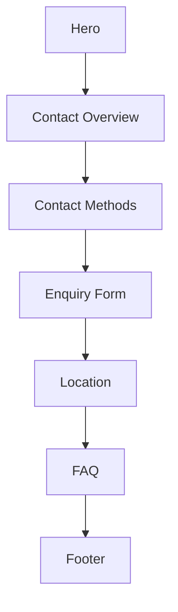
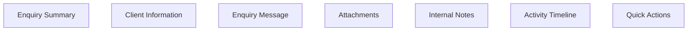
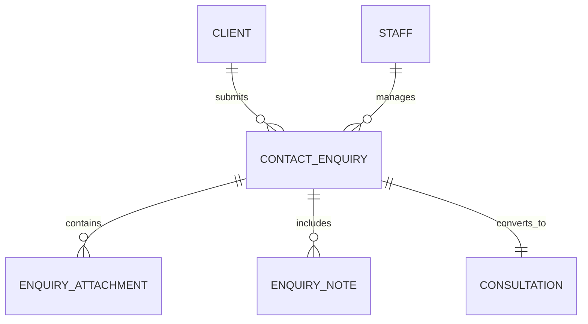

# 14 — Contact Page Specification (Part 1)

> MatchStick Events Documentation Repository

---

# Document Information

| Property | Value |
|----------|-------|
| Document Name | Contact Page |
| Document ID | DOC-014 |
| Version | 1.0.0 |
| Part | 1 of 4 |
| Status | Approved |
| Depends On | README.md, 01-product-vision.md, 06-design-system.md, 13-booking-consultation.md |

---

# Purpose

The Contact Page provides visitors with multiple ways to connect with MatchStick Events.

It serves as the central communication hub for visitors who:

- Want to ask questions.
- Need additional information.
- Prefer direct communication.
- Wish to enquire before booking.
- Need company contact details.

The page should make contacting MatchStick Events feel approachable, effortless, and premium.

---

# Business Goals

The Contact Page should:

- Increase qualified enquiries.
- Reduce communication friction.
- Build visitor confidence.
- Encourage conversations.
- Support multiple communication preferences.
- Reinforce the luxury brand identity.

The client currently receives enquiries through phone calls, WhatsApp, Instagram DMs, Facebook, email, and word of mouth. The Contact Page should centralize these communication channels while preserving the user's preferred method of contact. 0 1

---

# User Goals

Visitors should be able to:

- Find contact information quickly.
- Contact the company using their preferred method.
- Send enquiries.
- View business location.
- Access social media.
- Feel confident that someone will respond.

---

# Product Philosophy

The Contact Page should not feel like a corporate directory.

Instead, it should feel like an invitation to begin a conversation.

Every section should reassure visitors that MatchStick Events values personal relationships as much as exceptional event design.

---

# Core Principles

The Contact Page should always be:

- Elegant
- Personal
- Welcoming
- Professional
- Mobile-first
- Easy to navigate
- Trustworthy

---

# User Experience Goal

Visitors should leave the page thinking:

> "Reaching out feels simple, and I know I'll be speaking with professionals who care about my event."

---

# Information Architecture



---

# Overall User Journey

```mermaid
flowchart LR

Landing

-->

Choose Contact Method

-->

Send Enquiry

-->

Confirmation

-->

Team Response
```

---

# Contact Philosophy

Visitors should never have to search for ways to communicate.

The most important contact methods should always remain visible.

Every interaction should encourage conversation instead of forcing visitors into one communication channel.

---

# Hero Section

## Purpose

Welcome visitors and encourage them to begin a conversation.

---

# Hero Layout

Desktop

Two-column layout.

Left

Headline and introduction.

Right

Elegant lifestyle imagery or premium event photography.

Tablet

Stacked layout.

Mobile

Single-column layout.

---

# Hero Heading

Example direction

```
Let's Start the Conversation
```

Example only.

---

# Supporting Text

Approximately

80–120 words.

Explain that every memorable celebration begins with understanding the client's vision.

Encourage visitors to reach out regardless of whether they have a fully planned idea or are just getting started.

Avoid promotional language.

---

# Primary CTA

```
Send an Enquiry
```

---

# Secondary CTA

```
Book a Consultation
```

Links directly to the Booking Consultation experience.

---

# Contact Overview

Immediately below the hero section, display a concise overview of the available communication channels.

Purpose:

Help visitors decide the quickest way to reach MatchStick Events.

---

# Contact Cards

Display communication methods as premium cards.

Cards should include:

- Icon
- Title
- Short description
- Primary action

Cards include:

- Phone
- WhatsApp
- Email
- Office Address

---

# Card Behaviour

Each card should:

- Elevate slightly on hover.
- Highlight on selection.
- Support keyboard navigation.
- Display clear call-to-action buttons.

---

# Contact Prioritization

Order communication methods as follows:

1. Phone
2. WhatsApp
3. Email
4. Office Address

This reflects the company's existing enquiry workflow while keeping the fastest communication methods most visible. 2 3

---

# Business Hours

Display business availability.

Example

| Day | Hours |
|------|--------|
| Monday | 10:00 AM – 6:00 PM |
| Tuesday | 10:00 AM – 6:00 PM |
| Wednesday | 10:00 AM – 6:00 PM |
| Thursday | 10:00 AM – 6:00 PM |
| Friday | 10:00 AM – 6:00 PM |
| Saturday | 11:00 AM – 4:00 PM |
| Sunday | Closed |

Business hours should remain configurable through the Admin Dashboard.

---

# Response Expectations

Display a simple reassurance section.

Example

```
We typically respond within one business day.
```

The response time should remain configurable.

---

# Trust Indicators

Display subtle trust-building elements.

Examples

- Founded in 2012
- Personalized Event Planning
- Luxury Event Specialists
- Based in Kolkata

These details reflect the company's profile in the client brief. 4

---

# Contact Journey

```mermaid
flowchart TD

Visitor

-->

Contact Page

-->

Preferred Contact Method

-->

Enquiry Sent

-->

Team Review

-->

Response
```

---

# Alternative Path

Visitors who are ready to schedule a discussion should be guided toward the Booking Consultation page.

Display

```
Prefer to schedule a meeting instead?

Book a Consultation
```

This CTA should remain visible near the bottom of the page.

---

# Empty State

If no enquiry has been started:

Display

> We'd love to hear about your celebration.

Include

```
Send an Enquiry
```

---

# Responsive Behaviour

Desktop

- Two-column layout.
- Side-by-side contact cards.
- Spacious sections.

Tablet

- Two-column grid.
- Comfortable spacing.

Mobile

- Single-column layout.
- Large touch targets.
- Sticky contact actions.
- Easy thumb navigation.

---

# Functional Requirements

| ID | Requirement |
|----|-------------|
| CP-001 | Display contact hero section. |
| CP-002 | Display contact overview. |
| CP-003 | Display communication method cards. |
| CP-004 | Display business hours. |
| CP-005 | Display trust indicators. |
| CP-006 | Link to Booking Consultation page. |

---

# Non-Functional Requirements

The Contact Page shall be:

- Responsive.
- Accessible.
- Mobile-first.
- Fast.
- Elegant.
- Secure.
- Easy to navigate.

---

# Developer Notes

Developers should:

- Design communication cards as reusable components.
- Keep contact information configurable through the Admin Dashboard.
- Ensure the page gracefully adapts to future communication channels.
- Maintain visual consistency with the site's premium design system.
- Make primary contact actions immediately accessible without excessive scrolling.

---

# End of Part 1

Part 2 defines every communication channel in detail, including Phone, WhatsApp, Email, Office Address, Social Media integration, the interactive Enquiry Form, Google Maps integration, FAQ preview, validation rules, and responsive interaction behaviour.

# 14 — Contact Page Specification (Part 2)

> MatchStick Events Documentation Repository

---

# Document Information

| Property | Value |
|----------|-------|
| Document Name | Contact Page |
| Document ID | DOC-014 |
| Version | 1.0.0 |
| Part | 2 of 4 |
| Status | Approved |

---

# Contact Methods

## Purpose

Provide visitors with multiple convenient ways to contact MatchStick Events.

Each communication method should be immediately recognizable and require minimal effort to use.

---

# Phone Contact

## Purpose

Allow visitors to contact the team directly.

---

# Display

Show:

- Phone Number
- Availability
- Tap-to-call button

The contact number should be configurable.

The client-provided contact number should be displayed by default. 0

---

# Primary Action

```
Call Now
```

On supported devices:

- Launch phone dialer.
- Pre-fill the number.

---

# WhatsApp

## Purpose

Allow instant messaging.

---

# Display

Show

- WhatsApp Number
- Availability
- Response expectations

The client's contact number is also available on WhatsApp. 1

---

# Primary Action

```
Chat on WhatsApp
```

Action

Launch WhatsApp conversation.

Future versions may include pre-filled enquiry templates.

---

# Email

## Purpose

Support detailed enquiries.

---

# Display

Show

- Email Address

The client-provided email address should be displayed. 2

---

# Primary Action

```
Send Email
```

Action

Launch the visitor's default email application.

---

# Office Address

## Purpose

Display the business location.

---

# Display

- Full Address
- City
- State
- Postal Code

The address should use the client-provided office location. 3

---

# Primary Action

```
Get Directions
```

Launch the preferred maps application.

---

# Social Media

## Purpose

Allow visitors to explore additional content and connect through social platforms.

---

# Supported Platforms

Display

- Instagram
- Facebook

These are the social media platforms provided by the client. 4

---

# Social Cards

Each platform includes:

- Platform icon
- Username
- Short description
- Visit button

---

# Primary Actions

Instagram

```
Visit Instagram
```

Facebook

```
Visit Facebook
```

Links should open in a new browser tab.

---

# Enquiry Form

## Purpose

Provide visitors with a simple alternative to direct messaging.

The enquiry form should collect only the information required to respond appropriately.

---

# Form Sections

1. Contact Information
2. Enquiry Details
3. Review
4. Submit

---

# Contact Information

Fields

| Field | Required |
|--------|----------|
| Full Name | Yes |
| Mobile Number | Yes |
| Email Address | Yes |

---

# Enquiry Details

Fields

| Field | Required |
|--------|----------|
| Subject | Yes |
| Enquiry Type | Yes |
| Message | Yes |

---

# Enquiry Types

Display as selectable cards.

Examples

- Wedding
- Anniversary
- Birthday
- Baby Shower
- Corporate Event
- High Tea
- Seasonal Event
- General Enquiry

The event-related options correspond to the services offered by MatchStick Events. 5

---

# Message Field

Prompt

```
Tell us a little about your event or enquiry.
```

Maximum

3000 characters.

---

# Attachments

Optional.

Visitors may upload:

- Inspiration Images
- PDFs
- Event Documents

Supported Formats

- JPG
- PNG
- PDF

Maximum upload size should be configurable.

---

# Form Validation

Required fields

- Full Name
- Mobile Number
- Email
- Subject
- Enquiry Type
- Message

Validation should occur:

- During typing
- On field exit
- Before submission

Inline validation should be preferred over modal dialogs.

---

# Error Messages

Examples

```
Please enter your name.
```

```
Please provide your enquiry.
```

```
Please select an enquiry type.
```

Messages should clearly explain the issue.

---

# Confirmation Screen

After successful submission display

```
Thank You!

We've received your enquiry and will get back to you as soon as possible.
```

Display

- Enquiry Reference Number
- Submission Date
- Estimated Response Time

---

# Google Maps Integration

## Purpose

Help visitors locate the office.

---

# Map Features

Display

- Office Location
- Zoom Controls
- Fullscreen Mode
- Open in Google Maps

The office location should correspond to the client-provided address. 6

---

# FAQ Preview

Display a preview of frequently asked questions.

Examples

- How far in advance should I book?
- Do you travel outside Kolkata?
- Can you organize destination events?
- How do consultations work?

Each question links to a future dedicated FAQ page or expandable section.

---

# Alternative Contact CTA

Display near the bottom.

```
Ready to discuss your event in detail?

Book a Consultation
```

This CTA links directly to the Booking Consultation workflow.

---

# Responsive Behaviour

Desktop

- Two-column layout.
- Form beside contact information.
- Map displayed full width below.

Tablet

- Stacked layout.
- Responsive card grid.

Mobile

- Single-column layout.
- Full-width inputs.
- Sticky submit button.
- Large tap targets.

---

# Functional Requirements

| ID | Requirement |
|----|-------------|
| CP-007 | Display phone contact information. |
| CP-008 | Support WhatsApp contact. |
| CP-009 | Display email information. |
| CP-010 | Display office address and map. |
| CP-011 | Display social media links. |
| CP-012 | Provide enquiry form. |
| CP-013 | Support attachments. |
| CP-014 | Validate enquiry submissions. |
| CP-015 | Generate enquiry confirmation. |

---

# Non-Functional Requirements

The contact methods shall be:

- Responsive.
- Accessible.
- Mobile-first.
- Reliable.
- Secure.
- Easy to use.

---

# Developer Notes

Developers should:

- Keep all contact information configurable through the Admin Dashboard.
- Implement communication links using native platform actions (telephone, email, WhatsApp, maps).
- Build the enquiry form using reusable form components shared with the Booking Consultation module.
- Store uploaded attachments securely and associate them with the generated enquiry record.
- Design the contact module so additional communication channels can be introduced without restructuring the page.

---

# End of Part 2

Part 3 defines the complete **Dashboard Integration**, including the Contact Inbox, enquiry status workflow, lead assignment, follow-up management, internal notes, search and filtering, activity history, permissions, database relationships, and lead lifecycle management.

# 14 — Contact Page Specification (Part 3)

> MatchStick Events Documentation Repository

---

# Document Information

| Property | Value |
|----------|-------|
| Document Name | Contact Page |
| Document ID | DOC-014 |
| Version | 1.0.0 |
| Part | 3 of 4 |
| Status | Approved |
| Depends On | 13-booking-consultation.md, 15-admin-dashboard.md, 16-database-design.md |

---

# Dashboard Integration

## Purpose

Every enquiry submitted through the Contact Page should become a structured lead inside the Admin Dashboard.

The Dashboard should enable the MatchStick Events team to efficiently review, assign, respond to, and track enquiries until they are resolved or converted into consultations or projects.

---

# Workflow Overview

```mermaid
flowchart LR

Visitor

-->

Contact Form

-->

Database

-->

Contact Inbox

-->

Team Review

-->

Response

-->

Consultation

-->

Project
```

---

# Contact Inbox

Every submitted enquiry should appear in a centralized Contact Inbox.

Newest enquiries should appear first.

Each enquiry displays:

- Reference Number
- Name
- Enquiry Type
- Contact Method
- Submission Date
- Assigned Staff Member
- Status

---

# Dashboard Navigation

```text
Dashboard

↓

Contact Inbox

↓

New Enquiries

↓

In Progress

↓

Awaiting Response

↓

Resolved

↓

Archived
```

---

# Enquiry Status Workflow

Every enquiry shall have exactly one status.

| Status | Description |
|---------|-------------|
| New | Newly received enquiry |
| Under Review | Staff reviewing enquiry |
| Awaiting Response | Waiting for additional client information |
| Responded | Initial response sent |
| Consultation Scheduled | Converted into consultation |
| Closed | Enquiry resolved |
| Archived | Stored for historical reference |

Status changes should be recorded automatically.

---

# Enquiry Details Page

Selecting an enquiry opens a dedicated workspace.



Each section should be independently expandable.

---

# Client Information

Display

- Full Name
- Mobile Number
- Email Address
- Preferred Contact Method

Additional information

- Enquiry Reference
- Submission Date
- Last Updated

---

# Enquiry Information

Display

- Subject
- Enquiry Type
- Message
- Uploaded Attachments

The original enquiry message should remain immutable.

---

# Internal Notes

Staff members should be able to record:

- Follow-up actions
- Client preferences
- Important observations
- Internal discussions
- Next steps

Internal notes must never be visible to visitors.

---

# Staff Assignment

Managers should be able to assign enquiries.

Assignment methods

- Manual Assignment
- Automatic Assignment (Future)

Assigned staff should appear throughout the Dashboard.

---

# Follow-up Management

Staff should be able to:

- Schedule follow-ups
- Mark follow-ups complete
- Create reminders
- Record communication history

Every follow-up should include:

- Date
- Time
- Assigned Staff
- Status

---

# Communication History

Every interaction with the visitor should be recorded.

Examples

```text
Enquiry Submitted

↓

Email Sent

↓

Phone Call

↓

WhatsApp Conversation

↓

Consultation Scheduled
```

Communication history should remain permanent.

---

# Quick Actions

Available actions

- Reply by Email
- Call Client
- Open WhatsApp
- Schedule Consultation
- Assign Staff
- Add Notes
- Archive

Actions should change according to enquiry status.

---

# Contact → Consultation Conversion

## Purpose

Qualified enquiries should be convertible into Booking Consultations.

---

# Conversion Workflow

```mermaid
flowchart LR

Enquiry

-->

Qualified Lead

-->

Consultation

-->

Project
```

The conversion should preserve all client information.

---

# Data Transferred

Transfer

- Client Information
- Subject
- Message
- Attachments
- Internal Notes
- Communication History

Generate

- Consultation Record
- Consultation Reference
- Booking Workflow

No information should be lost during conversion.

---

# Duplicate Detection

Warn staff if another enquiry exists with:

- Same email
- Same phone number
- Similar subject
- Same client name

Staff may continue after confirmation.

---

# Search & Filtering

Search by

- Name
- Email
- Phone Number
- Reference Number
- Subject

Filter by

- Status
- Staff Member
- Enquiry Type
- Submission Date

Sorting should support ascending and descending order.

---

# Attachments

Store

- Images
- PDFs
- Event Documents

Support

- Preview
- Download
- Replace
- Delete

Permissions should determine attachment access.

---

# Dashboard Notifications

Notify staff when:

- New enquiry submitted
- Enquiry assigned
- Follow-up overdue
- Consultation scheduled
- Enquiry archived

Notification rules should remain configurable.

---

# Database Relationships



---

# Audit Trail

Record every important action.

Examples

- Enquiry Created
- Assignment Changed
- Note Added
- Response Sent
- Consultation Created
- Archived

Audit records should never be editable.

---

# Permissions

Administrators

- Full access

Managers

- Assign
- Respond
- Convert
- Archive

Staff

- View
- Update
- Add Notes
- Respond

Future role expansion should require no architectural redesign.

---

# Data Retention

Resolved enquiries should remain searchable.

Archived enquiries should preserve:

- Attachments
- Notes
- Activity History
- Communication History

Automatic deletion should not occur.

---

# Functional Requirements

| ID | Requirement |
|----|-------------|
| CP-016 | Store enquiry records. |
| CP-017 | Display Contact Inbox. |
| CP-018 | Support enquiry assignment. |
| CP-019 | Track communication history. |
| CP-020 | Manage follow-up activities. |
| CP-021 | Convert enquiries into consultations. |
| CP-022 | Support search and filtering. |
| CP-023 | Manage attachments. |
| CP-024 | Enforce role-based permissions. |

---

# Non-Functional Requirements

Dashboard integration shall be:

- Secure.
- Responsive.
- Reliable.
- Scalable.
- Maintainable.
- Transaction-safe.
- Easy for non-technical staff.

---

# Developer Notes

Developers should:

- Treat contact enquiries as independent lead entities.
- Implement configurable status workflows rather than hardcoded transitions.
- Preserve the original enquiry message while allowing staff to add notes separately.
- Design follow-up and communication history as reusable modules shared with the Booking Consultation workflow.
- Ensure conversions from enquiries to consultations are fully transactional and preserve all associated data and attachments.

---

# End of Part 3

Part 4 completes the Contact Page specification with:

- Accessibility
- SEO considerations
- Analytics Events
- Performance Goals
- Requirement Traceability
- Future Enhancements
- Acceptance Criteria
- Developer Checklist
- Version History
- Final implementation guidance

# 14 — Contact Page Specification (Part 4)

> MatchStick Events Documentation Repository

---

# Document Information

| Property | Value |
|----------|-------|
| Document Name | Contact Page |
| Document ID | DOC-014 |
| Version | 1.0.0 |
| Part | 4 of 4 |
| Status | Approved |

---

# Accessibility

## Purpose

The Contact Page should be fully accessible, ensuring every visitor can communicate with MatchStick Events regardless of ability, device, or assistive technology.

Accessibility should be incorporated throughout the entire communication experience.

---

# Keyboard Navigation

Visitors should be able to:

- Navigate every interactive element using the keyboard.
- Move through the enquiry form logically.
- Activate all contact methods without a mouse.
- Submit enquiries entirely through keyboard interaction.

---

# Screen Reader Support

Every interactive element shall include:

- Accessible labels
- Form descriptions
- Button descriptions
- Validation announcements
- Success messages
- Navigation landmarks

Decorative imagery should be ignored by assistive technologies.

---

# Error Accessibility

Validation messages should:

- Be announced immediately.
- Clearly identify the affected field.
- Explain how to resolve the issue.

Errors should never rely solely on color.

---

# Touch Accessibility

Mobile devices should provide:

- Large touch targets
- Comfortable spacing
- Sticky primary actions
- Easy thumb navigation
- Portrait-first layouts

---

# Performance

## Performance Goals

| Metric | Goal |
|---------|------|
| Contact Page Load | < 2 seconds |
| Form Submission | < 3 seconds |
| Attachment Upload | < 2 seconds |
| Map Loading | < 2 seconds |

---

# Reliability

The Contact Page shall:

- Recover from temporary network interruptions.
- Preserve partially completed enquiries.
- Retry failed submissions when appropriate.
- Prevent duplicate submissions.

---

# SEO Considerations

The Contact Page supports brand visibility and lead generation.

The page should include:

- Descriptive page title
- Meta description
- Open Graph metadata
- Semantic heading hierarchy
- Local business structured data
- Organization structured data

Personal enquiry information must never be indexed by search engines.

---

# Analytics

## Purpose

Analytics should measure visitor engagement and enquiry conversion while respecting user privacy.

---

# Recommended Events

| Event | Trigger |
|--------|----------|
| Contact Page Viewed | Visitor opens the page |
| Contact Method Selected | Phone, WhatsApp, Email, etc. |
| Phone Clicked | Tap-to-call activated |
| WhatsApp Opened | WhatsApp conversation initiated |
| Email Clicked | Email application launched |
| Map Opened | Directions requested |
| Enquiry Started | User begins form |
| Attachment Uploaded | File attached |
| Enquiry Submitted | Successful submission |
| Submission Failed | Submission unsuccessful |

---

# Contact Funnel

```mermaid
flowchart LR

Contact Page

-->

Contact Method Selected

-->

Enquiry Submitted

-->

Team Response

-->

Consultation

-->

Project
```

The funnel should identify where visitors discontinue the enquiry process.

---

# Success Metrics

Recommended KPIs

| Metric | Description |
|----------|-------------|
| Contact Conversion Rate | Percentage of visitors submitting enquiries |
| Form Completion Rate | Percentage of started forms submitted |
| Contact Method Usage | Most frequently selected communication channel |
| Average Response Time | Time until first staff response |
| Consultation Conversion Rate | Percentage of enquiries converted into consultations |

---

# Privacy

The Contact Page collects personal information.

The system should:

- Collect only required information.
- Protect uploaded files.
- Encrypt sensitive information during transmission.
- Restrict staff access through role-based permissions.

Detailed security requirements are specified in `19-security.md`.

---

# Future Enhancements

The Contact Page architecture should support future capabilities without requiring significant redesign.

Potential enhancements include:

- AI-powered enquiry categorization
- Live chat support
- WhatsApp Business API integration
- Facebook Messenger integration
- Instagram DM integration
- Automatic lead routing
- CRM synchronization
- Knowledge base integration
- Multi-language support
- Voice enquiries
- Client portal messaging
- AI response suggestions
- Smart enquiry prioritization

These features are outside the scope of Version 1.

---

# Requirement Traceability

| Requirement Group | Covered In |
|-------------------|------------|
| Contact Experience | Part 1 |
| Contact Methods & Form | Part 2 |
| Dashboard Integration | Part 3 |
| Accessibility & Quality | Part 4 |

---

# Acceptance Criteria

The Contact Page shall be considered complete when:

- Visitors can access all communication methods.
- Contact information displays correctly.
- The enquiry form validates successfully.
- Attachments upload correctly.
- Confirmation messages are generated.
- Dashboard users can manage enquiries.
- Enquiries can be converted into consultations.
- Accessibility requirements are satisfied.
- Performance targets are achieved.
- Analytics events are recorded successfully.

---

# Developer Checklist

## User Experience

- Hero section completed.
- Contact cards implemented.
- Business hours displayed.
- Social media links verified.
- Enquiry form completed.
- Map integration verified.
- Confirmation screen completed.

---

## Backend

- Enquiry data model implemented.
- Attachment storage completed.
- Reference number generation verified.
- Notification system implemented.
- Duplicate submission prevention verified.

---

## Dashboard

- Contact Inbox implemented.
- Lead workflow completed.
- Assignment system verified.
- Communication history implemented.
- Consultation conversion completed.
- Search and filtering completed.

---

## Quality Assurance

- Accessibility testing completed.
- Responsive testing completed.
- Cross-browser testing completed.
- Performance targets achieved.
- Form validation verified.
- Error recovery tested.
- Attachment handling verified.

---

# Related Documents

- README.md
- 01-product-vision.md
- 06-design-system.md
- 13-booking-consultation.md
- 15-admin-dashboard.md
- 16-database-design.md
- 17-backend-architecture.md
- 18-api-specification.md
- 19-security.md
- 20-seo.md
- 21-testing.md

---

# Version History

| Version | Date | Changes |
|----------|------|----------|
| 1.0.0 | Initial Release | Complete Contact Page specification |

---

# Conclusion

The Contact Page serves as the central communication hub for MatchStick Events, offering visitors multiple convenient ways to connect while maintaining the premium experience expected from the brand. By combining direct communication channels, a structured enquiry workflow, seamless dashboard integration, and future-ready architecture, the page supports the entire customer journey—from an initial question to a scheduled consultation and, ultimately, a successful event project.

The design prioritizes accessibility, simplicity, responsiveness, and maintainability while remaining flexible enough to accommodate future communication channels, CRM integrations, and intelligent automation.

---

# End of Document

**Document Complete**

**Next Document:** **15 — Admin Dashboard Specification**

The Admin Dashboard is the largest and most technically significant document in the repository. It defines the complete internal management platform for MatchStick Events, including authentication, dashboard overview, CRM, Dream Planner management, consultation scheduling, contact enquiries, project management, media library, analytics, settings, user roles, permissions, notifications, and operational workflows. It serves as the operational backbone of the entire website and integrates every public-facing module into a unified administrative system.
