# 15 — Admin Dashboard Specification (Part 1)

> MatchStick Events Documentation Repository

---

# Document Information

| Property | Value |
|----------|-------|
| Document Name | Admin Dashboard |
| Document ID | DOC-015 |
| Version | 1.0.0 |
| Part | 1 of 10 |
| Status | Approved |
| Depends On | README.md, 12-dream-planner.md, 13-booking-consultation.md, 14-contact-page.md |

---

# Purpose

The Admin Dashboard is the central operational platform for MatchStick Events.

It enables the internal team to manage every aspect of the website and business operations from one unified interface.

Unlike the public website, the Admin Dashboard is designed exclusively for authorized staff members.

Every enquiry, consultation, event, project, gallery update, and website change should ultimately be managed through this system.

---

# Scope

The Admin Dashboard manages:

- Website Content
- Client Relationship Management (CRM)
- Dream Planners
- Consultation Bookings
- Contact Enquiries
- Active Projects
- Previous Events
- Gallery
- Media Library
- Team Members
- Analytics
- Business Settings
- Notifications

It acts as the operational backbone of the MatchStick Events platform.

---

# Business Goals

The dashboard should:

- Centralize operations.
- Reduce manual work.
- Improve team collaboration.
- Increase response speed.
- Improve lead management.
- Simplify content management.
- Provide operational visibility.
- Support future business growth.

The client currently manages enquiries through multiple independent channels (calls, WhatsApp, Instagram DMs, emails, and word of mouth). The Admin Dashboard consolidates these workflows into a unified internal platform. 0

---

# Dashboard Philosophy

The dashboard should feel like a premium business operating system.

It should not resemble:

- Traditional admin panels
- Generic CMS software
- Complex ERP systems

Instead it should feel:

- Modern
- Elegant
- Fast
- Calm
- Organized
- Efficient

Every action should require as few clicks as possible.

---

# Core Principles

The dashboard should always be:

- Fast
- Reliable
- Secure
- Scalable
- Responsive
- Accessible
- Easy to learn

---

# Primary Users

The dashboard is intended for:

- Founder
- Administrators
- Event Managers
- Staff Members

Future roles may be added without architectural changes.

---

# User Goals

Users should be able to:

- View business activity instantly.
- Manage all enquiries.
- Organize consultations.
- Track active projects.
- Publish website content.
- Upload media.
- View analytics.
- Configure business settings.

---

# Information Architecture

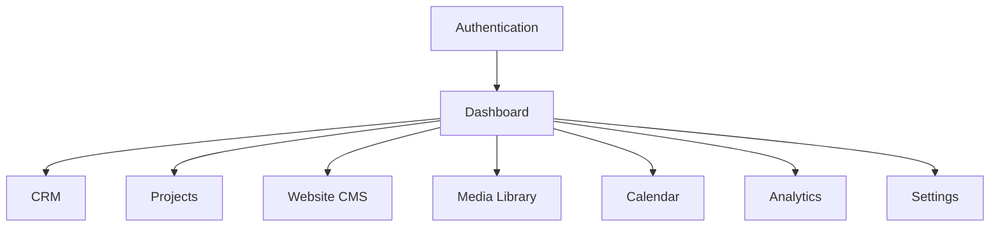

---

# Dashboard Layout

Desktop

```
┌────────────────────────────────────────────┐
│ Top Navigation                             │
├───────────────┬────────────────────────────┤
│ Sidebar       │ Main Content               │
│ Navigation    │                            │
│               │ Dashboard Widgets          │
│               │                            │
│               │                            │
└───────────────┴────────────────────────────┘
```

Tablet

Collapsible sidebar.

Mobile

Bottom navigation with expandable menu.

---

# Global Navigation

Primary Navigation

```
Dashboard

CRM

Projects

Website

Media

Calendar

Analytics

Settings
```

Navigation remains consistent throughout every module.

---

# Sidebar Structure

```text
Dashboard

CRM

Projects

Website CMS

Media Library

Calendar

Analytics

Settings

Logout
```

Current section should always be highlighted.

---

# Authentication

Only authenticated users may access the dashboard.

Unauthenticated visitors should never access internal pages.

Authentication is defined in detail within `17-backend-architecture.md` and `19-security.md`.

---

# Login Experience

Display

- Company Logo
- Welcome Message
- Email
- Password
- Sign In Button

Optional

```
Forgot Password
```

Future enhancement.

---

# Dashboard Home

Immediately after login users should arrive at the Dashboard Home.

Purpose

Provide an instant overview of business activity.

---

# Dashboard Widgets

Recommended widgets

- New Leads
- Today's Consultations
- Active Projects
- Upcoming Events
- Recent Activity
- Website Statistics
- Notifications
- Quick Actions

Widgets should be configurable.

---

# Example Layout

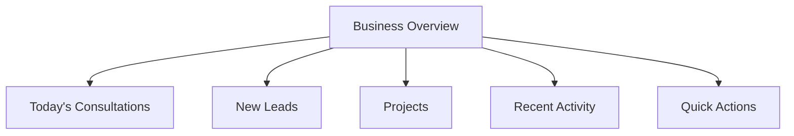

---

# Business Overview

Display summary cards.

Examples

- Active Projects
- New Enquiries
- Pending Consultations
- Gallery Items
- Previous Events
- Website Visitors

Values should update dynamically.

---

# Quick Actions

Provide shortcuts.

Examples

- Add Previous Event
- Upload Gallery Images
- Create Project
- Schedule Consultation
- Add Team Member
- Publish Website Changes

Quick Actions should be customizable.

---

# Notifications Panel

Display

- New Contact Enquiries
- New Dream Planners
- Upcoming Consultations
- Pending Tasks
- System Alerts

Unread notifications should be visually distinct.

---

# Recent Activity

Display a chronological activity feed.

Examples

```
Project Created

↓

Gallery Updated

↓

Dream Planner Submitted

↓

Consultation Scheduled

↓

Previous Event Published
```

Activity feed should update in real time where supported.

---

# Global Search

The dashboard should include a universal search bar.

Users should be able to search:

- Clients
- Projects
- Events
- Consultations
- Gallery
- Previous Events
- Team Members

Search should display categorized results.

---

# Breadcrumb Navigation

Every page should display its location.

Example

```
Dashboard

>

Projects

>

Project Details
```

---

# Responsive Behaviour

Desktop

- Permanent sidebar
- Multi-column widgets
- Full analytics

Tablet

- Collapsible sidebar
- Responsive widget grid

Mobile

- Bottom navigation
- Single-column layout
- Swipe-friendly interactions

---

# Functional Requirements

| ID | Requirement |
|----|-------------|
| AD-001 | Authenticate authorized users. |
| AD-002 | Display dashboard overview. |
| AD-003 | Display configurable widgets. |
| AD-004 | Support global navigation. |
| AD-005 | Support global search. |
| AD-006 | Display recent activity. |
| AD-007 | Display notifications. |
| AD-008 | Support responsive layouts. |

---

# Non-Functional Requirements

The Admin Dashboard shall be:

- Secure.
- Responsive.
- Fast.
- Accessible.
- Scalable.
- Reliable.
- Maintainable.

---

# Developer Notes

Developers should:

- Build every dashboard section as an independent module with clearly defined boundaries.
- Implement reusable layout components (sidebar, top navigation, widget cards, tables, dialogs, and forms) to ensure consistency across all modules.
- Design the navigation architecture to support future expansion without requiring structural changes.
- Treat the dashboard as the single operational interface for all website management tasks.
- Optimize the overview dashboard to load only summary data initially, with detailed information fetched on demand to maintain fast response times.

---

# End of Part 1

Part 2 defines the complete **CRM & Client Management** module, including lead management, Dream Planner records, Booking Consultations, Contact Enquiries, client profiles, communication history, search, filters, timelines, and relationship management across every customer touchpoint.

# 15 — Admin Dashboard Specification (Part 2)

> MatchStick Events Documentation Repository

---

# Document Information

| Property | Value |
|----------|-------|
| Document Name | Admin Dashboard |
| Document ID | DOC-015 |
| Version | 1.0.0 |
| Part | 2 of 10 |
| Status | Approved |
| Depends On | 12-dream-planner.md, 13-booking-consultation.md, 14-contact-page.md |

---

# CRM & Client Management

## Purpose

The CRM (Customer Relationship Management) module serves as the central repository for every person who interacts with MatchStick Events.

Regardless of how a visitor enters the platform—through the Dream Planner, Booking Consultation, Contact Page, or future integrations—they should eventually become a unified client record.

The CRM acts as the single source of truth for all client relationships.

---

# CRM Philosophy

The CRM should not simply store contact information.

Instead, it should maintain the complete history of every client relationship.

Staff members should immediately understand:

- Who the client is.
- What they are planning.
- Previous conversations.
- Current status.
- Upcoming actions.
- Historical interactions.

---

# CRM Workflow

```mermaid
flowchart LR

DreamPlanner

-->

CRM

Booking

-->

CRM

Contact

-->

CRM

CRM

-->

Project

Project

-->

Completed Client
```

---

# CRM Navigation

```text
CRM

↓

All Clients

↓

Leads

↓

Dream Planners

↓

Consultations

↓

Contact Enquiries

↓

Archived Clients
```

---

# CRM Dashboard

Immediately display:

- Total Clients
- Active Leads
- Pending Consultations
- Active Projects
- Completed Projects
- Recently Added Clients

These metrics should update dynamically.

---

# Client Categories

Every client belongs to one category.

| Category | Description |
|----------|-------------|
| Lead | Initial enquiry received |
| Prospect | Consultation scheduled |
| Active Client | Project underway |
| Returning Client | Previous client with new enquiry |
| Completed Client | Event successfully completed |
| Archived | No longer active |

Category updates should occur automatically when possible.

---

# Client List

Display a searchable data table.

Columns

- Client Name
- Event Type
- Status
- Assigned Planner
- Contact Method
- Last Activity
- Next Follow-up

Newest activity should appear first.

---

# Search

Global CRM search should support:

- Client Name
- Email
- Phone Number
- Event Type
- Project ID
- Consultation Reference
- Dream Planner ID

Search results should appear instantly where supported.

---

# Filters

Allow filtering by:

- Client Status
- Event Type
- Assigned Planner
- Consultation Status
- Budget Range
- Event Date
- Submission Date

Multiple filters may be combined.

---

# Client Profile

Selecting a client opens a complete profile.

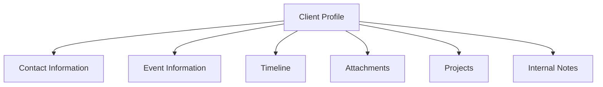

---

# Contact Information

Display

- Full Name
- Mobile Number
- Email Address
- Preferred Contact Method
- Address (if available)

Quick Actions

- Call
- WhatsApp
- Email

---

# Event Information

Display

- Event Type
- Event Date
- Guest Count
- Budget
- Venue
- Theme

If multiple events exist:

Display all chronologically.

---

# Relationship Timeline

The timeline should display every client interaction.

Example

```text
Dream Planner Submitted

↓

Consultation Scheduled

↓

Phone Discussion

↓

Proposal Sent

↓

Project Started

↓

Event Completed
```

Timeline entries should never be deleted.

---

# Dream Planner Integration

If a Dream Planner exists:

Display

- Planner Summary
- Theme
- Budget
- Guest Count
- Uploaded Inspiration

Quick Actions

- View Planner
- Edit Notes

---

# Consultation Integration

Display

- Consultation Date
- Meeting Mode
- Assigned Planner
- Consultation Status

Quick Actions

- Reschedule
- Complete
- Cancel

---

# Contact Enquiry Integration

If the client contacted through the Contact Page:

Display

- Subject
- Enquiry
- Attachments
- Communication History

---

# Project Integration

Display all projects associated with the client.

Each project displays:

- Project ID
- Event Type
- Status
- Progress
- Assigned Team

Quick Action

```
Open Project
```

---

# Internal Notes

Staff should be able to create:

- Client Preferences
- Planning Notes
- Meeting Notes
- Follow-up Notes
- Private Discussions

Notes should support:

- Rich Text
- Mentions
- Attachments

Notes remain internal only.

---

# Communication History

Every communication should be stored.

Examples

- Phone Call
- WhatsApp
- Email
- Consultation
- Contact Form
- Dream Planner

Each record includes:

- Date
- Time
- Staff Member
- Communication Type
- Summary

---

# Attachments

Store

- Inspiration Images
- PDFs
- Contracts
- Planning Documents
- Quotations

Support

- Preview
- Download
- Version History
- Replace

---

# Client Tags

Allow custom tags.

Examples

- VIP
- Returning Client
- Destination Event
- Corporate
- High Priority
- Referral

Tags improve searching and reporting.

---

# Follow-up Management

Staff should be able to:

- Schedule follow-ups
- Mark completed
- Snooze reminders
- Assign ownership

Upcoming follow-ups should appear on the Dashboard.

---

# Duplicate Detection

Warn staff if another client record contains:

- Same Email
- Same Mobile Number
- Similar Name

Provide options

- Merge Records
- Keep Separate

Merge operations should preserve all historical data.

---

# Quick Actions

Available throughout the CRM

- Call Client
- WhatsApp
- Send Email
- Schedule Consultation
- Create Project
- Upload File
- Add Note
- Archive Client

Actions should adapt to the client's lifecycle stage.

---

# CRM Notifications

Notify staff when:

- New Lead Created
- Consultation Scheduled
- Follow-up Overdue
- Project Assigned
- Client Responded

Notification rules should remain configurable.

---

# Database Relationships

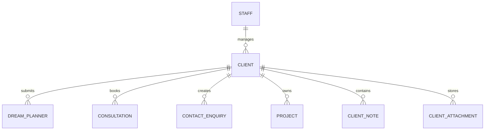

---

# Audit Trail

Every CRM action should be logged.

Examples

- Client Created
- Record Updated
- Consultation Scheduled
- Note Added
- File Uploaded
- Project Created
- Client Archived

Audit history must be immutable.

---

# Functional Requirements

| ID | Requirement |
|----|-------------|
| AD-009 | Maintain unified client records. |
| AD-010 | Display client profiles. |
| AD-011 | Support Dream Planner integration. |
| AD-012 | Support Consultation integration. |
| AD-013 | Support Contact enquiry integration. |
| AD-014 | Track communication history. |
| AD-015 | Support follow-up management. |
| AD-016 | Detect duplicate clients. |
| AD-017 | Manage client attachments. |

---

# Non-Functional Requirements

The CRM module shall be:

- Secure.
- Responsive.
- Scalable.
- Reliable.
- Fast.
- Easy to navigate.
- Maintainable.

---

# Developer Notes

Developers should:

- Treat the CRM as the canonical source of client information across the platform.
- Build client profiles using modular sections that can be extended without affecting existing functionality.
- Maintain immutable communication timelines and audit records.
- Implement configurable lifecycle stages instead of hardcoded client statuses.
- Ensure every public-facing module (Dream Planner, Booking Consultation, Contact Page) automatically links to the correct client record or creates a new one when appropriate.

---

# End of Part 2

Part 3 defines the complete **Project Management Module**, including active projects, event lifecycle, milestones, task management, team assignments, timelines, project files, calendars, progress tracking, project dashboards, and operational workflows.

# 15 — Admin Dashboard Specification (Part 3)

> MatchStick Events Documentation Repository

---

# Document Information

| Property | Value |
|----------|-------|
| Document Name | Admin Dashboard |
| Document ID | DOC-015 |
| Version | 1.0.0 |
| Part | 3 of 10 |
| Status | Approved |
| Depends On | 12-dream-planner.md, 13-booking-consultation.md, 16-database-design.md |

---

# Project Management Module

## Purpose

The Project Management module manages every active event after a client has accepted the proposal and the planning process officially begins.

It serves as the operational workspace for the MatchStick Events team throughout the complete event lifecycle.

Every event should transition from a consultation into a structured project with timelines, milestones, tasks, documents, and team collaboration.

---

# Project Philosophy

A project should represent the complete lifecycle of an event.

Rather than simply storing event information, it should organize:

- Planning
- Coordination
- Communication
- Progress
- Deliverables
- Documentation

The dashboard should provide complete visibility into every project.

---

# Project Lifecycle

```mermaid
flowchart LR

Lead

-->

Consultation

-->

Project Created

-->

Planning

-->

Execution

-->

Completed

-->

Archived
```

Every project should follow this lifecycle.

---

# Project Dashboard

Display immediately:

- Active Projects
- Upcoming Events
- Overdue Tasks
- Upcoming Deadlines
- Team Workload
- Recent Project Activity

Values update automatically.

---

# Project List

Display projects in a searchable table.

Columns

- Project ID
- Client Name
- Event Type
- Event Date
- Planner
- Progress
- Status

Newest projects appear first.

---

# Project Status

Every project shall have exactly one status.

| Status | Description |
|----------|-------------|
| Planning | Initial planning stage |
| In Progress | Active execution |
| Awaiting Client | Waiting for client input |
| Ready for Event | Final preparations complete |
| Event Day | Event in progress |
| Completed | Event successfully delivered |
| Archived | Historical project |

Status transitions should be recorded automatically.

---

# Project Workspace

Selecting a project opens a complete workspace.

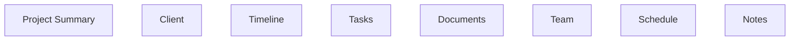

Every section should support independent editing.

---

# Project Summary

Display

- Project ID
- Client Name
- Event Type
- Event Date
- Venue
- Budget
- Assigned Planner
- Current Status

Display progress visually.

---

# Progress Tracking

Example

```
Project Progress

██████████████░░░░░░

70% Complete
```

Progress should be calculated automatically based on completed milestones and tasks.

---

# Event Timeline

Display important milestones.

Example

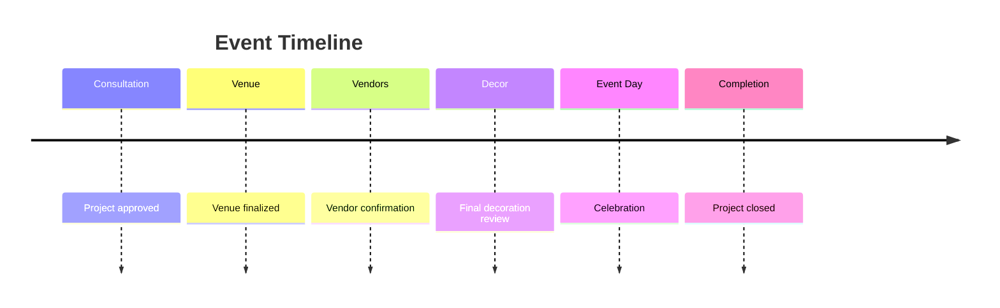

Timeline entries remain editable until project completion.

---

# Milestone Management

Create milestones.

Examples

- Consultation Complete
- Venue Confirmed
- Theme Approved
- Vendors Booked
- Invitations Completed
- Final Review
- Event Executed

Milestones may contain multiple tasks.

---

# Task Management

Each milestone contains tasks.

Every task includes:

- Task Name
- Description
- Priority
- Assignee
- Due Date
- Status

---

# Task Status

| Status | Description |
|----------|-------------|
| Not Started | Waiting |
| In Progress | Being worked on |
| Blocked | Cannot continue |
| Completed | Finished |

Task completion updates project progress automatically.

---

# Team Assignment

Assign staff members.

Roles

- Lead Planner
- Coordinator
- Designer
- Operations
- Photographer
- External Vendor

Future roles should be configurable.

---

# Calendar Integration

Every project should include:

- Meetings
- Deadlines
- Vendor Visits
- Event Timeline
- Follow-ups

Calendar should synchronize with the Dashboard calendar.

---

# Project Files

Store

- Contracts
- Quotations
- Mood Boards
- Images
- PDFs
- Planning Documents

Support

- Preview
- Download
- Replace
- Version History

---

# Project Notes

Staff should create:

- Planning Notes
- Client Preferences
- Meeting Notes
- Internal Discussions
- Risk Assessments

Notes remain internal.

---

# Vendor Management

Each project should support vendor tracking.

Example vendors

- Decor
- Catering
- Photography
- Entertainment
- Lighting
- Sound
- Transportation

Each vendor record contains:

- Name
- Contact
- Status
- Payment Status
- Notes

---

# Budget Tracking

Track

- Planned Budget
- Estimated Cost
- Actual Cost
- Remaining Budget

Example

```text
Budget

₹8,00,000

Spent

₹5,10,000

Remaining

₹2,90,000
```

Internal only.

Never displayed publicly.

---

# Activity Timeline

Every project action should be recorded.

Examples

```text
Project Created

↓

Task Assigned

↓

Vendor Added

↓

Milestone Completed

↓

Client Meeting

↓

Project Closed
```

Activity history should never be editable.

---

# Attachments

Support

- Images
- Videos
- PDFs
- Contracts
- Presentations
- Vendor Documents

Attachments should support categorization.

---

# Notifications

Notify assigned staff when:

- Task Assigned
- Deadline Near
- Milestone Completed
- Vendor Updated
- Project Status Changed

Notification rules remain configurable.

---

# Search

Search projects by

- Project ID
- Client Name
- Event Type
- Venue
- Planner
- Vendor

Results should appear instantly where supported.

---

# Filters

Filter by

- Status
- Planner
- Event Type
- Budget
- Event Month
- Venue

Multiple filters may be combined.

---

# Quick Actions

Available actions

- Add Task
- Add Milestone
- Upload Files
- Schedule Meeting
- Assign Staff
- Add Vendor
- Complete Milestone
- Archive Project

Actions should adapt to project status.

---

# Database Relationships

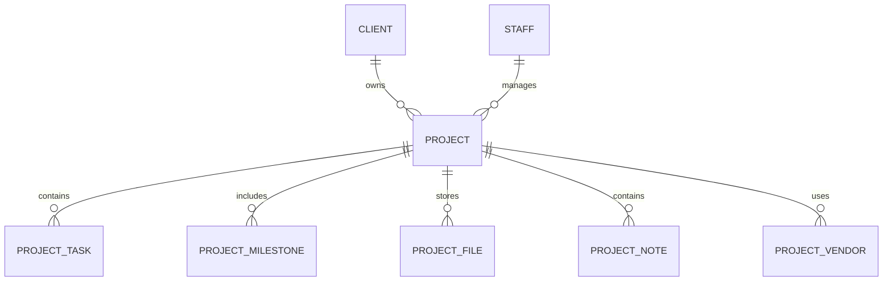

---

# Audit Trail

Every modification should be logged.

Examples

- Project Created
- Task Updated
- Milestone Completed
- File Uploaded
- Vendor Added
- Project Archived

Audit history must remain immutable.

---

# Functional Requirements

| ID | Requirement |
|----|-------------|
| AD-018 | Manage active projects. |
| AD-019 | Support project milestones. |
| AD-020 | Support task management. |
| AD-021 | Assign project teams. |
| AD-022 | Track project progress. |
| AD-023 | Manage project files. |
| AD-024 | Manage vendors. |
| AD-025 | Track project budgets. |
| AD-026 | Maintain project activity history. |

---

# Non-Functional Requirements

The Project Management module shall be:

- Secure.
- Responsive.
- Scalable.
- Reliable.
- Fast.
- Easy to manage.
- Maintainable.

---

# Developer Notes

Developers should:

- Treat projects as the primary operational entity after a consultation is converted into active work.
- Implement milestones, tasks, vendors, files, and notes as independent reusable modules linked to each project.
- Calculate project progress dynamically from milestone and task completion rather than manual percentage updates.
- Design the project workspace to accommodate additional planning modules without restructuring the data model.
- Ensure all project actions generate immutable audit records for operational traceability.

---

# End of Part 3

Part 4 defines the complete **Website CMS (Content Management System)**, including management of the Homepage, About page, Services, Gallery, Previous Events, Contact information, SEO metadata, publishing workflows, version control, drafts, previews, and content publishing architecture.


# 15 — Admin Dashboard Specification (Part 4)

> MatchStick Events Documentation Repository

---

# Document Information

| Property | Value |
|----------|-------|
| Document Name | Admin Dashboard |
| Document ID | DOC-015 |
| Version | 1.0.0 |
| Part | 4 of 10 |
| Status | Approved |
| Depends On | 07-homepage.md, 08-about-page.md, 09-services-page.md, 10-gallery-page.md, 11-previous-events-page.md, 14-contact-page.md |

---

# Website CMS

## Purpose

The Website Content Management System (CMS) enables authorized staff to manage every public-facing page without modifying source code.

The CMS should empower non-technical users to publish, edit, organize, and maintain website content while preserving the premium visual experience of the MatchStick Events website.

---

# CMS Philosophy

The CMS should not feel like a generic blog editor.

Instead, it should operate as a structured visual publishing platform specifically designed for MatchStick Events.

Staff should focus on content—not technology.

---

# CMS Workflow

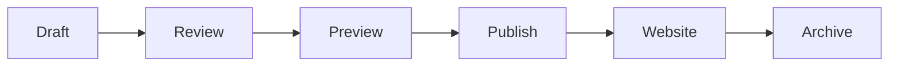

Every content item should follow this lifecycle.

---

# CMS Navigation

```text
Website CMS

↓

Homepage

↓

About

↓

Services

↓

Gallery

↓

Previous Events

↓

Contact

↓

SEO

↓

Drafts

↓

Published Content

↓

Archive
```

---

# CMS Dashboard

Display

- Published Pages
- Draft Pages
- Pending Changes
- Scheduled Publications
- Recently Updated Content
- Broken Links (future)

Dashboard metrics should update automatically.

---

# Editable Website Pages

The CMS should manage:

- Homepage
- About
- Services
- Gallery
- Previous Events
- Contact Information

These pages correspond to the public website defined in the project documentation. 0

---

# Homepage CMS

Staff should be able to edit:

- Hero Heading
- Hero Description
- Hero Images
- Featured Services
- Featured Projects
- Testimonials (future)
- Call-to-Action Sections
- Footer Content

Changes should support preview before publication.

---

# About Page CMS

Editable sections

- Company Introduction
- Founder Information
- Company Story
- Mission
- Vision
- Values
- Images

The mission, founder information, and company details should originate from the approved business profile. 1

---

# Services CMS

Editable

- Service Cards
- Descriptions
- Images
- Service Order
- Featured Services

Services should remain configurable without affecting page layout.

---

# Gallery CMS

Staff should manage

- Albums
- Images
- Categories
- Featured Images
- Captions
- Alt Text

Support

- Bulk Upload
- Drag-and-drop Sorting
- Featured Gallery Selection

---

# Previous Events CMS

Every previous event should support

- Create
- Edit
- Publish
- Archive
- Delete (Permission Controlled)

Editable sections

- Event Title
- Event Type
- Date
- Venue
- Description
- Gallery
- SEO Metadata

Publishing should automatically update the public website.

---

# Contact CMS

Editable

- Phone Number
- WhatsApp Number
- Email
- Address
- Business Hours
- Social Media Links
- Response Time

These values should default to the client-provided contact information while remaining editable by administrators. 2

---

# Rich Text Editor

The CMS should provide a modern editor supporting

- Headings
- Paragraphs
- Lists
- Links
- Tables
- Quotes
- Images
- Videos (future)

Formatting should remain consistent with the Design System.

---

# Media Picker

Content editors should insert media directly from the Media Library.

Supported

- Images
- PDFs
- Documents

Future

- Videos
- External Media

---

# Draft Management

Content should support

- Create Draft
- Save Draft
- Edit Draft
- Delete Draft
- Restore Draft

Drafts should never appear on the public website.

---

# Preview Mode

Editors should preview content before publishing.

Preview should closely match the production website.

Preview URLs should remain private.

---

# Publishing Workflow

```mermaid
flowchart LR

Edit

-->

Save Draft

-->

Preview

-->

Publish

-->

Website Live
```

Publishing should require confirmation.

---

# Scheduled Publishing

Allow staff to:

- Publish immediately
- Schedule publication
- Schedule unpublishing

Example

```
Publish

15 August

09:00 AM
```

Scheduler should use the server time zone.

---

# Version History

Every published item should maintain versions.

Each version stores

- Author
- Date
- Time
- Summary of Changes

Older versions should remain restorable.

---

# Content Status

Every content item shall have one status.

| Status | Description |
|----------|-------------|
| Draft | Not visible publicly |
| Scheduled | Waiting for publication |
| Published | Live on website |
| Archived | Hidden but preserved |

---

# SEO Editor

Every page should support

- Page Title
- Meta Description
- Canonical URL
- Open Graph Image
- Keywords (optional)

These fields integrate with `20-seo.md`.

---

# URL Management

Staff should manage

- Slugs
- Redirects
- Canonical URLs

Changing URLs should automatically create redirects where appropriate.

---

# Search

CMS search should support

- Page Titles
- Event Titles
- Gallery Items
- Service Names
- Draft Content

Results should be categorized.

---

# Filters

Filter by

- Status
- Author
- Publication Date
- Content Type

Multiple filters may be combined.

---

# Activity History

Every CMS action should be logged.

Examples

```text
Homepage Updated

↓

Gallery Published

↓

Previous Event Added

↓

Contact Information Updated

↓

Service Edited
```

History must remain immutable.

---

# Permissions

Administrators

- Full Access

Content Managers

- Create
- Edit
- Publish
- Archive

Staff

- Draft Only

Permission rules should be configurable.

---

# Database Relationships

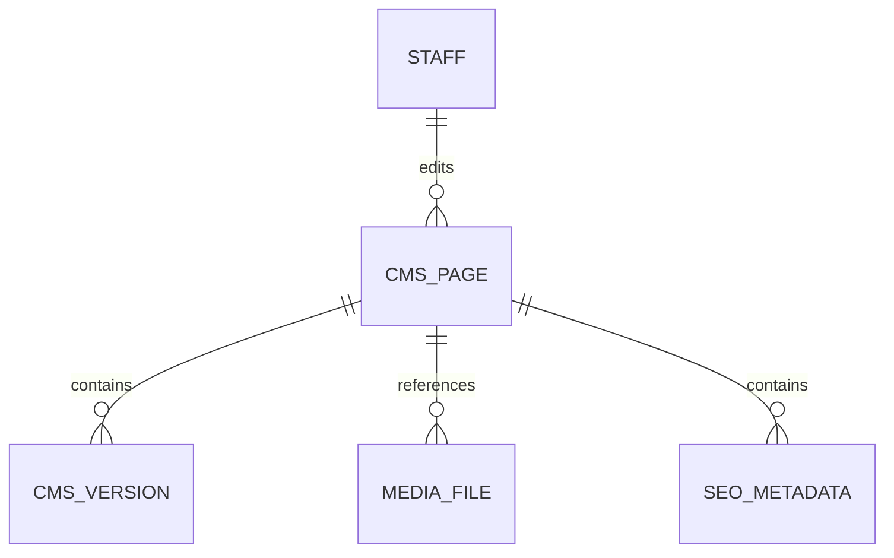

---

# Functional Requirements

| ID | Requirement |
|----|-------------|
| AD-027 | Manage website pages. |
| AD-028 | Support rich text editing. |
| AD-029 | Support draft workflow. |
| AD-030 | Support preview mode. |
| AD-031 | Publish website content. |
| AD-032 | Schedule publications. |
| AD-033 | Maintain version history. |
| AD-034 | Manage SEO metadata. |
| AD-035 | Support content permissions. |

---

# Non-Functional Requirements

The CMS shall be:

- Secure.
- Responsive.
- Accessible.
- Scalable.
- Reliable.
- Easy for non-technical users.
- Consistent with the website design system.

---

# Developer Notes

Developers should:

- Build every website page as a configurable content entity rather than hardcoded templates.
- Separate page content from presentation logic so design changes do not require content migration.
- Implement immutable version history with one-click rollback capabilities.
- Reuse the Media Library for all content assets to eliminate duplication.
- Ensure publishing operations are transactional so incomplete updates never become visible on the public website.

---

# End of Part 4

Part 5 defines the complete **Media Library Module**, including media uploads, folders, tagging, categorization, optimization, image processing, versioning, search, permissions, storage architecture, and integration with every module across the platform.

# 15 — Admin Dashboard Specification (Part 5)

> MatchStick Events Documentation Repository

---

# Document Information

| Property | Value |
|----------|-------|
| Document Name | Admin Dashboard |
| Document ID | DOC-015 |
| Version | 1.0.0 |
| Part | 5 of 10 |
| Status | Approved |
| Depends On | 10-gallery-page.md, 11-previous-events-page.md, Website CMS |

---

# Media Library Module

## Purpose

The Media Library serves as the centralized repository for every digital asset used throughout the MatchStick Events platform.

Rather than uploading duplicate files across different modules, every image, document, and future media asset should exist only once within the Media Library and be referenced wherever required.

---

# Media Library Philosophy

The Media Library should function like a professional Digital Asset Management (DAM) system.

Staff should be able to:

- Store assets
- Organize assets
- Search assets
- Reuse assets
- Manage versions
- Archive unused assets

without requiring technical knowledge.

---

# Media Workflow

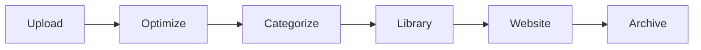

Every uploaded asset should follow this workflow.

---

# Navigation

```text
Media Library

↓

All Media

↓

Images

↓

Documents

↓

Gallery

↓

Previous Events

↓

Unused Media

↓

Archived
```

---

# Dashboard Overview

Display

- Total Assets
- Images
- Documents
- Storage Used
- Recently Uploaded
- Unused Files

Statistics should update automatically.

---

# Media Types

Supported

- Images
- PDFs
- Documents

Future support

- Videos
- Audio
- 360° Images
- Drone Footage

The architecture should support future media types without structural changes.

---

# Upload Experience

Users should be able to upload via

- Drag and Drop
- File Picker
- Mobile Upload
- Multi-file Upload

Uploads should display progress.

---

# Upload Progress

Example

```text
Uploading...

███████████████████░

92%
```

Users should be able to cancel uploads.

---

# Supported Formats

Images

- JPG
- JPEG
- PNG
- WEBP

Documents

- PDF

Future

- MP4
- MOV
- SVG

Supported formats should remain configurable.

---

# File Size Limits

Maximum upload sizes should be configurable.

Example

| Type | Maximum Size |
|--------|--------------|
| Image | 20 MB |
| PDF | 50 MB |

These values are examples only.

---

# Automatic Optimization

After upload

Images should automatically

- Compress
- Resize
- Generate thumbnails
- Preserve originals

Optimization should not noticeably reduce visual quality.

---

# Thumbnail Generation

Automatically generate

- Small
- Medium
- Large

Preview sizes.

Original image remains unchanged.

---

# Folder Organization

Support logical folders.

Example

```text
Media

↓

Homepage

↓

Services

↓

Gallery

↓

Previous Events

↓

Projects

↓

Clients

↓

Documents
```

Folders improve organization only.

Assets may also be categorized using tags.

---

# Categories

Example categories

- Homepage
- Weddings
- Birthdays
- Corporate
- Gallery
- Previous Events
- Team
- Branding

One asset may belong to multiple categories.

---

# Tags

Support unlimited custom tags.

Examples

- Floral
- Luxury
- Indoor
- Outdoor
- Gold
- Vintage
- Rajasthan
- Kolkata

Tags improve search accuracy.

---

# Asset Details

Selecting an asset displays

- File Name
- Upload Date
- Uploaded By
- File Type
- Resolution
- Dimensions
- File Size
- Categories
- Tags
- Usage Count

---

# Asset Preview

Support previews for

Images

- Zoom
- Fullscreen

PDF

- Embedded Viewer

Future

- Video Playback

---

# Usage Tracking

Every asset should display

```
Used On

Homepage

Gallery

Previous Events

Corporate Event
```

Staff should always know where an asset is being used.

---

# Duplicate Detection

Warn users if

- File Name
- File Hash

already exists.

Offer

- Replace
- Keep Both
- Cancel Upload

---

# Search

Search should support

- File Name
- Tags
- Categories
- Upload Date
- Uploader
- File Type

Search results should update dynamically.

---

# Filters

Filter by

- File Type
- Folder
- Category
- Upload Date
- File Size
- Usage Status

Multiple filters may be combined.

---

# Sorting

Sort by

- Name
- Date
- File Size
- Usage Count
- Recently Used

Ascending and descending order supported.

---

# Bulk Actions

Allow

- Download
- Delete
- Move
- Tag
- Categorize
- Archive

Bulk operations should display progress.

---

# Version History

Every replacement creates a new version.

Display

- Version Number
- Upload Date
- Uploaded By
- Change Summary

Older versions should remain restorable.

---

# Unused Assets

Display assets currently unused.

Examples

```
Not Used Anywhere

↓

Safe To Archive
```

Deletion should require confirmation.

---

# Archive

Archived assets

- Hidden from selection
- Remain searchable
- Preserve history

Restore should always be available.

---

# Media Permissions

Administrators

- Full Access

Content Managers

- Upload
- Edit
- Replace
- Archive

Staff

- View
- Download

Permissions should remain configurable.

---

# Media Relationships

Every module should reference Media Library assets.

Examples

- Homepage
- Gallery
- Previous Events
- Projects
- CRM
- Dream Planner
- Contact Enquiries

Media should never be duplicated unnecessarily.

---

# Database Relationships

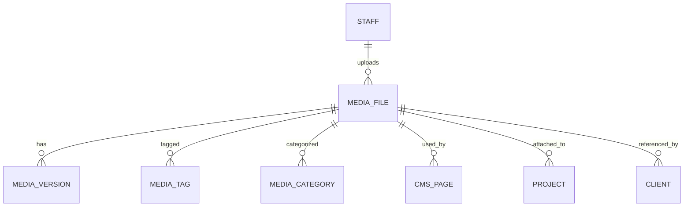

---

# Activity History

Every media operation should be recorded.

Examples

```text
Image Uploaded

↓

Thumbnail Generated

↓

Tagged

↓

Used In Homepage

↓

Archived
```

History should remain immutable.

---

# Storage Monitoring

Display

- Total Storage
- Available Storage
- Largest Files
- Recent Upload Growth

Administrators should receive warnings when storage thresholds are exceeded.

---

# Functional Requirements

| ID | Requirement |
|----|-------------|
| AD-036 | Support centralized media storage. |
| AD-037 | Upload and optimize assets. |
| AD-038 | Generate thumbnails automatically. |
| AD-039 | Organize assets using folders, categories, and tags. |
| AD-040 | Track asset usage. |
| AD-041 | Support version history. |
| AD-042 | Detect duplicate uploads. |
| AD-043 | Support bulk media operations. |
| AD-044 | Archive unused assets. |

---

# Non-Functional Requirements

The Media Library shall be:

- Secure.
- Fast.
- Responsive.
- Scalable.
- Reliable.
- Maintainable.
- Optimized for large media collections.

---

# Developer Notes

Developers should:

- Implement the Media Library as a shared service consumed by every module rather than allowing direct file uploads into individual features.
- Store original files separately from generated thumbnails and optimized variants.
- Reference media assets by unique identifiers instead of duplicating files across database records.
- Perform image optimization asynchronously to avoid blocking uploads.
- Design the storage architecture so cloud object storage providers (such as AWS S3, Google Cloud Storage, or Azure Blob Storage) can be integrated without major architectural changes.

---

# End of Part 5

Part 6 defines the complete **Calendar & Scheduling Module**, including consultation scheduling, project calendars, business hours, staff availability, holidays, reminders, recurring events, notification workflows, and calendar synchronization across the entire MatchStick Events platform.


# 15 — Admin Dashboard Specification (Part 6)

> MatchStick Events Documentation Repository

---

# Document Information

| Property | Value |
|----------|-------|
| Document Name | Admin Dashboard |
| Document ID | DOC-015 |
| Version | 1.0.0 |
| Part | 6 of 10 |
| Status | Approved |
| Depends On | 13-booking-consultation.md, 15-admin-dashboard.md (Parts 1–5) |

---

# Calendar & Scheduling Module

## Purpose

The Calendar & Scheduling module provides a unified scheduling system for all business activities within MatchStick Events.

Rather than maintaining separate calendars for consultations, projects, meetings, and internal activities, the dashboard should provide one centralized calendar that aggregates every scheduled event.

---

# Calendar Philosophy

The calendar should function as the operational timeline of the company.

Users should immediately understand:

- What is happening today.
- What requires preparation.
- Which staff members are occupied.
- Upcoming client meetings.
- Event schedules.
- Project deadlines.

The calendar should reduce scheduling conflicts and improve operational coordination.

---

# Calendar Workflow

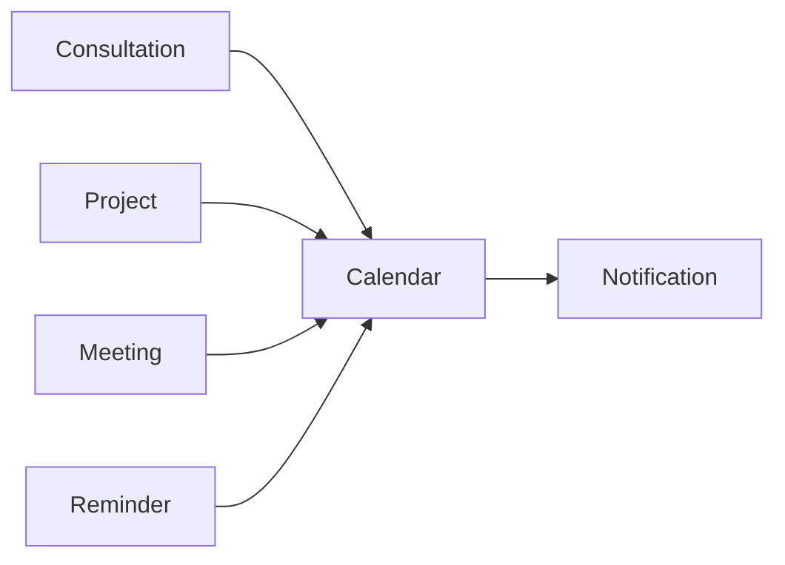

Every scheduled activity should automatically appear in the calendar.

---

# Calendar Navigation

```text
Calendar

↓

Today's Schedule

↓

Week View

↓

Month View

↓

Project Calendar

↓

Consultations

↓

Staff Schedule

↓

Business Hours

↓

Holidays

↓

Archived Events
```

---

# Dashboard Calendar

Display

- Today's Consultations
- Upcoming Meetings
- Active Events
- Upcoming Deadlines
- Staff Availability
- Recent Changes

Widgets should refresh automatically.

---

# Calendar Views

Support multiple views.

- Day
- Week
- Month
- Agenda

Future

- Timeline View

Users should switch views without losing filters.

---

# Event Types

The calendar shall support

- Consultation
- Client Meeting
- Site Visit
- Vendor Meeting
- Event Day
- Internal Meeting
- Deadline
- Reminder
- Holiday

Each event type should have a unique visual identifier.

---

# Event Details

Selecting an event displays

- Event Title
- Client
- Event Type
- Assigned Staff
- Start Time
- End Time
- Location
- Status
- Notes
- Attachments

Quick Actions

- Edit
- Duplicate
- Delete
- Open Related Project

---

# Consultation Integration

Consultations created through the Booking module should automatically appear.

Display

- Client
- Meeting Mode
- Assigned Planner
- Duration
- Status

Updates should synchronize in real time.

---

# Project Calendar

Every project automatically contributes events.

Examples

- Planning Meeting
- Venue Visit
- Vendor Meeting
- Decoration Setup
- Rehearsal
- Event Day
- Post-event Review

Project changes should immediately update the calendar.

---

# Staff Schedule

Each staff member should have an individual schedule.

Display

- Assigned Projects
- Meetings
- Consultations
- Leave
- Holidays

Managers should quickly identify availability.

---

# Availability Management

Staff should define

- Working Days
- Working Hours
- Break Periods
- Leave Requests
- Vacation

Availability should automatically influence scheduling.

---

# Business Hours

Administrators should configure

- Opening Time
- Closing Time
- Working Days
- Consultation Hours

These settings should be reused across booking workflows.

---

# Holiday Management

Support

- Public Holidays
- Company Holidays
- Office Closures

Holiday dates should block scheduling where applicable.

---

# Recurring Events

Support recurring schedules.

Examples

- Weekly Team Meeting
- Monthly Review
- Quarterly Planning

Recurrence options

- Daily
- Weekly
- Monthly
- Yearly

Exceptions should be supported.

---

# Reminders

Users should create reminders for

- Meetings
- Deadlines
- Follow-ups
- Vendor Payments
- Client Calls

Reminders should support multiple notification times.

Example

```text
Reminder

↓

1 Day Before

↓

2 Hours Before

↓

30 Minutes Before
```

---

# Notifications

Notify users when

- Consultation Starts Soon
- Meeting Rescheduled
- Deadline Approaching
- Staff Assigned
- Event Cancelled
- Reminder Triggered

Notification delivery channels should remain configurable.

---

# Drag-and-Drop Scheduling

Users should be able to

- Move events
- Extend duration
- Shorten duration
- Reschedule

All changes should update linked modules automatically.

---

# Conflict Detection

Before saving an event, the system should check

- Staff Availability
- Existing Meetings
- Business Hours
- Holidays
- Venue Conflicts (future)

Conflicts should present clear resolution options.

---

# Search

Search calendar by

- Client
- Project
- Event
- Staff
- Venue
- Consultation

Search results should focus the calendar on the selected event.

---

# Filters

Filter by

- Event Type
- Staff
- Project
- Client
- Status

Multiple filters may be combined.

---

# Calendar Synchronization

Changes made within

- CRM
- Projects
- Consultations

should automatically synchronize with the Calendar.

The Calendar acts as a unified scheduling layer rather than maintaining duplicate records.

---

# Calendar Export

Support exporting

- Daily Schedule
- Weekly Schedule
- Monthly Calendar

Formats

- PDF
- ICS (Calendar)
- CSV

Future integrations may include synchronization with external calendar providers.

---

# Activity History

Every scheduling action should be recorded.

Examples

```text
Consultation Scheduled

↓

Meeting Rescheduled

↓

Reminder Added

↓

Deadline Updated

↓

Holiday Created
```

Activity history should remain immutable.

---

# Permissions

Administrators

- Full Access

Managers

- Create
- Edit
- Delete

Staff

- View Assigned Events
- Update Personal Availability

Permissions should remain configurable.

---

# Database Relationships

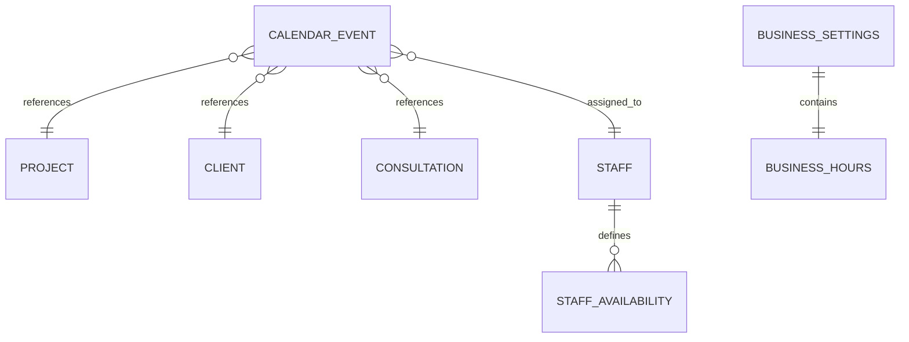

---

# Functional Requirements

| ID | Requirement |
|----|-------------|
| AD-045 | Provide unified calendar views. |
| AD-046 | Synchronize consultations automatically. |
| AD-047 | Synchronize project schedules automatically. |
| AD-048 | Support staff availability management. |
| AD-049 | Detect scheduling conflicts. |
| AD-050 | Support recurring events. |
| AD-051 | Deliver configurable reminders and notifications. |
| AD-052 | Export calendar data. |

---

# Non-Functional Requirements

The Calendar module shall be:

- Secure.
- Responsive.
- Reliable.
- Highly available.
- Scalable.
- Fast.
- Consistent across devices.

---

# Developer Notes

Developers should:

- Treat the Calendar as an aggregation layer that references events from other modules rather than storing duplicate business data.
- Build scheduling services with timezone awareness to support future expansion beyond a single geographic region.
- Implement conflict detection before persisting schedule changes to prevent overlapping assignments.
- Ensure drag-and-drop calendar interactions update all linked entities within a single transaction.
- Design notification scheduling as an asynchronous service to ensure reminders remain reliable even under high system load.

---

# End of Part 6

Part 7 defines the complete **Analytics & Reports Module**, including operational dashboards, business KPIs, lead conversion funnels, project analytics, website performance, staff productivity, custom reports, exports, and executive insights for strategic decision-making.


# 15 — Admin Dashboard Specification (Part 7)

> MatchStick Events Documentation Repository

---

# Document Information

| Property | Value |
|----------|-------|
| Document Name | Admin Dashboard |
| Document ID | DOC-015 |
| Version | 1.0.0 |
| Part | 7 of 10 |
| Status | Approved |
| Depends On | CRM, Projects, Website CMS, Calendar, Media Library |

---

# Analytics & Reports Module

## Purpose

The Analytics & Reports module provides operational intelligence for MatchStick Events by transforming business data into meaningful insights.

Rather than simply displaying numbers, the dashboard should help management understand business performance, identify trends, improve operational efficiency, and make informed strategic decisions.

---

# Analytics Philosophy

Analytics should answer questions—not just display data.

Users should quickly understand:

- How the business is performing.
- Where leads originate.
- Which services are most popular.
- Which projects require attention.
- Team performance.
- Website effectiveness.
- Business growth over time.

Every chart should support decision-making.

---

# Analytics Workflow

```mermaid
flowchart LR

Website

-->

Data Collection

CRM

-->

Data Collection

Projects

-->

Data Collection

Calendar

-->

Data Collection

Data Collection

-->

Analytics Engine

Analytics Engine

-->

Dashboard

Dashboard

-->

Reports

Reports

-->

Business Decisions
```

---

# Analytics Navigation

```text
Analytics

↓

Executive Dashboard

↓

Business KPIs

↓

Lead Analytics

↓

Project Analytics

↓

Website Analytics

↓

Staff Performance

↓

Financial Overview

↓

Reports

↓

Exports
```

---

# Executive Dashboard

Immediately display

- Total Leads
- Active Clients
- Active Projects
- Upcoming Events
- Monthly Revenue (future)
- Conversion Rate
- Website Visitors
- Pending Tasks

Widgets should update in near real time.

---

# Business KPIs

Track

- New Leads
- Consultations Booked
- Projects Started
- Projects Completed
- Returning Clients
- Average Response Time
- Average Project Duration
- Client Satisfaction (future)

KPIs should support custom date ranges.

---

# Lead Analytics

Display

- Total Leads
- New Leads
- Qualified Leads
- Converted Clients
- Lost Leads

Example Funnel

```mermaid
flowchart TD

Visitors

-->

Leads

-->

Consultations

-->

Projects

-->

Completed Events
```

Display conversion percentages between each stage.

---

# Lead Sources

Track enquiry sources.

Examples

- Website
- Dream Planner
- Contact Page
- Phone
- WhatsApp
- Instagram
- Referral

Managers should understand which channels generate the highest-quality leads.

---

# Consultation Analytics

Display

- Scheduled Consultations
- Completed Consultations
- Cancelled Consultations
- No-show Rate
- Average Consultation Duration

Support filtering by planner and time period.

---

# Project Analytics

Display

- Active Projects
- Completed Projects
- Delayed Projects
- Upcoming Events
- Average Completion Time

Charts should support monthly, quarterly, and yearly views.

---

# Project Status Distribution

Example

```text
Planning

██████

In Progress

██████████

Ready

████

Completed

████████████
```

Visualization type should remain configurable.

---

# Website Analytics

Track

- Total Visitors
- Unique Visitors
- Page Views
- Session Duration
- Bounce Rate
- Top Pages
- Device Types
- Traffic Sources

Future integrations may connect with external analytics platforms.

---

# Popular Content

Display

- Most Viewed Gallery
- Most Viewed Service
- Most Viewed Previous Event
- Most Viewed Landing Page

These insights help optimize website content.

---

# Staff Performance

Display

- Assigned Projects
- Completed Tasks
- Active Consultations
- Response Time
- Workload Distribution

Analytics should assist planning rather than employee surveillance.

---

# Calendar Analytics

Track

- Meetings Completed
- Upcoming Meetings
- Overdue Meetings
- Staff Utilization
- Consultation Availability

These metrics should assist scheduling decisions.

---

# Media Analytics

Display

- Total Assets
- Storage Growth
- Most Used Images
- Unused Assets
- Upload Activity

These metrics support efficient media management.

---

# Financial Overview

Future module.

Planned metrics

- Revenue
- Expenses
- Profit
- Outstanding Payments
- Vendor Costs

Architecture should support future expansion without redesign.

---

# Date Filters

Support

- Today
- This Week
- This Month
- This Quarter
- This Year
- Custom Range

Every dashboard should respect selected filters.

---

# Report Builder

Users should generate reports from

- CRM
- Projects
- Calendar
- Website
- Media
- Analytics

Reports should support reusable templates.

---

# Scheduled Reports

Administrators should schedule

- Daily Reports
- Weekly Reports
- Monthly Reports

Reports may be delivered automatically by email in future releases.

---

# Export

Support exporting reports as

- PDF
- Excel (.xlsx)
- CSV

Exports should preserve applied filters.

---

# Visualizations

Supported visualization types

- Line Chart
- Bar Chart
- Pie Chart
- Area Chart
- KPI Cards
- Tables

Visualization selection should remain configurable.

---

# Search

Search reports by

- Report Name
- Date
- Creator
- Module

Results should display instantly where supported.

---

# Activity History

Every reporting action should be recorded.

Examples

```text
Report Generated

↓

Dashboard Filter Updated

↓

Export Created

↓

Scheduled Report Added

↓

Analytics Settings Updated
```

Activity history must remain immutable.

---

# Permissions

Administrators

- Full Access

Managers

- View
- Export
- Schedule Reports

Staff

- View Assigned Analytics Only

Permissions should remain configurable.

---

# Database Relationships

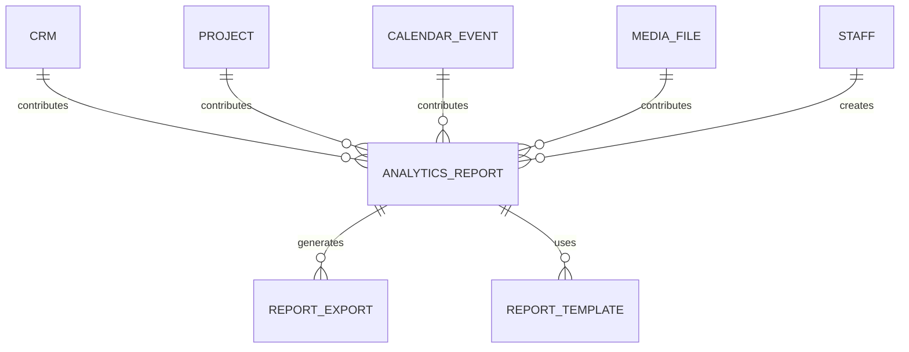

---

# Functional Requirements

| ID | Requirement |
|----|-------------|
| AD-053 | Display executive business dashboard. |
| AD-054 | Track business KPIs. |
| AD-055 | Analyze lead conversion funnels. |
| AD-056 | Report project performance. |
| AD-057 | Display website analytics. |
| AD-058 | Measure staff workload and productivity. |
| AD-059 | Generate reusable reports. |
| AD-060 | Export reports in multiple formats. |
| AD-061 | Support scheduled reporting. |

---

# Non-Functional Requirements

The Analytics module shall be:

- Secure.
- Responsive.
- Scalable.
- Reliable.
- Fast.
- Accurate.
- Extensible.

---

# Developer Notes

Developers should:

- Separate analytics processing from transactional operations to avoid impacting application performance.
- Use asynchronous aggregation pipelines or materialized summaries for large datasets.
- Build every dashboard widget as an independent component that can be added, removed, or rearranged without affecting other widgets.
- Design the reporting engine around reusable query definitions instead of module-specific implementations.
- Ensure exported reports accurately reflect the active filters, permissions, and selected reporting period.

---

# End of Part 7

Part 8 defines the complete **Users & Settings Module**, including user management, authentication settings, role-based access control (RBAC), permissions, business configuration, branding, notification preferences, feature flags, system preferences, and organization-wide settings.


# 15 — Admin Dashboard Specification (Part 8)

> MatchStick Events Documentation Repository

---

# Document Information

| Property | Value |
|----------|-------|
| Document Name | Admin Dashboard |
| Document ID | DOC-015 |
| Version | 1.0.0 |
| Part | 8 of 10 |
| Status | Approved |
| Depends On | 15-admin-dashboard.md (Parts 1–7), 19-security.md |

---

# Users & Settings Module

## Purpose

The Users & Settings module manages system users, organizational settings, permissions, branding, business configuration, notifications, and platform preferences.

It provides administrators with centralized control over how the MatchStick Events platform operates while ensuring that staff members only access features appropriate for their responsibilities.

---

# Module Philosophy

Administration should be:

- Secure
- Simple
- Centralized
- Configurable
- Future-proof

Business settings should be editable without modifying application code.

---

# Module Navigation

```text
Users & Settings

↓

Users

↓

Roles

↓

Permissions

↓

Business Settings

↓

Branding

↓

Notifications

↓

Feature Flags

↓

System Preferences

↓

Integrations

↓

Audit Settings
```

---

# Users

Display all registered users.

Columns

- Profile Photo
- Full Name
- Email
- Role
- Status
- Last Login
- Assigned Projects

Newest users appear first.

---

# User Profile

Selecting a user displays

- Profile Photo
- Full Name
- Email
- Phone Number
- Role
- Department
- Status
- Last Login
- Created Date

Administrators may edit user information.

---

# User Status

Each user shall have one status.

| Status | Description |
|----------|-------------|
| Active | Normal access |
| Suspended | Login disabled |
| Pending | Awaiting activation |
| Archived | Historical account |

Status changes should be logged.

---

# User Actions

Administrators should be able to

- Create User
- Edit User
- Reset Password
- Suspend User
- Reactivate User
- Archive User

Deleting users should not remove historical records.

---

# Roles

Default roles

- Administrator
- Manager
- Event Planner
- Content Manager
- Staff

Future custom roles should be supported.

---

# Role-Based Access Control (RBAC)

Permissions should be assigned to roles—not individual users whenever possible.

Example

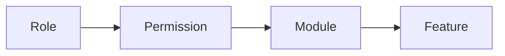

This simplifies permission management as the organization grows.

---

# Permission Categories

Permissions should be grouped by module.

Examples

- Dashboard
- CRM
- Projects
- Website CMS
- Media Library
- Calendar
- Analytics
- Settings

Each module supports

- View
- Create
- Edit
- Delete
- Export
- Approve

Permission categories should remain configurable.

---

# Permission Matrix

Example

| Module | Admin | Manager | Planner | Content | Staff |
|----------|:----:|:------:|:-------:|:-------:|:-----:|
| Dashboard | ✓ | ✓ | ✓ | ✓ | ✓ |
| CRM | ✓ | ✓ | ✓ | View | View |
| Projects | ✓ | ✓ | ✓ | — | View |
| CMS | ✓ | View | — | ✓ | — |
| Media | ✓ | ✓ | Upload | Upload | View |
| Analytics | ✓ | ✓ | View | View | — |
| Settings | ✓ | — | — | — | — |

This table is illustrative. Permissions should be configurable through the interface.

---

# Business Settings

Administrators should configure

- Business Name
- Tagline
- Address
- Email
- Phone Number
- WhatsApp
- Business Hours
- Time Zone
- Currency

These settings should automatically populate public-facing pages where applicable.

---

# Branding

Editable

- Company Logo
- Favicon
- Brand Colors
- Typography
- Email Branding

Future

- Dark Mode Branding
- Seasonal Branding

Brand updates should propagate consistently across the platform.

---

# Notification Settings

Configure

- Email Notifications
- Dashboard Notifications
- Reminder Notifications
- Consultation Alerts
- Project Alerts
- System Alerts

Each notification type should be independently enabled or disabled.

---

# Feature Flags

Feature Flags allow administrators to enable or disable functionality without redeploying the application.

Examples

- Testimonials
- Online Payments
- Blog
- AI Assistant
- External Calendar Sync
- Multi-language Support

Disabled features should remain hidden from users.

---

# System Preferences

Configure

- Date Format
- Time Format
- Default Language
- Default Time Zone
- Default Dashboard View
- Pagination Size

Preferences should apply across the application.

---

# Organization Settings

Support future expansion.

Examples

- Multiple Teams
- Multiple Offices
- Regional Settings
- Business Units

Current implementation may use a single organization while preserving scalability.

---

# Integration Settings

Future integrations

- Google Calendar
- Microsoft Outlook
- Email Services
- SMS Gateway
- WhatsApp Business API
- Cloud Storage
- Analytics Providers

Each integration should support

- Enable
- Disable
- Configuration
- Connection Status

---

# Password Policies

Administrators should configure

- Minimum Password Length
- Password Expiry
- Password History
- Account Lockout
- Failed Login Attempts

Detailed implementation is defined in `19-security.md`.

---

# Session Management

Display active sessions.

Each session displays

- User
- Device
- Browser
- IP Address
- Login Time
- Last Activity

Administrators may terminate sessions.

---

# API Keys (Future)

Support secure management of

- External APIs
- Cloud Services
- Third-party Integrations

Keys should never be displayed in plain text after creation.

---

# Audit Settings

Configure

- Audit Retention Period
- Log Export
- Activity Categories

Audit logging should remain enabled for critical operations.

---

# Search

Search users by

- Name
- Email
- Role
- Department

Search should provide instant results where supported.

---

# Filters

Filter users by

- Role
- Status
- Department
- Last Login

Multiple filters may be combined.

---

# Activity History

Every administrative action should be recorded.

Examples

```text
User Created

↓

Role Updated

↓

Business Hours Changed

↓

Brand Logo Updated

↓

Feature Flag Enabled

↓

Session Terminated
```

Activity history must remain immutable.

---

# Permissions

Only Administrators should have unrestricted access to this module.

Managers may receive limited administrative capabilities where explicitly granted.

---

# Database Relationships

```mermaid
erDiagram

ROLE ||--o{ USER : assigned_to

ROLE ||--o{ PERMISSION : contains

USER ||--o{ USER_SESSION : creates

USER ||--o{ AUDIT_LOG : performs

BUSINESS_SETTING ||--|| ORGANIZATION : configures

ORGANIZATION ||--o{ FEATURE_FLAG : enables

ORGANIZATION ||--o{ SYSTEM_PREFERENCE : defines
```

---

# Functional Requirements

| ID | Requirement |
|----|-------------|
| AD-062 | Manage user accounts. |
| AD-063 | Support role-based access control (RBAC). |
| AD-064 | Configure business settings. |
| AD-065 | Configure branding. |
| AD-066 | Manage notification preferences. |
| AD-067 | Support feature flags. |
| AD-068 | Manage system preferences. |
| AD-069 | Display and manage active user sessions. |
| AD-070 | Maintain immutable administrative audit logs. |

---

# Non-Functional Requirements

The Users & Settings module shall be:

- Secure.
- Configurable.
- Responsive.
- Scalable.
- Reliable.
- Maintainable.
- Extensible.

---

# Developer Notes

Developers should:

- Implement a centralized RBAC authorization service that is consumed consistently across all modules.
- Store permissions independently from roles to support future custom role creation without schema changes.
- Design organization and branding settings as configuration entities rather than application constants.
- Ensure administrative changes affecting security (such as password policies or role assignments) take effect immediately where practical.
- Build the module to support future multi-organization deployments while maintaining compatibility with the current single-organization architecture.

---

# End of Part 8

Part 9 defines the complete **Security & Operations Module**, including audit logs, system monitoring, backups, health checks, operational dashboards, disaster recovery, maintenance mode, session monitoring, incident management, and platform reliability infrastructure.


# 15 — Admin Dashboard Specification (Part 9)

> MatchStick Events Documentation Repository

---

# Document Information

| Property | Value |
|----------|-------|
| Document Name | Admin Dashboard |
| Document ID | DOC-015 |
| Version | 1.0.0 |
| Part | 9 of 10 |
| Status | Approved |
| Depends On | 19-security.md, 17-backend-architecture.md, 18-api-specification.md |

---

# Security & Operations Module

## Purpose

The Security & Operations module provides centralized operational visibility, platform security, monitoring, auditing, backup management, and disaster recovery capabilities.

It enables administrators to maintain the health, reliability, and security of the MatchStick Events platform while ensuring business continuity.

---

# Module Philosophy

Operational management should be

- Secure
- Transparent
- Reliable
- Observable
- Recoverable
- Proactive

The platform should detect issues before users report them whenever possible.

---

# Operations Workflow

```mermaid
flowchart LR

Application

-->

Monitoring

Database

-->

Monitoring

API

-->

Monitoring

Storage

-->

Monitoring

Monitoring

-->

Alerts

Alerts

-->

Administrator

Administrator

-->

Resolution
```

---

# Module Navigation

```text
Security & Operations

↓

System Health

↓

Audit Logs

↓

Monitoring

↓

Sessions

↓

Backups

↓

Maintenance Mode

↓

Incident Management

↓

Recovery

↓

System Configuration
```

---

# System Health Dashboard

Display

- Application Status
- Database Status
- API Status
- Storage Status
- Background Jobs
- Queue Health
- Server Time
- System Uptime

Status should refresh automatically.

---

# Health Indicators

Every service should expose one status.

| Status | Description |
|----------|-------------|
| Healthy | Operating normally |
| Warning | Degraded performance |
| Critical | Immediate attention required |
| Offline | Unavailable |

Status indicators should use consistent visual cues throughout the dashboard.

---

# Operational Metrics

Display

- Average API Response Time
- Database Query Time
- Active Users
- Active Sessions
- CPU Usage
- Memory Usage
- Storage Usage
- Network Activity

Historical trends should be available.

---

# Audit Logs

Every important system action should generate an immutable audit log.

Examples

- User Login
- User Logout
- Password Reset
- Role Changed
- Client Updated
- Project Archived
- Media Deleted
- Settings Changed

Audit records must never be modified or deleted through the application.

---

# Audit Log Details

Each record stores

- Timestamp
- User
- Module
- Action
- Target Resource
- IP Address
- Device
- Result
- Additional Metadata

Audit logs should support long-term retention.

---

# Audit Search

Search audit logs by

- User
- Module
- Date
- Resource
- Action
- IP Address

Results should remain performant even with large datasets.

---

# Session Monitoring

Display active sessions.

Each session includes

- User
- Role
- Device
- Browser
- Operating System
- IP Address
- Login Time
- Last Activity

Administrators may terminate active sessions.

---

# Failed Login Monitoring

Track

- Failed Login Attempts
- Locked Accounts
- Suspicious Login Activity

Repeated failures should trigger configurable alerts.

---

# Security Alerts

Generate alerts for

- Multiple Failed Logins
- Permission Escalation
- Suspicious Activity
- Unexpected Configuration Changes
- Backup Failures
- Storage Thresholds
- Service Outages

Alert severity should be categorized.

---

# Alert Levels

| Level | Description |
|--------|-------------|
| Information | General operational message |
| Warning | Potential issue requiring attention |
| Critical | Immediate administrative action required |

Alert thresholds should remain configurable.

---

# Backup Management

Display

- Last Backup
- Backup Status
- Backup Size
- Backup Type
- Storage Location

Administrators should immediately understand backup health.

---

# Backup Types

Support

- Full Backup
- Incremental Backup
- Database Backup
- Media Backup
- Configuration Backup

Backup schedules should remain configurable.

---

# Backup Workflow

```mermaid
flowchart LR

Schedule

-->

Backup

-->

Verification

-->

Storage

-->

Restore Ready
```

Every completed backup should be verified before being marked successful.

---

# Restore Operations

Support restoration of

- Entire System
- Database
- Media Library
- Configuration
- Individual Records (future)

Restoration should require administrator confirmation.

---

# Disaster Recovery

The platform should support

- Backup Restoration
- Database Recovery
- Configuration Recovery
- Media Recovery

Recovery operations should preserve audit history where possible.

---

# Maintenance Mode

Administrators should be able to enable maintenance mode.

When enabled

- Public website displays maintenance page.
- Existing administrator sessions remain active.
- New administrator logins remain configurable.
- Public write operations are disabled.

Maintenance messages should be customizable.

---

# Background Jobs

Display background processes.

Examples

- Image Optimization
- Email Queue
- Notification Queue
- Scheduled Reports
- Backup Jobs

Each job should display

- Status
- Start Time
- Duration
- Result

---

# Queue Monitoring

Display

- Pending Jobs
- Running Jobs
- Failed Jobs
- Average Processing Time

Failed jobs should support retry.

---

# Incident Management

Administrators should record operational incidents.

Each incident stores

- Title
- Description
- Severity
- Reported Time
- Assigned Administrator
- Resolution Status
- Resolution Notes

Incident history should remain searchable.

---

# Maintenance History

Record

- Maintenance Start
- Maintenance End
- Administrator
- Reason
- Services Affected

Maintenance history should never be editable.

---

# Log Retention

Retention periods should be configurable for

- Audit Logs
- System Logs
- Error Logs
- Security Events

Expired logs should be archived according to retention policies.

---

# Monitoring Dashboard

Display visual summaries of

- Service Availability
- Error Rates
- Storage Growth
- API Performance
- Backup Success Rate

Historical comparisons should be available.

---

# Search

Search by

- Incident
- Backup
- Audit Event
- User
- Session
- Alert

Search results should remain categorized.

---

# Permissions

Administrators

- Full Access

Managers

- View Operational Status

Staff

- No Access

Operational controls should remain restricted.

---

# Database Relationships

```mermaid
erDiagram

USER ||--o{ AUDIT_LOG : generates

USER ||--o{ USER_SESSION : owns

SYSTEM_SERVICE ||--o{ HEALTH_CHECK : reports

BACKUP ||--o{ RESTORE_OPERATION : enables

INCIDENT ||--o{ INCIDENT_NOTE : contains

BACKGROUND_JOB ||--o{ JOB_EXECUTION : records

SYSTEM_ALERT ||--o{ ALERT_HISTORY : creates
```

---

# Functional Requirements

| ID | Requirement |
|----|-------------|
| AD-071 | Display system health dashboard. |
| AD-072 | Maintain immutable audit logs. |
| AD-073 | Monitor user sessions. |
| AD-074 | Generate configurable security alerts. |
| AD-075 | Manage automated backups. |
| AD-076 | Support disaster recovery operations. |
| AD-077 | Support maintenance mode. |
| AD-078 | Monitor background jobs and queues. |
| AD-079 | Record operational incidents. |

---

# Non-Functional Requirements

The Security & Operations module shall be:

- Secure.
- Highly Available.
- Fault Tolerant.
- Scalable.
- Reliable.
- Observable.
- Maintainable.

---

# Developer Notes

Developers should:

- Design audit logging as an append-only system to guarantee integrity and traceability.
- Isolate monitoring, alerting, backup, and recovery services from normal application workflows to improve resilience.
- Execute backup verification automatically before marking backup jobs as successful.
- Build operational dashboards using aggregated telemetry rather than direct transactional queries to maintain performance.
- Ensure maintenance mode, backup operations, and recovery procedures are transactional and recover gracefully from unexpected interruptions.

---

# End of Part 9

Part 10 completes the Admin Dashboard specification with **Accessibility, Performance, Architecture Principles, Scalability, Acceptance Criteria, Developer Checklist, Future Enhancements, Cross-Document References, and Version History**, establishing the implementation standards for the entire administrative platform.


# 15 — Admin Dashboard Specification (Part 10)

> MatchStick Events Documentation Repository

---

# Document Information

| Property | Value |
|----------|-------|
| Document Name | Admin Dashboard |
| Document ID | DOC-015 |
| Version | 1.0.0 |
| Part | 10 of 10 |
| Status | Approved |
| Depends On | Parts 1–9 |

---

# Accessibility

The Admin Dashboard shall conform to WCAG 2.2 Level AA wherever applicable.

Every internal tool should remain usable by employees with different accessibility needs.

---

## Keyboard Navigation

Every interactive component shall support keyboard operation.

Examples

- Sidebar navigation
- Tables
- Forms
- Search
- Dialogs
- Menus
- Calendar
- Rich Text Editor

Users should never become trapped inside modal dialogs.

---

## Screen Reader Support

Provide semantic markup for

- Navigation
- Tables
- Buttons
- Dialogs
- Forms
- Notifications
- Charts (text alternatives)
- Images

Icons should include accessible labels where appropriate.

---

## Focus Management

The application shall

- Maintain visible keyboard focus.
- Restore focus after closing dialogs.
- Prevent hidden elements from receiving focus.
- Preserve logical tab order.

---

## Color & Contrast

Interface components shall

- Meet minimum contrast ratios.
- Avoid conveying information using color alone.
- Support clear hover, active, and focus states.

---

## Responsive Accessibility

Accessibility requirements apply equally to

- Desktop
- Tablet
- Mobile

Touch targets should remain comfortably usable across supported devices.

---

# Performance Requirements

The dashboard should remain responsive as the business grows.

Target performance objectives

| Metric | Target |
|----------|---------|
| Initial Dashboard Load | < 2 seconds |
| Navigation Between Modules | < 500 ms |
| Search Response | < 300 ms |
| API Response (Typical) | < 500 ms |
| Image Upload Feedback | Immediate |
| Notification Delivery | Near Real-Time |

These targets represent goals and may be refined during implementation.

---

# Scalability

The architecture should support growth without significant redesign.

Future expansion may include

- Multiple Offices
- Multiple Organizations
- Additional Staff Roles
- Increased Media Storage
- Larger Client Database
- Financial Modules
- AI-powered Features
- Mobile Applications
- Public Client Portal

Database and service architecture should support horizontal growth where appropriate.

---

# Reliability

The platform should prioritize operational continuity.

Goals

- Graceful error handling
- Automatic recovery where possible
- Consistent data integrity
- Reliable background processing
- Transactional updates for critical operations

Unexpected failures should not leave partially completed operations.

---

# Maintainability

Developers should prioritize

- Modular architecture
- Reusable components
- Clear separation of concerns
- Consistent naming conventions
- Comprehensive documentation
- Automated testing

Each dashboard module should remain independently maintainable.

---

# Architecture Principles

The Admin Dashboard should follow these principles.

## Modular Design

Each functional area

- CRM
- Projects
- CMS
- Media
- Calendar
- Analytics
- Settings
- Operations

should be developed as an independent module with well-defined interfaces.

---

## Shared Services

Common capabilities should be centralized.

Examples

- Authentication
- Authorization
- Notifications
- Search
- File Storage
- Activity Logging
- Audit Logging
- Media Processing

Modules should consume shared services instead of implementing duplicate functionality.

---

## API-First Architecture

Every dashboard capability should be exposed through documented backend APIs.

This enables future support for

- Mobile applications
- Third-party integrations
- Public APIs
- Automation tools

---

## Configuration Over Hardcoding

Business-specific values should remain configurable.

Examples

- Business Hours
- Contact Information
- User Roles
- Notification Rules
- Branding
- Feature Flags

Application behavior should adapt through configuration whenever practical.

---

## Security by Default

Every module should

- Verify permissions.
- Validate input.
- Log critical actions.
- Protect sensitive information.
- Fail securely.

Security considerations are defined in greater detail within `19-security.md`.

---

# Error Handling

Errors should

- Provide meaningful feedback.
- Avoid exposing sensitive information.
- Support recovery where possible.
- Be logged automatically.

Example

```
Unable to publish page.

Reason:
Network connection interrupted.

Please try again.
```

---

# Acceptance Criteria

The Admin Dashboard implementation shall satisfy the following criteria.

## General

- Authentication required for all protected routes.
- Responsive across supported devices.
- Consistent navigation throughout the dashboard.
- Global search available.
- Notification system operational.

---

## CRM

- Unified client records.
- Complete communication history.
- Dream Planner integration.
- Consultation integration.
- Contact enquiry integration.

---

## Project Management

- Project lifecycle management.
- Task management.
- Milestones.
- Vendors.
- Attachments.
- Progress tracking.

---

## Website CMS

- Draft workflow.
- Preview.
- Publishing.
- Version history.
- SEO management.

---

## Media Library

- Centralized assets.
- Optimization.
- Versioning.
- Usage tracking.

---

## Calendar

- Unified scheduling.
- Conflict detection.
- Reminders.
- Staff availability.

---

## Analytics

- KPI dashboards.
- Reports.
- Export.
- Filtering.

---

## Users & Settings

- RBAC.
- Branding.
- Business configuration.
- Notification settings.

---

## Security & Operations

- Audit logs.
- Monitoring.
- Backups.
- Recovery.
- Maintenance mode.

---

# Developer Checklist

## Architecture

- Modular implementation
- Shared services
- RESTful APIs
- Configurable settings
- Separation of concerns

---

## Security

- Authentication
- Authorization
- Input validation
- Audit logging
- Session management
- Secure file handling

---

## Performance

- Lazy loading
- Pagination
- Optimized queries
- Image optimization
- Background processing
- Caching strategy

---

## User Experience

- Responsive layouts
- Accessibility
- Consistent navigation
- Helpful validation
- Clear error messages
- Fast interactions

---

## Testing

Verify

- Authentication
- Permissions
- CRUD operations
- Notifications
- Uploads
- Search
- Filters
- Reports
- Backups
- Recovery
- Responsive layouts

---

## Documentation

Ensure

- API documentation
- Database schema
- Deployment guide
- Environment configuration
- Architecture documentation

remain synchronized with implementation.

---

# Future Enhancements

Potential future capabilities

## Artificial Intelligence

- AI-powered event recommendations
- Intelligent lead prioritization
- Automated proposal generation
- Smart scheduling assistant
- Natural language dashboard search

---

## Client Experience

- Client Portal
- Project Progress Tracking
- Secure Document Sharing
- Invoice Management
- Online Payments

---

## Mobile Applications

Future native applications

- Staff Mobile App
- Client Mobile App

Both should consume the same backend APIs.

---

## Business Growth

Future support

- Multi-location operations
- Franchise management
- Multi-brand management
- Vendor Portal
- Inventory Management
- Financial Accounting
- HR Management

The current architecture should accommodate these extensions without requiring fundamental redesign.

---

# Cross-Document References

This specification is closely related to

| Document | Purpose |
|----------|---------|
| README.md | Repository overview |
| 12-dream-planner.md | Dream Planner workflow |
| 13-booking-consultation.md | Consultation scheduling |
| 14-contact-page.md | Contact management |
| 16-database-design.md | Data model |
| 17-backend-architecture.md | System architecture |
| 18-api-specification.md | API contracts |
| 19-security.md | Security implementation |
| 20-seo.md | Search engine optimization |
| 21-testing.md | Testing strategy |
| 22-deployment.md | Deployment architecture |

---

# Version History

| Version | Date | Author | Changes |
|----------|------|--------|---------|
| 1.0.0 | Initial Release | Documentation Team | Initial Admin Dashboard specification |

---

# Summary

The **Admin Dashboard** serves as the operational backbone of the MatchStick Events platform. It unifies client relationship management, project execution, website content management, media organization, scheduling, analytics, user administration, and operational monitoring into a single secure, scalable, and maintainable system.

Designed with a modular, API-first architecture, it provides a foundation for future capabilities such as AI-powered planning, client portals, mobile applications, multi-location operations, and advanced business automation without requiring significant architectural changes.

---

# End of Document

**Document Complete**

**DOC-015 — Admin Dashboard Specification**

**Version 1.0.0**
