# 16 — Database Design Specification (Part 1)

> MatchStick Events Documentation Repository

---

# Document Information

| Property | Value |
|----------|-------|
| Document Name | Database Design |
| Document ID | DOC-016 |
| Version | 1.0.0 |
| Part | 1 of 12 |
| Status | Approved |
| Depends On | README.md, 15-admin-dashboard.md |

---

# Purpose

This document defines the logical database architecture for the MatchStick Events platform.

It establishes how business information is stored, organized, related, validated, and maintained throughout the lifecycle of the application.

The database acts as the single source of truth for all operational data across the platform.

---

# Scope

This specification covers the database design supporting:

- Authentication
- User Management
- CRM
- Dream Planner
- Consultation Booking
- Contact Enquiries
- Project Management
- Website CMS
- Media Library
- Calendar
- Analytics
- Notifications
- Security
- Audit Logs
- System Configuration

The database is intended to support the complete website and administrative platform described throughout this documentation repository. 0

---

# Business Goals

The database should:

- Maintain data consistency.
- Eliminate unnecessary duplication.
- Preserve complete business history.
- Enable efficient reporting.
- Support future feature expansion.
- Simplify maintenance.
- Ensure long-term scalability.

The database should evolve alongside the business without requiring major redesign.

---

# Database Philosophy

The database is more than a storage mechanism.

It represents the operational model of MatchStick Events.

Every client, consultation, project, event, gallery item, media asset, and administrative action should exist as structured, connected information rather than isolated records.

The design should prioritize:

- Accuracy
- Integrity
- Flexibility
- Performance
- Extensibility

---

# Design Principles

## Normalization

Business entities should be normalized to reduce redundancy while avoiding unnecessary complexity.

Reference data should exist once and be reused wherever applicable.

---

## Single Source of Truth

Each business entity should have one authoritative record.

Examples

- One Client Record
- One Project Record
- One Media Asset
- One User Account

Other modules should reference these entities instead of creating duplicates.

---

## Modular Architecture

Every major module should own its own logical database domain.

Examples

- CRM
- Projects
- CMS
- Media
- Calendar
- Analytics
- Security

Relationships between modules should be established through clearly defined foreign keys.

---

## Extensibility

The schema should support future additions without requiring structural redesign.

Examples

Future support for:

- Online Payments
- Client Portal
- Mobile Applications
- AI Features
- Vendor Portal
- Multi-location Operations

---

## Auditability

Critical business actions should remain traceable.

Historical information should be preserved whenever practical instead of being overwritten.

---

## Configuration over Hardcoding

Business rules should be represented as configurable data whenever appropriate.

Examples

- Business Hours
- User Roles
- Notification Rules
- Branding
- Feature Flags

---

# Database Type

Recommended database

```
Relational Database Management System (RDBMS)
```

Recommended implementation

```
PostgreSQL
```

Reason

- Mature ecosystem
- Strong ACID compliance
- Excellent relational capabilities
- Advanced indexing
- JSON support
- Full-text search
- Strong scalability

Equivalent enterprise-grade relational databases may also satisfy these requirements.

---

# Architectural Overview

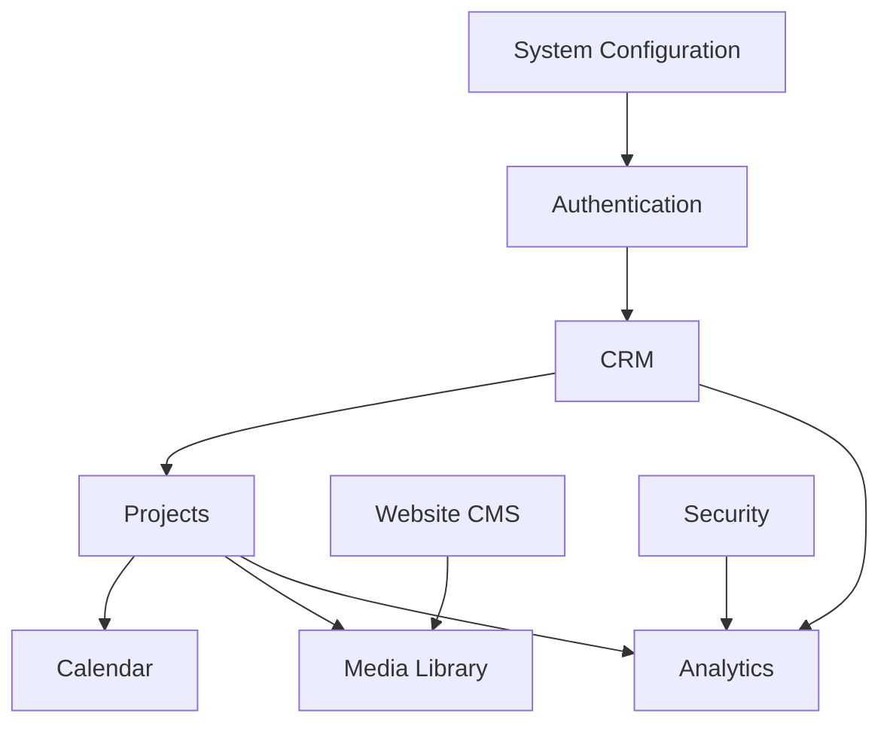

---

# High-Level Database Domains

```text
Identity

CRM

Projects

Website CMS

Media Library

Calendar

Analytics

Operations

Security

Configuration
```

Each domain should remain logically independent while participating in a unified relational model.

---

# Entity Philosophy

Business entities should represent real-world concepts.

Examples

Client

↓

Consultation

↓

Project

↓

Completed Event

rather than

```
Form Submission

↓

Spreadsheet

↓

Manual Tracking
```

The database should reflect the actual business workflow.

---

# Primary Entity Categories

The platform consists of the following primary entity groups.

| Domain | Primary Entities |
|----------|------------------|
| Identity | Users, Roles, Permissions |
| CRM | Clients, Dream Planners, Consultations, Contact Enquiries |
| Projects | Projects, Tasks, Milestones, Vendors |
| CMS | Pages, Versions, SEO Metadata |
| Media | Files, Categories, Tags |
| Calendar | Events, Reminders, Availability |
| Analytics | Reports, Metrics, Dashboards |
| Operations | Audit Logs, Backups, Incidents |
| Configuration | Business Settings, Feature Flags |

---

# Naming Conventions

## Tables

Use

```text
snake_case
```

Examples

```text
users

clients

projects

calendar_events

media_files
```

---

## Columns

Use

```text
snake_case
```

Examples

```text
created_at

updated_at

client_id

event_date

phone_number
```

---

## Primary Keys

Every table shall contain

```text
id
```

UUIDs are recommended over sequential integers for public-facing resources.

---

## Foreign Keys

Use the referenced entity name.

Examples

```text
client_id

project_id

user_id

media_file_id

consultation_id
```

---

## Junction Tables

Many-to-many relationships should use descriptive names.

Examples

```text
project_users

project_tags

media_categories

role_permissions
```

---

# Common Columns

Unless otherwise justified, every business table should include

| Column | Purpose |
|----------|----------|
| id | Primary Key |
| created_at | Creation Timestamp |
| updated_at | Last Modification Timestamp |
| created_by | Creating User |
| updated_by | Last Editing User |

These columns improve traceability and consistency.

---

# Soft Delete Strategy

Business records should generally not be permanently deleted.

Recommended approach

```text
deleted_at

deleted_by
```

instead of

```
DELETE FROM table
```

Benefits

- Recovery
- Auditability
- Historical Reporting
- Regulatory Compliance

Permanent deletion should remain an administrative operation where required.

---

# Timestamp Standards

Store timestamps in UTC.

Application interfaces should convert timestamps into the user's configured time zone.

This approach simplifies international expansion and reporting.

---

# Data Integrity

The database shall enforce

- Primary Keys
- Foreign Keys
- Unique Constraints
- Check Constraints
- Transaction Integrity

Business rules should be enforced at both the application and database layers where appropriate.

---

# Relationship Principles

Relationships should model real business connections.

Examples

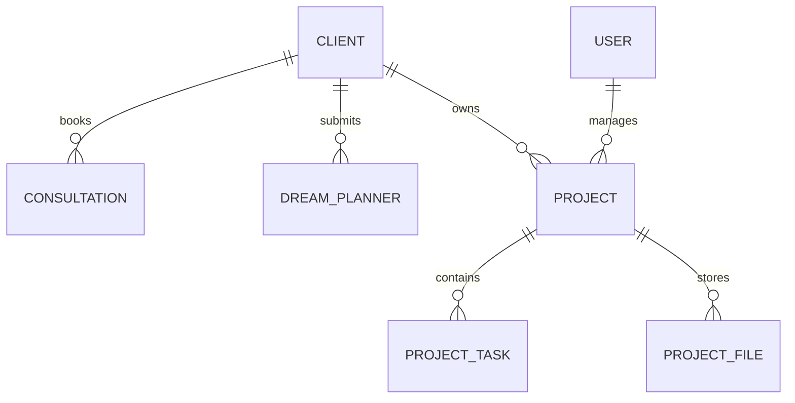

Relationships should avoid circular dependencies wherever practical.

---

# Database Layers

```mermaid
flowchart TD

APPLICATION

↓

SERVICES

↓

DATABASE

↓

BACKUP

↓

ARCHIVE
```

Each layer should have a clearly defined responsibility.

---

# Database Security Principles

The database should

- Enforce least privilege.
- Restrict direct access.
- Encrypt sensitive information where appropriate.
- Validate relational integrity.
- Record critical administrative actions.

Detailed security implementation is specified in `19-security.md`.

---

# Scalability Principles

The schema should support

- Millions of records
- Large media collections
- Multiple concurrent administrators
- Future cloud deployments
- Horizontal application scaling

Performance optimization strategies are defined later in this document.

---

# Functional Requirements

| ID | Requirement |
|----|-------------|
| DB-001 | Define a normalized relational schema. |
| DB-002 | Organize entities into logical domains. |
| DB-003 | Support extensible business workflows. |
| DB-004 | Enforce relational integrity. |
| DB-005 | Support soft deletion. |
| DB-006 | Maintain auditability. |
| DB-007 | Support future feature expansion. |

---

# Non-Functional Requirements

The database shall be:

- Reliable.
- Consistent.
- Scalable.
- Maintainable.
- Secure.
- Extensible.
- Highly Available.

---

# Developer Notes

Developers should:

- Design the schema around business entities rather than application screens or forms.
- Keep each database domain modular with explicit foreign key relationships instead of tightly coupled tables.
- Favor immutable historical records and soft deletion over destructive updates where business history has long-term value.
- Adopt consistent naming conventions, timestamps, and audit columns across every table to simplify maintenance and tooling.
- Treat this document as the foundational specification for backend architecture, API design, authentication, and security implementations.

---

# End of Part 1

Part 2 defines the complete **Identity & User Management** data model, including users, roles, permissions, authentication, sessions, password recovery, account status, audit identities, and role-based access control (RBAC), establishing the security foundation for the entire MatchStick Events platform.

# 16 — Database Design Specification (Part 2)

> MatchStick Events Documentation Repository

---

# Document Information

| Property | Value |
|----------|-------|
| Document Name | Database Design |
| Document ID | DOC-016 |
| Version | 1.0.0 |
| Part | 2 of 12 |
| Status | Approved |
| Depends On | 15-admin-dashboard.md (Users & Settings), 19-security.md |

---

# Identity & User Management Database

## Purpose

The Identity domain provides authentication, authorization, user management, and access control for the MatchStick Events platform.

Every administrator, manager, planner, content editor, and staff member accesses the system through this domain.

It serves as the security foundation for all other database modules.

---

# Identity Philosophy

Identity should represent **people**, not devices or sessions.

Authentication verifies who the user is.

Authorization determines what the user can do.

Sessions represent where the user is currently logged in.

These concerns should remain logically separated.

---

# Identity Domain Overview

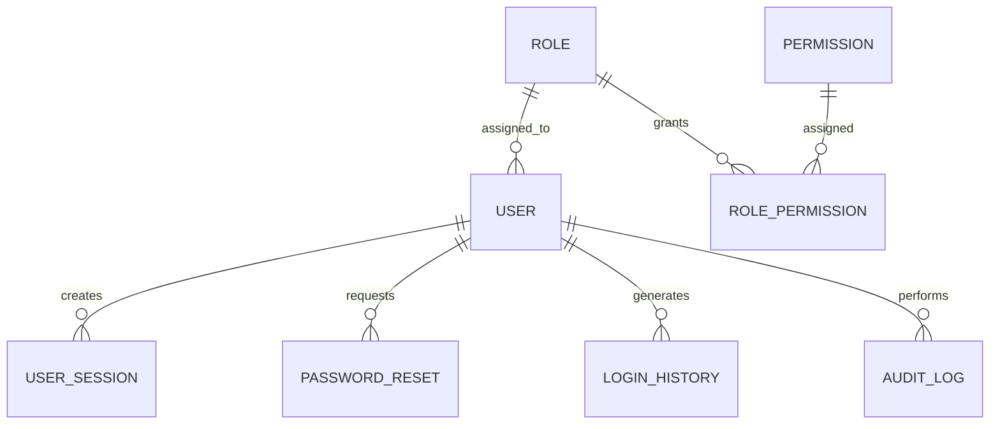

---

# Identity Entities

The Identity domain consists of

```text
users

roles

permissions

role_permissions

user_sessions

password_resets

login_history

audit_logs
```

Additional entities may be introduced without affecting existing relationships.

---

# Users Table

Stores every authenticated person.

Examples

- Founder
- Administrator
- Manager
- Event Planner
- Content Manager
- Staff

Every user must have exactly one primary role.

---

## Table

```text
users
```

---

## Columns

| Column | Type | Description |
|----------|------|-------------|
| id | UUID | Primary Key |
| role_id | UUID | Assigned Role |
| first_name | VARCHAR | First Name |
| last_name | VARCHAR | Last Name |
| email | VARCHAR | Login Email |
| phone_number | VARCHAR | Contact Number |
| password_hash | TEXT | Secure Password Hash |
| profile_photo_id | UUID | Media Reference |
| status | ENUM | Account Status |
| last_login_at | TIMESTAMP | Last Login |
| email_verified_at | TIMESTAMP | Email Verification |
| created_at | TIMESTAMP | Created |
| updated_at | TIMESTAMP | Updated |
| created_by | UUID | Creator |
| updated_by | UUID | Last Editor |
| deleted_at | TIMESTAMP | Soft Delete |
| deleted_by | UUID | Deleted By |

---

## Constraints

- Email must be unique.
- Passwords are never stored in plain text.
- Profile photos reference the Media Library.
- Every user belongs to one role.
- Soft-deleted users cannot authenticate.

---

# Account Status

Allowed values

| Status | Description |
|----------|-------------|
| Pending | Awaiting activation |
| Active | Normal operation |
| Suspended | Login disabled |
| Archived | Historical account |

Status transitions should be logged.

---

# Roles Table

Stores user roles.

Examples

- Administrator
- Manager
- Event Planner
- Content Manager
- Staff

Future custom roles should be supported.

---

## Table

```text
roles
```

---

## Columns

| Column | Type |
|----------|------|
| id | UUID |
| name | VARCHAR |
| description | TEXT |
| is_system_role | BOOLEAN |
| created_at | TIMESTAMP |
| updated_at | TIMESTAMP |

---

## Constraints

- Role names must be unique.
- System roles cannot be deleted.
- Custom roles may be archived.

---

# Permissions Table

Stores every permission available in the application.

Examples

```text
crm.view

crm.create

crm.edit

crm.delete

projects.manage

cms.publish

media.upload

analytics.export
```

Permissions should remain granular.

---

## Table

```text
permissions
```

---

## Columns

| Column | Type |
|----------|------|
| id | UUID |
| module | VARCHAR |
| permission_key | VARCHAR |
| description | TEXT |
| created_at | TIMESTAMP |

---

# Role Permissions

Many-to-many relationship.

```text
role_permissions
```

---

## Columns

| Column | Type |
|----------|------|
| role_id | UUID |
| permission_id | UUID |

Composite Primary Key

```
(role_id, permission_id)
```

---

# RBAC Architecture


Permissions should never be assigned directly to users except through future extension mechanisms.

---

# User Sessions

Every login creates a session.

---

## Table

```text
user_sessions
```

---

## Columns

| Column | Type |
|----------|------|
| id | UUID |
| user_id | UUID |
| refresh_token_hash | TEXT |
| ip_address | VARCHAR |
| user_agent | TEXT |
| browser | VARCHAR |
| operating_system | VARCHAR |
| device_type | VARCHAR |
| country | VARCHAR |
| city | VARCHAR |
| started_at | TIMESTAMP |
| expires_at | TIMESTAMP |
| last_activity_at | TIMESTAMP |
| revoked_at | TIMESTAMP |

---

## Session Rules

Users may have multiple active sessions.

Administrators may revoke sessions.

Expired sessions should be removed automatically according to retention policies.

---

# Login History

Stores authentication history.

---

## Table

```text
login_history
```

---

## Columns

| Column | Type |
|----------|------|
| id | UUID |
| user_id | UUID |
| login_time | TIMESTAMP |
| logout_time | TIMESTAMP |
| success | BOOLEAN |
| failure_reason | VARCHAR |
| ip_address | VARCHAR |
| user_agent | TEXT |

---

# Password Reset

Stores password reset requests.

---

## Table

```text
password_resets
```

---

## Columns

| Column | Type |
|----------|------|
| id | UUID |
| user_id | UUID |
| token_hash | TEXT |
| requested_at | TIMESTAMP |
| expires_at | TIMESTAMP |
| used_at | TIMESTAMP |

---

## Rules

- Tokens expire automatically.
- Tokens are single use.
- Tokens are stored as hashes.
- Expired tokens remain for auditing.

---

# Email Verification

Email verification information belongs to the user account.

Fields

```text
email_verified_at

verification_token_hash
```

Verification tokens should never be stored in plain text.

---

# Profile Photos

Users reference media assets.

```text
users

↓

profile_photo_id

↓

media_files
```

Profile images should never be duplicated.

---

# Authentication Flow

```mermaid
flowchart TD

LOGIN

-->

VERIFY PASSWORD

-->

CHECK STATUS

-->

CREATE SESSION

-->

ACCESS SYSTEM
```

Authentication logic is implemented within the backend rather than the database.

---

# Authorization Flow

```mermaid
flowchart TD

USER

-->

ROLE

-->

ROLE PERMISSIONS

-->

MODULE ACCESS
```

Authorization decisions should be made consistently across all APIs.

---

# Account Lifecycle


Historical information should always be preserved.

---

# Audit Identity

Every business entity should reference the responsible user.

Examples

```text
created_by

updated_by

deleted_by
```

These fields reference

```text
users.id
```

This enables complete accountability across the platform.

---

# Unique Constraints

Examples

| Table | Constraint |
|----------|------------|
| users | email |
| roles | name |
| permissions | permission_key |

Unique constraints should prevent duplicate identities.

---

# Index Recommendations

Create indexes on

```text
email

role_id

status

last_login_at

user_id

permission_key
```

Indexes should reflect common query patterns.

---

# Cascade Strategy

Deleting a role should not delete users.

Deleting a user should not remove

- Audit Logs
- Login History
- Historical Records

Historical integrity takes precedence over physical cleanup.

---

# Database Relationships

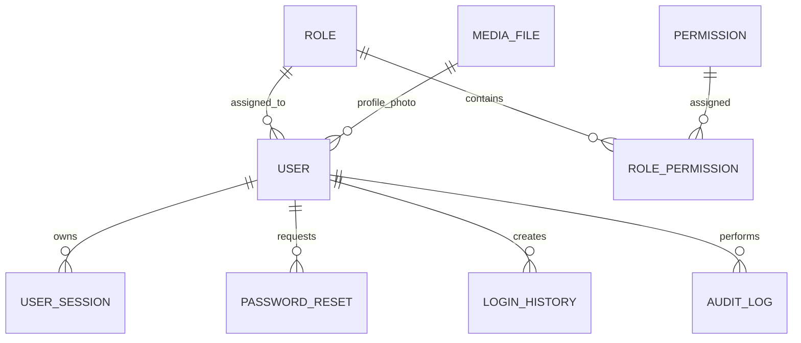

---

# Functional Requirements

| ID | Requirement |
|----|-------------|
| DB-008 | Store authenticated users. |
| DB-009 | Support RBAC. |
| DB-010 | Track active sessions. |
| DB-011 | Store login history. |
| DB-012 | Support password recovery. |
| DB-013 | Maintain audit identities. |
| DB-014 | Support account lifecycle management. |

---

# Non-Functional Requirements

The Identity domain shall be:

- Secure.
- Highly Available.
- Scalable.
- Reliable.
- Maintainable.
- Extensible.

---

# Developer Notes

Developers should:

- Use industry-standard password hashing algorithms (such as Argon2id or bcrypt) with appropriate configuration rather than implementing custom cryptography.
- Store refresh tokens, verification tokens, and password reset tokens only as cryptographic hashes.
- Keep authentication, authorization, and session management as separate concerns to improve maintainability and security.
- Design the RBAC system around permissions assigned to roles, allowing new roles to be introduced without schema changes.
- Preserve historical authentication and audit records even after users are archived or deactivated.

---

# End of Part 2

Part 3 defines the complete **CRM Database**, including clients, Dream Planners, consultation bookings, contact enquiries, communication history, notes, attachments, follow-ups, lifecycle tracking, and the relational foundation for customer management across the MatchStick Events platform.

# 16 — Database Design Specification (Part 3)

> MatchStick Events Documentation Repository

---

# Document Information

| Property | Value |
|----------|-------|
| Document Name | Database Design |
| Document ID | DOC-016 |
| Version | 1.0.0 |
| Part | 3 of 12 |
| Status | Approved |
| Depends On | 12-dream-planner.md, 13-booking-consultation.md, 14-contact-page.md, 15-admin-dashboard.md |

---

# CRM Database

## Purpose

The CRM (Customer Relationship Management) database stores every interaction between MatchStick Events and its clients.

It acts as the central customer domain, ensuring that information submitted through different channels is unified into a single, complete client record.

This domain supports the company's enquiry and consultation workflow originating from channels such as calls, WhatsApp, Instagram, email, and the website. 0

---

# CRM Philosophy

Every client should exist only once within the database.

Regardless of whether someone:

- Submits a Dream Planner
- Books a Consultation
- Uses the Contact Form
- Calls the business
- Sends a WhatsApp message

the system should associate these interactions with one unified client whenever possible.

---

# CRM Domain Overview

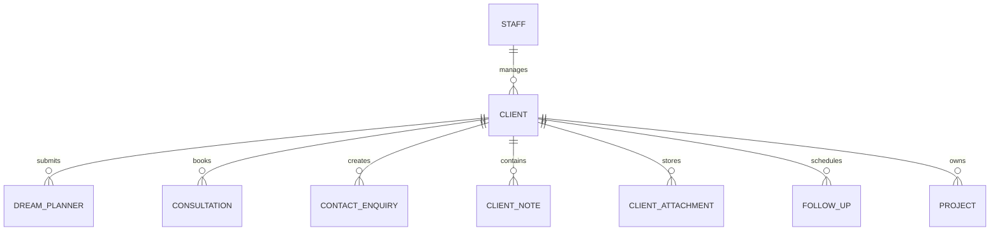

---

# CRM Entities

```text
clients

dream_planners

consultations

contact_enquiries

client_notes

client_attachments

follow_ups

communication_history
```

Each entity represents a distinct stage or aspect of the client lifecycle.

---

# Client Lifecycle

```mermaid
flowchart LR

Lead

-->

Consultation

-->

Active Client

-->

Completed Client

-->

Returning Client
```

Clients retain the same identity throughout every lifecycle stage.

---

# Clients Table

The `clients` table represents the canonical customer record.

Every CRM-related entity references this table.

---

## Table

```text
clients
```

---

## Columns

| Column | Type | Description |
|----------|------|-------------|
| id | UUID | Primary Key |
| full_name | VARCHAR | Client Name |
| email | VARCHAR | Email Address |
| phone_number | VARCHAR | Mobile Number |
| preferred_contact_method | ENUM | Preferred Communication |
| status | ENUM | Client Lifecycle |
| source | ENUM | Lead Source |
| assigned_user_id | UUID | Responsible Staff |
| event_type | VARCHAR | Primary Event |
| event_date | DATE | Planned Event |
| budget | DECIMAL | Estimated Budget |
| notes_count | INTEGER | Cached Count |
| created_at | TIMESTAMP | Created |
| updated_at | TIMESTAMP | Updated |
| created_by | UUID | Creator |
| updated_by | UUID | Last Editor |
| deleted_at | TIMESTAMP | Soft Delete |

---

## Client Status

Allowed values

| Status | Description |
|----------|-------------|
| Lead | Initial enquiry |
| Prospect | Consultation scheduled |
| Active | Project underway |
| Completed | Event delivered |
| Returning | Repeat client |
| Archived | Historical record |

---

## Lead Source

Examples

- Website
- Dream Planner
- Contact Page
- WhatsApp
- Phone
- Instagram
- Referral
- Walk-in

Lead sources should remain configurable.

---

# Dream Planners

Stores structured planning submissions.

---

## Table

```text
dream_planners
```

---

## Columns

| Column | Type |
|----------|------|
| id | UUID |
| client_id | UUID |
| event_type | VARCHAR |
| guest_count | INTEGER |
| estimated_budget | DECIMAL |
| venue_preference | VARCHAR |
| theme | VARCHAR |
| color_palette | TEXT |
| food_preferences | TEXT |
| entertainment | TEXT |
| inspiration_notes | TEXT |
| submitted_at | TIMESTAMP |
| converted_to_project | BOOLEAN |

---

## Rules

- Every Dream Planner belongs to one client.
- A client may submit multiple planners.
- Dream Planners remain immutable after submission except for administrative annotations.

---

# Consultations

Stores consultation bookings.

---

## Table

```text
consultations
```

---

## Columns

| Column | Type |
|----------|------|
| id | UUID |
| client_id | UUID |
| assigned_user_id | UUID |
| consultation_type | ENUM |
| scheduled_start | TIMESTAMP |
| scheduled_end | TIMESTAMP |
| status | ENUM |
| meeting_location | VARCHAR |
| notes | TEXT |
| created_at | TIMESTAMP |

---

## Consultation Status

| Status | Description |
|----------|-------------|
| Scheduled | Future meeting |
| Completed | Successfully conducted |
| Cancelled | Cancelled |
| No Show | Client absent |
| Rescheduled | New appointment created |

---

# Contact Enquiries

Stores enquiries submitted through the Contact Page.

---

## Table

```text
contact_enquiries
```

---

## Columns

| Column | Type |
|----------|------|
| id | UUID |
| client_id | UUID |
| subject | VARCHAR |
| message | TEXT |
| attachment_count | INTEGER |
| status | ENUM |
| submitted_at | TIMESTAMP |

---

## Enquiry Status

| Status | Description |
|----------|-------------|
| New | Awaiting review |
| Open | Being handled |
| Resolved | Completed |
| Closed | Archived |

---

# Communication History

Stores every interaction with the client.

---

## Table

```text
communication_history
```

---

## Columns

| Column | Type |
|----------|------|
| id | UUID |
| client_id | UUID |
| user_id | UUID |
| communication_type | ENUM |
| summary | TEXT |
| occurred_at | TIMESTAMP |

---

## Communication Types

Examples

- Phone Call
- WhatsApp
- Email
- Consultation
- Dream Planner
- Contact Form
- Internal Meeting

Communication history should be append-only.

---

# Client Notes

Internal planning notes.

---

## Table

```text
client_notes
```

---

## Columns

| Column | Type |
|----------|------|
| id | UUID |
| client_id | UUID |
| author_id | UUID |
| note_type | ENUM |
| content | TEXT |
| created_at | TIMESTAMP |

---

## Note Types

- General
- Planning
- Follow-up
- Internal
- Risk

Notes are never visible to clients.

---

# Client Attachments

Stores files associated with clients.

---

## Table

```text
client_attachments
```

---

## Columns

| Column | Type |
|----------|------|
| id | UUID |
| client_id | UUID |
| media_file_id | UUID |
| uploaded_by | UUID |
| category | ENUM |
| uploaded_at | TIMESTAMP |

---

## Categories

Examples

- Inspiration
- Contract
- Quotation
- Floor Plan
- Mood Board
- Reference Image

Actual files remain stored within the Media Library.

---

# Follow-ups

Tracks future actions.

---

## Table

```text
follow_ups
```

---

## Columns

| Column | Type |
|----------|------|
| id | UUID |
| client_id | UUID |
| assigned_user_id | UUID |
| due_at | TIMESTAMP |
| priority | ENUM |
| status | ENUM |
| description | TEXT |

---

## Priority

- Low
- Medium
- High
- Critical

---

## Status

- Pending
- Completed
- Cancelled

---

# Duplicate Detection Strategy

Potential duplicates should be detected using

- Email Address
- Phone Number
- Similar Name

Possible matches should be flagged for administrator review.

Duplicate resolution should merge related entities without losing historical records.

---

# Client Merge Strategy

When two records are merged

The surviving client record should retain

- Dream Planners
- Consultations
- Contact Enquiries
- Notes
- Attachments
- Communication History
- Follow-ups
- Projects

Merge operations should generate audit records.

---

# Relationship Rules

A client

- may own many Dream Planners.
- may book many Consultations.
- may submit many Contact Enquiries.
- may own many Projects.
- may contain many Notes.
- may contain many Attachments.
- may have many Follow-ups.

Every child entity references exactly one client.

---

# Referential Integrity

The database should prevent

- Dream Planners without Clients
- Consultations without Clients
- Notes without Authors
- Attachments without Media
- Follow-ups without Assignees

Foreign key constraints should enforce these rules.

---

# Cascade Strategy

Deleting a client should never automatically delete

- Projects
- Consultations
- Communication History
- Audit Records

Instead

Clients should be soft deleted.

---

# Suggested Indexes

Create indexes on

```text
email

phone_number

status

source

assigned_user_id

event_date

submitted_at

scheduled_start
```

Indexes should optimize dashboard filtering and CRM search.

---

# Complete CRM Relationships

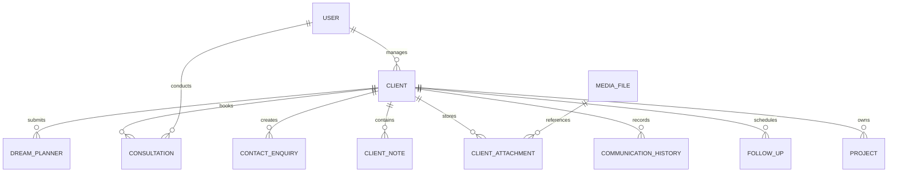

---

# Functional Requirements

| ID | Requirement |
|----|-------------|
| DB-015 | Maintain one canonical client record. |
| DB-016 | Support Dream Planner storage. |
| DB-017 | Support consultation scheduling data. |
| DB-018 | Store contact enquiries. |
| DB-019 | Maintain communication history. |
| DB-020 | Manage client notes and attachments. |
| DB-021 | Track follow-ups. |
| DB-022 | Support duplicate detection and client merging. |

---

# Non-Functional Requirements

The CRM database shall be:

- Consistent.
- Highly Available.
- Secure.
- Scalable.
- Auditable.
- Extensible.
- Optimized for rapid search.

---

# Developer Notes

Developers should:

- Treat the `clients` table as the canonical identity for all customer-related operations across the platform.
- Reference clients using foreign keys rather than duplicating contact information in child tables.
- Preserve complete customer history by implementing append-only communication records and soft deletion.
- Execute client merge operations within database transactions to prevent orphaned records or partial merges.
- Design CRM relationships so additional customer touchpoints (such as future chatbots, client portals, or mobile applications) can integrate without modifying the core client model.

---

# End of Part 3

Part 4 defines the complete **Project Management Database**, including projects, milestones, tasks, vendors, budgets, project documents, timelines, team assignments, dependencies, and the relational foundation for managing every event from planning through completion.

# 16 — Database Design Specification (Part 4)

> MatchStick Events Documentation Repository

---

# Document Information

| Property | Value |
|----------|-------|
| Document Name | Database Design |
| Document ID | DOC-016 |
| Version | 1.0.0 |
| Part | 4 of 12 |
| Status | Approved |
| Depends On | 15-admin-dashboard.md (Project Management Module) |

---

# Project Management Database

## Purpose

The Project Management database stores every event after a lead has successfully converted into an active client project.

It provides the relational foundation for planning, coordination, execution, collaboration, budgeting, vendor management, documentation, and event completion.

Every event managed by MatchStick Events should exist as a structured project with complete historical traceability.

---

# Project Philosophy

A project is the operational center of the business.

Everything required to execute an event should ultimately connect to a project.

Examples

- Client
- Team
- Tasks
- Milestones
- Vendors
- Budget
- Calendar
- Files
- Notes

The database should accurately represent the entire event lifecycle.

---

# Project Domain Overview

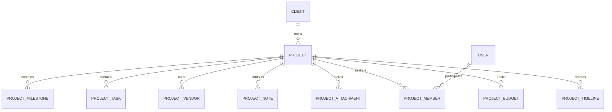

---

# Project Entities

```text
projects

project_milestones

project_tasks

project_members

project_vendors

project_budgets

project_notes

project_attachments

project_timeline
```

Each entity represents an independent business concern.

---

# Project Lifecycle

```mermaid
flowchart LR

Consultation

-->

Project Created

-->

Planning

-->

Execution

-->

Completed

-->

Archived
```

The database should preserve every stage.

---

# Projects Table

The `projects` table represents every event managed by the company.

---

## Table

```text
projects
```

---

## Columns

| Column | Type | Description |
|----------|------|-------------|
| id | UUID | Primary Key |
| client_id | UUID | Owner |
| project_code | VARCHAR | Human-readable Identifier |
| project_name | VARCHAR | Internal Name |
| event_type | VARCHAR | Event Category |
| event_date | DATE | Main Event |
| venue | VARCHAR | Primary Venue |
| status | ENUM | Current Status |
| progress_percentage | DECIMAL | Cached Progress |
| lead_planner_id | UUID | Primary Planner |
| estimated_budget | DECIMAL | Planned Budget |
| created_at | TIMESTAMP | Created |
| updated_at | TIMESTAMP | Updated |
| created_by | UUID | Creator |
| updated_by | UUID | Last Editor |
| deleted_at | TIMESTAMP | Soft Delete |

---

## Status

| Status | Description |
|----------|-------------|
| Planning | Initial planning |
| In Progress | Active execution |
| Awaiting Client | Waiting for approval |
| Ready | Preparation complete |
| Event Day | Event in progress |
| Completed | Successfully delivered |
| Archived | Historical project |

---

## Rules

- Every project belongs to one client.
- Project codes must be unique.
- Projects should never be physically deleted.
- Progress is calculated automatically.

---

# Project Milestones

Major planning stages.

---

## Table

```text
project_milestones
```

---

## Columns

| Column | Type |
|----------|------|
| id | UUID |
| project_id | UUID |
| milestone_name | VARCHAR |
| description | TEXT |
| due_date | DATE |
| completed_at | TIMESTAMP |
| sequence_order | INTEGER |

---

## Examples

- Venue Finalized
- Theme Approved
- Vendors Confirmed
- Invitations Sent
- Decoration Ready
- Final Review
- Event Completed

Milestones organize project progress.

---

# Project Tasks

Detailed work items.

---

## Table

```text
project_tasks
```

---

## Columns

| Column | Type |
|----------|------|
| id | UUID |
| milestone_id | UUID |
| assigned_user_id | UUID |
| task_name | VARCHAR |
| description | TEXT |
| priority | ENUM |
| status | ENUM |
| due_date | TIMESTAMP |
| completed_at | TIMESTAMP |

---

## Priority

- Low
- Medium
- High
- Critical

---

## Status

- Not Started
- In Progress
- Blocked
- Completed

Task completion contributes to milestone and project progress.

---

# Project Members

Stores assigned personnel.

---

## Table

```text
project_members
```

---

## Columns

| Column | Type |
|----------|------|
| id | UUID |
| project_id | UUID |
| user_id | UUID |
| role | VARCHAR |
| assigned_at | TIMESTAMP |

---

## Example Roles

- Lead Planner
- Coordinator
- Designer
- Operations
- Photographer
- Vendor Liaison

Projects may have multiple members.

---

# Vendors

External organizations.

---

## Table

```text
project_vendors
```

---

## Columns

| Column | Type |
|----------|------|
| id | UUID |
| project_id | UUID |
| vendor_name | VARCHAR |
| category | VARCHAR |
| contact_person | VARCHAR |
| phone_number | VARCHAR |
| email | VARCHAR |
| payment_status | ENUM |
| notes | TEXT |

---

## Categories

Examples

- Catering
- Decoration
- Photography
- Entertainment
- Lighting
- Sound
- Transportation
- Makeup

Future categories remain configurable.

---

## Payment Status

- Pending
- Partial
- Paid
- Cancelled

---

# Project Budget

Stores financial summaries.

---

## Table

```text
project_budgets
```

---

## Columns

| Column | Type |
|----------|------|
| id | UUID |
| project_id | UUID |
| estimated_cost | DECIMAL |
| actual_cost | DECIMAL |
| remaining_budget | DECIMAL |
| last_updated | TIMESTAMP |

---

## Rules

Remaining budget should be calculated automatically whenever costs change.

Future accounting integrations may extend this table.

---

# Project Notes

Internal planning notes.

---

## Table

```text
project_notes
```

---

## Columns

| Column | Type |
|----------|------|
| id | UUID |
| project_id | UUID |
| author_id | UUID |
| note_type | ENUM |
| content | TEXT |
| created_at | TIMESTAMP |

---

## Types

- Planning
- Meeting
- Vendor
- Client
- Internal
- Risk

Notes remain internal only.

---

# Project Attachments

Stores project-related files.

---

## Table

```text
project_attachments
```

---

## Columns

| Column | Type |
|----------|------|
| id | UUID |
| project_id | UUID |
| media_file_id | UUID |
| uploaded_by | UUID |
| category | VARCHAR |
| uploaded_at | TIMESTAMP |

---

## Examples

- Mood Board
- Contract
- Venue Layout
- Quotations
- Inspiration Images
- Vendor Documents

Actual files remain in the Media Library.

---

# Project Timeline

Chronological activity.

---

## Table

```text
project_timeline
```

---

## Columns

| Column | Type |
|----------|------|
| id | UUID |
| project_id | UUID |
| event_type | VARCHAR |
| description | TEXT |
| created_by | UUID |
| occurred_at | TIMESTAMP |

---

## Examples

- Project Created
- Milestone Completed
- Vendor Added
- Budget Updated
- Client Meeting
- Event Completed

Timeline entries should never be modified.

---

# Project Dependencies

Tasks may depend on other tasks.

Example

```mermaid
flowchart LR

Venue

-->

Decoration

-->

Lighting

-->

Final Setup
```

Dependencies should prevent premature task completion.

---

# Progress Calculation

Project progress should be derived automatically.

Example

```
Milestones

↓

Tasks

↓

Completion %

↓

Project Progress
```

Manual percentage editing should be avoided.

---

# Relationship Rules

Every

- Milestone belongs to one Project.
- Task belongs to one Milestone.
- Budget belongs to one Project.
- Timeline entry belongs to one Project.
- Attachment belongs to one Project.
- Vendor belongs to one Project.

Projects remain the parent entity.

---

# Referential Integrity

The database should prevent

- Tasks without milestones.
- Milestones without projects.
- Budgets without projects.
- Attachments without media.
- Members without users.

Foreign key constraints should enforce these relationships.

---

# Cascade Strategy

Deleting a project should never automatically delete

- Timeline
- Budget
- Vendors
- Audit Records
- Notes

Projects should be soft deleted.

Historical information must remain intact.

---

# Suggested Indexes

Create indexes on

```text
client_id

project_code

status

event_date

lead_planner_id

assigned_user_id

due_date

completed_at
```

Indexes should optimize dashboard queries and reporting.

---

# Complete Project Relationships

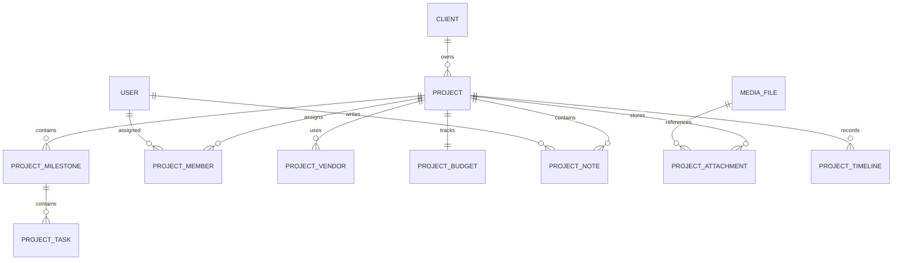

---

# Functional Requirements

| ID | Requirement |
|----|-------------|
| DB-023 | Store active projects. |
| DB-024 | Support milestone management. |
| DB-025 | Support task management. |
| DB-026 | Track project members. |
| DB-027 | Store vendor information. |
| DB-028 | Track project budgets. |
| DB-029 | Maintain project notes and attachments. |
| DB-030 | Preserve immutable project timelines. |

---

# Non-Functional Requirements

The Project Management database shall be:

- Consistent.
- Scalable.
- Highly Available.
- Secure.
- Auditable.
- Extensible.
- Optimized for operational workloads.

---

# Developer Notes

Developers should:

- Treat the `projects` table as the central operational entity once a client engagement transitions into execution.
- Keep milestones, tasks, vendors, budgets, notes, and attachments in separate normalized tables to avoid excessive row growth and simplify future extensions.
- Calculate project progress dynamically from milestone and task completion while optionally caching the result for dashboard performance.
- Preserve all operational history using append-only timeline records and soft deletion rather than destructive updates.
- Design the schema so future modules—such as invoices, procurement, inventory management, client portals, or AI planning assistants—can integrate with projects through foreign key relationships instead of schema redesign.

---

# End of Part 4

Part 5 defines the complete **Website CMS Database**, including pages, reusable content sections, publishing workflows, drafts, version history, SEO metadata, URL management, navigation structures, and the relational model supporting the public MatchStick Events website.

# 16 — Database Design Specification (Part 5)

> MatchStick Events Documentation Repository

---

# Document Information

| Property | Value |
|----------|-------|
| Document Name | Database Design |
| Document ID | DOC-016 |
| Version | 1.0.0 |
| Part | 5 of 12 |
| Status | Approved |
| Depends On | 07-homepage.md, 08-about-page.md, 09-services-page.md, 10-gallery-page.md, 11-previous-events-page.md, 14-contact-page.md, 15-admin-dashboard.md |

---

# Website CMS Database

## Purpose

The Website CMS database manages all public-facing website content.

It provides the relational foundation for creating, editing, reviewing, publishing, versioning, and archiving website content while maintaining complete editorial history.

The CMS enables non-technical staff to update website content without modifying application code.

---

# CMS Philosophy

Content should be structured rather than hardcoded.

Every page, section, image, SEO configuration, and published revision should exist as data.

The website should simply render the current published version.

---

# CMS Domain Overview

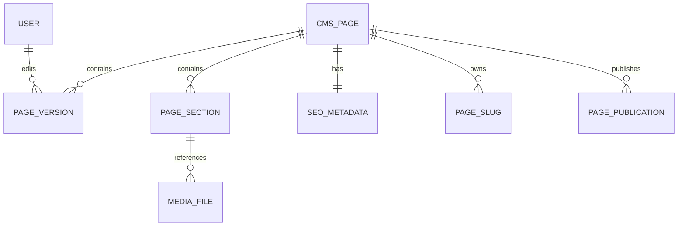

---

# CMS Entities

```text
cms_pages

page_sections

page_versions

seo_metadata

page_slugs

page_publications
```

Future modules such as blogs or testimonials should integrate without modifying existing structures.

---

# Content Lifecycle


Every content item should follow this lifecycle.

---

# CMS Pages

Stores every website page.

---

## Table

```text
cms_pages
```

---

## Columns

| Column | Type | Description |
|----------|------|-------------|
| id | UUID | Primary Key |
| page_name | VARCHAR | Internal Name |
| page_type | ENUM | Page Category |
| navigation_order | INTEGER | Display Order |
| is_homepage | BOOLEAN | Homepage Indicator |
| current_version_id | UUID | Published Version |
| status | ENUM | Page Status |
| created_at | TIMESTAMP | Created |
| updated_at | TIMESTAMP | Updated |
| created_by | UUID | Creator |
| updated_by | UUID | Last Editor |
| deleted_at | TIMESTAMP | Soft Delete |

---

## Page Types

Examples

- Homepage
- About
- Services
- Gallery
- Previous Events
- Contact

Future pages should be supported without schema redesign.

---

## Page Status

| Status | Description |
|----------|-------------|
| Draft | Being edited |
| Review | Awaiting approval |
| Published | Visible publicly |
| Archived | Historical |

---

# Page Sections

Stores reusable content blocks.

---

## Table

```text
page_sections
```

---

## Columns

| Column | Type |
|----------|------|
| id | UUID |
| page_id | UUID |
| section_name | VARCHAR |
| section_type | ENUM |
| display_order | INTEGER |
| content_json | JSONB |
| is_visible | BOOLEAN |
| created_at | TIMESTAMP |
| updated_at | TIMESTAMP |

---

## Section Types

Examples

- Hero
- Introduction
- Service Cards
- Gallery Grid
- CTA
- Contact Information
- FAQ
- Footer

Using `JSONB` allows flexible layouts while maintaining relational page structure.

---

# Page Versions

Stores historical revisions.

---

## Table

```text
page_versions
```

---

## Columns

| Column | Type |
|----------|------|
| id | UUID |
| page_id | UUID |
| version_number | INTEGER |
| summary | TEXT |
| editor_id | UUID |
| content_snapshot | JSONB |
| created_at | TIMESTAMP |
| published_at | TIMESTAMP |

---

## Rules

Every published version remains immutable.

Editing creates a new version.

Rollback creates another version rather than restoring old rows.

---

# SEO Metadata

Stores page SEO configuration.

---

## Table

```text
seo_metadata
```

---

## Columns

| Column | Type |
|----------|------|
| id | UUID |
| page_id | UUID |
| title | VARCHAR |
| meta_description | TEXT |
| canonical_url | VARCHAR |
| open_graph_title | VARCHAR |
| open_graph_description | TEXT |
| open_graph_image_id | UUID |
| robots | VARCHAR |
| structured_data | JSONB |
| updated_at | TIMESTAMP |

---

## Rules

Each page owns exactly one active SEO configuration.

Structured data supports future Schema.org enhancements.

---

# Page Slugs

Stores public URLs.

---

## Table

```text
page_slugs
```

---

## Columns

| Column | Type |
|----------|------|
| id | UUID |
| page_id | UUID |
| slug | VARCHAR |
| is_primary | BOOLEAN |
| redirect_to_slug_id | UUID |
| created_at | TIMESTAMP |

---

## Examples

```text
/

about

services

gallery

previous-events

contact
```

Changing a slug should preserve previous URLs through redirects.

---

# Publications

Tracks publishing operations.

---

## Table

```text
page_publications
```

---

## Columns

| Column | Type |
|----------|------|
| id | UUID |
| page_id | UUID |
| version_id | UUID |
| published_by | UUID |
| publication_status | ENUM |
| scheduled_for | TIMESTAMP |
| published_at | TIMESTAMP |

---

## Publication Status

- Draft
- Scheduled
- Published
- Archived

Publishing history should remain immutable.

---

# Navigation Structure

Navigation order should be stored within the database.

Example

```text
Home

↓

Services

↓

Gallery

↓

Previous Events

↓

Contact
```

Future navigation groups should be supported.

---

# Homepage

Only one page may have

```text
is_homepage = true
```

A unique constraint should enforce this rule.

---

# Draft Workflow

Drafts should

- Be editable
- Support preview
- Never appear publicly
- Preserve previous published versions

---

# Content Snapshots

Every version should store a complete snapshot.

Example

```
Version 3

↓

Entire Page Layout

↓

Section Content

↓

SEO Configuration
```

Snapshots simplify rollback operations.

---

# Reusable Sections

Future enhancement.

Support reusable content blocks.

Examples

- Footer
- Contact CTA
- Newsletter
- Testimonials

These may be shared across multiple pages.

---

# Media Relationships

Sections reference Media Library assets.

Examples

- Hero Images
- Gallery Photos
- Team Images
- Background Images

Files should never be duplicated.

---

# Referential Integrity

The database should prevent

- Versions without pages.
- SEO without pages.
- Publications without versions.
- Sections without pages.
- Slugs without pages.

---

# Cascade Strategy

Deleting a page should not delete

- Versions
- Publication History
- Audit Records

Pages should be archived through soft deletion.

---

# Suggested Indexes

Create indexes on

```text
page_name

status

page_type

slug

published_at

navigation_order
```

Indexes should optimize website rendering and CMS administration.

---

# Complete CMS Relationships

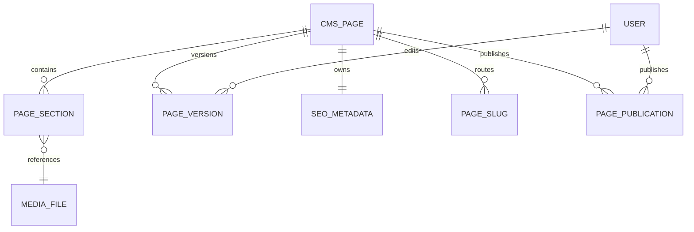

---

# Functional Requirements

| ID | Requirement |
|----|-------------|
| DB-031 | Store website pages. |
| DB-032 | Support structured page sections. |
| DB-033 | Maintain immutable version history. |
| DB-034 | Store SEO metadata. |
| DB-035 | Support URL slug management. |
| DB-036 | Track publishing operations. |
| DB-037 | Support draft workflows. |
| DB-038 | Reference centralized media assets. |

---

# Non-Functional Requirements

The CMS database shall be:

- Consistent.
- Secure.
- Scalable.
- Extensible.
- Highly Available.
- Optimized for content delivery.
- Easy to maintain.

---

# Developer Notes

Developers should:

- Separate content, presentation, and publication state into independent tables to simplify future redesigns.
- Store flexible page layouts using structured `JSONB` content blocks while keeping page metadata relational.
- Preserve every published version as an immutable snapshot to provide reliable rollback and auditing.
- Implement URL management independently from page definitions so redirects and SEO can evolve without changing page records.
- Design the CMS schema so future content types—such as blogs, testimonials, careers, FAQs, or landing pages—can reuse the same publishing and versioning infrastructure.

---

# End of Part 5

Part 6 defines the complete **Media Library Database**, including media assets, storage locations, thumbnails, categories, tags, version history, usage tracking, optimization metadata, duplicate detection, and the relational model supporting centralized digital asset management across the MatchStick Events platform.

# 16 — Database Design Specification (Part 6)

> MatchStick Events Documentation Repository

---

# Document Information

| Property | Value |
|----------|-------|
| Document Name | Database Design |
| Document ID | DOC-016 |
| Version | 1.0.0 |
| Part | 6 of 12 |
| Status | Approved |
| Depends On | 10-gallery-page.md, 11-previous-events-page.md, 15-admin-dashboard.md (Media Library Module) |

---

# Media Library Database

## Purpose

The Media Library database manages every digital asset used throughout the MatchStick Events platform.

It provides a centralized storage model for images, documents, thumbnails, metadata, categories, tags, versions, and usage relationships.

Every module should reference media assets stored in this domain rather than storing duplicate copies.

---

# Media Philosophy

Every digital asset should exist exactly once.

The platform should reference assets rather than duplicate them.

A single image may be simultaneously used by:

- Homepage
- Gallery
- Previous Events
- Projects
- CRM
- Staff Profiles

without creating multiple physical copies.

---

# Media Domain Overview

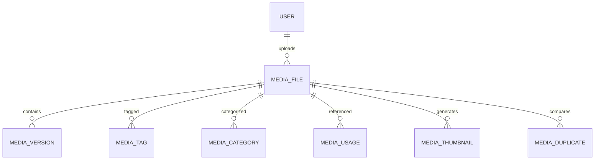

---

# Media Entities

```text
media_files

media_versions

media_categories

media_tags

media_file_tags

media_file_categories

media_usage

media_thumbnails

media_duplicates
```

Each entity has a single responsibility.

---

# Media Lifecycle

```mermaid
flowchart LR

Upload

-->

Optimize

-->

Categorize

-->

Publish

-->

Archive
```

Assets remain recoverable throughout their lifecycle.

---

# Media Files

Stores every uploaded asset.

---

## Table

```text
media_files
```

---

## Columns

| Column | Type | Description |
|----------|------|-------------|
| id | UUID | Primary Key |
| original_filename | VARCHAR | Uploaded File Name |
| stored_filename | VARCHAR | Storage Identifier |
| mime_type | VARCHAR | File Type |
| file_extension | VARCHAR | Extension |
| file_size | BIGINT | Bytes |
| width | INTEGER | Image Width |
| height | INTEGER | Image Height |
| checksum | VARCHAR | File Hash |
| storage_path | TEXT | Physical Location |
| uploaded_by | UUID | User |
| upload_status | ENUM | Upload State |
| is_archived | BOOLEAN | Archive Flag |
| created_at | TIMESTAMP | Uploaded |
| updated_at | TIMESTAMP | Updated |
| deleted_at | TIMESTAMP | Soft Delete |

---

## Upload Status

| Status | Description |
|----------|-------------|
| Uploading | Transfer in progress |
| Processing | Optimization running |
| Ready | Available |
| Failed | Upload failed |
| Archived | Hidden |

---

## Rules

- Every asset receives a UUID.
- Original filenames are preserved.
- Storage filenames remain unique.
- Checksums detect duplicate uploads.
- Physical files remain immutable.

---

# Media Versions

Stores replacement history.

---

## Table

```text
media_versions
```

---

## Columns

| Column | Type |
|----------|------|
| id | UUID |
| media_file_id | UUID |
| version_number | INTEGER |
| file_size | BIGINT |
| checksum | VARCHAR |
| uploaded_by | UUID |
| created_at | TIMESTAMP |
| change_summary | TEXT |

---

## Rules

Replacing a file creates a new version.

Previous versions remain available for restoration.

---

# Categories

Logical grouping.

---

## Table

```text
media_categories
```

---

## Columns

| Column | Type |
|----------|------|
| id | UUID |
| category_name | VARCHAR |
| description | TEXT |
| created_at | TIMESTAMP |

---

## Examples

- Homepage
- Weddings
- Birthdays
- Gallery
- Corporate
- Branding
- Previous Events

Categories remain configurable.

---

# Tags

Flexible searching.

---

## Table

```text
media_tags
```

---

## Columns

| Column | Type |
|----------|------|
| id | UUID |
| tag_name | VARCHAR |
| created_at | TIMESTAMP |

---

## Examples

- Luxury
- Floral
- Gold
- Outdoor
- Vintage
- Elegant
- Premium
- Rajasthan

Tags improve discoverability.

---

# Media File Tags

Many-to-many relationship.

---

## Table

```text
media_file_tags
```

---

## Columns

| Column | Type |
|----------|------|
| media_file_id | UUID |
| media_tag_id | UUID |

Composite Primary Key

```text
(media_file_id, media_tag_id)
```

---

# Media File Categories

Many-to-many relationship.

---

## Table

```text
media_file_categories
```

---

## Columns

| Column | Type |
|----------|------|
| media_file_id | UUID |
| media_category_id | UUID |

Composite Primary Key

```text
(media_file_id, media_category_id)
```

---

# Media Usage

Tracks where assets are referenced.

---

## Table

```text
media_usage
```

---

## Columns

| Column | Type |
|----------|------|
| id | UUID |
| media_file_id | UUID |
| entity_type | VARCHAR |
| entity_id | UUID |
| usage_context | VARCHAR |
| created_at | TIMESTAMP |

---

## Example Usage

```text
Homepage Hero

Gallery

Project

Client Attachment

About Page

Previous Event
```

Assets should never require manual tracking.

---

# Thumbnails

Generated automatically.

---

## Table

```text
media_thumbnails
```

---

## Columns

| Column | Type |
|----------|------|
| id | UUID |
| media_file_id | UUID |
| thumbnail_size | ENUM |
| storage_path | TEXT |
| width | INTEGER |
| height | INTEGER |
| generated_at | TIMESTAMP |

---

## Sizes

- Small
- Medium
- Large

Future sizes may be added.

---

# Duplicate Detection

Tracks duplicate analysis.

---

## Table

```text
media_duplicates
```

---

## Columns

| Column | Type |
|----------|------|
| id | UUID |
| original_media_id | UUID |
| duplicate_media_id | UUID |
| similarity_score | DECIMAL |
| detection_method | VARCHAR |
| detected_at | TIMESTAMP |

---

## Detection Methods

Examples

- SHA-256 Hash
- Perceptual Image Hash
- Filename Match

Future AI similarity detection may extend this table.

---

# Storage Locations

The database stores metadata only.

Actual files reside within object storage.

Example

```text
Database

↓

Storage Path

↓

Cloud Storage
```

This design keeps the database lightweight.

---

# Optimization Metadata

Optimization details should remain separate from the original asset.

Examples

- Compression Ratio
- Optimized File Size
- Thumbnail Count
- Processing Duration

Future optimization metrics may be added without affecting the primary file record.

---

# File Relationships

A media asset may belong to multiple modules.

Examples

```mermaid
flowchart TD

MEDIA

-->

CMS

MEDIA

-->

PROJECTS

MEDIA

-->

CRM

MEDIA

-->

GALLERY

MEDIA

-->

STAFF
```

Relationships should remain normalized.

---

# Referential Integrity

The database should prevent

- Thumbnails without media.
- Versions without media.
- Usage records without assets.
- Tag assignments without tags.
- Category assignments without categories.

---

# Cascade Strategy

Deleting a media asset should not automatically remove

- Version History
- Usage History
- Audit Records

Assets should instead be archived through soft deletion.

---

# Suggested Indexes

Create indexes on

```text
checksum

stored_filename

mime_type

uploaded_by

upload_status

created_at

file_size

is_archived
```

Additional indexes

```text
tag_name

category_name

entity_type

entity_id
```

These indexes optimize uploads, search, and usage tracking.

---

# Complete Media Relationships

```mermaid
erDiagram

MEDIA_FILE ||--o{ MEDIA_VERSION : versions

MEDIA_FILE ||--o{ MEDIA_THUMBNAIL : generates

MEDIA_FILE ||--o{ MEDIA_USAGE : referenced

MEDIA_FILE ||--o{ MEDIA_FILE_TAG : tagged

MEDIA_FILE ||--o{ MEDIA_FILE_CATEGORY : categorized

MEDIA_TAG ||--o{ MEDIA_FILE_TAG : assigned

MEDIA_CATEGORY ||--o{ MEDIA_FILE_CATEGORY : assigned

USER ||--o{ MEDIA_FILE : uploads

MEDIA_FILE ||--o{ MEDIA_DUPLICATE : compares
```

---

# Functional Requirements

| ID | Requirement |
|----|-------------|
| DB-039 | Store centralized media assets. |
| DB-040 | Support asset versioning. |
| DB-041 | Support categories and tags. |
| DB-042 | Track media usage. |
| DB-043 | Generate thumbnail metadata. |
| DB-044 | Detect duplicate uploads. |
| DB-045 | Preserve optimization metadata. |
| DB-046 | Support centralized storage references. |

---

# Non-Functional Requirements

The Media Library database shall be:

- Highly Available.
- Scalable.
- Secure.
- Optimized for large media collections.
- Consistent.
- Maintainable.
- Extensible.

---

# Developer Notes

Developers should:

- Store only metadata and storage references in the database while keeping binary files in object storage.
- Use checksum-based duplicate detection as the primary mechanism, with support for future perceptual similarity algorithms.
- Model tags and categories as independent many-to-many relationships to maximize flexibility and search performance.
- Keep original assets immutable while recording all replacements through version history.
- Design media relationships generically so any future module can reference assets through the `media_usage` table without schema modifications.

---

# End of Part 6

Part 7 defines the complete **Calendar & Scheduling Database**, including calendar events, staff availability, recurring schedules, holidays, reminders, notifications, event participants, scheduling conflicts, and the relational foundation supporting organization-wide scheduling.

# 16 — Database Design Specification (Part 7)

> MatchStick Events Documentation Repository

---

# Document Information

| Property | Value |
|----------|-------|
| Document Name | Database Design |
| Document ID | DOC-016 |
| Version | 1.0.0 |
| Part | 7 of 12 |
| Status | Approved |
| Depends On | 13-booking-consultation.md, 15-admin-dashboard.md (Calendar & Scheduling Module) |

---

# Calendar & Scheduling Database

## Purpose

The Calendar domain manages all time-based activities across the MatchStick Events platform.

It provides a centralized scheduling system for consultations, projects, meetings, reminders, staff availability, holidays, recurring events, and operational planning.

Every scheduled activity should exist as a structured calendar entity.

---

# Calendar Philosophy

Time should be treated as a shared organizational resource.

Rather than maintaining separate calendars for different modules, all scheduled activities should be unified into a single calendar system.

Different modules contribute events, while the Calendar domain provides scheduling, availability management, reminders, and conflict detection.

---

# Calendar Domain Overview

```mermaid
erDiagram

CALENDAR_EVENT ||--o{ EVENT_PARTICIPANT : includes

CALENDAR_EVENT ||--o{ EVENT_REMINDER : schedules

CALENDAR_EVENT ||--o{ EVENT_RECURRENCE : repeats

USER ||--o{ USER_AVAILABILITY : defines

USER ||--o{ EVENT_PARTICIPANT : attends

HOLIDAY ||--o{ USER_AVAILABILITY : affects
```

---

# Calendar Entities

```text
calendar_events

event_participants

event_reminders

event_recurrence

user_availability

holidays

calendar_notifications
```

Future scheduling features should integrate without modifying existing structures.

---

# Calendar Lifecycle

```mermaid
flowchart LR

Created

-->

Scheduled

-->

Reminder

-->

In Progress

-->

Completed

-->

Archived
```

Historical calendar records should remain permanently available.

---

# Calendar Events

Stores every scheduled activity.

---

## Table

```text
calendar_events
```

---

## Columns

| Column | Type | Description |
|----------|------|-------------|
| id | UUID | Primary Key |
| event_title | VARCHAR | Display Title |
| event_type | ENUM | Event Category |
| related_entity_type | VARCHAR | Source Module |
| related_entity_id | UUID | Source Record |
| organizer_id | UUID | Event Owner |
| location | VARCHAR | Venue |
| description | TEXT | Notes |
| start_time | TIMESTAMP | Start |
| end_time | TIMESTAMP | End |
| status | ENUM | Event Status |
| is_all_day | BOOLEAN | All-Day Event |
| created_at | TIMESTAMP | Created |
| updated_at | TIMESTAMP | Updated |
| created_by | UUID | Creator |

---

## Event Types

Examples

- Consultation
- Project Meeting
- Site Visit
- Venue Inspection
- Vendor Meeting
- Internal Meeting
- Event Day
- Staff Training
- Holiday

Future event types should remain configurable.

---

## Event Status

| Status | Description |
|----------|-------------|
| Scheduled | Planned |
| Confirmed | Approved |
| In Progress | Currently active |
| Completed | Finished |
| Cancelled | Cancelled |
| Archived | Historical |

---

## Rules

- Every event has a start time.
- End time must occur after start time.
- Events may reference another business entity.
- Completed events become read-only except for administrative corrections.

---

# Event Participants

Stores attendees.

---

## Table

```text
event_participants
```

---

## Columns

| Column | Type |
|----------|------|
| id | UUID |
| event_id | UUID |
| user_id | UUID |
| participation_role | VARCHAR |
| attendance_status | ENUM |
| invited_at | TIMESTAMP |

---

## Roles

Examples

- Organizer
- Planner
- Coordinator
- Staff
- Vendor
- Observer

---

## Attendance Status

- Invited
- Accepted
- Declined
- Attended
- Absent

---

# Event Reminders

Stores reminder schedules.

---

## Table

```text
event_reminders
```

---

## Columns

| Column | Type |
|----------|------|
| id | UUID |
| event_id | UUID |
| reminder_type | ENUM |
| reminder_time | TIMESTAMP |
| delivery_status | ENUM |
| delivered_at | TIMESTAMP |

---

## Reminder Types

- Email
- SMS
- Push Notification
- In-App Notification

---

## Delivery Status

- Pending
- Sent
- Failed
- Cancelled

---

# Recurring Events

Stores recurring schedules.

---

## Table

```text
event_recurrence
```

---

## Columns

| Column | Type |
|----------|------|
| id | UUID |
| event_id | UUID |
| recurrence_pattern | VARCHAR |
| recurrence_interval | INTEGER |
| recurrence_end | TIMESTAMP |
| created_at | TIMESTAMP |

---

## Examples

- Daily
- Weekly
- Monthly
- Yearly

Future RRULE-based recurrence patterns should be supported.

---

# User Availability

Stores working schedules.

---

## Table

```text
user_availability
```

---

## Columns

| Column | Type |
|----------|------|
| id | UUID |
| user_id | UUID |
| weekday | ENUM |
| available_from | TIME |
| available_until | TIME |
| availability_status | ENUM |
| created_at | TIMESTAMP |

---

## Availability Status

- Available
- Busy
- Leave
- Remote

Availability supports scheduling automation.

---

# Holidays

Stores organizational holidays.

---

## Table

```text
holidays
```

---

## Columns

| Column | Type |
|----------|------|
| id | UUID |
| holiday_name | VARCHAR |
| holiday_date | DATE |
| holiday_type | ENUM |
| description | TEXT |
| created_at | TIMESTAMP |

---

## Holiday Types

- National
- Regional
- Company
- Optional

Holiday calendars should remain configurable.

---

# Calendar Notifications

Stores notification history.

---

## Table

```text
calendar_notifications
```

---

## Columns

| Column | Type |
|----------|------|
| id | UUID |
| event_id | UUID |
| recipient_id | UUID |
| notification_type | ENUM |
| sent_at | TIMESTAMP |
| delivery_status | ENUM |

---

## Notification Types

- Reminder
- Update
- Cancellation
- Invitation
- Reschedule

Notification history should remain immutable.

---

# Conflict Detection

Scheduling conflicts should be detected using

- Organizer availability
- Participant availability
- Existing calendar events
- Holiday schedules
- Working hours

Conflicts should be flagged before event confirmation.

---

# Event Relationships

Calendar events may reference

- Consultations
- Projects
- CRM Follow-ups
- Internal Meetings
- Staff Activities

This relationship should use

```text
related_entity_type

related_entity_id
```

to avoid creating separate calendar tables for each module.

---

# Time Zone Strategy

All timestamps should be stored in UTC.

Display time zones should be determined by user preferences.

Recurring schedules should account for daylight saving time where applicable.

---

# Scheduling Rules

The database should enforce

- End time after start time.
- No orphaned participants.
- Valid recurrence references.
- Valid organizer references.

Application logic should handle complex scheduling policies.

---

# Referential Integrity

The database should prevent

- Participants without events.
- Reminders without events.
- Notifications without recipients.
- Availability without users.
- Recurrence rules without events.

Foreign key constraints should enforce these relationships.

---

# Cascade Strategy

Deleting an event should never remove

- Notification history
- Reminder history
- Audit records

Events should be archived through soft deletion.

---

# Suggested Indexes

Create indexes on

```text
start_time

end_time

event_type

status

organizer_id

related_entity_type

related_entity_id

holiday_date
```

Additional indexes

```text
user_id

weekday

availability_status

reminder_time
```

These indexes optimize scheduling, calendar rendering, and conflict detection.

---

# Complete Calendar Relationships

```mermaid
erDiagram

CALENDAR_EVENT ||--o{ EVENT_PARTICIPANT : includes

CALENDAR_EVENT ||--o{ EVENT_REMINDER : schedules

CALENDAR_EVENT ||--o{ EVENT_RECURRENCE : repeats

CALENDAR_EVENT ||--o{ CALENDAR_NOTIFICATION : generates

USER ||--o{ USER_AVAILABILITY : defines

USER ||--o{ EVENT_PARTICIPANT : attends

USER ||--o{ CALENDAR_EVENT : organizes

HOLIDAY ||--o{ USER_AVAILABILITY : influences
```

---

# Functional Requirements

| ID | Requirement |
|----|-------------|
| DB-047 | Store all scheduled events. |
| DB-048 | Manage event participants. |
| DB-049 | Support reminders and notifications. |
| DB-050 | Support recurring schedules. |
| DB-051 | Track staff availability. |
| DB-052 | Maintain holiday calendars. |
| DB-053 | Detect scheduling conflicts. |
| DB-054 | Support cross-module calendar integration. |

---

# Non-Functional Requirements

The Calendar database shall be:

- Highly Available.
- Consistent.
- Scalable.
- Reliable.
- Secure.
- Extensible.
- Optimized for scheduling workloads.

---

# Developer Notes

Developers should:

- Treat the Calendar as a shared service rather than a feature owned by a single module.
- Use the `related_entity_type` and `related_entity_id` pattern to associate events with CRM, Projects, or future modules without introducing unnecessary table coupling.
- Store recurring event definitions separately from individual event records to simplify scheduling logic and future standards-based recurrence support.
- Keep reminders and notifications immutable so delivery history remains available for auditing and troubleshooting.
- Design availability and conflict detection to support future AI-assisted scheduling and automated resource allocation.

---

# End of Part 7

Part 8 defines the complete **Analytics & Reporting Database**, including event tracking, KPI aggregation, dashboard metrics, custom reports, historical snapshots, reporting schedules, and the relational foundation supporting business intelligence across the MatchStick Events platform.

# 16 — Database Design Specification (Part 8)

> MatchStick Events Documentation Repository

---

# Document Information

| Property | Value |
|----------|-------|
| Document Name | Database Design |
| Document ID | DOC-016 |
| Version | 1.0.0 |
| Part | 8 of 12 |
| Status | Approved |
| Depends On | 15-admin-dashboard.md (Analytics & Reports Module) |

---

# Analytics & Reporting Database

## Purpose

The Analytics domain stores business intelligence, performance metrics, historical reporting data, dashboard statistics, and reporting configurations for the MatchStick Events platform.

It provides decision-makers with reliable, historical, and actionable insights into business operations.

Analytics should aggregate operational data rather than replace it.

---

# Analytics Philosophy

Operational databases record business transactions.

Analytics databases transform those transactions into meaningful insights.

The Analytics domain should:

- Aggregate data
- Preserve historical trends
- Enable reporting
- Support executive dashboards
- Provide business intelligence
- Avoid modifying operational records

Analytics should always remain derived from operational data.

---

# Analytics Domain Overview

```mermaid
erDiagram

KPI_METRIC ||--o{ KPI_SNAPSHOT : stores

REPORT ||--o{ REPORT_SCHEDULE : generates

REPORT ||--o{ REPORT_EXPORT : produces

DASHBOARD ||--o{ DASHBOARD_WIDGET : contains

EVENT_METRIC ||--o{ KPI_METRIC : aggregates

USER ||--o{ REPORT : creates
```

---

# Analytics Entities

```text
dashboard_widgets

kpi_metrics

kpi_snapshots

event_metrics

reports

report_schedules

report_exports
```

Future AI-powered analytics should integrate without schema redesign.

---

# Analytics Lifecycle

```mermaid
flowchart LR

Business Data

-->

Aggregation

-->

KPI Calculation

-->

Dashboard

-->

Historical Archive
```

Analytics should preserve historical values even if operational data changes.

---

# KPI Metrics

Stores metric definitions.

---

## Table

```text
kpi_metrics
```

---

## Columns

| Column | Type | Description |
|----------|------|-------------|
| id | UUID | Primary Key |
| metric_name | VARCHAR | KPI Name |
| metric_key | VARCHAR | Unique Identifier |
| category | VARCHAR | KPI Category |
| calculation_method | TEXT | Formula Description |
| refresh_interval | VARCHAR | Update Frequency |
| created_at | TIMESTAMP | Created |
| updated_at | TIMESTAMP | Updated |

---

## Example KPIs

- Total Leads
- Active Clients
- Completed Projects
- Monthly Revenue (Future)
- Consultation Conversion Rate
- Average Response Time
- Website Visitors
- Gallery Views

Metric definitions should remain reusable.

---

# KPI Snapshots

Stores historical KPI values.

---

## Table

```text
kpi_snapshots
```

---

## Columns

| Column | Type |
|----------|------|
| id | UUID |
| metric_id | UUID |
| metric_value | DECIMAL |
| snapshot_date | DATE |
| generated_at | TIMESTAMP |

---

## Rules

Snapshots should never be updated.

Corrections should generate new records.

Historical trends depend on immutable snapshots.

---

# Dashboard Widgets

Stores dashboard configuration.

---

## Table

```text
dashboard_widgets
```

---

## Columns

| Column | Type |
|----------|------|
| id | UUID |
| widget_name | VARCHAR |
| widget_type | ENUM |
| display_order | INTEGER |
| configuration | JSONB |
| created_at | TIMESTAMP |

---

## Widget Types

Examples

- KPI Card
- Line Chart
- Pie Chart
- Bar Chart
- Calendar
- Recent Activity
- Progress Tracker
- Funnel

Widgets remain configurable.

---

# Event Metrics

Stores event-level statistics.

---

## Table

```text
event_metrics
```

---

## Columns

| Column | Type |
|----------|------|
| id | UUID |
| related_entity_type | VARCHAR |
| related_entity_id | UUID |
| metric_name | VARCHAR |
| metric_value | DECIMAL |
| recorded_at | TIMESTAMP |

---

## Examples

- Consultation Duration
- Gallery Views
- Page Visits
- CRM Conversion
- Project Completion Time
- Vendor Response Time

This table provides flexible event tracking.

---

# Reports

Stores saved report definitions.

---

## Table

```text
reports
```

---

## Columns

| Column | Type |
|----------|------|
| id | UUID |
| report_name | VARCHAR |
| report_type | ENUM |
| description | TEXT |
| query_configuration | JSONB |
| created_by | UUID |
| created_at | TIMESTAMP |
| updated_at | TIMESTAMP |

---

## Report Types

- CRM
- Projects
- Calendar
- Website
- Media
- Analytics
- Executive

Reports define *how* data is generated rather than storing the report itself.

---

# Report Schedules

Stores automatic report generation.

---

## Table

```text
report_schedules
```

---

## Columns

| Column | Type |
|----------|------|
| id | UUID |
| report_id | UUID |
| frequency | ENUM |
| next_execution | TIMESTAMP |
| recipient_email | VARCHAR |
| is_enabled | BOOLEAN |

---

## Frequency

- Daily
- Weekly
- Monthly
- Quarterly

Future cron-based scheduling may extend this table.

---

# Report Exports

Stores export history.

---

## Table

```text
report_exports
```

---

## Columns

| Column | Type |
|----------|------|
| id | UUID |
| report_id | UUID |
| exported_by | UUID |
| export_format | ENUM |
| exported_at | TIMESTAMP |
| file_path | TEXT |

---

## Export Formats

- PDF
- Excel
- CSV

Export metadata should be retained even if exported files expire.

---

# Dashboard Personalization

Future enhancement.

Each user may customize

- Widget layout
- Widget visibility
- Default dashboard
- Preferred charts

Personalization should remain independent of KPI storage.

---

# Historical Reporting

Reports should preserve historical accuracy.

Examples

```text
Daily KPI

↓

Weekly Summary

↓

Monthly Report

↓

Annual Trend
```

Analytics should not recalculate historical snapshots after archival.

---

# Aggregation Strategy

Analytics should aggregate from

- CRM
- Projects
- Calendar
- CMS
- Media
- Security

The Analytics database should never become the primary operational datastore.

---

# Data Refresh

Metrics may be refreshed

- Real-time
- Hourly
- Daily
- On Demand

Refresh frequency depends on business requirements.

---

# Referential Integrity

The database should prevent

- Snapshots without metrics.
- Reports without creators.
- Scheduled reports without report definitions.
- Export history without reports.

Foreign key constraints should enforce these relationships.

---

# Cascade Strategy

Deleting a report should not remove

- Export History
- KPI Snapshots
- Historical Dashboards

Analytics history should remain available for auditing and trend analysis.

---

# Suggested Indexes

Create indexes on

```text
metric_key

category

snapshot_date

report_type

created_by

next_execution

exported_at
```

Additional indexes

```text
related_entity_type

related_entity_id

metric_name
```

Indexes should optimize dashboard rendering and reporting.

---

# Complete Analytics Relationships

```mermaid
erDiagram

KPI_METRIC ||--o{ KPI_SNAPSHOT : stores

REPORT ||--o{ REPORT_SCHEDULE : schedules

REPORT ||--o{ REPORT_EXPORT : exports

USER ||--o{ REPORT : creates

DASHBOARD_WIDGET ||--|| KPI_METRIC : displays

EVENT_METRIC }o--|| KPI_METRIC : aggregates
```

---

# Functional Requirements

| ID | Requirement |
|----|-------------|
| DB-055 | Define reusable KPI metrics. |
| DB-056 | Preserve historical KPI snapshots. |
| DB-057 | Support configurable dashboard widgets. |
| DB-058 | Track event-level analytics. |
| DB-059 | Store reusable report definitions. |
| DB-060 | Support scheduled report generation. |
| DB-061 | Maintain report export history. |
| DB-062 | Aggregate analytics across all business modules. |

---

# Non-Functional Requirements

The Analytics database shall be:

- Highly Available.
- Scalable.
- Reliable.
- Secure.
- Extensible.
- Optimized for read-heavy workloads.
- Capable of supporting historical trend analysis.

---

# Developer Notes

Developers should:

- Keep analytics data separate from operational business data to avoid impacting transactional performance.
- Store historical KPI values as immutable snapshots rather than recalculating past metrics after business data changes.
- Use flexible `JSONB` configurations for dashboard widgets and report definitions to simplify future customization.
- Design aggregation pipelines so metrics can be recalculated or extended without altering the underlying operational schema.
- Build the analytics domain to support future predictive analytics, AI-generated insights, forecasting, and advanced business intelligence features.

---

# End of Part 8

Part 9 defines the complete **Operations & System Database**, including audit logs, system health, background jobs, feature flags, maintenance operations, backups, incidents, monitoring, and the relational foundation supporting platform administration and operational reliability.

# 16 — Database Design Specification (Part 9)

> MatchStick Events Documentation Repository

---

# Document Information

| Property | Value |
|----------|-------|
| Document Name | Database Design |
| Document ID | DOC-016 |
| Version | 1.0.0 |
| Part | 9 of 12 |
| Status | Approved |
| Depends On | 15-admin-dashboard.md (Security & Operations Module) |

---

# Operations & System Database

## Purpose

The Operations domain manages platform administration, operational monitoring, audit history, maintenance activities, feature management, backups, incidents, and background processing.

It provides the operational foundation required to keep the MatchStick Events platform reliable, secure, and maintainable throughout its lifecycle.

Unlike business modules, this domain primarily supports system administrators rather than business users.

---

# Operations Philosophy

Every significant system event should be traceable.

Operational activities should be recorded instead of assumed.

The database should provide visibility into:

- System health
- Administrative actions
- Background processes
- Maintenance activities
- Feature rollout
- Incident management
- Backup operations

without affecting business data integrity.

---

# Operations Domain Overview

```mermaid
erDiagram

AUDIT_LOG ||--o{ AUDIT_EVENT : contains

BACKGROUND_JOB ||--o{ JOB_EXECUTION : runs

FEATURE_FLAG ||--o{ FEATURE_AUDIENCE : targets

SYSTEM_BACKUP ||--o{ BACKUP_RESTORE : restores

SYSTEM_INCIDENT ||--o{ INCIDENT_ACTIVITY : tracks

SYSTEM_HEALTH ||--o{ HEALTH_METRIC : records

USER ||--o{ AUDIT_LOG : performs
```

---

# Operations Entities

```text
audit_logs

audit_events

background_jobs

job_executions

feature_flags

feature_audiences

system_backups

backup_restores

system_incidents

incident_activity

system_health

health_metrics
```

Future operational services should integrate without structural redesign.

---

# Audit Logs

Records every critical administrative action.

---

## Table

```text
audit_logs
```

---

## Columns

| Column | Type | Description |
|----------|------|-------------|
| id | UUID | Primary Key |
| user_id | UUID | Responsible User |
| action | VARCHAR | Action Name |
| entity_type | VARCHAR | Business Entity |
| entity_id | UUID | Target Record |
| ip_address | VARCHAR | Source IP |
| user_agent | TEXT | Browser Information |
| occurred_at | TIMESTAMP | Event Time |

---

## Examples

- User Created
- Role Updated
- Project Archived
- Page Published
- Password Reset
- Backup Started
- Feature Enabled

Audit records should never be modified.

---

# Audit Events

Stores detailed audit metadata.

---

## Table

```text
audit_events
```

---

## Columns

| Column | Type |
|----------|------|
| id | UUID |
| audit_log_id | UUID |
| field_name | VARCHAR |
| old_value | TEXT |
| new_value | TEXT |

---

## Rules

Detailed field-level changes should remain immutable.

Large values may be truncated according to retention policies.

---

# Background Jobs

Stores asynchronous tasks.

---

## Table

```text
background_jobs
```

---

## Columns

| Column | Type |
|----------|------|
| id | UUID |
| job_name | VARCHAR |
| queue_name | VARCHAR |
| priority | ENUM |
| status | ENUM |
| created_at | TIMESTAMP |

---

## Examples

- Thumbnail Generation
- Email Delivery
- Report Generation
- Backup Creation
- Cache Refresh
- Search Index Update

---

## Status

- Pending
- Running
- Completed
- Failed
- Cancelled

---

# Job Executions

Stores execution history.

---

## Table

```text
job_executions
```

---

## Columns

| Column | Type |
|----------|------|
| id | UUID |
| job_id | UUID |
| started_at | TIMESTAMP |
| finished_at | TIMESTAMP |
| execution_time_ms | INTEGER |
| execution_status | ENUM |
| error_message | TEXT |

---

## Rules

Every execution should generate its own record.

Retries should create new execution entries.

---

# Feature Flags

Stores runtime feature configuration.

---

## Table

```text
feature_flags
```

---

## Columns

| Column | Type |
|----------|------|
| id | UUID |
| feature_key | VARCHAR |
| feature_name | VARCHAR |
| description | TEXT |
| is_enabled | BOOLEAN |
| rollout_percentage | INTEGER |
| created_at | TIMESTAMP |
| updated_at | TIMESTAMP |

---

## Examples

- AI Planner
- Client Portal
- Online Payments
- New Dashboard
- Beta Gallery

Feature flags should support gradual rollouts.

---

# Feature Audiences

Stores rollout targeting.

---

## Table

```text
feature_audiences
```

---

## Columns

| Column | Type |
|----------|------|
| id | UUID |
| feature_flag_id | UUID |
| role_id | UUID |
| user_id | UUID |
| created_at | TIMESTAMP |

---

## Rules

Rollouts may target

- Individual users
- Roles
- Entire organization

---

# System Backups

Stores backup metadata.

---

## Table

```text
system_backups
```

---

## Columns

| Column | Type |
|----------|------|
| id | UUID |
| backup_type | ENUM |
| storage_location | TEXT |
| file_size | BIGINT |
| checksum | VARCHAR |
| started_at | TIMESTAMP |
| completed_at | TIMESTAMP |
| status | ENUM |

---

## Backup Types

- Full
- Incremental
- Differential

---

## Status

- Running
- Completed
- Failed
- Verified

---

# Backup Restores

Stores restoration history.

---

## Table

```text
backup_restores
```

---

## Columns

| Column | Type |
|----------|------|
| id | UUID |
| backup_id | UUID |
| restored_by | UUID |
| restore_reason | TEXT |
| restored_at | TIMESTAMP |

---

Restoration history should always remain available.

---

# System Incidents

Stores operational incidents.

---

## Table

```text
system_incidents
```

---

## Columns

| Column | Type |
|----------|------|
| id | UUID |
| incident_title | VARCHAR |
| severity | ENUM |
| status | ENUM |
| description | TEXT |
| detected_at | TIMESTAMP |
| resolved_at | TIMESTAMP |

---

## Severity

- Low
- Medium
- High
- Critical

---

## Status

- Open
- Investigating
- Resolved
- Closed

---

# Incident Activity

Tracks investigation history.

---

## Table

```text
incident_activity
```

---

## Columns

| Column | Type |
|----------|------|
| id | UUID |
| incident_id | UUID |
| author_id | UUID |
| activity_type | VARCHAR |
| description | TEXT |
| occurred_at | TIMESTAMP |

---

Examples

- Investigation Started
- Temporary Fix Applied
- Root Cause Identified
- Incident Closed

Activities should remain immutable.

---

# System Health

Stores health checks.

---

## Table

```text
system_health
```

---

## Columns

| Column | Type |
|----------|------|
| id | UUID |
| component_name | VARCHAR |
| health_status | ENUM |
| checked_at | TIMESTAMP |

---

## Components

Examples

- Database
- API
- Storage
- Queue
- Cache
- Email Service

---

## Health Status

- Healthy
- Warning
- Critical
- Offline

---

# Health Metrics

Stores performance measurements.

---

## Table

```text
health_metrics
```

---

## Columns

| Column | Type |
|----------|------|
| id | UUID |
| system_health_id | UUID |
| metric_name | VARCHAR |
| metric_value | DECIMAL |
| unit | VARCHAR |
| recorded_at | TIMESTAMP |

---

## Examples

- CPU Usage
- Memory Usage
- Disk Usage
- Queue Length
- Database Connections
- Response Time

---

# Operational Retention

Operational records should follow configurable retention policies.

Examples

| Record | Suggested Retention |
|---------|---------------------|
| Audit Logs | Permanent |
| Job Executions | 1 Year |
| Health Metrics | 90 Days |
| Incident Records | Permanent |
| Backup History | Configurable |

Retention policies should be configurable.

---

# Monitoring Strategy

Monitoring should include

- System availability
- Queue health
- Database health
- Storage capacity
- Backup success
- Incident frequency

Operational dashboards should consume these records.

---

# Referential Integrity

The database should prevent

- Audit events without audit logs.
- Job executions without jobs.
- Restore history without backups.
- Incident activities without incidents.
- Health metrics without health checks.

Foreign key constraints should enforce these relationships.

---

# Cascade Strategy

Deleting operational records should be avoided.

Operational history forms part of the platform audit trail.

Soft deletion should be preferred where appropriate.

---

# Suggested Indexes

Create indexes on

```text
user_id

occurred_at

entity_type

entity_id

status

severity

feature_key

health_status

checked_at
```

Additional indexes

```text
queue_name

job_name

backup_type

recorded_at
```

Indexes should optimize monitoring dashboards and operational reporting.

---

# Complete Operations Relationships

```mermaid
erDiagram

AUDIT_LOG ||--o{ AUDIT_EVENT : contains

BACKGROUND_JOB ||--o{ JOB_EXECUTION : executes

FEATURE_FLAG ||--o{ FEATURE_AUDIENCE : targets

SYSTEM_BACKUP ||--o{ BACKUP_RESTORE : restores

SYSTEM_INCIDENT ||--o{ INCIDENT_ACTIVITY : contains

SYSTEM_HEALTH ||--o{ HEALTH_METRIC : records

USER ||--o{ AUDIT_LOG : performs

USER ||--o{ INCIDENT_ACTIVITY : updates

ROLE ||--o{ FEATURE_AUDIENCE : receives
```

---

# Functional Requirements

| ID | Requirement |
|----|-------------|
| DB-063 | Maintain immutable audit logs. |
| DB-064 | Track asynchronous background jobs. |
| DB-065 | Support runtime feature flags. |
| DB-066 | Record backup metadata and restore history. |
| DB-067 | Manage operational incidents. |
| DB-068 | Store system health checks and metrics. |
| DB-069 | Support configurable operational retention policies. |
| DB-070 | Provide complete operational traceability. |

---

# Non-Functional Requirements

The Operations database shall be:

- Highly Available.
- Reliable.
- Secure.
- Auditable.
- Scalable.
- Maintainable.
- Optimized for operational monitoring.

---

# Developer Notes

Developers should:

- Keep operational data isolated from business domains while maintaining foreign-key relationships where accountability is required.
- Treat audit logs, incident history, and backup records as immutable operational evidence rather than editable business data.
- Record every background job execution independently to simplify troubleshooting, retries, and performance analysis.
- Design feature flag storage to support gradual rollouts, A/B testing, and future experimentation frameworks without schema changes.
- Build operational tables to integrate seamlessly with external monitoring, observability, and alerting platforms while preserving a complete internal audit trail.

---

# End of Part 9

Part 10 defines the **Cross-Domain Relationships & Database Integrity** specification, including complete platform ER diagrams, foreign key standards, cascade behaviors, transaction boundaries, soft deletion strategy, data validation rules, referential integrity policies, and the architectural principles that unify every database domain into a single coherent relational model.

# 16 — Database Design Specification (Part 10)

> MatchStick Events Documentation Repository

---

# Document Information

| Property | Value |
|----------|-------|
| Document Name | Database Design |
| Document ID | DOC-016 |
| Version | 1.0.0 |
| Part | 10 of 12 |
| Status | Approved |

---

# Cross-Domain Relationships & Database Integrity

## Purpose

This section defines how every database domain interacts with one another.

While previous sections described each domain independently, this section establishes the relational rules that transform those independent schemas into one unified enterprise database.

The objective is to ensure:

- Consistency
- Integrity
- Scalability
- Maintainability
- Predictable relationships
- Transactional reliability

across the entire MatchStick Events platform.

---

# Unified Database Philosophy

Every database domain should remain independently maintainable while participating in one unified relational architecture.

No module should duplicate information owned by another module.

Instead, relationships should be established using foreign keys.

Example

```text
Client

↓

Project

↓

Calendar

↓

Media

↓

Analytics

↓

Audit
```

rather than

```text
Client

↓

Copy Client Data

↓

Copy Again

↓

Copy Again
```

Normalization remains the preferred strategy.

---

# Complete Platform Relationship

```mermaid
flowchart TD

AUTH[Identity]

CRM[CRM]

PROJECTS[Projects]

CMS[Website CMS]

MEDIA[Media Library]

CALENDAR[Calendar]

ANALYTICS[Analytics]

OPERATIONS[Operations]

AUTH --> CRM

AUTH --> PROJECTS

AUTH --> CMS

AUTH --> MEDIA

AUTH --> CALENDAR

CRM --> PROJECTS

CRM --> CALENDAR

PROJECTS --> MEDIA

PROJECTS --> CALENDAR

CMS --> MEDIA

CRM --> ANALYTICS

PROJECTS --> ANALYTICS

CMS --> ANALYTICS

MEDIA --> ANALYTICS

OPERATIONS --> ANALYTICS
```

---

# Master Entity Hierarchy

```text
Users

↓

Clients

↓

Projects

↓

Tasks

↓

Media

↓

Calendar

↓

Analytics

↓

Audit Logs
```

This hierarchy represents the primary operational flow.

---

# Cross-Domain Foreign Keys

The following foreign keys represent the core relationships.

| Parent Entity | Child Entity | Foreign Key |
|---------------|-------------|-------------|
| users | clients | assigned_user_id |
| users | projects | lead_planner_id |
| users | project_tasks | assigned_user_id |
| users | page_versions | editor_id |
| users | media_files | uploaded_by |
| users | calendar_events | organizer_id |
| users | audit_logs | user_id |
| clients | projects | client_id |
| clients | consultations | client_id |
| clients | dream_planners | client_id |
| projects | milestones | project_id |
| projects | vendors | project_id |
| projects | notes | project_id |
| projects | attachments | project_id |
| media_files | attachments | media_file_id |
| roles | users | role_id |

Every foreign key should enforce referential integrity.

---

# Shared Entity Strategy

Certain entities serve multiple modules.

| Shared Entity | Used By |
|---------------|---------|
| Users | Every Module |
| Media Files | CMS, CRM, Projects |
| Calendar Events | CRM, Projects |
| Audit Logs | Entire Platform |
| Analytics | Entire Platform |

Shared entities should remain centralized.

---

# Generic Relationship Pattern

Some relationships should use a polymorphic reference model.

Example

```text
entity_type

entity_id
```

Examples

```text
Project

↓

Calendar Event

entity_type = Project

entity_id = UUID
```

or

```text
Client

↓

Communication

entity_type = Client

entity_id = UUID
```

This approach minimizes schema duplication.

---

# Transaction Boundaries

Operations affecting multiple tables should execute within a single database transaction.

Examples

### Client Creation

```
Client

+

Dream Planner

+

Communication History

↓

Commit
```

---

### Project Creation

```
Project

+

Milestones

+

Tasks

+

Timeline

↓

Commit
```

---

### Page Publishing

```
Version

+

SEO

+

Publication

↓

Commit
```

---

### Media Upload

```
Media

+

Thumbnail

+

Metadata

↓

Commit
```

---

# Atomic Operations

The database should guarantee

- Complete Success

or

- Complete Rollback

Partial writes should never occur.

---

# Referential Integrity Rules

Foreign keys should enforce

- Parent existence
- Valid references
- Consistent relationships

The database should reject

- Orphaned records
- Invalid references
- Broken relationships

---

# Constraint Strategy

Every table should use constraints appropriate to its purpose.

Examples

Primary Keys

```text
PRIMARY KEY
```

Unique Constraints

```text
UNIQUE(email)

UNIQUE(project_code)

UNIQUE(slug)
```

Check Constraints

```text
budget >= 0

end_time > start_time
```

Foreign Keys

```text
client_id

↓

clients.id
```

Constraints should be enforced at the database level whenever possible.

---

# Cascade Rules

Cascade delete should be used sparingly.

Recommended strategy

| Relationship | Action |
|--------------|--------|
| User → Sessions | Cascade Delete |
| User → Login History | Restrict |
| Client → Projects | Restrict |
| Project → Tasks | Cascade Soft Delete |
| Project → Timeline | Preserve |
| Media → Usage | Restrict |
| Page → Versions | Preserve |
| Report → Exports | Preserve |

Historical information takes priority over aggressive cleanup.

---

# Soft Delete Policy

Business entities should support soft deletion.

Recommended columns

```text
deleted_at

deleted_by
```

Business modules

- CRM
- Projects
- CMS
- Media

should never permanently remove operational history.

Operational modules

- Audit
- Analytics
- Incidents

should remain immutable.

---

# Data Validation Rules

Examples

Email

```text
Unique

Required

Valid Format
```

Phone Number

```text
Required

Normalized Format
```

Budget

```text
>= 0
```

Dates

```text
Start < End
```

Progress

```text
0–100
```

Validation should occur at both application and database layers.

---

# UUID Strategy

Every public-facing entity should use UUIDs.

Examples

- Users
- Clients
- Projects
- Media
- Calendar
- Reports

Benefits

- Better security
- Easier synchronization
- Reduced enumeration risks
- Safer distributed systems

---

# Naming Standards

Every database object should follow

```text
snake_case
```

Examples

Tables

```text
project_tasks

calendar_events

media_files
```

Columns

```text
created_at

updated_by

project_id
```

Indexes

```text
idx_project_status

idx_client_email

idx_media_checksum
```

Constraints

```text
fk_projects_client

uq_users_email

chk_budget_positive
```

---

# Indexing Philosophy

Indexes should prioritize

- Search
- Filtering
- Sorting
- Reporting
- Dashboard Loading

Avoid excessive indexing that negatively impacts write performance.

Indexes should be reviewed as application usage evolves.

---

# Partitioning Strategy

Future enhancement.

Large tables may be partitioned.

Examples

- Audit Logs
- Login History
- Analytics
- Calendar Events
- Media Usage

Partitioning should be transparent to application logic.

---

# Archival Strategy

Historical records should move to archive storage when appropriate.

Examples

- Completed Projects
- Old Analytics
- Audit History
- Archived CMS Versions

Archives should remain queryable for administrative purposes.

---

# Cross-Domain ER Diagram

```mermaid
erDiagram

ROLE ||--o{ USER : assigned

USER ||--o{ CLIENT : manages

CLIENT ||--o{ PROJECT : owns

PROJECT ||--o{ PROJECT_TASK : contains

PROJECT ||--o{ PROJECT_ATTACHMENT : stores

MEDIA_FILE ||--o{ PROJECT_ATTACHMENT : references

MEDIA_FILE ||--o{ PAGE_SECTION : displays

PROJECT ||--o{ CALENDAR_EVENT : schedules

PROJECT ||--o{ ANALYTIC_EVENT : measures

USER ||--o{ AUDIT_LOG : performs
```

---

# Data Consistency Principles

The database should maintain

- One source of truth
- Normalized relationships
- Immutable history
- Strong referential integrity
- Consistent naming
- Modular ownership

No module should assume ownership of another module's data.

---

# Functional Requirements

| ID | Requirement |
|----|-------------|
| DB-071 | Maintain referential integrity across all domains. |
| DB-072 | Enforce transactional consistency. |
| DB-073 | Support centralized shared entities. |
| DB-074 | Define cascade and soft-delete policies. |
| DB-075 | Standardize naming conventions and constraints. |
| DB-076 | Support scalable indexing and partitioning strategies. |
| DB-077 | Prevent orphaned records and broken relationships. |

---

# Non-Functional Requirements

The unified database architecture shall be:

- ACID compliant.
- Consistent.
- Highly Available.
- Secure.
- Extensible.
- Scalable.
- Easy to maintain.

---

# Developer Notes

Developers should:

- Treat each database domain as an independent bounded context while enforcing relationships through explicit foreign keys.
- Prefer database-enforced integrity (constraints, foreign keys, transactions, and checks) over relying solely on application logic.
- Design all multi-table business operations as atomic transactions to prevent inconsistent system states.
- Preserve historical records through soft deletion and immutable audit trails instead of destructive operations.
- Review indexing, partitioning, and archival strategies periodically as data volume and usage patterns evolve to maintain predictable performance.

---

# End of Part 10

Part 11 defines the **Performance, Scalability & Storage Strategy**, including indexing architecture, query optimization, connection management, caching strategies, database partitioning, archival policies, storage optimization, replication, backup optimization, and long-term scalability planning for enterprise-scale deployments.

# 16 — Database Design Specification (Part 11)

> MatchStick Events Documentation Repository

---

# Document Information

| Property | Value |
|----------|-------|
| Document Name | Database Design |
| Document ID | DOC-016 |
| Version | 1.0.0 |
| Part | 11 of 12 |
| Status | Approved |

---

# Performance, Scalability & Storage Strategy

## Purpose

This section defines the architectural principles required to ensure the MatchStick Events database remains performant, scalable, reliable, and maintainable as the business grows.

It establishes standards for:

- Query performance
- Storage optimization
- Indexing
- Scalability
- High availability
- Replication
- Caching
- Partitioning
- Backup optimization

These principles ensure the platform can evolve from a small deployment into an enterprise-scale system without requiring major database redesign.

---

# Performance Philosophy

Database performance should primarily be achieved through good schema design rather than hardware upgrades.

The preferred optimization order is

```
Good Schema

↓

Efficient Queries

↓

Indexes

↓

Caching

↓

Hardware Scaling
```

Structural improvements should always take precedence over infrastructure expansion.

---

# Performance Goals

The database should support

- Thousands of concurrent users
- Millions of business records
- Large media libraries
- Fast administrative dashboards
- Low-latency API responses
- Continuous business growth

Performance should remain predictable under increasing load.

---

# Query Optimization Strategy

Queries should

- Retrieve only required columns.
- Avoid unnecessary joins.
- Utilize indexes effectively.
- Support pagination.
- Minimize repeated computations.
- Avoid full table scans whenever practical.

Application code should avoid N+1 query patterns.

---

# Indexing Strategy

Indexes should reflect real application usage rather than theoretical optimization.

Primary index categories

```text
Primary Keys

Foreign Keys

Unique Columns

Frequently Filtered Columns

Sorting Columns

Reporting Columns
```

Indexes should be reviewed periodically as usage patterns evolve.

---

# Composite Indexes

Composite indexes should be created for common multi-column queries.

Examples

```text
(status, created_at)

(client_id, event_date)

(project_id, due_date)

(upload_status, created_at)

(metric_key, snapshot_date)
```

Composite indexes should follow the most common filtering order.

---

# Full-Text Search

Modules supporting keyword search should use full-text indexing.

Examples

- CRM
- Projects
- CMS
- Media Library

Searchable fields may include

- Client Name
- Notes
- Project Description
- Page Content
- Tags

Future semantic search may complement traditional indexing.

---

# Pagination Strategy

Large datasets should never be fully loaded.

Preferred approaches

```text
LIMIT

OFFSET
```

or

```text
Cursor Pagination
```

Cursor-based pagination is recommended for very large datasets.

---

# Connection Management

Applications should use connection pooling.

Benefits

- Lower latency
- Better resource utilization
- Improved concurrency
- Stable performance

Database connections should never be created per request.

---

# Read Optimization

Frequently accessed data may utilize

- Read Replicas
- Materialized Views
- Cached Queries
- Aggregated Tables

Read-heavy workloads should not impact transactional operations.

---

# Write Optimization

Write operations should

- Execute within transactions.
- Batch updates when appropriate.
- Avoid unnecessary writes.
- Minimize lock contention.

Bulk imports should use optimized insertion strategies.

---

# Caching Strategy

The database should remain the source of truth.

Caching improves performance but should never replace persistent storage.

Recommended cache targets

- Business Settings
- Feature Flags
- Published CMS Pages
- Dashboard KPIs
- Navigation
- Frequently accessed media metadata

Cache invalidation should occur automatically after updates.

---

# Materialized Views

Materialized views may be used for

- Executive Dashboards
- Analytics
- Monthly Reports
- Aggregated KPIs
- Business Statistics

Views should refresh according to business requirements.

---

# Database Partitioning

Very large tables should support partitioning.

Recommended candidates

- Audit Logs
- Login History
- Analytics
- Calendar Events
- Media Usage
- Communication History

Partitioning strategies may include

- Time-based
- Range-based
- Hash-based

Partitioning should remain transparent to application logic.

---

# Storage Strategy

Separate storage responsibilities.

```text
Relational Database

↓

Structured Metadata

↓

Object Storage

↓

Binary Files
```

Binary assets should never be stored directly inside relational tables.

---

# Large Object Strategy

The database stores

- File metadata
- Storage paths
- Checksums
- Dimensions
- Ownership

Object storage stores

- Images
- Videos
- PDFs
- Documents
- Thumbnails

This separation improves scalability.

---

# Compression Strategy

Compression should be applied where appropriate.

Examples

- Archived backups
- Export files
- Logs
- Historical analytics

Application-level compression should not compromise query performance.

---

# Replication Strategy

Production deployments should support replication.

Example

```text
Primary Database

↓

Read Replica

↓

Reporting

↓

Analytics
```

Replication improves

- Availability
- Reporting
- Read scalability

The primary database remains authoritative.

---

# High Availability

Future enterprise deployments should support

- Automatic failover
- Redundant storage
- Health monitoring
- Multi-zone deployments
- Continuous backups

Single points of failure should be minimized.

---

# Backup Optimization

Backups should

- Run automatically.
- Verify integrity.
- Support restoration testing.
- Minimize production impact.

Backup scheduling should avoid peak business hours.

---

# Archival Strategy

Historical records should be archived rather than deleted.

Examples

- Completed Projects
- Old CMS Versions
- Audit Logs
- Historical Analytics
- Login History

Archived data should remain recoverable.

---

# Retention Strategy

Suggested defaults

| Data | Retention |
|------|-----------|
| Business Records | Permanent |
| Audit Logs | Permanent |
| Analytics Snapshots | Permanent |
| Login History | Configurable |
| Health Metrics | 90 Days |
| Background Job History | 1 Year |
| Cache | Temporary |

Retention policies should remain configurable.

---

# Monitoring Performance

Performance metrics should include

- Query Duration
- Slow Queries
- Connection Usage
- Lock Contention
- Replication Delay
- Cache Hit Ratio
- Index Utilization
- Storage Growth

These metrics support proactive optimization.

---

# Capacity Planning

Infrastructure should be monitored for

- Database Growth
- Media Growth
- Daily Transactions
- Concurrent Users
- API Requests
- Storage Consumption

Capacity planning should occur before resource exhaustion.

---

# Scalability Roadmap

The architecture should support progressive scaling.

```text
Single Database

↓

Connection Pooling

↓

Caching

↓

Read Replicas

↓

Partitioning

↓

Horizontal Application Scaling

↓

Enterprise Deployment
```

Database evolution should minimize application changes.

---

# Disaster Recovery

Performance planning should complement disaster recovery.

Recommended objectives

- Rapid backup restoration
- Verified recovery procedures
- Minimal downtime
- Consistent recovery points

Disaster recovery testing should occur periodically.

---

# Performance Testing

Testing should evaluate

- Query performance
- Bulk imports
- Dashboard loading
- Search responsiveness
- Concurrent users
- Backup execution
- Recovery performance

Testing should reflect realistic production workloads.

---

# Performance Principles

The database should prioritize

- Fast reads
- Reliable writes
- Predictable latency
- Efficient storage
- Horizontal application scaling
- Long-term maintainability

Optimization decisions should be evidence-based rather than speculative.

---

# Functional Requirements

| ID | Requirement |
|----|-------------|
| DB-078 | Support efficient indexing strategies. |
| DB-079 | Optimize read and write performance. |
| DB-080 | Support caching and materialized views. |
| DB-081 | Support partitioning of high-volume tables. |
| DB-082 | Store binary assets outside the relational database. |
| DB-083 | Support replication and high availability. |
| DB-084 | Enable long-term archival and retention policies. |
| DB-085 | Support enterprise-scale performance monitoring. |

---

# Non-Functional Requirements

The database architecture shall be

- Highly Available.
- Fault Tolerant.
- Scalable.
- Performant.
- Reliable.
- Maintainable.
- Storage Efficient.

---

# Developer Notes

Developers should:

- Design schemas and queries to scale predictably before introducing infrastructure-level optimizations.
- Regularly review execution plans, index utilization, and slow-query logs to identify optimization opportunities.
- Store only structured metadata in the relational database while delegating binary assets to dedicated object storage.
- Treat caching, replication, partitioning, and materialized views as complementary optimizations rather than replacements for good schema design.
- Build the platform with progressive scalability in mind so future enterprise deployments require minimal architectural changes.

---

# End of Part 11

Part 12 concludes the Database Design Specification by defining database standards, validation rules, migration strategy, schema versioning, developer checklist, acceptance criteria, future enhancements, and the final architectural summary for the MatchStick Events platform.

# 16 — Database Design Specification (Part 12)

> MatchStick Events Documentation Repository

---

# Document Information

| Property | Value |
|----------|-------|
| Document Name | Database Design |
| Document ID | DOC-016 |
| Version | 1.0.0 |
| Part | 12 of 12 |
| Status | Approved |
| Classification | Internal Technical Documentation |

---

# Database Standards

The following standards shall apply across every database domain within the MatchStick Events platform.

---

## Naming Standards

All database objects shall use

```text
snake_case
```

Examples

Tables

```text
clients

projects

calendar_events

media_files
```

Columns

```text
created_at

updated_at

project_id

client_id
```

Indexes

```text
idx_clients_email

idx_projects_status

idx_media_checksum
```

Constraints

```text
pk_projects

fk_projects_client

uq_users_email

chk_budget_positive
```

Naming consistency improves readability, tooling, and long-term maintenance.

---

## Primary Keys

Every table shall contain

```text
id UUID PRIMARY KEY
```

UUIDs should be generated by the application or database using secure UUID generation mechanisms.

Sequential numeric identifiers should only be used where internal optimization requires them.

---

## Timestamp Standards

Business entities should include

```text
created_at

updated_at
```

Where applicable

```text
deleted_at
```

All timestamps shall be stored in UTC.

Applications are responsible for local time zone presentation.

---

## Audit Columns

Business entities should include

```text
created_by

updated_by

deleted_by
```

These fields reference

```text
users.id
```

This ensures complete accountability throughout the platform.

---

# Validation Standards

Validation should exist at multiple layers.

## Database Layer

Examples

- Primary Keys
- Foreign Keys
- Check Constraints
- Unique Constraints

---

## Application Layer

Examples

- Business Rules
- Authorization
- Workflow Validation
- Input Sanitization

---

## API Layer

Examples

- Request Validation
- Schema Validation
- Authentication
- Authorization

Validation should never rely on a single layer.

---

# Migration Strategy

Schema changes should be managed through version-controlled database migrations.

Each migration should

- Be repeatable
- Be reversible whenever practical
- Be tested before deployment
- Include rollback procedures

Direct manual modification of production schemas should be avoided.

---

# Seed Data

Certain reference data should be created through controlled seed scripts.

Examples

- Roles
- Permissions
- Feature Flags
- Business Settings
- Default CMS Pages
- Event Types
- Notification Types

Seed data should remain idempotent.

Running the same seed multiple times should not create duplicates.

---

# Schema Versioning

Database schema versions should follow semantic versioning.

Example

```text
1.0.0

↓

1.1.0

↓

2.0.0
```

Major versions indicate breaking schema changes.

Minor versions introduce backward-compatible additions.

Patch versions contain fixes only.

---

# Backward Compatibility

Whenever practical

- Existing APIs should remain functional.
- Existing data should remain readable.
- Existing migrations should remain reproducible.

Breaking changes should be carefully planned and documented.

---

# Documentation Standards

Every table should document

- Purpose
- Relationships
- Constraints
- Indexes
- Validation Rules

Every migration should include

- Description
- Author
- Date
- Rollback Instructions

Documentation should evolve alongside the schema.

---

# Database Review Checklist

Before deployment verify

- Naming conventions
- Foreign keys
- Indexes
- Constraints
- Soft delete behavior
- Transaction safety
- Migration success
- Rollback success
- Backup verification
- Performance impact

Every release should complete this review.

---

# Acceptance Criteria

The database design is considered complete when

- All business entities are represented.
- Every relationship is normalized.
- Referential integrity is enforced.
- Transactions support atomic operations.
- Auditability is preserved.
- Historical information is retained.
- Performance targets are satisfied.
- Scalability requirements are supported.
- Security principles are implemented.
- Documentation remains synchronized with implementation.

---

# Future Enhancements

The database has been intentionally designed to support future expansion.

Potential enhancements include

## Client Portal

Examples

- Client Accounts
- Document Sharing
- Event Timeline
- Payment Tracking

---

## Online Payments

Examples

- Invoices
- Transactions
- Refunds
- Payment Gateways

---

## AI Features

Examples

- AI Event Planning
- Recommendation Engine
- Budget Prediction
- Vendor Recommendations
- Automated Content Generation

---

## Mobile Applications

Examples

- Staff Mobile App
- Client Mobile App
- Vendor Portal

---

## Multi-Branch Operations

Examples

- Branch Management
- Regional Teams
- Branch Analytics
- Location-specific Settings

---

## International Expansion

Examples

- Multi-Currency
- Multi-Time Zone
- Localization
- Language Support

---

## Advanced Analytics

Examples

- Predictive Analytics
- Business Forecasting
- Executive KPIs
- Machine Learning Models

These features should integrate using the existing relational architecture without requiring significant schema redesign.

---

# Database Architecture Summary

The MatchStick Events database architecture is based on the following principles.

```text
Normalized Relational Model

↓

Modular Business Domains

↓

Shared Core Entities

↓

Strong Referential Integrity

↓

Immutable Historical Records

↓

Soft Deletion

↓

Scalable Performance

↓

Enterprise Maintainability
```

Each domain remains independently maintainable while participating in a unified enterprise database.

---

# Cross-Document Dependencies

This document provides the relational foundation for

- 17-backend-architecture.md
- 18-api-specification.md
- 19-security.md
- 21-testing.md
- 22-deployment.md

Future technical documents should reference this specification as the authoritative database design.

---

# Developer Checklist

Before implementation developers should confirm

- [ ] Every table has a clearly defined purpose.
- [ ] All primary and foreign keys are implemented.
- [ ] Constraints are enforced.
- [ ] Required indexes are created.
- [ ] Soft deletion is implemented where appropriate.
- [ ] Audit columns are included.
- [ ] Migrations are version-controlled.
- [ ] Seed scripts are idempotent.
- [ ] Transactions are used for multi-table operations.
- [ ] Backup and recovery procedures are verified.
- [ ] Performance has been tested.
- [ ] Documentation matches the implemented schema.

---

# Version History

| Version | Date | Author | Changes |
|----------|------|--------|---------|
| 1.0.0 | Initial Release | MatchStick Events | Initial enterprise database architecture covering Identity, CRM, Projects, CMS, Media Library, Calendar, Analytics, Operations, cross-domain relationships, performance strategy, and implementation standards. |

---

# Conclusion

The Database Design Specification establishes the authoritative relational data model for the MatchStick Events platform.

It defines how information is structured, related, validated, secured, stored, and maintained throughout the entire application lifecycle.

Together with the Product Vision, Business Requirements, User Experience, Design System, Page Specifications, and Admin Dashboard documentation, this specification forms the foundation for the backend architecture, API contracts, security model, testing strategy, and deployment architecture that follow.

The database has been intentionally designed to prioritize:

- Business correctness
- Long-term maintainability
- Scalability
- Security
- Performance
- Extensibility

This document should be treated as the definitive reference for all database implementation and future schema evolution.

---

# End of Document

**Document Status:** Complete ✅

**Document ID:** DOC-016

**Version:** 1.0.0

**Total Parts:** 12

**Next Document:** **17 — Backend Architecture Specification**
