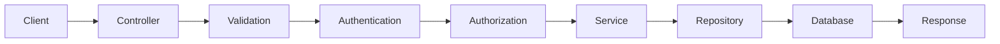
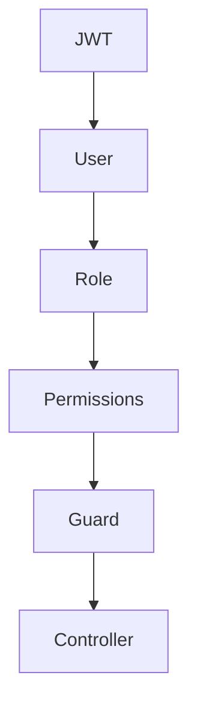

# 17 — Backend Architecture Specification (Part 1)

> MatchStick Events Documentation Repository

---

# Document Information

| Property | Value |
|----------|-------|
| Document Name | Backend Architecture |
| Document ID | DOC-017 |
| Version | 1.0.0 |
| Part | 1 of 12 |
| Status | Approved |
| Depends On | README.md, 15-admin-dashboard.md, 16-database-design.md |

---

# Purpose

This document defines the backend architecture for the MatchStick Events platform.

It specifies how the server-side application should be structured, how business logic should be organized, how different modules communicate, and how requests flow through the system.

The backend serves as the operational engine that powers both the public website and the administrative dashboard while enforcing business rules, security, scalability, and maintainability. 0

---

# Scope

This specification covers the backend architecture supporting:

- Authentication
- Authorization
- CRM
- Dream Planner
- Consultation Booking
- Contact Enquiries
- Project Management
- Website CMS
- Media Library
- Calendar
- Analytics
- Notifications
- Background Jobs
- System Configuration
- Administrative Dashboard

The backend is responsible for processing every business operation across the MatchStick Events platform. 1

---

# Business Goals

The backend should:

- Centralize business logic.
- Enforce business rules consistently.
- Protect sensitive business data.
- Support future expansion.
- Provide reliable APIs.
- Remain highly maintainable.
- Scale as the business grows.

The backend should function as the operational backbone of the entire application.

---

# Backend Philosophy

The backend should never simply move data between the frontend and database.

Instead, it should represent the business itself.

Every operation should pass through clearly defined services responsible for validation, authorization, business workflows, and data persistence.

Business rules should exist once and only once.

---

# Architecture Principles

## Separation of Concerns

Each module should own its own business logic.

Examples

- CRM
- Projects
- CMS
- Media
- Calendar
- Analytics

Modules should communicate through well-defined interfaces rather than direct implementation dependencies.

---

## Layered Architecture

Business logic should remain independent of

- HTTP
- Database
- Storage
- External services

This allows infrastructure changes without affecting core application logic.

---

## Modular Design

Each feature should exist as an independent backend module.

Example

```text
CRM Module

Projects Module

CMS Module

Media Module

Calendar Module

Analytics Module
```

Modules should be reusable, independently testable, and easy to extend.

---

## API-First Development

Every business capability should be exposed through well-defined APIs.

The frontend should never communicate directly with the database.

All communication should pass through the backend.

---

## Security by Default

Every request should be treated as untrusted.

The backend should

- Authenticate users.
- Authorize access.
- Validate inputs.
- Log important actions.
- Reject invalid requests.

Security should be integrated throughout the architecture rather than added later.

---

## Scalability

The backend should support

- Increasing users
- Larger databases
- More administrators
- Higher traffic
- Future mobile applications
- Future client portals

Scaling should require infrastructure changes rather than application redesign.

---

# Recommended Technology Stack

| Layer | Recommended Technology |
|--------|------------------------|
| Runtime | Node.js (LTS) |
| Framework | NestJS |
| Language | TypeScript |
| ORM | Prisma |
| Database | PostgreSQL |
| Authentication | JWT |
| Object Storage | Supabase Storage |
| Queue | BullMQ |
| Cache | Redis |
| API Style | REST |
| Validation | Zod / class-validator |
| Documentation | OpenAPI (Swagger) |

Equivalent technologies providing similar capabilities may also satisfy these requirements.

---

# Why NestJS?

NestJS is recommended because it provides

- Modular architecture
- Dependency Injection
- Strong TypeScript support
- Built-in testing
- Guards
- Middleware
- Validation
- Interceptors
- Enterprise scalability

These characteristics align with the maintainability and scalability goals of this project.

---

# High-Level System Architecture

```mermaid
flowchart TD

CLIENT

↓

FRONTEND

↓

REST API

↓

BACKEND

↓

DATABASE

↓

OBJECT STORAGE
```

Every request should pass through the backend before reaching persistent storage.

---

# Backend Responsibilities

The backend shall be responsible for

- Authentication
- Authorization
- Business Logic
- Validation
- File Uploads
- Notifications
- Database Operations
- Scheduling
- Analytics
- Logging
- Security
- API Responses

The frontend should remain focused on presentation and user interaction.

---

# Layered Architecture

```mermaid
flowchart TD

Presentation Layer

↓

API Layer

↓

Application Layer

↓

Domain Layer

↓

Data Access Layer

↓

Database
```

Each layer has a clearly defined responsibility.

---

# Backend Layers

## Presentation Layer

Responsibilities

- HTTP Endpoints
- Request Parsing
- Response Formatting

Business logic should not exist here.

---

## API Layer

Responsibilities

- Controllers
- Authentication
- Authorization
- Validation
- Serialization

This layer exposes backend functionality to clients.

---

## Application Layer

Responsibilities

- Business Workflows
- Service Coordination
- Transaction Management

This layer orchestrates application behavior.

---

## Domain Layer

Responsibilities

- Core Business Logic
- Business Rules
- Domain Models
- Policies

The Domain Layer represents the heart of the application.

---

## Data Access Layer

Responsibilities

- ORM
- Database Queries
- Persistence
- Transactions

Only this layer communicates directly with the database.

---

# Request Lifecycle



Every request should follow a predictable lifecycle.

---

# Module Overview

The backend consists of the following primary modules.

| Module | Responsibility |
|----------|----------------|
| Authentication | Identity & Access Management |
| CRM | Client Management |
| Projects | Event Execution |
| CMS | Website Content |
| Media | Digital Assets |
| Calendar | Scheduling |
| Analytics | Business Intelligence |
| Notifications | Communication |
| Operations | System Services |
| Configuration | Business Settings |

Each module owns its business logic and data interactions.

---

# Suggested Folder Structure

```text
src/

├── auth/

├── crm/

├── projects/

├── cms/

├── media/

├── calendar/

├── analytics/

├── notifications/

├── operations/

├── config/

├── common/

├── database/

├── infrastructure/

├── shared/

└── main.ts
```

This structure promotes modularity and maintainability.

---

# Dependency Rules

Modules should depend only on stable abstractions.

Recommended dependency direction

```text
Controller

↓

Service

↓

Repository

↓

Database
```

Controllers should never access repositories directly.

Business logic should never exist inside controllers.

---

# Configuration Management

Application configuration should be externalized.

Examples

- Environment Variables
- Database Credentials
- JWT Secrets
- Storage Keys
- Email Configuration
- Queue Settings

Configuration should never be hardcoded.

---

# Error Handling Philosophy

Errors should be

- Consistent
- Predictable
- Logged
- Meaningful

Internal implementation details should never be exposed to clients.

---

# Logging Philosophy

The backend should log

- Authentication Events
- API Errors
- Business Events
- Background Jobs
- Security Events
- System Health

Logging should support debugging, monitoring, and auditing.

---

# Future Expansion

The architecture should support future additions including

- Mobile Applications
- Client Portal
- Vendor Portal
- AI Planning Assistant
- Online Payments
- Multi-Branch Operations
- Third-Party Integrations

New features should integrate as modules without requiring architectural redesign.

---

# Functional Requirements

| ID | Requirement |
|----|-------------|
| BA-001 | Implement a modular backend architecture. |
| BA-002 | Separate business logic from infrastructure concerns. |
| BA-003 | Support REST-based communication. |
| BA-004 | Enforce layered architecture. |
| BA-005 | Support scalable module-based development. |
| BA-006 | Centralize business workflows. |
| BA-007 | Externalize configuration management. |

---

# Non-Functional Requirements

The backend shall be:

- Secure.
- Scalable.
- Maintainable.
- Testable.
- Modular.
- Reliable.
- Extensible.
- Highly Available.

---

# Developer Notes

Developers should:

- Organize the backend around business domains rather than technical utilities to improve long-term maintainability.
- Keep controllers lightweight by delegating validation, business workflows, and persistence to dedicated services and repositories.
- Treat every module as an independent unit with clearly defined interfaces and minimal coupling to other modules.
- Design infrastructure components—such as storage, queues, caching, and databases—to be replaceable without affecting domain logic.
- Use this document together with the Database Design Specification as the architectural foundation for implementing the backend services that power the MatchStick Events platform. 2

---

# End of Part 1

Part 2 defines the complete **Authentication & Authorization Architecture**, including JWT authentication, refresh token strategy, session management, RBAC, permission resolution, guards, middleware, login flows, password management, and identity services that secure the entire MatchStick Events platform.

# 17 — Backend Architecture Specification (Part 2)

> MatchStick Events Documentation Repository

---

# Document Information

| Property | Value |
|----------|-------|
| Document Name | Backend Architecture |
| Document ID | DOC-017 |
| Version | 1.0.0 |
| Part | 2 of 12 |
| Status | Approved |
| Depends On | 15-admin-dashboard.md (Users & Settings), 16-database-design.md (Identity Domain) |

---

# Authentication & Authorization Architecture

## Purpose

The Authentication & Authorization module secures access to the MatchStick Events platform.

It is responsible for:

- Identity verification
- Access control
- Session management
- Role-Based Access Control (RBAC)
- Permission enforcement
- Password management
- Account security
- Authentication auditing

Every protected backend operation begins within this module.

---

# Authentication Philosophy

Authentication answers one question:

> **"Who is making this request?"**

Authorization answers another:

> **"What is this user allowed to do?"**

These responsibilities should remain completely independent.

Authentication should establish identity.

Authorization should determine permissions.

---

# Identity Architecture

```mermaid
flowchart TD

LOGIN

-->

AUTH SERVICE

-->

JWT SERVICE

-->

USER SESSION

-->

PROTECTED APIs
```

Every authenticated request should pass through this architecture.

---

# Authentication Components

The module consists of:

```text
Authentication Service

Authorization Service

JWT Service

Session Service

Password Service

Email Verification Service

Password Reset Service

Permission Resolver

Guards

Middleware
```

Each component should own a single responsibility.

---

# Authentication Flow

```mermaid
flowchart LR

Login Request

-->

Credential Validation

-->

User Lookup

-->

Password Verification

-->

Account Status Check

-->

Generate JWT

-->

Generate Refresh Token

-->

Create Session

-->

Return Tokens
```

Authentication succeeds only when every step completes successfully.

---

# Login Workflow

## Step 1

Receive

```text
Email

Password
```

---

## Step 2

Validate

- Required fields
- Email format
- Password length

Invalid requests should terminate immediately.

---

## Step 3

Retrieve user

```text
users
```

from the database.

---

## Step 4

Verify password.

Passwords should never be decrypted.

Instead, compare the submitted password against the stored password hash.

---

## Step 5

Verify account status.

Allowed status

```text
Active
```

Rejected examples

- Pending
- Suspended
- Archived

---

## Step 6

Generate

- Access Token
- Refresh Token

---

## Step 7

Store authenticated session.

---

## Step 8

Return authentication response.

---

# JWT Strategy

Authentication should use

```text
JSON Web Tokens (JWT)
```

Two-token architecture

```text
Access Token

+

Refresh Token
```

---

# Access Token

Purpose

- Authenticate API requests

Characteristics

- Short lifetime
- Stateless
- Signed
- Contains minimal claims

Example claims

```text
User ID

Role

Permissions

Session ID
```

Sensitive information should never be embedded inside JWT payloads.

---

# Refresh Token

Purpose

Generate new access tokens without requiring another login.

Characteristics

- Long lifetime
- Stored securely
- Revocable
- Rotated after use

Refresh tokens should always be stored as cryptographic hashes within the database.

---

# Token Lifecycle

```mermaid
flowchart LR

Login

-->

Access Token

-->

Expires

-->

Refresh Token

-->

New Access Token
```

Expired refresh tokens require the user to authenticate again.

---

# Session Management

Every successful login creates a session.

A session stores

- User
- Device
- Browser
- IP Address
- Login Time
- Last Activity
- Expiration Time

Sessions allow administrators to monitor and revoke access.

---

# Multiple Sessions

Users may authenticate from multiple devices simultaneously.

Examples

- Laptop
- Mobile
- Tablet

Each device should receive its own independent session.

---

# Session Revocation

Sessions may be revoked when

- User logs out.
- Administrator revokes access.
- Password changes.
- Security incident detected.
- Refresh token expires.

Revoked sessions should immediately lose access.

---

# Logout Flow

```mermaid
flowchart LR

Logout

-->

Invalidate Refresh Token

-->

Revoke Session

-->

Return Success
```

Logout should invalidate only the current session unless explicitly requested to log out from all devices.

---

# Authorization Architecture

Authorization determines whether an authenticated user may perform an operation.

The backend should enforce authorization before executing any business logic.

---

# RBAC (Role-Based Access Control)

The platform shall implement Role-Based Access Control.

Relationship

```text
User

↓

Role

↓

Permissions

↓

Backend Module
```

Permissions should be assigned to roles rather than directly to users.

---

# Example Roles

- Administrator
- Manager
- Event Planner
- Content Manager
- Staff

Additional custom roles should be supported.

---

# Permission Examples

```text
crm.view

crm.create

crm.update

crm.delete

projects.manage

cms.publish

media.upload

calendar.schedule

analytics.export
```

Permissions should remain granular.

---

# Permission Resolution

Authorization flow



Access is granted only when the required permission exists.

---

# Guards

Guards protect backend endpoints.

Examples

```text
JWT Guard

Role Guard

Permission Guard
```

Guards execute before controller methods.

Unauthorized requests should never reach business logic.

---

# Middleware

Authentication middleware may perform

- Request logging
- Correlation ID generation
- Security headers
- Request context creation

Business logic should never exist within middleware.

---

# Password Management

Passwords should

- Never be stored in plain text.
- Never be reversible.
- Always be hashed.

Recommended algorithms

- Argon2id
- bcrypt

The backend should never implement custom cryptographic algorithms.

---

# Password Policy

Minimum requirements

- Minimum length
- Uppercase letter
- Lowercase letter
- Number
- Special character

Password policies should remain configurable.

---

# Email Verification

Account activation should require email verification.

Workflow

```mermaid
flowchart LR

Register

-->

Verification Email

-->

Verification Token

-->

Activate Account
```

Verification tokens should be

- Random
- Single-use
- Time-limited
- Stored as hashes

---

# Password Reset

Workflow

```mermaid
flowchart LR

Forgot Password

-->

Email Token

-->

Verify Token

-->

Choose Password

-->

Login
```

Reset tokens should

- Expire automatically.
- Be single-use.
- Be securely hashed.

---

# Rate Limiting

Authentication endpoints should implement rate limiting.

Examples

- Login
- Password Reset
- Email Verification
- Token Refresh

Repeated failed attempts should trigger temporary restrictions.

---

# Account Lockout

Accounts may be temporarily locked after excessive failed login attempts.

Example policy

```text
5 Failed Attempts

↓

Temporary Lock

↓

Automatic Unlock
```

Lockout duration should remain configurable.

---

# Authentication Audit

The backend should record

- Successful Logins
- Failed Logins
- Password Changes
- Password Resets
- Email Verification
- Logout Events
- Session Revocation

Authentication history supports auditing and security investigations.

---

# Authentication Events

Examples

```text
User Logged In

Password Changed

Refresh Token Revoked

Session Expired

Account Locked

Password Reset Requested
```

Events should integrate with the Operations module.

---

# Error Handling

Authentication errors should never reveal internal details.

Examples

Avoid

```text
Email Exists

Wrong Password
```

Prefer

```text
Invalid Credentials
```

Responses should minimize information disclosure.

---

# Authentication Dependencies

The Authentication module depends on

- Identity Database
- Email Service
- Notification Service
- Configuration Service
- Audit Service

Authentication should remain independent of business modules such as CRM or Projects.

---

# Functional Requirements

| ID | Requirement |
|----|-------------|
| BA-008 | Authenticate users using JWT. |
| BA-009 | Support refresh token rotation. |
| BA-010 | Maintain secure user sessions. |
| BA-011 | Implement Role-Based Access Control (RBAC). |
| BA-012 | Protect endpoints using guards and middleware. |
| BA-013 | Support password reset and email verification. |
| BA-014 | Record authentication audit events. |
| BA-015 | Support configurable password and lockout policies. |

---

# Non-Functional Requirements

The Authentication module shall be:

- Secure.
- Reliable.
- Scalable.
- Highly Available.
- Auditable.
- Maintainable.
- Extensible.

---

# Developer Notes

Developers should:

- Separate authentication, authorization, session management, and password management into independent services with clearly defined responsibilities.
- Implement short-lived access tokens and rotating refresh tokens to reduce the impact of token compromise.
- Enforce authorization through reusable guards and permission checks rather than embedding access-control logic within controllers or services.
- Store all passwords and authentication tokens using strong one-way cryptographic hashing algorithms and never persist sensitive secrets in plain text.
- Treat authentication events as security-critical operations by logging them consistently and integrating them with the platform's audit and monitoring infrastructure.

---

# End of Part 2

Part 3 defines the complete **CRM Backend Architecture**, including client services, Dream Planner processing, consultation workflows, contact enquiry handling, duplicate detection, client merge logic, communication history, follow-up automation, and the business workflows that power customer relationship management across the MatchStick Events platform.

# 17 — Backend Architecture Specification (Part 3)

> MatchStick Events Documentation Repository

---

# Document Information

| Property | Value |
|----------|-------|
| Document Name | Backend Architecture |
| Document ID | DOC-017 |
| Version | 1.0.0 |
| Part | 3 of 12 |
| Status | Approved |
| Depends On | 12-dream-planner.md, 13-booking-consultation.md, 14-contact-page.md, 16-database-design.md (CRM Domain) |

---

# CRM Backend Architecture

## Purpose

The CRM module manages the complete customer journey for MatchStick Events.

It is responsible for receiving, validating, organizing, and maintaining every client interaction—from the first enquiry through consultation, project creation, and long-term relationship management.

The CRM backend serves as the operational gateway into the business.

---

# CRM Philosophy

Every customer should have a single unified identity.

Regardless of how a person contacts the company:

- Dream Planner
- Consultation Booking
- Contact Form
- Phone Call
- WhatsApp
- Instagram
- Referral

the backend should attempt to associate the interaction with an existing client before creating a new one.

The CRM should always maintain one canonical client record.

---

# CRM Module Overview

```mermaid
flowchart TD

DreamPlanner

-->

CRM

Consultation

-->

CRM

ContactForm

-->

CRM

ManualEntry

-->

CRM

CRM

-->

Client Service

Client Service

-->

Database

Client Service

-->

Notifications

Client Service

-->

Projects
```

The CRM acts as the central business module connecting customer-facing features with internal operations.

---

# CRM Components

The module consists of

```text
Client Service

Dream Planner Service

Consultation Service

Contact Service

Communication Service

Follow-up Service

Duplicate Detection Service

Client Merge Service

CRM Validation Service

CRM Event Publisher
```

Each service should own a single business responsibility.

---

# Layered Architecture

```mermaid
flowchart LR

Controller

-->

Validation

-->

CRM Service

-->

Repository

-->

Database
```

Business rules should reside exclusively within the service layer.

---

# Client Service

The Client Service is the primary entry point into the CRM.

Responsibilities

- Create clients
- Retrieve clients
- Update clients
- Archive clients
- Search clients
- Merge duplicate records
- Assign staff members

Other CRM services should interact with clients exclusively through the Client Service.

---

# Client Creation Workflow

```mermaid
flowchart LR

Receive Request

-->

Validate

-->

Duplicate Detection

-->

Create Client

-->

Create Communication Entry

-->

Notify Staff

-->

Return Response
```

The workflow should execute as a single database transaction.

---

# Duplicate Detection Service

Before creating a new client, the backend should search for existing records.

Comparison criteria

- Email Address
- Phone Number
- Similar Name

Possible duplicates should be flagged for administrative review rather than automatically merged.

---

# Client Merge Service

Administrators may merge duplicate records.

Merge process

```mermaid
flowchart LR

Select Clients

-->

Validate

-->

Transfer Child Records

-->

Archive Duplicate

-->

Audit Log

-->

Complete
```

Transferred entities include

- Dream Planners
- Consultations
- Contact Enquiries
- Communication History
- Follow-ups
- Notes
- Attachments
- Projects

Merge operations should be atomic.

---

# Dream Planner Service

Responsible for processing Dream Planner submissions.

Responsibilities

- Validate submissions
- Associate client
- Store planner
- Trigger notifications
- Record communication history

Every Dream Planner should become part of the client's permanent history.

---

# Dream Planner Workflow

```mermaid
flowchart TD

Submit Planner

-->

Validate

-->

Find Client

-->

Create Client if Needed

-->

Save Planner

-->

Create Timeline Entry

-->

Notify Team
```

No planner submission should be discarded after successful validation.

---

# Consultation Service

Responsible for consultation bookings.

Responsibilities

- Validate availability
- Schedule consultation
- Create calendar event
- Notify assigned planner
- Update CRM timeline

The Consultation Service integrates directly with the Calendar module.

---

# Consultation Workflow

```mermaid
flowchart LR

Receive Booking

-->

Validate

-->

Availability Check

-->

Create Consultation

-->

Create Calendar Event

-->

Send Notifications

-->

Success
```

Scheduling conflicts should prevent booking confirmation.

---

# Contact Service

Responsible for processing Contact Page enquiries.

Responsibilities

- Validate submission
- Associate client
- Create enquiry
- Record communication
- Notify staff

Contact submissions should become searchable CRM records.

---

# Contact Workflow

```mermaid
flowchart LR

Submit Contact Form

-->

Validate

-->

Client Lookup

-->

Create Enquiry

-->

Communication History

-->

Notification
```

The workflow should remain consistent with other CRM entry points.

---

# Communication Service

Maintains the complete customer interaction timeline.

Supported communication types

- Dream Planner
- Consultation
- Contact Form
- Phone Call
- WhatsApp
- Email
- Internal Meeting

Communication history should be append-only.

---

# Communication Timeline

```mermaid
flowchart TD

Client

-->

Dream Planner

-->

Consultation

-->

Project

-->

Completed Event

-->

Returning Client
```

The timeline provides a complete customer history.

---

# Follow-up Service

Responsible for scheduling future actions.

Responsibilities

- Create reminders
- Assign staff
- Notify users
- Mark completion
- Escalate overdue follow-ups

Follow-ups integrate with the Calendar module.

---

# Follow-up Workflow

```mermaid
flowchart LR

Create Follow-up

-->

Assign User

-->

Calendar Reminder

-->

Notification

-->

Completion
```

Completed follow-ups remain part of the client's history.

---

# Client Assignment

Every client may be assigned to a staff member.

Assignment rules

- Manual assignment
- Administrative reassignment
- Future automatic assignment

Changing ownership should generate an audit event.

---

# CRM Validation

Validation should occur before persistence.

Examples

Client

- Name required
- Valid email
- Valid phone

Consultation

- Valid date
- Available slot

Dream Planner

- Required event information

Validation failures should prevent database writes.

---

# CRM Business Rules

Examples

- Every Dream Planner belongs to one client.
- Every consultation belongs to one client.
- Every follow-up has an assignee.
- Every communication references a client.
- Clients cannot own duplicate active projects for the same event unless explicitly allowed.

Business rules should remain centralized inside CRM services.

---

# CRM Events

Business events published by the CRM module

Examples

```text
ClientCreated

DreamPlannerSubmitted

ConsultationBooked

FollowUpCreated

ClientMerged

ClientAssigned
```

Events allow other modules to react without creating tight coupling.

---

# Module Integrations

The CRM module integrates with

- Calendar
- Notifications
- Analytics
- Projects
- Operations
- Authentication

CRM should never communicate directly with the frontend.

All interaction occurs through controllers and APIs.

---

# Error Handling

Examples

Validation Error

```text
Invalid Consultation Date
```

Conflict Error

```text
Duplicate Client Detected
```

Business Rule Error

```text
Selected Time Slot Unavailable
```

Errors should remain consistent across the platform.

---

# Transactions

The following operations should execute atomically

- Client Creation
- Client Merge
- Dream Planner Submission
- Consultation Booking
- Follow-up Creation

Partial CRM operations should never be committed.

---

# Performance Considerations

Frequently accessed CRM operations should support

- Pagination
- Filtering
- Full-text search
- Indexed lookups
- Cached dashboard statistics

Heavy reporting should be delegated to the Analytics module.

---

# Functional Requirements

| ID | Requirement |
|----|-------------|
| BA-016 | Maintain a canonical client service. |
| BA-017 | Process Dream Planner submissions. |
| BA-018 | Manage consultation workflows. |
| BA-019 | Process contact enquiries. |
| BA-020 | Maintain communication history. |
| BA-021 | Support follow-up management. |
| BA-022 | Detect duplicate clients. |
| BA-023 | Support atomic client merge operations. |

---

# Non-Functional Requirements

The CRM backend shall be:

- Reliable.
- Secure.
- Scalable.
- Maintainable.
- Auditable.
- Extensible.
- Optimized for high-volume customer interactions.

---

# Developer Notes

Developers should:

- Treat the `Client Service` as the single authoritative entry point for all customer-related operations across the platform.
- Keep business workflows—such as duplicate detection, client merging, consultation scheduling, and follow-up management—inside dedicated services rather than controllers.
- Publish domain events for significant CRM actions so other modules can react without introducing direct dependencies.
- Execute complex CRM workflows within database transactions to ensure consistency across multiple related entities.
- Design the CRM module so future integrations, including AI assistants, WhatsApp Business APIs, marketing automation, and client portals, can connect through existing service interfaces without architectural changes.

---

# End of Part 3

Part 4 defines the complete **Project Management Backend Architecture**, including project lifecycle management, milestone orchestration, task workflows, vendor coordination, budget processing, timeline generation, document management, progress calculation, and the business services responsible for executing every MatchStick Events project from planning to completion.

# 17 — Backend Architecture Specification (Part 4)

> MatchStick Events Documentation Repository

---

# Document Information

| Property | Value |
|----------|-------|
| Document Name | Backend Architecture |
| Document ID | DOC-017 |
| Version | 1.0.0 |
| Part | 4 of 12 |
| Status | Approved |
| Depends On | 15-admin-dashboard.md (Project Management), 16-database-design.md (Project Domain) |

---

# Project Management Backend Architecture

## Purpose

The Project Management module manages the complete operational lifecycle of every event executed by MatchStick Events.

Once a client engagement has been confirmed, this module becomes the operational center responsible for planning, execution, coordination, progress tracking, budgeting, documentation, and successful event delivery.

Every event should be represented as a structured backend workflow rather than a collection of unrelated records.

---

# Project Philosophy

A project represents the complete execution of an event.

Everything required to deliver that event should revolve around the Project.

Examples

- Client
- Milestones
- Tasks
- Vendors
- Budget
- Documents
- Calendar
- Timeline
- Team Members

The backend should coordinate these components while ensuring data consistency and business correctness.

---

# Module Overview

```mermaid
flowchart TD

CRM

-->

Project Service

Project Service

-->

Milestone Service

Project Service

-->

Task Service

Project Service

-->

Vendor Service

Project Service

-->

Budget Service

Project Service

-->

Timeline Service

Project Service

-->

Calendar

Project Service

-->

Notifications

Project Service

-->

Analytics
```

The Project module orchestrates event execution while collaborating with supporting modules.

---

# Project Components

The module consists of

```text
Project Service

Milestone Service

Task Service

Project Member Service

Vendor Service

Budget Service

Timeline Service

Project File Service

Progress Engine

Project Validation Service

Project Event Publisher
```

Each component should remain independently testable.

---

# Layered Architecture

```mermaid
flowchart LR

Controller

-->

Validation

-->

Project Service

-->

Repository

-->

Database
```

Business rules should reside exclusively inside services.

---

# Project Service

The Project Service is the central coordinator.

Responsibilities

- Create projects
- Retrieve projects
- Update projects
- Archive projects
- Assign lead planners
- Coordinate project workflows

Every project-related operation should begin here.

---

# Project Creation Workflow

```mermaid
flowchart LR

Approved Consultation

-->

Create Project

-->

Generate Milestones

-->

Generate Default Tasks

-->

Assign Team

-->

Create Timeline

-->

Calendar Integration

-->

Notifications

-->

Success
```

Project creation should execute within a single transaction.

---

# Milestone Service

Responsible for project phases.

Responsibilities

- Create milestones
- Update milestone status
- Validate milestone completion
- Track milestone progress
- Trigger downstream workflows

Milestones divide large projects into manageable stages.

---

# Milestone Workflow

```mermaid
flowchart LR

Create

-->

Assign Tasks

-->

Monitor Progress

-->

Complete

-->

Update Project
```

Milestone completion should trigger automatic project progress recalculation.

---

# Task Service

Responsible for detailed work management.

Responsibilities

- Create tasks
- Assign users
- Update status
- Record completion
- Validate dependencies
- Notify assignees

Tasks represent the smallest operational unit within a project.

---

# Task Workflow

```mermaid
flowchart LR

Create Task

-->

Assign User

-->

Work Begins

-->

Complete Task

-->

Update Milestone

-->

Update Project
```

Task completion should automatically update related milestones.

---

# Dependency Engine

Tasks may depend on other tasks.

Example

```text
Venue Confirmed

↓

Decoration Planning

↓

Lighting Installation

↓

Final Inspection
```

The backend should prevent completion of dependent tasks until prerequisite tasks have been completed.

---

# Progress Engine

Project progress should never be manually entered.

Instead

```mermaid
flowchart LR

Completed Tasks

-->

Completed Milestones

-->

Progress Calculation

-->

Project Status
```

The Progress Engine should calculate progress automatically.

---

# Project Members Service

Responsible for staffing.

Responsibilities

- Assign users
- Remove users
- Change roles
- Track assignments

Example project roles

- Lead Planner
- Coordinator
- Designer
- Operations
- Photographer
- Vendor Manager

Changes should generate audit events.

---

# Vendor Service

Responsible for vendor coordination.

Responsibilities

- Register vendors
- Update information
- Associate vendors with projects
- Track payment status
- Store vendor notes

Future vendor portals should integrate through this service.

---

# Vendor Workflow

```mermaid
flowchart LR

Add Vendor

-->

Assign Category

-->

Associate Project

-->

Track Payments

-->

Complete Services
```

Vendor information should remain reusable across future projects.

---

# Budget Service

Responsible for project financial tracking.

Responsibilities

- Record estimated costs
- Record actual costs
- Calculate remaining budget
- Monitor budget utilization

The backend should calculate derived values automatically.

---

# Budget Workflow

```mermaid
flowchart LR

Estimate Budget

-->

Record Expenses

-->

Calculate Remaining

-->

Budget Reports
```

Budget calculations should remain centralized.

---

# Timeline Service

Maintains the complete project history.

Timeline entries include

- Project Created
- Task Assigned
- Milestone Completed
- Vendor Added
- Budget Updated
- Event Completed

Timeline entries should remain immutable.

---

# Project File Service

Responsible for project documentation.

Supported files

- Contracts
- Venue Layouts
- Mood Boards
- Vendor Quotations
- Images
- Planning Documents

Actual files remain managed by the Media module.

---

# Calendar Integration

The Project module integrates directly with Calendar.

Examples

- Event Date
- Planning Meetings
- Vendor Visits
- Site Inspections
- Deadlines

Calendar events should be created automatically whenever appropriate.

---

# Notification Integration

Project events should trigger notifications.

Examples

- New Task Assignment
- Milestone Due
- Budget Warning
- Upcoming Event
- Project Completion

Notifications should be handled asynchronously.

---

# Analytics Integration

The module should publish analytics events.

Examples

```text
ProjectCreated

MilestoneCompleted

TaskCompleted

VendorAssigned

ProjectCompleted
```

Analytics should aggregate operational data rather than query transactional workflows directly.

---

# Project Validation

Validation examples

Project

- Valid client
- Future event date
- Assigned lead planner

Task

- Valid assignee
- Valid due date

Vendor

- Required contact information

Budget

- Non-negative values

Validation failures should terminate processing before persistence.

---

# Business Rules

Examples

- Every project belongs to one client.
- Every milestone belongs to one project.
- Every task belongs to one milestone.
- Every project has one lead planner.
- Progress is system-calculated.
- Timeline entries cannot be modified.
- Archived projects are read-only except for authorized administrative actions.

Business rules should remain centralized within services.

---

# Transactions

The following workflows should execute atomically

- Project Creation
- Team Assignment
- Milestone Generation
- Vendor Assignment
- Budget Updates
- Project Completion

Partial project workflows should never be committed.

---

# Project Completion Workflow

```mermaid
flowchart LR

Verify Milestones

-->

Verify Tasks

-->

Finalize Timeline

-->

Generate Analytics

-->

Archive Project

-->

Notify Client Team
```

Projects should not transition to **Completed** until all mandatory conditions are satisfied.

---

# Error Handling

Examples

Validation Error

```text
Invalid Event Date
```

Conflict Error

```text
Task Dependency Not Satisfied
```

Business Rule Error

```text
Project Already Archived
```

Error responses should remain consistent across the backend.

---

# Performance Considerations

The Project module should support

- Pagination
- Advanced filtering
- Full-text search
- Cached dashboard summaries
- Optimized project timelines

Heavy reporting should be delegated to the Analytics module.

---

# Functional Requirements

| ID | Requirement |
|----|-------------|
| BA-024 | Manage complete project lifecycles. |
| BA-025 | Coordinate milestone and task workflows. |
| BA-026 | Support automatic progress calculation. |
| BA-027 | Manage project teams and vendor coordination. |
| BA-028 | Maintain project budgets and timelines. |
| BA-029 | Integrate with Calendar and Notifications. |
| BA-030 | Publish project analytics events. |
| BA-031 | Execute project workflows atomically. |

---

# Non-Functional Requirements

The Project Management module shall be:

- Reliable.
- Secure.
- Scalable.
- Maintainable.
- Auditable.
- Extensible.
- Optimized for operational workloads.

---

# Developer Notes

Developers should:

- Treat the `Project Service` as the orchestration layer responsible for coordinating all project-related business workflows.
- Keep milestones, tasks, vendors, budgets, timelines, and project files within dedicated services to maintain separation of concerns.
- Calculate project progress automatically from milestone and task completion rather than allowing manual percentage updates.
- Publish domain events for significant project lifecycle changes so Calendar, Notifications, Analytics, and future modules remain loosely coupled.
- Design the module to support future capabilities—including procurement, inventory management, client portals, mobile applications, AI planning assistants, and financial systems—without requiring architectural redesign.

---

# End of Part 4

Part 5 defines the complete **CMS Backend Architecture**, including page management, section rendering, draft workflows, publishing pipelines, version control, SEO management, slug routing, preview generation, rollback operations, and the business services responsible for powering the public MatchStick Events website.

# 17 — Backend Architecture Specification (Part 5)

> MatchStick Events Documentation Repository

---

# Document Information

| Property | Value |
|----------|-------|
| Document Name | Backend Architecture |
| Document ID | DOC-017 |
| Version | 1.0.0 |
| Part | 5 of 12 |
| Status | Approved |
| Depends On | 07-homepage.md, 08-about-page.md, 09-services-page.md, 10-gallery-page.md, 11-previous-events-page.md, 12-dream-planner.md, 13-booking-consultation.md, 14-contact-page.md, 16-database-design.md (CMS Domain) |

---

# CMS Backend Architecture

## Purpose

The CMS (Content Management System) module powers the entire public-facing MatchStick Events website.

It enables administrators to create, edit, preview, publish, version, organize, and retire website content without modifying application code.

The backend should treat website content as structured business data rather than hardcoded frontend components.

---

# CMS Philosophy

Content should be:

- Structured
- Reusable
- Versioned
- Searchable
- Previewable
- Publishable
- Recoverable

The backend should manage website content independently from the frontend implementation.

---

# CMS Module Overview

```mermaid
flowchart TD

Administrator

-->

CMS Controller

-->

CMS Service

CMS Service

-->

Page Service

CMS Service

-->

Section Service

CMS Service

-->

Version Service

CMS Service

-->

SEO Service

CMS Service

-->

Media Service

CMS Service

-->

Database

CMS Service

-->

Frontend APIs
```

The CMS module provides all content required by the website.

---

# CMS Components

The module consists of

```text
CMS Service

Page Service

Section Service

Publishing Service

Version Service

SEO Service

Slug Service

Preview Service

Rollback Service

CMS Validation Service

CMS Event Publisher
```

Each service owns a clearly defined responsibility.

---

# Layered Architecture

```mermaid
flowchart LR

Controller

-->

Validation

-->

CMS Service

-->

Repository

-->

Database
```

Business rules belong exclusively within the service layer.

---

# Page Service

The Page Service manages every page on the website.

Responsibilities

- Create pages
- Update pages
- Delete pages
- Publish pages
- Archive pages
- Restore pages
- Retrieve pages

Every page should have a unique identity.

---

# Supported Pages

Examples

- Homepage
- About
- Services
- Gallery
- Previous Events
- Dream Planner
- Booking Consultation
- Contact

The architecture should allow unlimited future pages.

---

# Page Workflow

```mermaid
flowchart LR

Create Page

-->

Save Draft

-->

Preview

-->

Publish

-->

Live Website
```

Every page begins as a draft before publication.

---

# Section Service

Each page consists of multiple reusable sections.

Examples

Homepage

```text
Hero

Services

Gallery Preview

Testimonials

CTA

Footer
```

Sections should be independently editable.

---

# Section Workflow

```mermaid
flowchart LR

Create Section

-->

Assign Page

-->

Edit Content

-->

Preview

-->

Publish
```

Reusable sections should reduce duplicated content.

---

# Draft Workflow

Content editing should never immediately affect the live website.

Workflow

```mermaid
flowchart LR

Edit Draft

-->

Save

-->

Preview

-->

Approve

-->

Publish
```

Drafts remain isolated until publication.

---

# Publishing Service

Responsible for making content publicly available.

Responsibilities

- Validate content
- Publish page
- Publish sections
- Update version
- Trigger cache refresh
- Notify dependent systems

Publishing should execute atomically.

---

# Publishing Workflow

```mermaid
flowchart LR

Draft

-->

Validation

-->

Create Version

-->

Publish

-->

Invalidate Cache

-->

Live Website
```

Visitors should never observe partially published pages.

---

# Version Service

Every published revision should create a permanent version.

Version history stores

- Title
- Content
- Sections
- SEO Metadata
- Publish Date
- Publisher

Historical versions should remain immutable.

---

# Version Workflow

```mermaid
flowchart LR

Save Draft

-->

Create Version

-->

Publish

-->

Archive Version
```

Each publication creates a recoverable snapshot.

---

# Rollback Service

Administrators may restore previous versions.

Workflow

```mermaid
flowchart LR

Choose Version

-->

Validate

-->

Restore

-->

Publish

-->

Log Event
```

Rollback should create a new version rather than modifying historical records.

---

# Preview Service

The backend should generate preview content.

Preview pages should

- Require authentication
- Not be indexed
- Use draft content
- Not affect production data

Preview URLs should expire automatically.

---

# Slug Service

Responsible for public URLs.

Examples

```text
/

about

services

gallery

previous-events

dream-planner

booking-consultation

contact
```

Slugs should remain unique.

---

# Slug Workflow

```mermaid
flowchart LR

Create Slug

-->

Validate

-->

Check Uniqueness

-->

Save
```

Conflicting slugs should be rejected.

---

# SEO Service

Responsible for search engine metadata.

Supported fields

- Title
- Description
- Keywords
- Canonical URL
- Open Graph
- Twitter Cards
- Robots
- Structured Data

SEO data belongs to pages rather than frontend code.

---

# Media Integration

The CMS integrates directly with the Media module.

Supported content

- Images
- Videos
- Documents
- Icons
- Logos

Only media references should be stored.

Files remain managed by the Media module.

---

# Navigation Management

The backend should provide navigation configuration.

Examples

```text
Main Navigation

Footer Navigation

Quick Links

Social Links
```

Navigation should be editable without code changes.

---

# Homepage Management

Only one homepage may exist.

Business rules

- Exactly one homepage
- Published homepage required
- Homepage cannot be deleted
- Homepage may be updated
- Homepage versions remain recoverable

---

# Content Validation

Validation examples

Page

- Title required
- Slug required
- Status valid

Section

- Valid page
- Valid type

SEO

- Title length
- Description length

Validation failures prevent publication.

---

# Business Rules

Examples

- Every section belongs to one page.
- Every page has one active published version.
- Slugs must remain unique.
- Published content cannot be partially updated.
- Rollbacks create new versions.
- Archived pages cannot be publicly accessible.

Business rules should remain centralized.

---

# CMS Events

Examples

```text
PageCreated

PageUpdated

PagePublished

PageArchived

VersionCreated

PageRolledBack

NavigationUpdated
```

Events enable cache invalidation, analytics, and audit logging.

---

# Module Integrations

The CMS integrates with

- Media
- Analytics
- Operations
- Authentication
- Notifications

The frontend retrieves website content exclusively through backend APIs.

---

# Transactions

The following workflows should execute atomically

- Publish Page
- Rollback Version
- Create Version
- Delete Section
- Update Navigation

Visitors should never experience inconsistent website content.

---

# Error Handling

Examples

Validation Error

```text
Page Title Required
```

Conflict Error

```text
Slug Already Exists
```

Business Rule Error

```text
Homepage Cannot Be Deleted
```

Errors should follow consistent backend standards.

---

# Performance Considerations

The CMS backend should support

- Content caching
- Optimized page retrieval
- Lazy loading
- Search indexing
- Efficient media references

Published pages should require minimal database queries.

---

# Functional Requirements

| ID | Requirement |
|----|-------------|
| BA-032 | Manage website pages. |
| BA-033 | Support reusable page sections. |
| BA-034 | Implement draft and publishing workflows. |
| BA-035 | Maintain complete version history. |
| BA-036 | Support rollback operations. |
| BA-037 | Manage SEO metadata and slugs. |
| BA-038 | Integrate with the Media module. |
| BA-039 | Publish CMS events for dependent modules. |

---

# Non-Functional Requirements

The CMS backend shall be:

- Secure.
- Reliable.
- Scalable.
- Maintainable.
- Extensible.
- Auditable.
- Optimized for high-performance content delivery.

---

# Developer Notes

Developers should:

- Treat pages, sections, navigation, SEO metadata, and versions as independent domain entities managed through dedicated services.
- Ensure all publishing operations are transactional so visitors only ever receive fully published content.
- Keep version history immutable, with rollback operations creating new versions instead of altering historical records.
- Store only references to media assets within the CMS while delegating file storage and processing to the Media module.
- Design the CMS to support future additions—including blogs, news articles, landing pages, multilingual content, personalization, and headless content delivery—without requiring architectural changes.

---

# End of Part 5

Part 6 defines the complete **Media Backend Architecture**, including file uploads, storage abstraction, image optimization, video handling, metadata extraction, thumbnail generation, duplicate detection, version management, CDN integration, security validation, and the business services responsible for managing all digital assets across the MatchStick Events platform.

# 17 — Backend Architecture Specification (Part 6)

> MatchStick Events Documentation Repository

---

# Document Information

| Property | Value |
|----------|-------|
| Document Name | Backend Architecture |
| Document ID | DOC-017 |
| Version | 1.0.0 |
| Part | 6 of 12 |
| Status | Approved |
| Depends On | 10-gallery-page.md, 16-database-design.md (Media Domain), 17-backend-architecture.md (Part 5) |

---

# Media Backend Architecture

## Purpose

The Media module manages every digital asset used throughout the MatchStick Events platform.

It is responsible for uploading, validating, processing, optimizing, storing, organizing, securing, and delivering all media assets while maintaining complete metadata and version history.

The backend should treat media as a first-class business resource rather than simple files.

---

# Media Philosophy

Every media asset should have

- A unique identity
- Complete metadata
- Version history
- Usage tracking
- Secure storage
- Optimized delivery

Applications should reference media assets through their identifiers instead of directly accessing storage providers.

---

# Module Overview

```mermaid
flowchart TD

Administrator

-->

Media Controller

-->

Media Service

Media Service

-->

Upload Service

Media Service

-->

Optimization Service

Media Service

-->

Thumbnail Service

Media Service

-->

Metadata Service

Media Service

-->

Storage Service

Media Service

-->

CDN

Media Service

-->

Database
```

The Media module acts as the centralized asset management system for the entire platform.

---

# Media Components

The module consists of

```text
Media Service

Upload Service

Storage Service

Optimization Service

Thumbnail Service

Metadata Service

Duplicate Detection Service

Version Service

Media Validation Service

Media Event Publisher
```

Each component should have one clearly defined responsibility.

---

# Layered Architecture

```mermaid
flowchart LR

Controller

-->

Validation

-->

Media Service

-->

Storage Adapter

-->

Database

Storage Adapter

-->

Object Storage
```

Business logic should remain independent of storage technology.

---

# Upload Service

The Upload Service manages incoming files.

Responsibilities

- Receive uploads
- Validate files
- Generate identifiers
- Store metadata
- Trigger optimization
- Return asset information

Uploads should never bypass backend validation.

---

# Upload Workflow

```mermaid
flowchart LR

Upload Request

-->

Validate

-->

Virus Scan

-->

Store Original

-->

Extract Metadata

-->

Generate Thumbnails

-->

Optimize

-->

Save Database

-->

Return Asset
```

The original file should always remain preserved.

---

# Supported Media Types

Examples

Images

- JPEG
- PNG
- WebP
- SVG

Videos

- MP4
- MOV

Documents

- PDF

Additional formats may be introduced through configuration.

---

# File Validation

Validation should include

- File type
- File size
- MIME type
- Extension
- Integrity
- Upload limits

Invalid files should be rejected before storage.

---

# Storage Service

The Storage Service abstracts physical storage providers.

Responsibilities

- Store assets
- Retrieve assets
- Delete assets
- Generate URLs
- Manage folders

Changing storage providers should not affect business logic.

---

# Storage Architecture

```mermaid
flowchart LR

Media Service

-->

Storage Interface

-->

Supabase Storage

Future

-->

S3

Future

-->

Azure Blob

Future

-->

Google Cloud Storage
```

Storage implementations should be interchangeable.

---

# Metadata Service

Responsible for extracting media information.

Examples

Images

- Width
- Height
- Format
- File Size

Videos

- Duration
- Resolution
- Codec

Documents

- Page Count
- File Size

Metadata should be automatically generated whenever possible.

---

# Optimization Service

Responsible for improving delivery performance.

Operations include

- Compression
- Format conversion
- Responsive image generation
- Quality optimization

Optimization should never overwrite the original file.

---

# Thumbnail Service

Automatically generates preview images.

Examples

```text
Small

Medium

Large
```

Thumbnail dimensions should remain configurable.

---

# Image Workflow

```mermaid
flowchart LR

Original

-->

Optimization

-->

Thumbnail Generation

-->

Responsive Versions

-->

CDN
```

Optimized images should improve website performance.

---

# Duplicate Detection

Before storing a file, the backend should compare

- File Hash
- File Size
- Metadata

Potential duplicates should reuse existing assets whenever appropriate.

Duplicate detection should be configurable.

---

# Version Service

Media assets may have multiple versions.

Example

```text
Original

↓

Edited

↓

Retouched

↓

Published
```

Historical versions should remain accessible.

---

# Usage Tracking

Every asset should maintain references to its usage.

Examples

- Homepage
- Gallery
- Previous Events
- Services
- CMS Sections
- Projects

Unused assets may be safely identified for cleanup.

---

# Access Control

Media access should respect authentication and authorization rules.

Examples

Public

- Website Images

Private

- Contracts
- Internal Documents
- Client Files

Access policies should be enforced by the backend.

---

# CDN Integration

The backend should support Content Delivery Networks.

Responsibilities

- Asset caching
- Geographic delivery
- Cache invalidation
- Fast downloads

The application should interact with the CDN through the Storage Service.

---

# Media Deletion

Deletion workflow

```mermaid
flowchart LR

Delete Request

-->

Usage Check

-->

Archive

-->

Remove References

-->

Delete Storage

-->

Audit Log
```

Referenced assets should not be permanently deleted without validation.

---

# Media Validation

Validation examples

Image

- Supported format
- Maximum dimensions
- Maximum file size

Video

- Supported codec
- Maximum duration

Document

- Allowed extension

Validation failures prevent storage.

---

# Business Rules

Examples

- Every asset has a unique identifier.
- Original files remain immutable.
- Optimized files are generated automatically.
- Every asset maintains metadata.
- Every asset records usage history.
- Private assets require authorization.
- Asset versions remain recoverable.

Business rules should remain centralized inside the Media services.

---

# Media Events

Examples

```text
MediaUploaded

MediaOptimized

ThumbnailGenerated

MediaDeleted

MediaVersionCreated

MediaArchived
```

Events enable Analytics, Operations, and Notifications to react independently.

---

# Module Integrations

The Media module integrates with

- CMS
- CRM
- Projects
- Analytics
- Operations
- Authentication

Other modules should reference media assets rather than storing files directly.

---

# Transactions

The following workflows should execute atomically

- Upload Asset
- Replace Asset
- Delete Asset
- Generate Versions
- Archive Asset

Partial media operations should never be committed.

---

# Error Handling

Examples

Validation Error

```text
Unsupported File Format
```

Conflict Error

```text
Duplicate Asset Detected
```

Business Rule Error

```text
Asset Currently In Use
```

Errors should follow platform-wide response standards.

---

# Performance Considerations

The Media module should support

- CDN delivery
- Lazy loading
- Responsive images
- Streaming large videos
- Efficient metadata queries
- Cached asset URLs

Large files should be processed asynchronously where appropriate.

---

# Functional Requirements

| ID | Requirement |
|----|-------------|
| BA-040 | Support secure media uploads. |
| BA-041 | Validate all uploaded files. |
| BA-042 | Generate metadata automatically. |
| BA-043 | Create optimized assets and thumbnails. |
| BA-044 | Track asset usage across the platform. |
| BA-045 | Support asset versioning and recovery. |
| BA-046 | Integrate with object storage and CDN services. |
| BA-047 | Publish media lifecycle events. |

---

# Non-Functional Requirements

The Media module shall be:

- Secure.
- Reliable.
- Scalable.
- High-performing.
- Maintainable.
- Extensible.
- Optimized for large media libraries.

---

# Developer Notes

Developers should:

- Treat the Media module as the single source of truth for all digital assets used throughout the platform.
- Keep storage providers abstracted behind interfaces so services such as Supabase Storage, Amazon S3, Azure Blob Storage, or Google Cloud Storage can be substituted without affecting business logic.
- Preserve original files while generating optimized versions, thumbnails, and responsive assets through asynchronous background processing.
- Store only media references in other modules and avoid duplicating physical files across CMS, CRM, and Project domains.
- Design the Media module to support future capabilities such as AI-powered image tagging, facial recognition, automatic categorization, video transcoding, watermarking, digital rights management, and advanced CDN optimization without requiring architectural redesign.

---

# End of Part 6

Part 7 defines the complete **Calendar Backend Architecture**, including event scheduling, availability management, recurring events, reminder processing, notification workflows, conflict detection, resource allocation, calendar synchronization, and the backend services responsible for coordinating time-based operations across the MatchStick Events platform.

# 17 — Backend Architecture Specification (Part 7)

> MatchStick Events Documentation Repository

---

# Document Information

| Property | Value |
|----------|-------|
| Document Name | Backend Architecture |
| Document ID | DOC-017 |
| Version | 1.0.0 |
| Part | 7 of 12 |
| Status | Approved |
| Depends On | 13-booking-consultation.md, 15-admin-dashboard.md (Calendar), 16-database-design.md (Calendar Domain) |

---

# Calendar Backend Architecture

## Purpose

The Calendar module coordinates every time-based activity within the MatchStick Events platform.

It manages scheduling, availability, reminders, recurring events, resource allocation, conflict detection, and notifications to ensure all business operations occur at the correct time.

The Calendar backend acts as the centralized scheduling engine for the organization.

---

# Calendar Philosophy

Every scheduled activity should exist as a structured event.

Examples include

- Consultation Bookings
- Client Meetings
- Site Visits
- Vendor Meetings
- Internal Meetings
- Project Deadlines
- Milestone Due Dates
- Event Days
- Staff Leave
- Company Holidays

The Calendar should provide a single, reliable source of scheduling information.

---

# Module Overview

```mermaid
flowchart TD

CRM

-->

Calendar Service

Projects

-->

Calendar Service

Calendar Service

-->

Availability Service

Calendar Service

-->

Reminder Service

Calendar Service

-->

Conflict Detection Service

Calendar Service

-->

Notification Service

Calendar Service

-->

Database

Calendar Service

-->

Analytics
```

The Calendar module coordinates scheduling across multiple business domains.

---

# Calendar Components

The module consists of

```text
Calendar Service

Event Service

Availability Service

Reminder Service

Conflict Detection Service

Recurrence Service

Resource Allocation Service

Calendar Validation Service

Calendar Event Publisher
```

Each service should focus on one business responsibility.

---

# Layered Architecture

```mermaid
flowchart LR

Controller

-->

Validation

-->

Calendar Service

-->

Repository

-->

Database
```

Business rules should remain inside the service layer.

---

# Calendar Service

The Calendar Service coordinates all scheduling operations.

Responsibilities

- Create events
- Update events
- Delete events
- Reschedule events
- Retrieve schedules
- Manage availability
- Publish calendar events

Every scheduling operation should begin here.

---

# Event Service

Responsible for event lifecycle management.

Supported event types

- Consultation
- Project Meeting
- Internal Meeting
- Site Visit
- Vendor Meeting
- Deadline
- Reminder
- Company Event
- Holiday

Additional event types should be configurable.

---

# Event Creation Workflow

```mermaid
flowchart LR

Receive Request

-->

Validate

-->

Availability Check

-->

Conflict Detection

-->

Create Event

-->

Schedule Reminders

-->

Notify Participants

-->

Success
```

The workflow should execute atomically.

---

# Availability Service

Responsible for determining whether users or resources are available.

Availability considers

- Existing events
- Working hours
- Leave requests
- Holidays
- Resource reservations

Unavailable time slots should not be offered for booking.

---

# Availability Workflow

```mermaid
flowchart LR

Select Time

-->

Load Schedule

-->

Check Availability

-->

Available

-->

Allow Booking
```

Availability calculations should be performed before event creation.

---

# Conflict Detection Service

The backend should prevent scheduling conflicts.

Examples

- Double-booked consultations
- Overlapping meetings
- Multiple event assignments
- Venue conflicts
- Staff conflicts

Conflicts should block scheduling until resolved.

---

# Conflict Detection Workflow

```mermaid
flowchart LR

New Event

-->

Load Existing Events

-->

Compare Time Range

-->

Conflict?

-->

Reject or Continue
```

Conflict detection should occur before database persistence.

---

# Reminder Service

Responsible for automated reminders.

Supported reminders

- Consultation Reminder
- Meeting Reminder
- Event Reminder
- Deadline Reminder
- Follow-up Reminder

Reminder timing should remain configurable.

---

# Reminder Workflow

```mermaid
flowchart LR

Create Event

-->

Generate Reminder

-->

Queue Reminder

-->

Send Notification
```

Reminder processing should execute asynchronously.

---

# Recurrence Service

Responsible for recurring schedules.

Supported recurrence

- Daily
- Weekly
- Monthly
- Yearly
- Custom

Exceptions should be supported.

---

# Recurrence Workflow

```mermaid
flowchart LR

Create Recurring Event

-->

Generate Schedule

-->

Store Pattern

-->

Future Events
```

Recurring events should be generated according to defined recurrence rules.

---

# Resource Allocation Service

Responsible for scheduling shared resources.

Examples

- Meeting Rooms
- Vehicles
- Equipment
- Photography Teams
- Decoration Teams

Resources should not be double-booked.

---

# Resource Workflow

```mermaid
flowchart LR

Select Resource

-->

Availability Check

-->

Reserve Resource

-->

Associate Event
```

Resource reservations should be released if event creation fails.

---

# Calendar Synchronization

The backend architecture should support future synchronization with external calendar providers.

Potential integrations

- Google Calendar
- Microsoft Outlook
- Apple Calendar

Synchronization should remain optional and configurable.

---

# Notification Integration

The Calendar module integrates directly with the Notification module.

Examples

- Upcoming Consultation
- Upcoming Deadline
- Meeting Invitation
- Schedule Update
- Event Cancellation

Notification delivery should occur through background jobs.

---

# CRM Integration

Calendar integrates with CRM by scheduling

- Consultations
- Follow-ups
- Client Meetings

Calendar events should automatically appear within the client's activity timeline.

---

# Project Integration

Project-related events include

- Planning Meetings
- Vendor Visits
- Site Inspections
- Task Deadlines
- Milestone Dates
- Final Event Day

Projects should automatically create calendar events where required.

---

# Validation

Validation examples

Event

- Valid title
- Start before end
- Future date where applicable

Reminder

- Valid trigger time

Recurrence

- Supported recurrence pattern

Validation failures should prevent persistence.

---

# Business Rules

Examples

- Events require a valid owner.
- End time must occur after start time.
- Resources cannot be double-booked.
- Conflicting schedules should be rejected.
- Completed events remain immutable except for administrative corrections.
- Cancelled events remain in history.

Business rules should remain centralized.

---

# Calendar Events

Examples

```text
EventCreated

EventUpdated

EventCancelled

ReminderScheduled

ReminderSent

RecurringEventCreated

ResourceReserved
```

These events enable Analytics, Notifications, and Operations to react independently.

---

# Transactions

The following workflows should execute atomically

- Create Event
- Reschedule Event
- Cancel Event
- Reserve Resource
- Create Recurring Event

Partial scheduling operations should never be committed.

---

# Error Handling

Examples

Validation Error

```text
End Time Must Be After Start Time
```

Conflict Error

```text
Selected Time Slot Already Reserved
```

Business Rule Error

```text
Assigned Resource Unavailable
```

Errors should remain consistent across all backend modules.

---

# Performance Considerations

The Calendar module should support

- Indexed date queries
- Efficient availability searches
- Cached schedules
- Asynchronous reminder processing
- Optimized recurring event generation

Calendar views should load efficiently even with large datasets.

---

# Functional Requirements

| ID | Requirement |
|----|-------------|
| BA-048 | Manage complete calendar event lifecycles. |
| BA-049 | Support availability and conflict detection. |
| BA-050 | Schedule reminders and notifications. |
| BA-051 | Support recurring events and exceptions. |
| BA-052 | Manage shared resource reservations. |
| BA-053 | Integrate with CRM and Project modules. |
| BA-054 | Support future external calendar synchronization. |
| BA-055 | Publish calendar lifecycle events. |

---

# Non-Functional Requirements

The Calendar module shall be:

- Reliable.
- Secure.
- Scalable.
- Highly Available.
- Maintainable.
- Extensible.
- Optimized for high-volume scheduling operations.

---

# Developer Notes

Developers should:

- Treat the Calendar module as the authoritative scheduling engine for every time-based activity across the platform.
- Keep event management, reminders, recurrence, conflict detection, and resource allocation within dedicated services to preserve modularity.
- Execute scheduling workflows transactionally to prevent inconsistent bookings and orphaned reservations.
- Perform reminder delivery and notification processing asynchronously using background job queues to minimize request latency.
- Design the Calendar module to support future capabilities such as client self-booking, team scheduling, AI-assisted planning, automatic schedule optimization, external calendar synchronization, and multi-location event management without requiring architectural redesign.

---

# End of Part 7

Part 8 defines the complete **Analytics Backend Architecture**, including event tracking, KPI aggregation, dashboard generation, reporting services, scheduled reports, business intelligence pipelines, export workflows, data aggregation strategies, and the backend services responsible for transforming operational data into actionable insights across the MatchStick Events platform.

# 17 — Backend Architecture Specification (Part 8)

> MatchStick Events Documentation Repository

---

# Document Information

| Property | Value |
|----------|-------|
| Document Name | Backend Architecture |
| Document ID | DOC-017 |
| Version | 1.0.0 |
| Part | 8 of 12 |
| Status | Approved |
| Depends On | 15-admin-dashboard.md (Analytics), 16-database-design.md (Analytics Domain), CRM, Projects, Calendar, CMS Modules |

---

# Analytics Backend Architecture

## Purpose

The Analytics module transforms operational data into meaningful business intelligence.

It collects, processes, aggregates, and presents information that enables administrators to monitor company performance, evaluate operations, identify trends, and make informed business decisions.

The Analytics backend should serve as the organization's central decision-support system.

---

# Analytics Philosophy

Operational modules generate data.

The Analytics module transforms that data into insights.

Rather than querying operational databases repeatedly, analytics should rely on structured events, aggregated datasets, and optimized reporting pipelines.

Analytics should never interfere with day-to-day business operations.

---

# Module Overview

```mermaid
flowchart TD

CRM

-->

Analytics Service

Projects

-->

Analytics Service

CMS

-->

Analytics Service

Calendar

-->

Analytics Service

Media

-->

Analytics Service

Analytics Service

-->

Aggregation Engine

Aggregation Engine

-->

Dashboard Service

Aggregation Engine

-->

Reporting Service

Aggregation Engine

-->

Export Service

Aggregation Engine

-->

Database
```

The Analytics module consumes business events from every major backend module.

---

# Analytics Components

The module consists of

```text
Analytics Service

Event Tracking Service

Aggregation Service

Dashboard Service

Reporting Service

Export Service

Snapshot Service

KPI Service

Analytics Validation Service

Analytics Event Publisher
```

Each component should have a clearly defined responsibility.

---

# Layered Architecture

```mermaid
flowchart LR

Controller

-->

Validation

-->

Analytics Service

-->

Aggregation Engine

-->

Analytics Database
```

Analytics processing should remain isolated from operational workflows.

---

# Event Tracking Service

The Event Tracking Service receives business events from other modules.

Examples

- Client Created
- Dream Planner Submitted
- Consultation Booked
- Project Created
- Project Completed
- Media Uploaded
- CMS Page Published

Events should be immutable once recorded.

---

# Event Processing Workflow

```mermaid
flowchart LR

Business Event

-->

Analytics Queue

-->

Aggregation

-->

Snapshot Update

-->

Dashboard Refresh
```

Analytics processing should occur asynchronously.

---

# Aggregation Service

Responsible for transforming raw events into summarized business metrics.

Examples

- Monthly consultations
- New clients
- Completed projects
- Website enquiries
- Revenue trends
- Staff productivity

Aggregated data should be optimized for fast dashboard loading.

---

# KPI Service

Responsible for calculating Key Performance Indicators.

Examples

- Total Clients
- Active Projects
- Monthly Bookings
- Conversion Rate
- Consultation Success Rate
- Average Project Duration
- Client Retention Rate
- Revenue Growth
- Website Traffic
- Staff Workload

KPIs should be calculated automatically.

---

# KPI Workflow

```mermaid
flowchart LR

Business Events

-->

Aggregation

-->

KPI Calculation

-->

Dashboard
```

KPI calculations should execute according to configurable schedules.

---

# Dashboard Service

Responsible for providing administrative dashboards.

Dashboard sections may include

- Business Overview
- CRM Metrics
- Project Status
- Revenue Overview
- Staff Activity
- Calendar Summary
- Website Performance
- Media Statistics

Dashboard responses should prioritize speed over transactional detail.

---

# Dashboard Workflow

```mermaid
flowchart LR

Dashboard Request

-->

Retrieve Snapshot

-->

Prepare Widgets

-->

Return Response
```

Dashboards should retrieve pre-aggregated data whenever possible.

---

# Reporting Service

Responsible for generating business reports.

Examples

- Daily Reports
- Weekly Reports
- Monthly Reports
- Quarterly Reports
- Annual Reports
- Custom Reports

Reports should remain reproducible.

---

# Reporting Workflow

```mermaid
flowchart LR

Select Report

-->

Collect Aggregated Data

-->

Generate Report

-->

Store Snapshot

-->

Return Report
```

Large reports should execute as background jobs.

---

# Snapshot Service

Snapshots preserve historical business metrics.

Examples

- Daily KPI Snapshot
- Monthly Revenue Snapshot
- Quarterly Business Summary
- Annual Performance Snapshot

Historical snapshots should remain immutable.

---

# Export Service

Responsible for exporting analytics.

Supported formats

- PDF
- CSV
- Excel

Additional formats should be configurable.

Exports should not affect dashboard performance.

---

# Scheduled Reports

Reports may be generated automatically.

Examples

- Daily Operations Report
- Weekly Business Summary
- Monthly KPI Report
- Annual Performance Report

Scheduled reports should execute through background workers.

---

# Data Sources

Analytics consumes information from

- CRM
- Projects
- Calendar
- CMS
- Media
- Authentication
- Operations

Operational modules should publish events rather than exposing internal database structures.

---

# Data Retention

Analytics data should support

- Daily aggregation
- Monthly aggregation
- Annual aggregation
- Historical archives

Retention policies should remain configurable.

---

# Validation

Validation examples

Report

- Valid date range
- Existing report type

Dashboard

- Valid filters
- Authorized user

Export

- Supported format

Validation failures should terminate processing.

---

# Business Rules

Examples

- Analytics never modifies operational data.
- Snapshots remain immutable.
- KPIs are system-generated.
- Historical reports remain reproducible.
- Dashboard statistics use aggregated data.
- Heavy calculations execute asynchronously.

Business rules should remain centralized.

---

# Analytics Events

Examples

```text
DashboardViewed

ReportGenerated

SnapshotCreated

ExportCompleted

KPICalculated

AggregationCompleted
```

Events support auditing, monitoring, and system optimization.

---

# Module Integrations

The Analytics module integrates with

- CRM
- Projects
- Calendar
- CMS
- Media
- Authentication
- Operations

Analytics should consume events instead of directly coupling to operational logic.

---

# Transactions

The following workflows should execute atomically

- KPI Calculation
- Snapshot Creation
- Report Generation
- Export Preparation
- Dashboard Cache Refresh

Analytics consistency should be preserved throughout processing.

---

# Error Handling

Examples

Validation Error

```text
Invalid Report Date Range
```

Conflict Error

```text
Snapshot Already Exists
```

Business Rule Error

```text
Requested KPI Not Available
```

Error responses should follow platform-wide standards.

---

# Performance Considerations

The Analytics module should support

- Cached dashboard responses
- Incremental aggregations
- Background processing
- Indexed reporting queries
- Efficient historical lookups
- Parallel report generation

Long-running analytical workloads should never delay user-facing requests.

---

# Functional Requirements

| ID | Requirement |
|----|-------------|
| BA-056 | Collect business events from all backend modules. |
| BA-057 | Aggregate operational data into KPIs. |
| BA-058 | Generate dashboards using pre-aggregated datasets. |
| BA-059 | Support scheduled and on-demand reports. |
| BA-060 | Maintain immutable historical snapshots. |
| BA-061 | Support report exports in multiple formats. |
| BA-062 | Process analytics asynchronously. |
| BA-063 | Publish analytics lifecycle events. |

---

# Non-Functional Requirements

The Analytics module shall be:

- Reliable.
- Scalable.
- High-performing.
- Maintainable.
- Extensible.
- Auditable.
- Optimized for business intelligence workloads.

---

# Developer Notes

Developers should:

- Treat Analytics as a read-oriented module that consumes business events without modifying operational data.
- Use asynchronous event processing and aggregation pipelines to minimize impact on transactional modules.
- Serve dashboards from cached or pre-computed datasets rather than executing expensive database queries on every request.
- Keep KPI calculations deterministic so historical reports remain accurate and reproducible.
- Design the Analytics module to support future capabilities including predictive analytics, AI-powered forecasting, customer behavior analysis, marketing attribution, financial forecasting, anomaly detection, and executive dashboards without requiring architectural redesign.

---

# End of Part 8

Part 9 defines the complete **Infrastructure Services Backend Architecture**, including email delivery, notification services, background job processing, caching, search services, logging, configuration management, feature flags, health monitoring, and the shared infrastructure components that support every backend module across the MatchStick Events platform.

# 17 — Backend Architecture Specification (Part 9)

> MatchStick Events Documentation Repository

---

# Document Information

| Property | Value |
|----------|-------|
| Document Name | Backend Architecture |
| Document ID | DOC-017 |
| Version | 1.0.0 |
| Part | 9 of 12 |
| Status | Approved |
| Depends On | 16-database-design.md (Operations Domain), All Backend Modules |

---

# Infrastructure Services Backend Architecture

## Purpose

The Infrastructure Services module provides the shared backend capabilities required by every business module.

Unlike CRM, Projects, CMS, or Calendar, Infrastructure Services do not implement business features directly. Instead, they provide reusable services that support the entire platform.

These services ensure that the backend remains reliable, scalable, maintainable, and operationally efficient.

---

# Infrastructure Philosophy

Infrastructure should remain invisible to business logic.

Business modules should focus only on business operations.

Infrastructure Services should provide standardized mechanisms for

- Email delivery
- Notifications
- Background processing
- Caching
- Search
- Logging
- Configuration
- Monitoring
- Feature management

Every infrastructure capability should be reusable across the platform.

---

# Module Overview

```mermaid
flowchart TD

CRM

-->

Infrastructure

Projects

-->

Infrastructure

CMS

-->

Infrastructure

Calendar

-->

Infrastructure

Analytics

-->

Infrastructure

Infrastructure

-->

Email Service

Infrastructure

-->

Notification Service

Infrastructure

-->

Queue Service

Infrastructure

-->

Cache Service

Infrastructure

-->

Search Service

Infrastructure

-->

Logging Service

Infrastructure

-->

Configuration Service

Infrastructure

-->

Feature Flag Service

Infrastructure

-->

Health Monitoring
```

Infrastructure Services support every backend module without containing business-specific logic.

---

# Infrastructure Components

The module consists of

```text
Email Service

Notification Service

Queue Service

Cache Service

Search Service

Logging Service

Configuration Service

Feature Flag Service

Health Monitoring Service

Infrastructure Event Publisher
```

Each service should have a clearly defined responsibility.

---

# Layered Architecture

```mermaid
flowchart LR

Business Module

-->

Infrastructure Interface

-->

Infrastructure Service

-->

External Provider
```

Business modules should depend on abstractions rather than specific providers.

---

# Email Service

The Email Service manages all outgoing emails.

Responsibilities

- Email delivery
- Template rendering
- Retry failed deliveries
- Queue processing
- Delivery logging

Supported email types

- Consultation Confirmation
- Dream Planner Confirmation
- Contact Acknowledgement
- Password Reset
- Email Verification
- Internal Notifications

The Email Service should be reusable by every module.

---

# Email Workflow

```mermaid
flowchart LR

Business Event

-->

Email Queue

-->

Render Template

-->

Send Email

-->

Log Delivery
```

Email delivery should always occur asynchronously.

---

# Notification Service

Responsible for internal system notifications.

Examples

- New Consultation
- Task Assignment
- Upcoming Deadline
- Budget Warning
- Project Completed
- Media Uploaded

Future notification channels may include

- Push Notifications
- SMS
- WhatsApp
- Microsoft Teams
- Slack

The architecture should support additional delivery channels without modifying business modules.

---

# Notification Workflow

```mermaid
flowchart LR

Business Event

-->

Notification Queue

-->

Determine Channel

-->

Deliver Notification

-->

Record Status
```

Notification delivery should remain independent of request processing.

---

# Queue Service

The Queue Service manages asynchronous background jobs.

Examples

- Email Sending
- Image Processing
- Report Generation
- Reminder Processing
- Analytics Aggregation
- Thumbnail Generation
- Cache Refresh

Queues prevent long-running operations from blocking user requests.

---

# Queue Workflow

```mermaid
flowchart LR

Business Request

-->

Create Job

-->

Queue

-->

Worker

-->

Complete

-->

Update Status
```

Jobs should support retries and failure handling.

---

# Cache Service

Responsible for temporary high-speed data storage.

Examples

- Dashboard Statistics
- CMS Pages
- Navigation
- Frequently Accessed Projects
- Session Data
- API Responses

Caching should improve performance without affecting correctness.

---

# Cache Workflow

```mermaid
flowchart LR

Request

-->

Cache

-->

Hit

-->

Return

Cache

-->

Miss

-->

Database

-->

Update Cache
```

Cache expiration policies should remain configurable.

---

# Search Service

Provides platform-wide search capabilities.

Supported searches

- Clients
- Projects
- Media
- CMS Pages
- Calendar Events
- Vendors

Search indexes should remain synchronized with operational data.

---

# Search Workflow

```mermaid
flowchart LR

Data Updated

-->

Update Index

-->

Search Query

-->

Return Results
```

Search indexing should execute asynchronously.

---

# Logging Service

Responsible for centralized application logging.

Log categories

- API Requests
- Authentication
- Errors
- Background Jobs
- Business Events
- Performance Metrics
- Infrastructure Events

Logs should support debugging and auditing.

---

# Logging Workflow

```mermaid
flowchart LR

Application Event

-->

Logger

-->

Log Store

-->

Monitoring
```

Logging should never interrupt application workflows.

---

# Configuration Service

Responsible for application configuration.

Examples

- Environment Variables
- JWT Configuration
- Database Settings
- Storage Configuration
- Email Settings
- Queue Settings
- Cache Settings

Configuration should remain external to application code.

---

# Feature Flag Service

Feature flags enable controlled feature deployment.

Examples

- Enable AI Assistant
- Enable Vendor Portal
- Enable Client Portal
- Enable Online Payments
- Enable Experimental Dashboard

Feature flags should be evaluated during runtime.

---

# Feature Flag Workflow

```mermaid
flowchart LR

Request

-->

Check Feature Flag

-->

Enabled?

-->

Execute Feature
```

Disabled features should remain inaccessible.

---

# Health Monitoring Service

Responsible for monitoring backend health.

Checks include

- Database Connectivity
- Cache Availability
- Queue Status
- Storage Availability
- Email Provider
- API Availability

Health information supports operational monitoring.

---

# Health Monitoring Workflow

```mermaid
flowchart LR

Health Check

-->

Infrastructure Services

-->

Status Report

-->

Monitoring Dashboard
```

Health checks should execute automatically.

---

# Infrastructure Events

Examples

```text
EmailSent

NotificationDelivered

JobCompleted

CacheInvalidated

SearchIndexUpdated

ConfigurationChanged

FeatureEnabled

HealthCheckCompleted
```

Infrastructure events support monitoring, analytics, and auditing.

---

# Module Integrations

Infrastructure Services integrate with

- Authentication
- CRM
- Projects
- CMS
- Media
- Calendar
- Analytics
- Operations

Every business module should use Infrastructure Services through defined interfaces.

---

# Transactions

The following workflows should execute atomically where applicable

- Configuration Updates
- Feature Flag Changes
- Cache Invalidation
- Search Index Updates

Long-running operations such as email delivery and report generation should execute asynchronously.

---

# Error Handling

Examples

Infrastructure Error

```text
Email Provider Unavailable
```

Queue Error

```text
Background Job Failed
```

Configuration Error

```text
Missing Environment Variable
```

Provider Error

```text
Storage Service Unreachable
```

Infrastructure failures should be logged and handled gracefully without exposing internal implementation details.

---

# Performance Considerations

The Infrastructure module should support

- Distributed caching
- Concurrent background workers
- High-volume email delivery
- Efficient search indexing
- Centralized logging
- Horizontal scaling

Infrastructure services should remain performant under increasing system load.

---

# Functional Requirements

| ID | Requirement |
|----|-------------|
| BA-064 | Provide centralized email delivery services. |
| BA-065 | Support internal notification delivery. |
| BA-066 | Execute background jobs asynchronously. |
| BA-067 | Provide centralized caching services. |
| BA-068 | Support platform-wide search indexing. |
| BA-069 | Centralize logging and monitoring. |
| BA-070 | Externalize configuration management. |
| BA-071 | Support runtime feature flags. |
| BA-072 | Monitor infrastructure health continuously. |

---

# Non-Functional Requirements

The Infrastructure Services module shall be:

- Reliable.
- Highly Available.
- Scalable.
- Maintainable.
- Extensible.
- Observable.
- Fault Tolerant.

---

# Developer Notes

Developers should:

- Keep infrastructure concerns completely separated from business logic by exposing reusable interfaces instead of provider-specific implementations.
- Execute long-running operations—such as email delivery, analytics processing, report generation, and media optimization—through asynchronous background workers.
- Centralize configuration, logging, monitoring, caching, and feature management so all backend modules behave consistently across environments.
- Design infrastructure services to tolerate transient failures using retries, circuit breakers where appropriate, graceful degradation, and comprehensive logging.
- Build the infrastructure layer so future integrations—including SMS gateways, WhatsApp Business APIs, AI inference services, external search engines, distributed caching systems, cloud monitoring platforms, and additional notification channels—can be introduced without requiring changes to business modules.

---

# End of Part 9

Part 10 defines the complete **Security & Reliability Backend Architecture**, including input validation, authentication enforcement, authorization strategies, rate limiting, CORS, CSRF protection, XSS mitigation, SQL injection prevention, secure file handling, secrets management, audit logging, error handling, resilience patterns, and the security mechanisms that protect every backend service across the MatchStick Events platform.

# 17 — Backend Architecture Specification (Part 10)

> MatchStick Events Documentation Repository

---

# Document Information

| Property | Value |
|----------|-------|
| Document Name | Backend Architecture |
| Document ID | DOC-017 |
| Version | 1.0.0 |
| Part | 10 of 12 |
| Status | Approved |
| Depends On | 16-database-design.md (Identity & Operations Domains), Parts 1–9 |

---

# Security & Reliability Backend Architecture

## Purpose

The Security & Reliability module establishes the standards, mechanisms, and safeguards that protect every backend service within the MatchStick Events platform.

It ensures that every request, every business operation, and every stored piece of data is processed securely, reliably, and consistently.

Security should be embedded into the architecture rather than implemented as an afterthought.

---

# Security Philosophy

Every request should be considered untrusted until verified.

The backend should

- Verify identity
- Verify permissions
- Validate inputs
- Protect sensitive data
- Prevent malicious activity
- Record security events
- Recover gracefully from failures

Security should exist at every layer of the application.

---

# Security Architecture

```mermaid
flowchart TD

Client

-->

HTTPS

-->

Rate Limiter

-->

Authentication

-->

Authorization

-->

Validation

-->

Business Logic

-->

Database
```

Every request should pass through multiple security checkpoints before reaching business logic.

---

# Security Components

The module consists of

```text
Authentication Enforcement

Authorization Engine

Validation Service

Rate Limiting Service

Security Headers

CSRF Protection

CORS Management

Input Sanitization

Secrets Management

Audit Logging

Error Handling

Health Monitoring
```

Each component contributes to platform security and operational reliability.

---

# Authentication Enforcement

Every protected endpoint should require authentication.

Authentication responsibilities

- Validate JWT
- Verify session
- Verify account status
- Load request identity

Unauthenticated requests should be rejected immediately.

---

# Authorization Enforcement

Every authenticated request should undergo authorization.

Authorization determines

- Allowed modules
- Allowed operations
- Allowed resources

Permission checks should execute before business logic.

---

# Request Validation

Every incoming request should be validated.

Validation includes

- Required fields
- Data types
- Length constraints
- Allowed values
- Business rules

Invalid requests should never reach the service layer.

---

# Input Sanitization

User input should be sanitized before processing.

Examples

- Remove dangerous HTML
- Escape special characters
- Normalize whitespace
- Validate URLs
- Validate filenames

Sanitization reduces attack surface.

---

# SQL Injection Protection

Database operations should never concatenate raw user input.

Instead

- Parameterized queries
- ORM-generated queries
- Prepared statements

Raw SQL should be minimized and carefully reviewed.

---

# Cross-Site Scripting (XSS)

The backend should

- Sanitize rich text
- Escape output where appropriate
- Validate HTML content
- Restrict dangerous markup

Stored content should never become an attack vector.

---

# Cross-Origin Resource Sharing (CORS)

CORS should explicitly define trusted origins.

Configuration examples

- Production Website
- Admin Dashboard
- Local Development

Unknown origins should be denied unless explicitly allowed.

---

# Cross-Site Request Forgery (CSRF)

Endpoints using cookies or browser sessions should support CSRF protection.

Examples

- CSRF Tokens
- SameSite Cookies
- Origin Validation

CSRF protection should remain configurable.

---

# Rate Limiting

The backend should limit excessive requests.

Protected endpoints include

- Login
- Registration
- Password Reset
- Contact Form
- Dream Planner
- Consultation Booking
- API Authentication

Limits should remain configurable.

---

# File Upload Security

Uploaded files should undergo

- MIME validation
- File extension validation
- File size validation
- Virus scanning
- Filename normalization

Executable files should never be accepted unless explicitly required.

---

# Secrets Management

Sensitive credentials include

- JWT Secrets
- Database Passwords
- API Keys
- Storage Credentials
- Email Credentials
- Encryption Keys

Secrets should

- Never be hardcoded.
- Never be committed to version control.
- Be loaded through secure configuration.

---

# Data Protection

Sensitive information should be protected.

Examples

- Password Hashes
- Refresh Tokens
- Personal Information
- Internal Notes

Only authorized users should access protected data.

---

# Audit Logging

Security-sensitive operations should always be logged.

Examples

- Login
- Logout
- Password Change
- Permission Changes
- Client Merge
- Project Archive
- CMS Publishing
- Configuration Changes

Audit records should remain immutable.

---

# Error Handling

Errors should

- Be consistent
- Avoid exposing internal details
- Include unique identifiers
- Support debugging

Internal exceptions should never be returned directly to clients.

---

# Exception Handling Workflow

```mermaid
flowchart LR

Exception

-->

Exception Filter

-->

Log Error

-->

Standard Response

-->

Client
```

Every unhandled exception should be captured centrally.

---

# Reliability Philosophy

Failures are inevitable.

The backend should recover gracefully whenever possible.

Examples

- Retry temporary failures
- Queue failed jobs
- Reconnect external services
- Continue unaffected operations

Critical failures should be isolated.

---

# Retry Strategy

Automatic retries may be applied to

- Email Delivery
- Object Storage
- Notification Delivery
- External APIs

Retries should use exponential backoff.

Infinite retries should never occur.

---

# Circuit Breaker Strategy

External dependencies may temporarily fail.

Examples

- Email Provider
- Storage Provider
- SMS Gateway
- AI Service

Repeated failures should temporarily disable requests until recovery.

---

# Graceful Degradation

If optional services become unavailable

Examples

- Analytics
- Notifications
- Search

Core business operations should continue whenever possible.

---

# Health Checks

Health monitoring should verify

- Database
- Cache
- Queue
- Storage
- Email Provider
- API Availability

Health endpoints should support automated monitoring systems.

---

# Security Events

Examples

```text
LoginFailed

PermissionDenied

RateLimitExceeded

InvalidToken

SuspiciousActivityDetected

VirusDetected

ConfigurationChanged
```

Security events should integrate with the Operations module.

---

# Incident Response

Security incidents should support

- Detection
- Logging
- Investigation
- Recovery
- Reporting

Incident history should remain permanently available.

---

# Dependency Security

External packages should

- Be regularly updated
- Be reviewed
- Receive security patches
- Minimize unnecessary dependencies

Only trusted packages should be included.

---

# Backup Reliability

Critical information should support

- Automated backups
- Backup verification
- Restore testing
- Disaster recovery

Backup integrity should be validated regularly.

---

# Business Continuity

The backend should continue operating during

- Partial infrastructure failures
- Temporary network outages
- Queue congestion
- Storage latency

Mission-critical workflows should receive priority.

---

# Transactions

Critical security workflows should execute atomically.

Examples

- Password Reset
- Session Revocation
- Client Merge
- Permission Updates
- Configuration Changes

Partial security operations should never be committed.

---

# Security Validation

Validation examples

Authentication

- Valid JWT
- Active Session

Authorization

- Required Permission

Input

- Valid Schema

Upload

- Safe File

Validation failures should immediately terminate request processing.

---

# Functional Requirements

| ID | Requirement |
|----|-------------|
| BA-073 | Enforce authentication on protected endpoints. |
| BA-074 | Validate authorization before business logic execution. |
| BA-075 | Validate and sanitize all incoming requests. |
| BA-076 | Protect against SQL injection, XSS, CSRF, and common web attacks. |
| BA-077 | Implement configurable rate limiting. |
| BA-078 | Secure file upload workflows. |
| BA-079 | Protect secrets and sensitive data. |
| BA-080 | Record immutable security audit events. |
| BA-081 | Support retry, recovery, and graceful degradation strategies. |
| BA-082 | Continuously monitor system health. |

---

# Non-Functional Requirements

The Security & Reliability module shall be:

- Secure.
- Reliable.
- Fault Tolerant.
- Highly Available.
- Maintainable.
- Auditable.
- Extensible.

---

# Developer Notes

Developers should:

- Apply security controls at every layer of the backend rather than relying on a single defensive mechanism.
- Centralize authentication, authorization, validation, exception handling, and audit logging so every module follows consistent security standards.
- Protect external integrations through retry strategies, circuit breakers, configurable timeouts, and graceful degradation to improve system resilience.
- Store secrets using secure configuration providers and ensure sensitive information is never exposed through logs, responses, source code, or version control.
- Design the security architecture to accommodate future capabilities—including multi-factor authentication (MFA), single sign-on (SSO), OAuth providers, hardware security modules (HSMs), advanced threat detection, Web Application Firewalls (WAFs), and zero-trust networking—without requiring architectural redesign.

---

# End of Part 10

Part 11 defines the complete **Performance & Scalability Backend Architecture**, including caching strategies, asynchronous processing, database optimization, horizontal scaling, load balancing, replication, performance targets, monitoring, capacity planning, cloud deployment strategies, and the architectural patterns that enable the MatchStick Events platform to scale efficiently as business demand grows.

# 17 — Backend Architecture Specification (Part 11)

> MatchStick Events Documentation Repository

---

# Document Information

| Property | Value |
|----------|-------|
| Document Name | Backend Architecture |
| Document ID | DOC-017 |
| Version | 1.0.0 |
| Part | 11 of 12 |
| Status | Approved |
| Depends On | Parts 1–10, 16-database-design.md (Performance & Scalability) |

---

# Performance & Scalability Backend Architecture

## Purpose

The Performance & Scalability architecture ensures that the MatchStick Events backend remains fast, responsive, reliable, and capable of supporting increasing business growth without requiring significant architectural changes.

The backend should be designed to efficiently serve both current operational requirements and future expansion.

---

# Performance Philosophy

Performance should be considered a core architectural requirement rather than an optimization performed after development.

The backend should

- Respond quickly
- Scale predictably
- Utilize resources efficiently
- Remain stable under load
- Minimize unnecessary computation

Performance improvements should never compromise correctness or security.

---

# Scalability Philosophy

The backend should support growth in

- Users
- Administrators
- Projects
- Clients
- Website Traffic
- API Requests
- Media Assets
- Database Size

Scaling should primarily require infrastructure expansion rather than application redesign.

---

# Performance Architecture

```mermaid
flowchart TD

Client

-->

Load Balancer

-->

Application Server

-->

Cache

-->

Database

Application Server

-->

Background Workers

Application Server

-->

Object Storage
```

The architecture separates user-facing requests from resource-intensive background processing.

---

# Scalability Components

The architecture consists of

```text
Load Balancer

Application Servers

Caching Layer

Background Workers

Queue System

Database

Read Replicas

Object Storage

Monitoring System
```

Each component contributes to overall system scalability.

---

# Horizontal Scaling

The backend should support multiple application instances.

Example

```text
Load Balancer

↓

Backend Instance A

Backend Instance B

Backend Instance C
```

Requests should be distributed automatically.

Application instances should remain stateless.

---

# Stateless Services

Application servers should not permanently store

- Sessions
- Uploaded Files
- Cached Business Data

Persistent information should be stored in shared infrastructure.

Stateless services simplify horizontal scaling.

---

# Load Balancing

Load balancing distributes incoming traffic across backend instances.

Responsibilities

- Traffic Distribution
- Health Checks
- Failover
- Session Affinity (if required)

Load balancing should improve both availability and performance.

---

# Database Optimization

Database performance should be improved through

- Proper indexing
- Optimized queries
- Pagination
- Connection pooling
- Query optimization

The backend should minimize unnecessary database operations.

---

# Read Replicas

Future deployments may introduce database read replicas.

Example

```mermaid
flowchart LR

Application

-->

Primary Database

Primary Database

-->

Read Replica 1

Primary Database

-->

Read Replica 2
```

Read-heavy operations may utilize replicas while write operations continue using the primary database.

---

# Connection Pooling

Database connections should be pooled.

Benefits

- Reduced connection overhead
- Improved throughput
- Better resource utilization

Connection pool sizes should remain configurable.

---

# Caching Strategy

Caching should reduce repeated computation.

Suitable cache candidates include

- CMS Pages
- Navigation
- Dashboard Statistics
- Frequently Accessed Projects
- API Responses
- Configuration

Cache invalidation should occur automatically whenever source data changes.

---

# Cache Workflow

```mermaid
flowchart LR

Request

-->

Cache

-->

Cache Hit

-->

Response

Cache

-->

Cache Miss

-->

Database

-->

Update Cache
```

The backend should always treat the database as the authoritative source.

---

# Asynchronous Processing

Long-running operations should execute outside the request-response cycle.

Examples

- Email Sending
- Image Optimization
- Report Generation
- Analytics Processing
- Reminder Delivery
- Search Index Updates
- Thumbnail Generation

Asynchronous processing improves user experience.

---

# Queue Architecture

```mermaid
flowchart LR

Application

-->

Job Queue

-->

Worker

-->

Completed Job
```

Workers should process jobs independently of user requests.

---

# Background Workers

Workers should execute

- Email Jobs
- Analytics Jobs
- Media Jobs
- Notification Jobs
- Report Jobs

Worker counts should remain configurable.

---

# Object Storage

Large files should remain outside the application server.

Examples

- Images
- Videos
- Documents
- Backups

Application servers should store only references to assets.

---

# API Performance

API endpoints should

- Minimize payload size
- Support pagination
- Allow filtering
- Support sorting
- Avoid unnecessary joins

Frequently requested endpoints should be optimized.

---

# Pagination Strategy

Large datasets should never be returned entirely.

Examples

- Clients
- Projects
- Gallery
- Calendar Events
- Media Library

Pagination should remain consistent across APIs.

---

# Search Optimization

Search operations should utilize

- Database indexes
- Full-text search
- Search indexes
- Cached queries

Large datasets should not require full table scans.

---

# Memory Management

The backend should

- Release unused resources
- Avoid memory leaks
- Limit cache growth
- Reuse objects where appropriate

Memory utilization should be monitored continuously.

---

# Monitoring

Performance monitoring should include

- API Response Time
- Database Latency
- Cache Hit Rate
- Queue Length
- Worker Utilization
- Memory Usage
- CPU Usage
- Storage Usage

Performance metrics should support proactive optimization.

---

# Capacity Planning

The backend should support future growth through

- Additional application servers
- Increased worker capacity
- Larger database instances
- Additional storage
- Improved networking

Infrastructure expansion should occur with minimal service interruption.

---

# High Availability

The backend should minimize downtime.

Strategies include

- Multiple application instances
- Database backups
- Redundant storage
- Automatic recovery
- Health monitoring

Single points of failure should be minimized.

---

# Disaster Recovery

Recovery planning should include

- Automated backups
- Database restoration
- Media restoration
- Configuration recovery
- Infrastructure recreation

Recovery procedures should be tested periodically.

---

# Performance Targets

Example targets

| Metric | Target |
|---------|--------|
| API Response Time | < 300 ms (typical requests) |
| Dashboard Load | < 2 seconds |
| Authentication | < 500 ms |
| CMS Page Retrieval | < 500 ms |
| Media Upload Initiation | < 1 second |
| Availability | 99.9% uptime target |

Performance targets should be reviewed as the platform evolves.

---

# Future Scalability

The architecture should support future capabilities including

- Mobile Applications
- Vendor Portal
- Client Portal
- Online Payments
- AI Services
- Real-Time Notifications
- Multi-Branch Operations
- Multi-Tenant Deployments
- International Expansion

These additions should integrate without requiring major architectural redesign.

---

# Business Rules

Examples

- Long-running tasks execute asynchronously.
- Application servers remain stateless.
- Database remains the authoritative data source.
- Cache never becomes the primary source of truth.
- Infrastructure should scale horizontally whenever possible.

Business rules should remain consistent across deployments.

---

# Performance Events

Examples

```text
CacheHit

CacheMiss

JobQueued

JobCompleted

WorkerStarted

WorkerStopped

HighLatencyDetected

ScalingEventTriggered
```

Performance events should integrate with monitoring and operations systems.

---

# Transactions

Performance optimizations should never compromise transactional consistency.

Critical business workflows should continue to execute atomically regardless of caching or asynchronous processing.

---

# Functional Requirements

| ID | Requirement |
|----|-------------|
| BA-083 | Support horizontal scaling of backend services. |
| BA-084 | Keep application instances stateless. |
| BA-085 | Utilize caching for frequently accessed data. |
| BA-086 | Execute long-running operations asynchronously. |
| BA-087 | Support database optimization and read replicas. |
| BA-088 | Implement centralized monitoring and health metrics. |
| BA-089 | Support disaster recovery and high availability. |
| BA-090 | Design for future global scalability. |

---

# Non-Functional Requirements

The Performance & Scalability architecture shall be:

- Fast.
- Reliable.
- Scalable.
- Highly Available.
- Efficient.
- Fault Tolerant.
- Extensible.

---

# Developer Notes

Developers should:

- Design every backend service to remain stateless so application instances can be added or removed without affecting user sessions or business workflows.
- Treat caching as a performance optimization rather than a replacement for the database, ensuring cache invalidation strategies maintain data consistency.
- Move expensive or time-consuming operations to asynchronous background workers to keep API response times predictable under heavy load.
- Continuously monitor application, database, queue, cache, and infrastructure metrics to identify bottlenecks before they affect end users.
- Build the architecture with future expansion in mind, allowing additional application servers, read replicas, distributed caches, AI services, real-time communication, multi-region deployments, and cloud-native infrastructure to be introduced without requiring major architectural redesign.

---

# End of Part 11

Part 12 concludes the **Backend Architecture Specification**, covering implementation standards, coding conventions, dependency management, module contracts, deployment readiness, acceptance criteria, future enhancements, architecture summary, cross-document references, developer implementation checklist, version history, and the final completion of **17-backend-architecture.md**.

# 17 — Backend Architecture Specification (Part 12)

> MatchStick Events Documentation Repository

---

# Document Information

| Property | Value |
|----------|-------|
| Document Name | Backend Architecture |
| Document ID | DOC-017 |
| Version | 1.0.0 |
| Part | 12 of 12 |
| Status | Approved |
| Depends On | Parts 1–11, README.md, 16-database-design.md |

---

# Purpose

This final section defines the implementation standards, engineering guidelines, acceptance criteria, and architectural governance for the MatchStick Events backend.

It serves as the reference for developers implementing, maintaining, extending, and reviewing the backend architecture throughout the lifecycle of the platform.

---

# Architecture Principles Summary

The backend architecture shall be built upon the following principles:

- Modular Design
- Layered Architecture
- Separation of Concerns
- Security by Default
- Scalability
- Reliability
- Maintainability
- Extensibility
- API-First Development
- Event-Driven Integration

Every future enhancement should continue to follow these principles.

---

# Backend Standards

All backend modules should follow consistent engineering standards.

Examples

- Consistent folder structure
- Consistent naming conventions
- Standard API responses
- Shared validation approach
- Common error handling
- Centralized authentication
- Shared authorization strategy
- Unified logging
- Shared configuration management

Consistency improves long-term maintainability.

---

# Coding Standards

Developers should

- Write readable code.
- Use meaningful names.
- Prefer composition over duplication.
- Keep functions focused.
- Keep modules cohesive.
- Minimize coupling.
- Document complex business logic.

Business logic should remain self-explanatory whenever possible.

---

# Module Independence

Every backend module should remain independently maintainable.

Examples

- CRM
- Projects
- CMS
- Media
- Calendar
- Analytics
- Infrastructure

Modules should communicate through defined interfaces rather than internal implementations.

---

# Dependency Rules

Dependencies should follow one direction only.

```text
Controller

↓

Service

↓

Repository

↓

Database
```

Business modules should never bypass service boundaries.

Circular dependencies should never exist.

---

# Shared Components

Common functionality should be centralized.

Examples

- Validation
- Authentication
- Authorization
- Logging
- Error Handling
- Configuration
- Utilities

Shared components should avoid business-specific logic.

---

# API Consistency

Every API should follow consistent standards.

Examples

- Naming
- HTTP Methods
- Status Codes
- Error Responses
- Pagination
- Filtering
- Authentication

API behavior should remain predictable across all modules.

---

# Database Consistency

The backend should always respect the Database Design Specification.

Examples

- Transactions
- Foreign Keys
- Constraints
- Soft Deletes
- Audit Logging
- Indexes

Business services should preserve database integrity.

---

# Event-Driven Architecture

Modules should publish business events instead of tightly coupling with one another.

Examples

```text
ProjectCreated

ConsultationBooked

PagePublished

MediaUploaded

ReminderSent

ReportGenerated
```

Subscribers should react independently.

---

# Configuration Management

Configuration should remain

- Externalized
- Environment-specific
- Version controlled where appropriate
- Secure

Sensitive information should never be stored inside source code.

---

# Documentation Standards

Developers should document

- Business Rules
- Complex Algorithms
- Public APIs
- Configuration
- Infrastructure
- Module Interfaces

Documentation should evolve together with implementation.

---

# Testing Expectations

Backend implementation should support

- Unit Testing
- Integration Testing
- End-to-End Testing
- Performance Testing
- Security Testing

Testing should be automated whenever practical.

---

# Deployment Readiness

Before deployment, verify

- Configuration
- Database Migrations
- Environment Variables
- Health Checks
- Logging
- Monitoring
- Backups

Production deployments should follow repeatable procedures.

---

# Monitoring Requirements

Production systems should monitor

- API Availability
- Database Health
- Queue Status
- Worker Health
- Cache Performance
- Storage Health
- Error Rates
- Response Times

Monitoring should enable proactive issue detection.

---

# Maintenance Strategy

The backend should support

- Safe upgrades
- Database migrations
- Dependency updates
- Infrastructure replacement
- Module extensions

Routine maintenance should minimize service interruption.

---

# Future Enhancements

The architecture is designed to support future capabilities including

- Native Mobile Applications
- Client Portal
- Vendor Portal
- AI Planning Assistant
- AI Chat Support
- Online Payments
- Real-Time Notifications
- Multi-Branch Management
- Multi-Tenant Deployments
- International Expansion
- Third-Party Integrations
- Workflow Automation

Future features should integrate without requiring architectural redesign.

---

# Architecture Summary

The MatchStick Events backend architecture provides

- Modular services
- Layered architecture
- Secure authentication
- Robust authorization
- Centralized CRM
- Structured project management
- Dynamic CMS
- Enterprise media management
- Intelligent scheduling
- Business analytics
- Shared infrastructure services
- Enterprise-grade security
- High-performance scalability

Together, these components provide a comprehensive backend foundation capable of supporting both current business operations and future organizational growth.

---

# Cross-Document Dependencies

This document should be implemented together with

- README
- 15 — Admin Dashboard Specification
- 16 — Database Design Specification
- 18 — API Specification
- 19 — Security Specification
- 20 — SEO Specification
- 21 — Testing Specification
- 22 — Deployment Specification

Collectively, these documents define the complete backend ecosystem.

---

# Backend Implementation Checklist

Before implementation begins, verify that

- Modular architecture is established.
- Layered architecture is enforced.
- Authentication is implemented.
- Authorization is configured.
- Database schema is complete.
- APIs are defined.
- Validation is centralized.
- Logging is operational.
- Monitoring is configured.
- Queues are functional.
- Caching is operational.
- Media storage is configured.
- Analytics pipelines are prepared.
- Security controls are enabled.
- Testing framework is configured.
- Deployment pipeline is validated.

Implementation should begin only after foundational requirements are satisfied.

---

# Acceptance Criteria

The Backend Architecture Specification shall be considered complete when

- Every backend module has clearly defined responsibilities.
- Business logic is separated from infrastructure concerns.
- Authentication and authorization are fully specified.
- Shared infrastructure services are documented.
- Security and reliability strategies are established.
- Performance and scalability guidelines are defined.
- Module interactions are documented.
- Implementation standards are established.
- Future extensibility is supported.
- Architectural consistency is maintained across all backend components.

---

# Version History

| Version | Date | Changes |
|----------|------|----------|
| 1.0.0 | Initial Release | Complete Backend Architecture Specification |

---

# Conclusion

This document defines the complete backend architecture for the MatchStick Events platform.

It establishes a modular, scalable, secure, and maintainable server-side foundation capable of supporting customer interactions, business operations, administrative workflows, and future platform expansion.

Together with the Database Design, API Specification, Security, Testing, and Deployment documents, it forms the engineering blueprint required to implement a production-ready backend that aligns with the long-term vision of MatchStick Events.

---

# Developer Notes

Developers should:

- Treat this document as the architectural reference for backend implementation and ensure every new feature aligns with the established principles of modularity, layering, security, and scalability.
- Keep business logic isolated within domain services while using shared infrastructure components for cross-cutting concerns such as authentication, logging, notifications, caching, and configuration.
- Validate every implementation against the Database Design, API Specification, Security, Testing, and Deployment documents to maintain consistency across the platform.
- Review architectural decisions periodically as the platform evolves, introducing new technologies only when they preserve the overall architectural philosophy.
- Prioritize maintainability and extensibility so future teams can confidently add new capabilities without introducing unnecessary complexity or breaking existing functionality.

---

# End of Document

**Document Complete**

**17 — Backend Architecture Specification** is now complete.

**Document Statistics**

| Metric | Value |
|--------|-------|
| Parts | 12 |
| Primary Modules Covered | 10 |
| Backend Services Specified | 80+ |
| Architectural Layers | 5 |
| Functional Requirements | BA-001 to BA-090 |
| Status | ✅ Approved |

The backend architecture now provides a complete blueprint for implementing the server-side of the MatchStick Events platform. The next document, **18 — API Specification**, will define the REST endpoints, request/response schemas, authentication requirements, validation rules, pagination, filtering, error formats, and API contracts that connect the frontend to this backend architecture.
