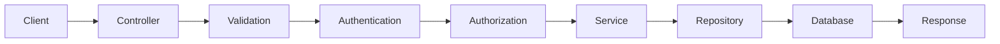
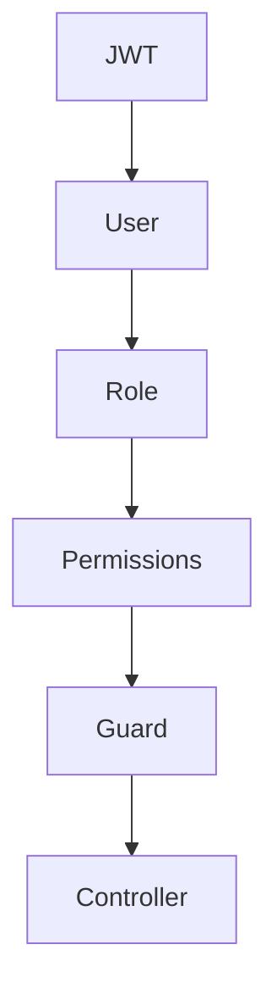

# 17 — Backend Architecture Specification (Part 1)

> MatchStick Events Documentation Repository

---

# Document Information

| Property | Value |
|----------|-------|
| Document Name | Backend Architecture |
| Document ID | DOC-017 |
| Version | 1.0.0 |
| Part | 1 of 12 |
| Status | Approved |
| Depends On | README.md, 15-admin-dashboard.md, 16-database-design.md |

---

# Purpose

This document defines the backend architecture for the MatchStick Events platform.

It specifies how the server-side application should be structured, how business logic should be organized, how different modules communicate, and how requests flow through the system.

The backend serves as the operational engine that powers both the public website and the administrative dashboard while enforcing business rules, security, scalability, and maintainability. 0

---

# Scope

This specification covers the backend architecture supporting:

- Authentication
- Authorization
- CRM
- Dream Planner
- Consultation Booking
- Contact Enquiries
- Project Management
- Website CMS
- Media Library
- Calendar
- Analytics
- Notifications
- Background Jobs
- System Configuration
- Administrative Dashboard

The backend is responsible for processing every business operation across the MatchStick Events platform. 1

---

# Business Goals

The backend should:

- Centralize business logic.
- Enforce business rules consistently.
- Protect sensitive business data.
- Support future expansion.
- Provide reliable APIs.
- Remain highly maintainable.
- Scale as the business grows.

The backend should function as the operational backbone of the entire application.

---

# Backend Philosophy

The backend should never simply move data between the frontend and database.

Instead, it should represent the business itself.

Every operation should pass through clearly defined services responsible for validation, authorization, business workflows, and data persistence.

Business rules should exist once and only once.

---

# Architecture Principles

## Separation of Concerns

Each module should own its own business logic.

Examples

- CRM
- Projects
- CMS
- Media
- Calendar
- Analytics

Modules should communicate through well-defined interfaces rather than direct implementation dependencies.

---

## Layered Architecture

Business logic should remain independent of

- HTTP
- Database
- Storage
- External services

This allows infrastructure changes without affecting core application logic.

---

## Modular Design

Each feature should exist as an independent backend module.

Example

```text
CRM Module

Projects Module

CMS Module

Media Module

Calendar Module

Analytics Module
```

Modules should be reusable, independently testable, and easy to extend.

---

## API-First Development

Every business capability should be exposed through well-defined APIs.

The frontend should never communicate directly with the database.

All communication should pass through the backend.

---

## Security by Default

Every request should be treated as untrusted.

The backend should

- Authenticate users.
- Authorize access.
- Validate inputs.
- Log important actions.
- Reject invalid requests.

Security should be integrated throughout the architecture rather than added later.

---

## Scalability

The backend should support

- Increasing users
- Larger databases
- More administrators
- Higher traffic
- Future mobile applications
- Future client portals

Scaling should require infrastructure changes rather than application redesign.

---

# Recommended Technology Stack

| Layer | Recommended Technology |
|--------|------------------------|
| Runtime | Node.js (LTS) |
| Framework | NestJS |
| Language | TypeScript |
| ORM | Prisma |
| Database | PostgreSQL |
| Authentication | JWT |
| Object Storage | Supabase Storage |
| Queue | BullMQ |
| Cache | Redis |
| API Style | REST |
| Validation | Zod / class-validator |
| Documentation | OpenAPI (Swagger) |

Equivalent technologies providing similar capabilities may also satisfy these requirements.

---

# Why NestJS?

NestJS is recommended because it provides

- Modular architecture
- Dependency Injection
- Strong TypeScript support
- Built-in testing
- Guards
- Middleware
- Validation
- Interceptors
- Enterprise scalability

These characteristics align with the maintainability and scalability goals of this project.

---

# High-Level System Architecture

```mermaid
flowchart TD

CLIENT

↓

FRONTEND

↓

REST API

↓

BACKEND

↓

DATABASE

↓

OBJECT STORAGE
```

Every request should pass through the backend before reaching persistent storage.

---

# Backend Responsibilities

The backend shall be responsible for

- Authentication
- Authorization
- Business Logic
- Validation
- File Uploads
- Notifications
- Database Operations
- Scheduling
- Analytics
- Logging
- Security
- API Responses

The frontend should remain focused on presentation and user interaction.

---

# Layered Architecture

```mermaid
flowchart TD

Presentation Layer

↓

API Layer

↓

Application Layer

↓

Domain Layer

↓

Data Access Layer

↓

Database
```

Each layer has a clearly defined responsibility.

---

# Backend Layers

## Presentation Layer

Responsibilities

- HTTP Endpoints
- Request Parsing
- Response Formatting

Business logic should not exist here.

---

## API Layer

Responsibilities

- Controllers
- Authentication
- Authorization
- Validation
- Serialization

This layer exposes backend functionality to clients.

---

## Application Layer

Responsibilities

- Business Workflows
- Service Coordination
- Transaction Management

This layer orchestrates application behavior.

---

## Domain Layer

Responsibilities

- Core Business Logic
- Business Rules
- Domain Models
- Policies

The Domain Layer represents the heart of the application.

---

## Data Access Layer

Responsibilities

- ORM
- Database Queries
- Persistence
- Transactions

Only this layer communicates directly with the database.

---

# Request Lifecycle



Every request should follow a predictable lifecycle.

---

# Module Overview

The backend consists of the following primary modules.

| Module | Responsibility |
|----------|----------------|
| Authentication | Identity & Access Management |
| CRM | Client Management |
| Projects | Event Execution |
| CMS | Website Content |
| Media | Digital Assets |
| Calendar | Scheduling |
| Analytics | Business Intelligence |
| Notifications | Communication |
| Operations | System Services |
| Configuration | Business Settings |

Each module owns its business logic and data interactions.

---

# Suggested Folder Structure

```text
src/

├── auth/

├── crm/

├── projects/

├── cms/

├── media/

├── calendar/

├── analytics/

├── notifications/

├── operations/

├── config/

├── common/

├── database/

├── infrastructure/

├── shared/

└── main.ts
```

This structure promotes modularity and maintainability.

---

# Dependency Rules

Modules should depend only on stable abstractions.

Recommended dependency direction

```text
Controller

↓

Service

↓

Repository

↓

Database
```

Controllers should never access repositories directly.

Business logic should never exist inside controllers.

---

# Configuration Management

Application configuration should be externalized.

Examples

- Environment Variables
- Database Credentials
- JWT Secrets
- Storage Keys
- Email Configuration
- Queue Settings

Configuration should never be hardcoded.

---

# Error Handling Philosophy

Errors should be

- Consistent
- Predictable
- Logged
- Meaningful

Internal implementation details should never be exposed to clients.

---

# Logging Philosophy

The backend should log

- Authentication Events
- API Errors
- Business Events
- Background Jobs
- Security Events
- System Health

Logging should support debugging, monitoring, and auditing.

---

# Future Expansion

The architecture should support future additions including

- Mobile Applications
- Client Portal
- Vendor Portal
- AI Planning Assistant
- Online Payments
- Multi-Branch Operations
- Third-Party Integrations

New features should integrate as modules without requiring architectural redesign.

---

# Functional Requirements

| ID | Requirement |
|----|-------------|
| BA-001 | Implement a modular backend architecture. |
| BA-002 | Separate business logic from infrastructure concerns. |
| BA-003 | Support REST-based communication. |
| BA-004 | Enforce layered architecture. |
| BA-005 | Support scalable module-based development. |
| BA-006 | Centralize business workflows. |
| BA-007 | Externalize configuration management. |

---

# Non-Functional Requirements

The backend shall be:

- Secure.
- Scalable.
- Maintainable.
- Testable.
- Modular.
- Reliable.
- Extensible.
- Highly Available.

---

# Developer Notes

Developers should:

- Organize the backend around business domains rather than technical utilities to improve long-term maintainability.
- Keep controllers lightweight by delegating validation, business workflows, and persistence to dedicated services and repositories.
- Treat every module as an independent unit with clearly defined interfaces and minimal coupling to other modules.
- Design infrastructure components—such as storage, queues, caching, and databases—to be replaceable without affecting domain logic.
- Use this document together with the Database Design Specification as the architectural foundation for implementing the backend services that power the MatchStick Events platform. 2

---

# End of Part 1

Part 2 defines the complete **Authentication & Authorization Architecture**, including JWT authentication, refresh token strategy, session management, RBAC, permission resolution, guards, middleware, login flows, password management, and identity services that secure the entire MatchStick Events platform.

# 17 — Backend Architecture Specification (Part 2)

> MatchStick Events Documentation Repository

---

# Document Information

| Property | Value |
|----------|-------|
| Document Name | Backend Architecture |
| Document ID | DOC-017 |
| Version | 1.0.0 |
| Part | 2 of 12 |
| Status | Approved |
| Depends On | 15-admin-dashboard.md (Users & Settings), 16-database-design.md (Identity Domain) |

---

# Authentication & Authorization Architecture

## Purpose

The Authentication & Authorization module secures access to the MatchStick Events platform.

It is responsible for:

- Identity verification
- Access control
- Session management
- Role-Based Access Control (RBAC)
- Permission enforcement
- Password management
- Account security
- Authentication auditing

Every protected backend operation begins within this module.

---

# Authentication Philosophy

Authentication answers one question:

> **"Who is making this request?"**

Authorization answers another:

> **"What is this user allowed to do?"**

These responsibilities should remain completely independent.

Authentication should establish identity.

Authorization should determine permissions.

---

# Identity Architecture

```mermaid
flowchart TD

LOGIN

-->

AUTH SERVICE

-->

JWT SERVICE

-->

USER SESSION

-->

PROTECTED APIs
```

Every authenticated request should pass through this architecture.

---

# Authentication Components

The module consists of:

```text
Authentication Service

Authorization Service

JWT Service

Session Service

Password Service

Email Verification Service

Password Reset Service

Permission Resolver

Guards

Middleware
```

Each component should own a single responsibility.

---

# Authentication Flow

```mermaid
flowchart LR

Login Request

-->

Credential Validation

-->

User Lookup

-->

Password Verification

-->

Account Status Check

-->

Generate JWT

-->

Generate Refresh Token

-->

Create Session

-->

Return Tokens
```

Authentication succeeds only when every step completes successfully.

---

# Login Workflow

## Step 1

Receive

```text
Email

Password
```

---

## Step 2

Validate

- Required fields
- Email format
- Password length

Invalid requests should terminate immediately.

---

## Step 3

Retrieve user

```text
users
```

from the database.

---

## Step 4

Verify password.

Passwords should never be decrypted.

Instead, compare the submitted password against the stored password hash.

---

## Step 5

Verify account status.

Allowed status

```text
Active
```

Rejected examples

- Pending
- Suspended
- Archived

---

## Step 6

Generate

- Access Token
- Refresh Token

---

## Step 7

Store authenticated session.

---

## Step 8

Return authentication response.

---

# JWT Strategy

Authentication should use

```text
JSON Web Tokens (JWT)
```

Two-token architecture

```text
Access Token

+

Refresh Token
```

---

# Access Token

Purpose

- Authenticate API requests

Characteristics

- Short lifetime
- Stateless
- Signed
- Contains minimal claims

Example claims

```text
User ID

Role

Permissions

Session ID
```

Sensitive information should never be embedded inside JWT payloads.

---

# Refresh Token

Purpose

Generate new access tokens without requiring another login.

Characteristics

- Long lifetime
- Stored securely
- Revocable
- Rotated after use

Refresh tokens should always be stored as cryptographic hashes within the database.

---

# Token Lifecycle

```mermaid
flowchart LR

Login

-->

Access Token

-->

Expires

-->

Refresh Token

-->

New Access Token
```

Expired refresh tokens require the user to authenticate again.

---

# Session Management

Every successful login creates a session.

A session stores

- User
- Device
- Browser
- IP Address
- Login Time
- Last Activity
- Expiration Time

Sessions allow administrators to monitor and revoke access.

---

# Multiple Sessions

Users may authenticate from multiple devices simultaneously.

Examples

- Laptop
- Mobile
- Tablet

Each device should receive its own independent session.

---

# Session Revocation

Sessions may be revoked when

- User logs out.
- Administrator revokes access.
- Password changes.
- Security incident detected.
- Refresh token expires.

Revoked sessions should immediately lose access.

---

# Logout Flow

```mermaid
flowchart LR

Logout

-->

Invalidate Refresh Token

-->

Revoke Session

-->

Return Success
```

Logout should invalidate only the current session unless explicitly requested to log out from all devices.

---

# Authorization Architecture

Authorization determines whether an authenticated user may perform an operation.

The backend should enforce authorization before executing any business logic.

---

# RBAC (Role-Based Access Control)

The platform shall implement Role-Based Access Control.

Relationship

```text
User

↓

Role

↓

Permissions

↓

Backend Module
```

Permissions should be assigned to roles rather than directly to users.

---

# Example Roles

- Administrator
- Manager
- Event Planner
- Content Manager
- Staff

Additional custom roles should be supported.

---

# Permission Examples

```text
crm.view

crm.create

crm.update

crm.delete

projects.manage

cms.publish

media.upload

calendar.schedule

analytics.export
```

Permissions should remain granular.

---

# Permission Resolution

Authorization flow



Access is granted only when the required permission exists.

---

# Guards

Guards protect backend endpoints.

Examples

```text
JWT Guard

Role Guard

Permission Guard
```

Guards execute before controller methods.

Unauthorized requests should never reach business logic.

---

# Middleware

Authentication middleware may perform

- Request logging
- Correlation ID generation
- Security headers
- Request context creation

Business logic should never exist within middleware.

---

# Password Management

Passwords should

- Never be stored in plain text.
- Never be reversible.
- Always be hashed.

Recommended algorithms

- Argon2id
- bcrypt

The backend should never implement custom cryptographic algorithms.

---

# Password Policy

Minimum requirements

- Minimum length
- Uppercase letter
- Lowercase letter
- Number
- Special character

Password policies should remain configurable.

---

# Email Verification

Account activation should require email verification.

Workflow

```mermaid
flowchart LR

Register

-->

Verification Email

-->

Verification Token

-->

Activate Account
```

Verification tokens should be

- Random
- Single-use
- Time-limited
- Stored as hashes

---

# Password Reset

Workflow

```mermaid
flowchart LR

Forgot Password

-->

Email Token

-->

Verify Token

-->

Choose Password

-->

Login
```

Reset tokens should

- Expire automatically.
- Be single-use.
- Be securely hashed.

---

# Rate Limiting

Authentication endpoints should implement rate limiting.

Examples

- Login
- Password Reset
- Email Verification
- Token Refresh

Repeated failed attempts should trigger temporary restrictions.

---

# Account Lockout

Accounts may be temporarily locked after excessive failed login attempts.

Example policy

```text
5 Failed Attempts

↓

Temporary Lock

↓

Automatic Unlock
```

Lockout duration should remain configurable.

---

# Authentication Audit

The backend should record

- Successful Logins
- Failed Logins
- Password Changes
- Password Resets
- Email Verification
- Logout Events
- Session Revocation

Authentication history supports auditing and security investigations.

---

# Authentication Events

Examples

```text
User Logged In

Password Changed

Refresh Token Revoked

Session Expired

Account Locked

Password Reset Requested
```

Events should integrate with the Operations module.

---

# Error Handling

Authentication errors should never reveal internal details.

Examples

Avoid

```text
Email Exists

Wrong Password
```

Prefer

```text
Invalid Credentials
```

Responses should minimize information disclosure.

---

# Authentication Dependencies

The Authentication module depends on

- Identity Database
- Email Service
- Notification Service
- Configuration Service
- Audit Service

Authentication should remain independent of business modules such as CRM or Projects.

---

# Functional Requirements

| ID | Requirement |
|----|-------------|
| BA-008 | Authenticate users using JWT. |
| BA-009 | Support refresh token rotation. |
| BA-010 | Maintain secure user sessions. |
| BA-011 | Implement Role-Based Access Control (RBAC). |
| BA-012 | Protect endpoints using guards and middleware. |
| BA-013 | Support password reset and email verification. |
| BA-014 | Record authentication audit events. |
| BA-015 | Support configurable password and lockout policies. |

---

# Non-Functional Requirements

The Authentication module shall be:

- Secure.
- Reliable.
- Scalable.
- Highly Available.
- Auditable.
- Maintainable.
- Extensible.

---

# Developer Notes

Developers should:

- Separate authentication, authorization, session management, and password management into independent services with clearly defined responsibilities.
- Implement short-lived access tokens and rotating refresh tokens to reduce the impact of token compromise.
- Enforce authorization through reusable guards and permission checks rather than embedding access-control logic within controllers or services.
- Store all passwords and authentication tokens using strong one-way cryptographic hashing algorithms and never persist sensitive secrets in plain text.
- Treat authentication events as security-critical operations by logging them consistently and integrating them with the platform's audit and monitoring infrastructure.

---

# End of Part 2

Part 3 defines the complete **CRM Backend Architecture**, including client services, Dream Planner processing, consultation workflows, contact enquiry handling, duplicate detection, client merge logic, communication history, follow-up automation, and the business workflows that power customer relationship management across the MatchStick Events platform.

# 17 — Backend Architecture Specification (Part 3)

> MatchStick Events Documentation Repository

---

# Document Information

| Property | Value |
|----------|-------|
| Document Name | Backend Architecture |
| Document ID | DOC-017 |
| Version | 1.0.0 |
| Part | 3 of 12 |
| Status | Approved |
| Depends On | 12-dream-planner.md, 13-booking-consultation.md, 14-contact-page.md, 16-database-design.md (CRM Domain) |

---

# CRM Backend Architecture

## Purpose

The CRM module manages the complete customer journey for MatchStick Events.

It is responsible for receiving, validating, organizing, and maintaining every client interaction—from the first enquiry through consultation, project creation, and long-term relationship management.

The CRM backend serves as the operational gateway into the business.

---

# CRM Philosophy

Every customer should have a single unified identity.

Regardless of how a person contacts the company:

- Dream Planner
- Consultation Booking
- Contact Form
- Phone Call
- WhatsApp
- Instagram
- Referral

the backend should attempt to associate the interaction with an existing client before creating a new one.

The CRM should always maintain one canonical client record.

---

# CRM Module Overview

```mermaid
flowchart TD

DreamPlanner

-->

CRM

Consultation

-->

CRM

ContactForm

-->

CRM

ManualEntry

-->

CRM

CRM

-->

Client Service

Client Service

-->

Database

Client Service

-->

Notifications

Client Service

-->

Projects
```

The CRM acts as the central business module connecting customer-facing features with internal operations.

---

# CRM Components

The module consists of

```text
Client Service

Dream Planner Service

Consultation Service

Contact Service

Communication Service

Follow-up Service

Duplicate Detection Service

Client Merge Service

CRM Validation Service

CRM Event Publisher
```

Each service should own a single business responsibility.

---

# Layered Architecture

```mermaid
flowchart LR

Controller

-->

Validation

-->

CRM Service

-->

Repository

-->

Database
```

Business rules should reside exclusively within the service layer.

---

# Client Service

The Client Service is the primary entry point into the CRM.

Responsibilities

- Create clients
- Retrieve clients
- Update clients
- Archive clients
- Search clients
- Merge duplicate records
- Assign staff members

Other CRM services should interact with clients exclusively through the Client Service.

---

# Client Creation Workflow

```mermaid
flowchart LR

Receive Request

-->

Validate

-->

Duplicate Detection

-->

Create Client

-->

Create Communication Entry

-->

Notify Staff

-->

Return Response
```

The workflow should execute as a single database transaction.

---

# Duplicate Detection Service

Before creating a new client, the backend should search for existing records.

Comparison criteria

- Email Address
- Phone Number
- Similar Name

Possible duplicates should be flagged for administrative review rather than automatically merged.

---

# Client Merge Service

Administrators may merge duplicate records.

Merge process

```mermaid
flowchart LR

Select Clients

-->

Validate

-->

Transfer Child Records

-->

Archive Duplicate

-->

Audit Log

-->

Complete
```

Transferred entities include

- Dream Planners
- Consultations
- Contact Enquiries
- Communication History
- Follow-ups
- Notes
- Attachments
- Projects

Merge operations should be atomic.

---

# Dream Planner Service

Responsible for processing Dream Planner submissions.

Responsibilities

- Validate submissions
- Associate client
- Store planner
- Trigger notifications
- Record communication history

Every Dream Planner should become part of the client's permanent history.

---

# Dream Planner Workflow

```mermaid
flowchart TD

Submit Planner

-->

Validate

-->

Find Client

-->

Create Client if Needed

-->

Save Planner

-->

Create Timeline Entry

-->

Notify Team
```

No planner submission should be discarded after successful validation.

---

# Consultation Service

Responsible for consultation bookings.

Responsibilities

- Validate availability
- Schedule consultation
- Create calendar event
- Notify assigned planner
- Update CRM timeline

The Consultation Service integrates directly with the Calendar module.

---

# Consultation Workflow

```mermaid
flowchart LR

Receive Booking

-->

Validate

-->

Availability Check

-->

Create Consultation

-->

Create Calendar Event

-->

Send Notifications

-->

Success
```

Scheduling conflicts should prevent booking confirmation.

---

# Contact Service

Responsible for processing Contact Page enquiries.

Responsibilities

- Validate submission
- Associate client
- Create enquiry
- Record communication
- Notify staff

Contact submissions should become searchable CRM records.

---

# Contact Workflow

```mermaid
flowchart LR

Submit Contact Form

-->

Validate

-->

Client Lookup

-->

Create Enquiry

-->

Communication History

-->

Notification
```

The workflow should remain consistent with other CRM entry points.

---

# Communication Service

Maintains the complete customer interaction timeline.

Supported communication types

- Dream Planner
- Consultation
- Contact Form
- Phone Call
- WhatsApp
- Email
- Internal Meeting

Communication history should be append-only.

---

# Communication Timeline

```mermaid
flowchart TD

Client

-->

Dream Planner

-->

Consultation

-->

Project

-->

Completed Event

-->

Returning Client
```

The timeline provides a complete customer history.

---

# Follow-up Service

Responsible for scheduling future actions.

Responsibilities

- Create reminders
- Assign staff
- Notify users
- Mark completion
- Escalate overdue follow-ups

Follow-ups integrate with the Calendar module.

---

# Follow-up Workflow

```mermaid
flowchart LR

Create Follow-up

-->

Assign User

-->

Calendar Reminder

-->

Notification

-->

Completion
```

Completed follow-ups remain part of the client's history.

---

# Client Assignment

Every client may be assigned to a staff member.

Assignment rules

- Manual assignment
- Administrative reassignment
- Future automatic assignment

Changing ownership should generate an audit event.

---

# CRM Validation

Validation should occur before persistence.

Examples

Client

- Name required
- Valid email
- Valid phone

Consultation

- Valid date
- Available slot

Dream Planner

- Required event information

Validation failures should prevent database writes.

---

# CRM Business Rules

Examples

- Every Dream Planner belongs to one client.
- Every consultation belongs to one client.
- Every follow-up has an assignee.
- Every communication references a client.
- Clients cannot own duplicate active projects for the same event unless explicitly allowed.

Business rules should remain centralized inside CRM services.

---

# CRM Events

Business events published by the CRM module

Examples

```text
ClientCreated

DreamPlannerSubmitted

ConsultationBooked

FollowUpCreated

ClientMerged

ClientAssigned
```

Events allow other modules to react without creating tight coupling.

---

# Module Integrations

The CRM module integrates with

- Calendar
- Notifications
- Analytics
- Projects
- Operations
- Authentication

CRM should never communicate directly with the frontend.

All interaction occurs through controllers and APIs.

---

# Error Handling

Examples

Validation Error

```text
Invalid Consultation Date
```

Conflict Error

```text
Duplicate Client Detected
```

Business Rule Error

```text
Selected Time Slot Unavailable
```

Errors should remain consistent across the platform.

---

# Transactions

The following operations should execute atomically

- Client Creation
- Client Merge
- Dream Planner Submission
- Consultation Booking
- Follow-up Creation

Partial CRM operations should never be committed.

---

# Performance Considerations

Frequently accessed CRM operations should support

- Pagination
- Filtering
- Full-text search
- Indexed lookups
- Cached dashboard statistics

Heavy reporting should be delegated to the Analytics module.

---

# Functional Requirements

| ID | Requirement |
|----|-------------|
| BA-016 | Maintain a canonical client service. |
| BA-017 | Process Dream Planner submissions. |
| BA-018 | Manage consultation workflows. |
| BA-019 | Process contact enquiries. |
| BA-020 | Maintain communication history. |
| BA-021 | Support follow-up management. |
| BA-022 | Detect duplicate clients. |
| BA-023 | Support atomic client merge operations. |

---

# Non-Functional Requirements

The CRM backend shall be:

- Reliable.
- Secure.
- Scalable.
- Maintainable.
- Auditable.
- Extensible.
- Optimized for high-volume customer interactions.

---

# Developer Notes

Developers should:

- Treat the `Client Service` as the single authoritative entry point for all customer-related operations across the platform.
- Keep business workflows—such as duplicate detection, client merging, consultation scheduling, and follow-up management—inside dedicated services rather than controllers.
- Publish domain events for significant CRM actions so other modules can react without introducing direct dependencies.
- Execute complex CRM workflows within database transactions to ensure consistency across multiple related entities.
- Design the CRM module so future integrations, including AI assistants, WhatsApp Business APIs, marketing automation, and client portals, can connect through existing service interfaces without architectural changes.

---

# End of Part 3

Part 4 defines the complete **Project Management Backend Architecture**, including project lifecycle management, milestone orchestration, task workflows, vendor coordination, budget processing, timeline generation, document management, progress calculation, and the business services responsible for executing every MatchStick Events project from planning to completion.

# 17 — Backend Architecture Specification (Part 4)

> MatchStick Events Documentation Repository

---

# Document Information

| Property | Value |
|----------|-------|
| Document Name | Backend Architecture |
| Document ID | DOC-017 |
| Version | 1.0.0 |
| Part | 4 of 12 |
| Status | Approved |
| Depends On | 15-admin-dashboard.md (Project Management), 16-database-design.md (Project Domain) |

---

# Project Management Backend Architecture

## Purpose

The Project Management module manages the complete operational lifecycle of every event executed by MatchStick Events.

Once a client engagement has been confirmed, this module becomes the operational center responsible for planning, execution, coordination, progress tracking, budgeting, documentation, and successful event delivery.

Every event should be represented as a structured backend workflow rather than a collection of unrelated records.

---

# Project Philosophy

A project represents the complete execution of an event.

Everything required to deliver that event should revolve around the Project.

Examples

- Client
- Milestones
- Tasks
- Vendors
- Budget
- Documents
- Calendar
- Timeline
- Team Members

The backend should coordinate these components while ensuring data consistency and business correctness.

---

# Module Overview

```mermaid
flowchart TD

CRM

-->

Project Service

Project Service

-->

Milestone Service

Project Service

-->

Task Service

Project Service

-->

Vendor Service

Project Service

-->

Budget Service

Project Service

-->

Timeline Service

Project Service

-->

Calendar

Project Service

-->

Notifications

Project Service

-->

Analytics
```

The Project module orchestrates event execution while collaborating with supporting modules.

---

# Project Components

The module consists of

```text
Project Service

Milestone Service

Task Service

Project Member Service

Vendor Service

Budget Service

Timeline Service

Project File Service

Progress Engine

Project Validation Service

Project Event Publisher
```

Each component should remain independently testable.

---

# Layered Architecture

```mermaid
flowchart LR

Controller

-->

Validation

-->

Project Service

-->

Repository

-->

Database
```

Business rules should reside exclusively inside services.

---

# Project Service

The Project Service is the central coordinator.

Responsibilities

- Create projects
- Retrieve projects
- Update projects
- Archive projects
- Assign lead planners
- Coordinate project workflows

Every project-related operation should begin here.

---

# Project Creation Workflow

```mermaid
flowchart LR

Approved Consultation

-->

Create Project

-->

Generate Milestones

-->

Generate Default Tasks

-->

Assign Team

-->

Create Timeline

-->

Calendar Integration

-->

Notifications

-->

Success
```

Project creation should execute within a single transaction.

---

# Milestone Service

Responsible for project phases.

Responsibilities

- Create milestones
- Update milestone status
- Validate milestone completion
- Track milestone progress
- Trigger downstream workflows

Milestones divide large projects into manageable stages.

---

# Milestone Workflow

```mermaid
flowchart LR

Create

-->

Assign Tasks

-->

Monitor Progress

-->

Complete

-->

Update Project
```

Milestone completion should trigger automatic project progress recalculation.

---

# Task Service

Responsible for detailed work management.

Responsibilities

- Create tasks
- Assign users
- Update status
- Record completion
- Validate dependencies
- Notify assignees

Tasks represent the smallest operational unit within a project.

---

# Task Workflow

```mermaid
flowchart LR

Create Task

-->

Assign User

-->

Work Begins

-->

Complete Task

-->

Update Milestone

-->

Update Project
```

Task completion should automatically update related milestones.

---

# Dependency Engine

Tasks may depend on other tasks.

Example

```text
Venue Confirmed

↓

Decoration Planning

↓

Lighting Installation

↓

Final Inspection
```

The backend should prevent completion of dependent tasks until prerequisite tasks have been completed.

---

# Progress Engine

Project progress should never be manually entered.

Instead

```mermaid
flowchart LR

Completed Tasks

-->

Completed Milestones

-->

Progress Calculation

-->

Project Status
```

The Progress Engine should calculate progress automatically.

---

# Project Members Service

Responsible for staffing.

Responsibilities

- Assign users
- Remove users
- Change roles
- Track assignments

Example project roles

- Lead Planner
- Coordinator
- Designer
- Operations
- Photographer
- Vendor Manager

Changes should generate audit events.

---

# Vendor Service

Responsible for vendor coordination.

Responsibilities

- Register vendors
- Update information
- Associate vendors with projects
- Track payment status
- Store vendor notes

Future vendor portals should integrate through this service.

---

# Vendor Workflow

```mermaid
flowchart LR

Add Vendor

-->

Assign Category

-->

Associate Project

-->

Track Payments

-->

Complete Services
```

Vendor information should remain reusable across future projects.

---

# Budget Service

Responsible for project financial tracking.

Responsibilities

- Record estimated costs
- Record actual costs
- Calculate remaining budget
- Monitor budget utilization

The backend should calculate derived values automatically.

---

# Budget Workflow

```mermaid
flowchart LR

Estimate Budget

-->

Record Expenses

-->

Calculate Remaining

-->

Budget Reports
```

Budget calculations should remain centralized.

---

# Timeline Service

Maintains the complete project history.

Timeline entries include

- Project Created
- Task Assigned
- Milestone Completed
- Vendor Added
- Budget Updated
- Event Completed

Timeline entries should remain immutable.

---

# Project File Service

Responsible for project documentation.

Supported files

- Contracts
- Venue Layouts
- Mood Boards
- Vendor Quotations
- Images
- Planning Documents

Actual files remain managed by the Media module.

---

# Calendar Integration

The Project module integrates directly with Calendar.

Examples

- Event Date
- Planning Meetings
- Vendor Visits
- Site Inspections
- Deadlines

Calendar events should be created automatically whenever appropriate.

---

# Notification Integration

Project events should trigger notifications.

Examples

- New Task Assignment
- Milestone Due
- Budget Warning
- Upcoming Event
- Project Completion

Notifications should be handled asynchronously.

---

# Analytics Integration

The module should publish analytics events.

Examples

```text
ProjectCreated

MilestoneCompleted

TaskCompleted

VendorAssigned

ProjectCompleted
```

Analytics should aggregate operational data rather than query transactional workflows directly.

---

# Project Validation

Validation examples

Project

- Valid client
- Future event date
- Assigned lead planner

Task

- Valid assignee
- Valid due date

Vendor

- Required contact information

Budget

- Non-negative values

Validation failures should terminate processing before persistence.

---

# Business Rules

Examples

- Every project belongs to one client.
- Every milestone belongs to one project.
- Every task belongs to one milestone.
- Every project has one lead planner.
- Progress is system-calculated.
- Timeline entries cannot be modified.
- Archived projects are read-only except for authorized administrative actions.

Business rules should remain centralized within services.

---

# Transactions

The following workflows should execute atomically

- Project Creation
- Team Assignment
- Milestone Generation
- Vendor Assignment
- Budget Updates
- Project Completion

Partial project workflows should never be committed.

---

# Project Completion Workflow

```mermaid
flowchart LR

Verify Milestones

-->

Verify Tasks

-->

Finalize Timeline

-->

Generate Analytics

-->

Archive Project

-->

Notify Client Team
```

Projects should not transition to **Completed** until all mandatory conditions are satisfied.

---

# Error Handling

Examples

Validation Error

```text
Invalid Event Date
```

Conflict Error

```text
Task Dependency Not Satisfied
```

Business Rule Error

```text
Project Already Archived
```

Error responses should remain consistent across the backend.

---

# Performance Considerations

The Project module should support

- Pagination
- Advanced filtering
- Full-text search
- Cached dashboard summaries
- Optimized project timelines

Heavy reporting should be delegated to the Analytics module.

---

# Functional Requirements

| ID | Requirement |
|----|-------------|
| BA-024 | Manage complete project lifecycles. |
| BA-025 | Coordinate milestone and task workflows. |
| BA-026 | Support automatic progress calculation. |
| BA-027 | Manage project teams and vendor coordination. |
| BA-028 | Maintain project budgets and timelines. |
| BA-029 | Integrate with Calendar and Notifications. |
| BA-030 | Publish project analytics events. |
| BA-031 | Execute project workflows atomically. |

---

# Non-Functional Requirements

The Project Management module shall be:

- Reliable.
- Secure.
- Scalable.
- Maintainable.
- Auditable.
- Extensible.
- Optimized for operational workloads.

---

# Developer Notes

Developers should:

- Treat the `Project Service` as the orchestration layer responsible for coordinating all project-related business workflows.
- Keep milestones, tasks, vendors, budgets, timelines, and project files within dedicated services to maintain separation of concerns.
- Calculate project progress automatically from milestone and task completion rather than allowing manual percentage updates.
- Publish domain events for significant project lifecycle changes so Calendar, Notifications, Analytics, and future modules remain loosely coupled.
- Design the module to support future capabilities—including procurement, inventory management, client portals, mobile applications, AI planning assistants, and financial systems—without requiring architectural redesign.

---

# End of Part 4

Part 5 defines the complete **CMS Backend Architecture**, including page management, section rendering, draft workflows, publishing pipelines, version control, SEO management, slug routing, preview generation, rollback operations, and the business services responsible for powering the public MatchStick Events website.

# 17 — Backend Architecture Specification (Part 5)

> MatchStick Events Documentation Repository

---

# Document Information

| Property | Value |
|----------|-------|
| Document Name | Backend Architecture |
| Document ID | DOC-017 |
| Version | 1.0.0 |
| Part | 5 of 12 |
| Status | Approved |
| Depends On | 07-homepage.md, 08-about-page.md, 09-services-page.md, 10-gallery-page.md, 11-previous-events-page.md, 12-dream-planner.md, 13-booking-consultation.md, 14-contact-page.md, 16-database-design.md (CMS Domain) |

---

# CMS Backend Architecture

## Purpose

The CMS (Content Management System) module powers the entire public-facing MatchStick Events website.

It enables administrators to create, edit, preview, publish, version, organize, and retire website content without modifying application code.

The backend should treat website content as structured business data rather than hardcoded frontend components.

---

# CMS Philosophy

Content should be:

- Structured
- Reusable
- Versioned
- Searchable
- Previewable
- Publishable
- Recoverable

The backend should manage website content independently from the frontend implementation.

---

# CMS Module Overview

```mermaid
flowchart TD

Administrator

-->

CMS Controller

-->

CMS Service

CMS Service

-->

Page Service

CMS Service

-->

Section Service

CMS Service

-->

Version Service

CMS Service

-->

SEO Service

CMS Service

-->

Media Service

CMS Service

-->

Database

CMS Service

-->

Frontend APIs
```

The CMS module provides all content required by the website.

---

# CMS Components

The module consists of

```text
CMS Service

Page Service

Section Service

Publishing Service

Version Service

SEO Service

Slug Service

Preview Service

Rollback Service

CMS Validation Service

CMS Event Publisher
```

Each service owns a clearly defined responsibility.

---

# Layered Architecture

```mermaid
flowchart LR

Controller

-->

Validation

-->

CMS Service

-->

Repository

-->

Database
```

Business rules belong exclusively within the service layer.

---

# Page Service

The Page Service manages every page on the website.

Responsibilities

- Create pages
- Update pages
- Delete pages
- Publish pages
- Archive pages
- Restore pages
- Retrieve pages

Every page should have a unique identity.

---

# Supported Pages

Examples

- Homepage
- About
- Services
- Gallery
- Previous Events
- Dream Planner
- Booking Consultation
- Contact

The architecture should allow unlimited future pages.

---

# Page Workflow

```mermaid
flowchart LR

Create Page

-->

Save Draft

-->

Preview

-->

Publish

-->

Live Website
```

Every page begins as a draft before publication.

---

# Section Service

Each page consists of multiple reusable sections.

Examples

Homepage

```text
Hero

Services

Gallery Preview

Testimonials

CTA

Footer
```

Sections should be independently editable.

---

# Section Workflow

```mermaid
flowchart LR

Create Section

-->

Assign Page

-->

Edit Content

-->

Preview

-->

Publish
```

Reusable sections should reduce duplicated content.

---

# Draft Workflow

Content editing should never immediately affect the live website.

Workflow

```mermaid
flowchart LR

Edit Draft

-->

Save

-->

Preview

-->

Approve

-->

Publish
```

Drafts remain isolated until publication.

---

# Publishing Service

Responsible for making content publicly available.

Responsibilities

- Validate content
- Publish page
- Publish sections
- Update version
- Trigger cache refresh
- Notify dependent systems

Publishing should execute atomically.

---

# Publishing Workflow

```mermaid
flowchart LR

Draft

-->

Validation

-->

Create Version

-->

Publish

-->

Invalidate Cache

-->

Live Website
```

Visitors should never observe partially published pages.

---

# Version Service

Every published revision should create a permanent version.

Version history stores

- Title
- Content
- Sections
- SEO Metadata
- Publish Date
- Publisher

Historical versions should remain immutable.

---

# Version Workflow

```mermaid
flowchart LR

Save Draft

-->

Create Version

-->

Publish

-->

Archive Version
```

Each publication creates a recoverable snapshot.

---

# Rollback Service

Administrators may restore previous versions.

Workflow

```mermaid
flowchart LR

Choose Version

-->

Validate

-->

Restore

-->

Publish

-->

Log Event
```

Rollback should create a new version rather than modifying historical records.

---

# Preview Service

The backend should generate preview content.

Preview pages should

- Require authentication
- Not be indexed
- Use draft content
- Not affect production data

Preview URLs should expire automatically.

---

# Slug Service

Responsible for public URLs.

Examples

```text
/

about

services

gallery

previous-events

dream-planner

booking-consultation

contact
```

Slugs should remain unique.

---

# Slug Workflow

```mermaid
flowchart LR

Create Slug

-->

Validate

-->

Check Uniqueness

-->

Save
```

Conflicting slugs should be rejected.

---

# SEO Service

Responsible for search engine metadata.

Supported fields

- Title
- Description
- Keywords
- Canonical URL
- Open Graph
- Twitter Cards
- Robots
- Structured Data

SEO data belongs to pages rather than frontend code.

---

# Media Integration

The CMS integrates directly with the Media module.

Supported content

- Images
- Videos
- Documents
- Icons
- Logos

Only media references should be stored.

Files remain managed by the Media module.

---

# Navigation Management

The backend should provide navigation configuration.

Examples

```text
Main Navigation

Footer Navigation

Quick Links

Social Links
```

Navigation should be editable without code changes.

---

# Homepage Management

Only one homepage may exist.

Business rules

- Exactly one homepage
- Published homepage required
- Homepage cannot be deleted
- Homepage may be updated
- Homepage versions remain recoverable

---

# Content Validation

Validation examples

Page

- Title required
- Slug required
- Status valid

Section

- Valid page
- Valid type

SEO

- Title length
- Description length

Validation failures prevent publication.

---

# Business Rules

Examples

- Every section belongs to one page.
- Every page has one active published version.
- Slugs must remain unique.
- Published content cannot be partially updated.
- Rollbacks create new versions.
- Archived pages cannot be publicly accessible.

Business rules should remain centralized.

---

# CMS Events

Examples

```text
PageCreated

PageUpdated

PagePublished

PageArchived

VersionCreated

PageRolledBack

NavigationUpdated
```

Events enable cache invalidation, analytics, and audit logging.

---

# Module Integrations

The CMS integrates with

- Media
- Analytics
- Operations
- Authentication
- Notifications

The frontend retrieves website content exclusively through backend APIs.

---

# Transactions

The following workflows should execute atomically

- Publish Page
- Rollback Version
- Create Version
- Delete Section
- Update Navigation

Visitors should never experience inconsistent website content.

---

# Error Handling

Examples

Validation Error

```text
Page Title Required
```

Conflict Error

```text
Slug Already Exists
```

Business Rule Error

```text
Homepage Cannot Be Deleted
```

Errors should follow consistent backend standards.

---

# Performance Considerations

The CMS backend should support

- Content caching
- Optimized page retrieval
- Lazy loading
- Search indexing
- Efficient media references

Published pages should require minimal database queries.

---

# Functional Requirements

| ID | Requirement |
|----|-------------|
| BA-032 | Manage website pages. |
| BA-033 | Support reusable page sections. |
| BA-034 | Implement draft and publishing workflows. |
| BA-035 | Maintain complete version history. |
| BA-036 | Support rollback operations. |
| BA-037 | Manage SEO metadata and slugs. |
| BA-038 | Integrate with the Media module. |
| BA-039 | Publish CMS events for dependent modules. |

---

# Non-Functional Requirements

The CMS backend shall be:

- Secure.
- Reliable.
- Scalable.
- Maintainable.
- Extensible.
- Auditable.
- Optimized for high-performance content delivery.

---

# Developer Notes

Developers should:

- Treat pages, sections, navigation, SEO metadata, and versions as independent domain entities managed through dedicated services.
- Ensure all publishing operations are transactional so visitors only ever receive fully published content.
- Keep version history immutable, with rollback operations creating new versions instead of altering historical records.
- Store only references to media assets within the CMS while delegating file storage and processing to the Media module.
- Design the CMS to support future additions—including blogs, news articles, landing pages, multilingual content, personalization, and headless content delivery—without requiring architectural changes.

---

# End of Part 5

Part 6 defines the complete **Media Backend Architecture**, including file uploads, storage abstraction, image optimization, video handling, metadata extraction, thumbnail generation, duplicate detection, version management, CDN integration, security validation, and the business services responsible for managing all digital assets across the MatchStick Events platform.

